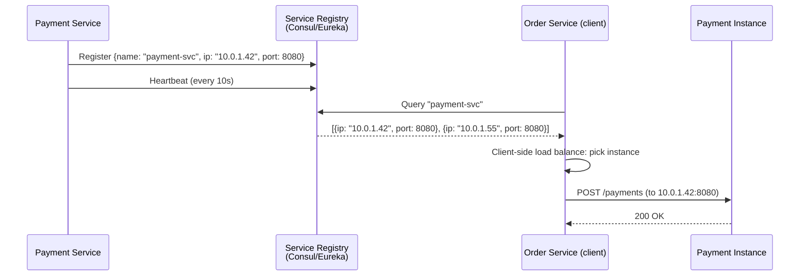
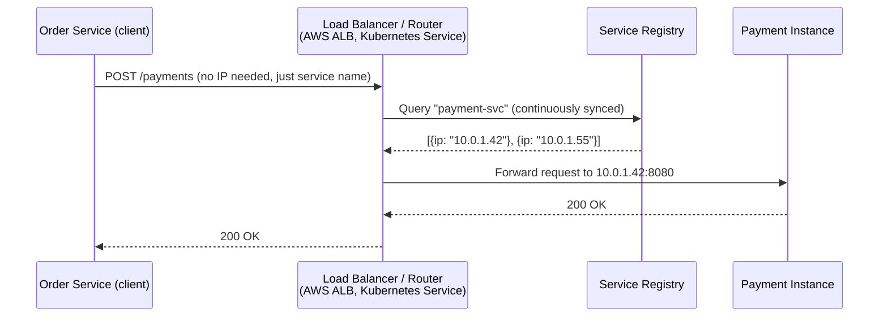
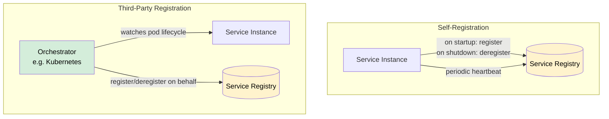
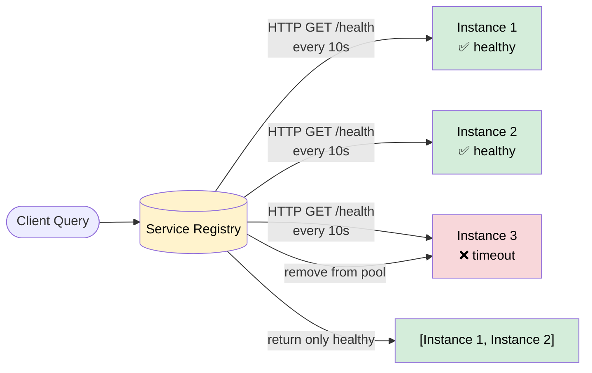
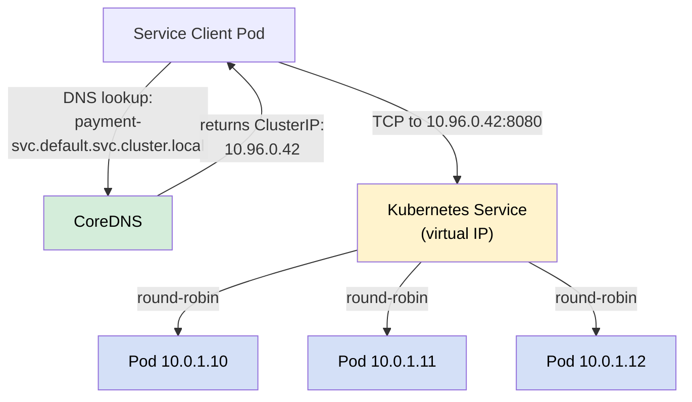

# Service Discovery

> **Service Discovery** is the mechanism by which services in a distributed system find and communicate with each other, even when service instances are constantly starting, stopping, and moving to new IP addresses.

**Level:** 5 · **Topic:** 4 · **Prerequisites:** [Monolith vs Microservices](../01-Monolith-vs-Microservices/README.md) · [Level 02 — Load Balancing](../../Level-02-Data-Layer/README.md)

---

## 🎯 The Problem

In a microservices architecture, services run as multiple instances across many machines. Unlike a traditional setup where you point your app at `db.company.com:5432` and that IP never changes, in a containerized world:

- The Payment Service might have 10 instances running on different machines
- Every time Kubernetes restarts a pod, it gets a new IP address
- Instances scale up and down based on load — you don't know how many will exist
- A hardcoded IP list in your config file is impossible to maintain

**How does Service A find Service B when B has 10 instances, all with dynamic IPs, that change constantly?**

---

## 🌍 Real-World Analogy

Imagine you need a plumber. You don't call every plumber in the city directly (you don't have all their numbers). Instead, you call a **directory service** — Yelp, Angi, or a local union — and ask "give me an available plumber near me." The directory knows who's registered, who's available (health checks), and can route you to the right one.

That's a **service registry**: a phonebook that services register with when they start, deregister from when they stop, and that clients (or load balancers) query to find healthy instances.

---

## 🧠 Core Idea

Service discovery has two main responsibilities:

1. **Registration:** Services announce themselves ("I'm the Payment Service, my IP is 10.0.1.42, port 8080, I'm healthy")
2. **Lookup:** Clients or infrastructure find the right service ("Give me a healthy Payment Service instance")

There are two ways to split this responsibility: **client-side** and **server-side** discovery.

---

## 📊 How It Works

### Client-Side Discovery

*Caption: In client-side discovery, the service client queries the registry and chooses an instance itself. Netflix's Ribbon library is the classic example. Your Order Service contains the load-balancing logic.*

---

### Server-Side Discovery

*Caption: In server-side discovery, the client just calls a well-known endpoint. The load balancer or service mesh handles registry lookups and routing. Clients stay simple; the infrastructure does the work.*

---

### Self-Registration vs Third-Party Registration

*Caption: With self-registration, services manage their own lifecycle in the registry. With third-party registration (more common in Kubernetes), the platform registers services automatically based on pod events.*

---

### Health Checks

*Caption: The registry periodically probes each registered instance. Unhealthy instances are removed from the pool automatically, preventing clients from routing to dead services.*

---

### DNS-Based Discovery (Kubernetes CoreDNS)

*Caption: Kubernetes provides DNS-based discovery out of the box. Each Service gets a stable DNS name. CoreDNS resolves it to the Service's ClusterIP (a virtual IP), which kube-proxy forwards to healthy pods via iptables rules.*

---

## 🔧 Types / Variations / Strategies

### Discovery Style Comparison

| | Client-Side Discovery | Server-Side Discovery |
|--|----------------------|----------------------|
| **Who queries registry?** | The client service | Load balancer / router |
| **Load balancing logic** | In the client | In the infrastructure |
| **Client complexity** | Higher (client needs SDK) | Lower (client calls one endpoint) |
| **Language flexibility** | Lower (SDK per language) | Higher (any client works) |
| **Examples** | Netflix Eureka + Ribbon | Kubernetes, AWS ALB, Consul + Envoy |
| **Latency** | One less hop | One extra hop (LB) |

### Registration Style Comparison

| | Self-Registration | Third-Party Registration |
|--|------------------|-------------------------|
| **Who registers?** | The service itself | External orchestrator |
| **Coupling** | Service code knows about registry | Service code is unaware of registry |
| **Deregistration on crash** | TTL/heartbeat expiry | Orchestrator event-driven |
| **Best with** | Traditional VMs, bare-metal | Kubernetes, ECS, Nomad |

### Service Discovery Tools

| Tool | Type | Key Features | Best For |
|------|------|-------------|----------|
| **Consul** (HashiCorp) | Full-featured | DNS + HTTP API, health checks, KV store, multi-DC | Multi-cloud, VM + container |
| **Eureka** (Netflix) | Client-side | Simple, Java-native, AP system | Java microservices on VMs |
| **etcd** | Distributed KV | Strong consistency (CP), used by Kubernetes internally | Kubernetes control plane |
| **Kubernetes Services** | Platform-native | DNS-based, kube-proxy routing, free with K8s | Any K8s workload |
| **CoreDNS** | DNS server | Kubernetes DNS, plugin-based | Kubernetes service discovery |
| **AWS Cloud Map** | Managed | Native AWS integration, health checks | AWS ECS/EKS workloads |
| **Zookeeper** | Coordination | Strong consistency, complex ops | Legacy Hadoop ecosystems |

---

## 🏢 Real-World Examples

**Netflix (Eureka):** Netflix open-sourced Eureka as their service registry. Every service registers itself with Eureka on startup. Client services (Order, Recommendation, etc.) use Netflix Ribbon, a client-side load balancer, which periodically fetches the Eureka registry and caches it locally. This means service discovery survives Eureka being temporarily unavailable — clients use their cached registry copy. Netflix chose AP consistency for Eureka: availability over strict consistency.

**Kubernetes (CoreDNS + kube-proxy):** Kubernetes provides service discovery out of the box. When you create a `Service` object, Kubernetes assigns it a stable DNS name (`<name>.<namespace>.svc.cluster.local`) and a virtual ClusterIP. CoreDNS resolves the name; kube-proxy handles the load balancing via iptables rules on every node. Third-party registration is automatic — Kubernetes registers pods when they become ready and deregisters them on termination.

**HashiCorp Consul at Scale:** Consul is used by companies like Cloudflare, Stripe, and Cisco. It supports multiple datacenters, provides health checks (HTTP, TCP, script-based), and integrates with service meshes (Consul Connect). At Cloudflare, Consul manages discovery across thousands of services running in their global network.

---

## ⚖️ Trade-offs

| Pros | Cons |
|------|------|
| Dynamic routing to healthy instances | Registry becomes a critical dependency (SPOF if not HA) |
| Automatic removal of unhealthy instances | Stale registry data during failure modes |
| Enables zero-downtime deployments | Added operational complexity |
| Works with auto-scaling | Network overhead of health checks |
| Decouples callers from instance IPs | Cache invalidation timing (clients cache registry) |

---

## ✅ When to Use / ❌ When NOT to Use

**Use service discovery when:**
- You have more than 3–5 services
- Services run as multiple instances (for load or availability)
- You use containers/Kubernetes (it's usually built in)
- Services scale up and down dynamically
- You need zero-downtime rolling deployments

**You might not need explicit service discovery when:**
- You have 1–2 services with static IPs (just hardcode them + use a load balancer)
- You're using a managed platform that handles it (AWS ECS with service connect, Google Cloud Run)
- You have a monolith

---

## ⚠️ Common Pitfalls

**Stale registry cache:** Clients cache the registry for performance. If an instance crashes and the client's cache hasn't refreshed, it may still try to route to the dead instance. Always combine service discovery with proper retry and circuit breaker logic. See [Resilience Patterns](../06-Resilience-Patterns/README.md).

**Health check mismatch:** A health check that only pings "is the process alive?" is insufficient. An instance can be alive but unable to connect to its database. Deep health checks that verify downstream dependencies give a more accurate picture of instance health.

**Registry as a single point of failure:** If your registry goes down, no new service lookups can occur. Run the registry as a cluster (Consul uses Raft consensus, Eureka runs in AP mode). Cache the registry client-side so existing connections survive registry downtime.

**Slow deregistration after crash:** If a service crashes without gracefully deregistering, clients may route to it until the TTL expires (typically 30–90 seconds). During this window, requests fail. Combine with circuit breakers to fail fast.

**Not using namespacing:** In large systems, different teams' services need isolation. Use namespaces (Kubernetes namespaces, Consul namespaces) to prevent naming collisions and enforce network policies.

---

## 🎤 Interview Tips

- Open with the problem: "In microservices, service instances have dynamic IPs. Service discovery solves how services find each other."
- Compare **client-side** (client queries registry, handles LB itself — Netflix Eureka + Ribbon) vs **server-side** (load balancer queries registry — Kubernetes Services, AWS ALB).
- Mention **health checks** as the key to automatic failure routing — the registry removes unhealthy instances.
- For Kubernetes interviews: know that `Service` objects + CoreDNS handle discovery, and kube-proxy handles packet routing via iptables.
- Mention that **service discovery is a building block**: it doesn't solve failures. You still need timeouts, retries, and circuit breakers.
- For large-scale design, mention that clients should **cache the registry** to avoid the registry being a bottleneck and to survive registry downtime.

---

## 📝 TL;DR

- **Service Discovery** solves the problem of finding service instances with dynamic IPs at runtime
- **Client-side discovery:** client queries registry, does its own load balancing (Netflix Eureka + Ribbon)
- **Server-side discovery:** client calls a fixed endpoint; load balancer handles registry lookups (Kubernetes, AWS ALB)
- **Self-registration:** service registers itself on startup; **third-party:** platform (Kubernetes) registers it
- **Health checks** keep the registry accurate by removing unhealthy instances
- **Tools:** Consul (versatile), Eureka (Java/Netflix), Kubernetes Services (built-in), CoreDNS
- Service discovery doesn't replace circuit breakers — use both

---

## 🧪 Test Yourself

1. Your Order Service needs to call the Payment Service. Describe how client-side service discovery works in this scenario, step by step.
2. What happens when a Payment Service instance crashes abruptly (process killed, no graceful shutdown) in a system using Consul? How do clients eventually stop routing to it?
3. In Kubernetes, what is the role of a `Service` object vs `CoreDNS` vs `kube-proxy`?
4. Why might a service registry choose AP consistency (like Eureka) over CP consistency (like etcd/Zookeeper)?
5. Your service registry is down for 2 minutes. How can you design your client-side discovery to continue routing traffic during the outage?

---

## 📚 Further Reading

- [Consul by HashiCorp — Documentation](https://developer.hashicorp.com/consul/docs) — full-featured service discovery
- [Netflix Eureka — GitHub](https://github.com/Netflix/eureka) — the Netflix approach
- [Kubernetes Services Documentation](https://kubernetes.io/docs/concepts/services-networking/service/) — built-in K8s discovery
- [Chris Richardson — Service Discovery Pattern](https://microservices.io/patterns/client-side-discovery.html) — patterns reference
- Related: [API Gateway](../05-API-Gateway/README.md) · [Resilience Patterns](../06-Resilience-Patterns/README.md)

---

*← [CQRS & Event Sourcing](../03-CQRS-and-Event-Sourcing/README.md) · [Level 05 Overview](../README.md) · Next: [API Gateway](../05-API-Gateway/README.md) →*
