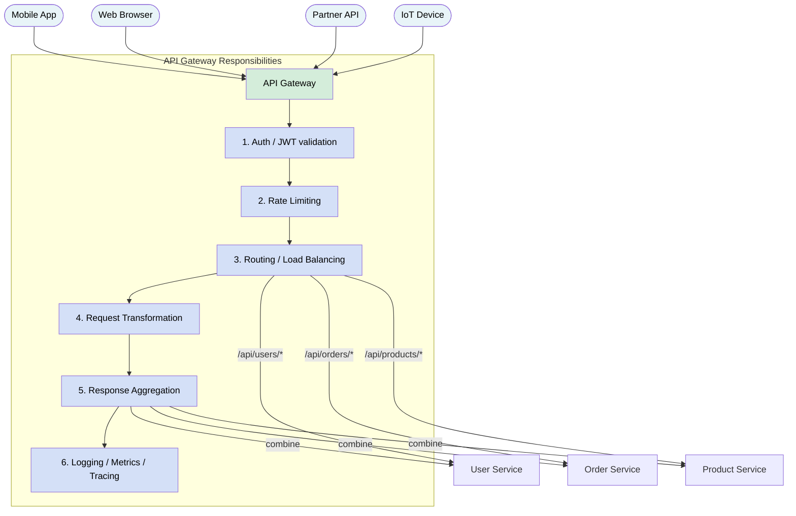
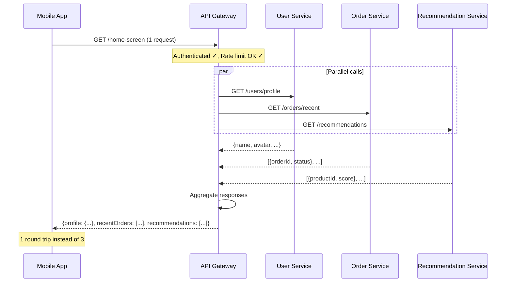
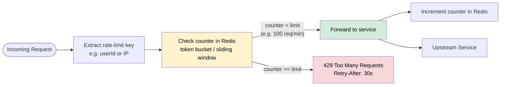
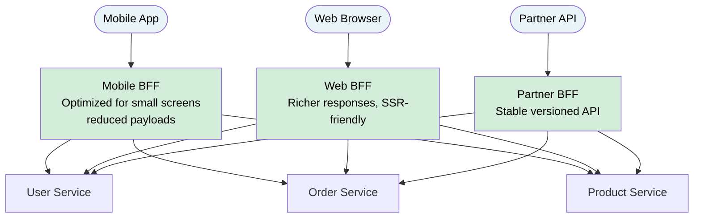

# API Gateway

> An **API Gateway** is a single entry point for all client requests to a microservices backend. It handles cross-cutting concerns — routing, authentication, rate limiting, TLS termination, request transformation, and observability — so individual services don't have to.

**Level:** 5 · **Topic:** 5 · **Prerequisites:** [Monolith vs Microservices](../01-Monolith-vs-Microservices/README.md) · [Service Discovery](../04-Service-Discovery/README.md)

---

## 🎯 The Problem

You've built 15 microservices. Now your mobile app needs to:

- Authenticate every request (check JWT tokens)
- Call 4 different services and combine their responses for a single screen
- Handle HTTPS/TLS termination
- Enforce rate limits (max 100 req/sec per user)
- Log every request for debugging
- Handle CORS for browser clients
- Transform old API formats for mobile clients on older app versions

**Without an API Gateway:** Every service must implement auth, rate limiting, CORS, and logging itself — 15 times. Every mobile request needs knowledge of 15 different service URLs. Your mobile client becomes tightly coupled to your backend's internal service structure.

**With an API Gateway:** One entry point handles all of this. Services stay focused on their business logic.

---

## 🌍 Real-World Analogy

Think of a hotel concierge. When you arrive at a large hotel, you don't go directly to the kitchen to order food, directly to housekeeping to request towels, and directly to the pool department to book a lane. You go to the **concierge** — one person who knows where everything is, checks that you're a registered guest, takes your requests, and coordinates with the right departments on your behalf.

The API Gateway is your system's concierge: one front door, multiple capabilities behind it.

---

## 🧠 Core Idea

The API Gateway sits between clients (mobile apps, browsers, third-party integrations) and your backend services. All traffic flows through it.

**Key insight:** The API Gateway handles **cross-cutting concerns** — things that every service needs but that aren't specific to any single service's business logic.

---

## 📊 How It Works

### Core Architecture

*Caption: The API Gateway is the only component exposed to the internet. Internal services are isolated behind it. The gateway handles auth, rate limiting, routing, and aggregation before returning a response.*

---

### Request Aggregation / Composition

*Caption: API aggregation (also called API composition) lets a mobile client fetch everything it needs for one screen in a single network round trip. The gateway calls multiple services in parallel and stitches the responses together.*

---

### Rate Limiting Flow

*Caption: Rate limiting at the gateway protects downstream services from overload. A shared Redis counter ensures rate limits apply across multiple gateway instances.*

---

### Backend-for-Frontend (BFF) Pattern

*Caption: The BFF pattern creates one API Gateway per client type. The mobile BFF returns compact JSON for slow networks; the web BFF can return richer data. This avoids the "one size fits all" problem of a single monolithic gateway.*

---

## 🔧 Types / Variations / Strategies

### Gateway vs Reverse Proxy vs Load Balancer

| | Load Balancer | Reverse Proxy | API Gateway |
|--|---------------|---------------|-------------|
| **Primary job** | Distribute traffic across instances | Forward requests to backend | Manage APIs as a product |
| **Layer** | L4 (TCP) or L7 (HTTP) | L7 | L7 |
| **Auth/Rate limit?** | No | Sometimes | Yes |
| **Routing rules** | Round-robin, least-conn, IP hash | Path-based | Path + header + query + auth |
| **Request transform?** | No | Rarely | Yes |
| **Response aggregation?** | No | No | Yes |
| **Examples** | AWS NLB, HAProxy | Nginx, Traefik | Kong, AWS API GW, Apigee |

### API Gateway Responsibilities

| Responsibility | Description | Example |
|----------------|-------------|---------|
| **Routing** | Forward `/api/orders/*` → Order Service | Path-based routing rules |
| **Authentication** | Validate JWT tokens, API keys, OAuth | Reject 401 before hitting services |
| **Rate Limiting** | Per-user or per-IP request limits | 100 req/min per API key |
| **TLS Termination** | Handle HTTPS; internal traffic can be plain HTTP | Let services skip TLS config |
| **Request Transformation** | Rename fields, change protocols (REST↔gRPC) | Adapt old mobile clients |
| **Response Aggregation** | Combine multiple service responses | One-request home screen |
| **Caching** | Cache responses for repeated reads | Cache product catalog for 60s |
| **Circuit Breaking** | Stop forwarding to unhealthy services | Protect backend from cascade |
| **Observability** | Trace IDs, access logs, latency metrics | Distributed tracing propagation |
| **CORS** | Handle browser preflight requests | Allow cross-origin requests |
| **Versioning** | Route `/v1/` and `/v2/` to different backends | Support multiple API versions |

### Popular Gateway Tools

| Tool | Type | Key Strength | Used By |
|------|------|-------------|---------|
| **Kong** | Open source + managed | Plugin ecosystem, high perf (nginx-based) | Startup to enterprise |
| **AWS API Gateway** | Fully managed | Native AWS integration, serverless | AWS-native teams |
| **Netflix Zuul** (v1) | Open source (Java) | Netflix OSS ecosystem | Java teams |
| **Spring Cloud Gateway** | Open source (Java) | Spring ecosystem, reactive | Java/Spring teams |
| **Apigee** (Google) | Enterprise managed | Full API management lifecycle | Enterprise |
| **Traefik** | Open source | Kubernetes-native, automatic config | Container-first teams |
| **Envoy** | Open source proxy | Service mesh, high perf, extensible | Istio, Lyft, Stripe |
| **Azure API Management** | Managed | Azure ecosystem | Azure-native teams |

---

## 🏢 Real-World Examples

**Netflix Zuul:** Netflix built Zuul as their API gateway to handle 100,000+ requests per second from millions of devices. Zuul runs on every edge server and handles routing, load balancing, auth, and request filtering. Netflix's mobile and web clients call Zuul, which routes to the appropriate microservices. They later developed Zuul 2 with non-blocking I/O for better throughput. Zuul enabled Netflix to deploy new services without changing any client code.

**AWS API Gateway:** AWS API Gateway is used by millions of serverless architectures. It integrates natively with Lambda, allowing serverless backends. Features include usage plans (rate limiting per API key), request validation (reject malformed JSON before it hits Lambda), response caching (TTL per route), and native integration with AWS WAF for security. A typical pattern: `Client → API Gateway → Lambda → DynamoDB`.

**Kong (Stripe, Nasdaq):** Kong is built on top of nginx and handles high-traffic API scenarios. Stripe uses Kong for external API traffic management. Its plugin system covers auth (JWT, OAuth, API keys), rate limiting, logging, and transformation. Kong's declarative configuration makes it GitOps-friendly.

---

## ⚖️ Trade-offs

| Pros | Cons |
|------|------|
| Single entry point — clients don't need to know service topology | New latency hop for every request (~1–5ms) |
| Cross-cutting concerns in one place (no duplication) | Gateway can become a bottleneck or SPOF |
| Easier to enforce security policies consistently | Risk of building a "god gateway" with too much logic |
| Simplifies client code (one URL, one auth mechanism) | Gateway logic is hard to test in isolation |
| Enables versioning without changing services | Team ownership friction (who owns gateway config?) |
| Protects services from direct internet exposure | Configuration management at scale is complex |

---

## ✅ When to Use / ❌ When NOT to Use

**Use an API Gateway when:**
- You have 3+ microservices with external clients
- You need consistent auth/rate-limiting across services
- Your clients (mobile, web, partners) have different API shape requirements
- You want to protect services from direct internet exposure
- You need API versioning, request transformation, or aggregation

**Be careful (or avoid) when:**
- You're building a monolith (just expose it directly)
- You're putting business logic in the gateway — it should be routing/cross-cutting concerns only
- You make the gateway do so much that it becomes a bottleneck or a mini-monolith
- You have very strict latency requirements and can't afford the extra hop

---

## ⚠️ Common Pitfalls

**The "God Gateway" anti-pattern:** When teams keep adding business logic to the gateway (e.g., "the gateway decides which product recommendations to show"), it becomes a bottleneck and a maintenance nightmare. The gateway should route and filter, not implement business logic.

**Single point of failure:** If you have one gateway instance, its failure takes down all services. Run the gateway in a highly available cluster (multiple instances behind a load balancer).

**Chatty BFF:** A BFF that makes 10 sequential service calls instead of parallel calls adds unnecessary latency. Always parallelize independent calls.

**Too much logic in one gateway:** If every team's services share one gateway and one team's breaking change affects the gateway config, it can impact everyone. The BFF pattern (one gateway per client type) helps isolate this.

**Forgetting to propagate trace IDs:** The gateway is where request traces start. If it doesn't inject and propagate distributed trace IDs (e.g., `X-Trace-ID` header), debugging requests across services becomes nearly impossible.

---

## 🎤 Interview Tips

- Define it clearly: "A single entry point that handles routing, auth, rate limiting, and other cross-cutting concerns, so individual services don't have to."
- Contrast with a **load balancer** (distributes traffic to identical instances) and a **reverse proxy** (forwards requests, less feature-rich than a gateway).
- Mention **BFF pattern**: one gateway per client type (mobile vs web vs partner) to avoid one-size-fits-all API.
- The "god gateway" anti-pattern is a great point to raise unprompted — it shows you've thought beyond the basics.
- Name real tools: Netflix Zuul, Kong, AWS API Gateway, Spring Cloud Gateway.
- Mention **rate limiting** (token bucket, sliding window) and **auth** (JWT validation) as the most common responsibilities.
- For latency-sensitive interviews: mention the gateway adds ~1–5ms of overhead; it should be a thin routing layer, not a processing layer.

---

## 📝 TL;DR

- **API Gateway** = single entry point for all client traffic; handles routing, auth, rate limiting, TLS, logging
- **Aggregation:** combine multiple service calls into one response (reduces mobile round trips)
- **BFF pattern:** one gateway per client type (mobile, web, partner) for tailored APIs
- **Not a load balancer:** LBs distribute to identical instances; gateways route to different services with business-level rules
- **Avoid the god gateway:** keep business logic out of the gateway
- **Tools:** Kong, AWS API Gateway, Netflix Zuul, Apigee, Traefik, Envoy
- Gateway must be HA — it's a SPOF if it goes down

---

## 🧪 Test Yourself

1. Your mobile app currently calls 5 different services for a single screen load, causing 5 network round trips on a slow mobile connection. How does an API Gateway solve this?
2. What's the difference between an API Gateway and a reverse proxy? Give a concrete example of something an API gateway can do that a reverse proxy typically cannot.
3. Explain the BFF pattern. When would you choose BFF over a single gateway for all clients?
4. Your team wants to add user authentication to all services. You can either add JWT validation code to each service or add it to the API Gateway. What are the trade-offs of each approach?
5. A competitor's service discovery page shows requests routed to `user-service.internal:8080`. What does this tell you about their network architecture, and is this a security concern?

---

## 📚 Further Reading

- [Kong Documentation](https://docs.konghq.com/) — popular open-source gateway
- [AWS API Gateway](https://aws.amazon.com/api-gateway/) — fully managed option
- [Netflix Zuul — GitHub](https://github.com/Netflix/zuul) — the Netflix implementation
- [Sam Newman — BFF Pattern](https://samnewman.io/patterns/architectural/bff/) — canonical BFF explanation
- [Martin Fowler — API Gateway](https://martinfowler.com/articles/microservices.html#ComponentsAndServices) — architectural context
- Related: [Service Discovery](../04-Service-Discovery/README.md) · [Resilience Patterns](../06-Resilience-Patterns/README.md)

---

*← [Service Discovery](../04-Service-Discovery/README.md) · [Level 05 Overview](../README.md) · Next: [Resilience Patterns](../06-Resilience-Patterns/README.md) →*
