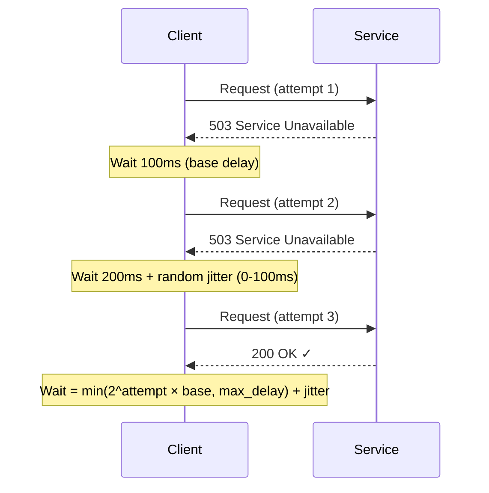
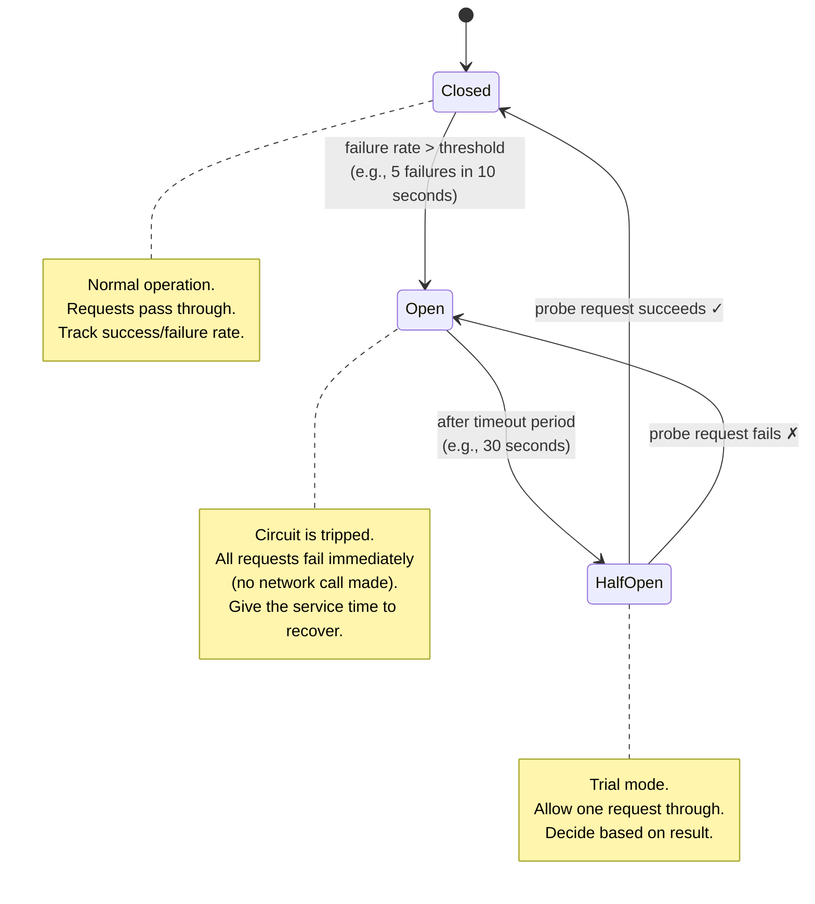
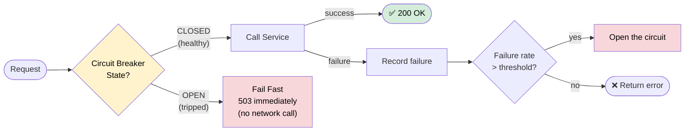
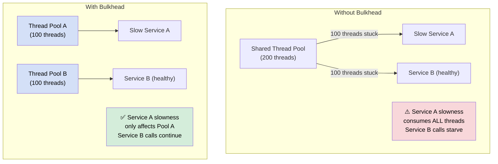
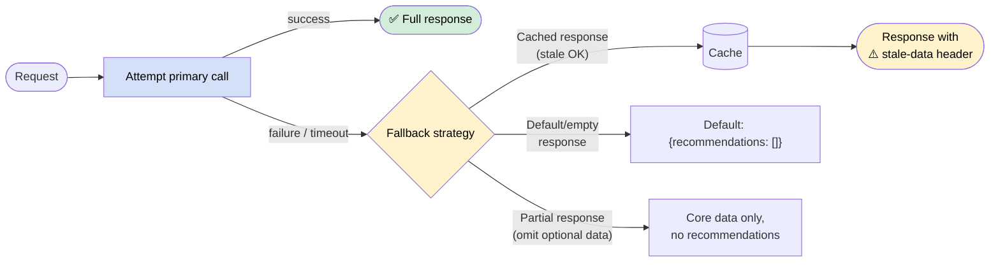
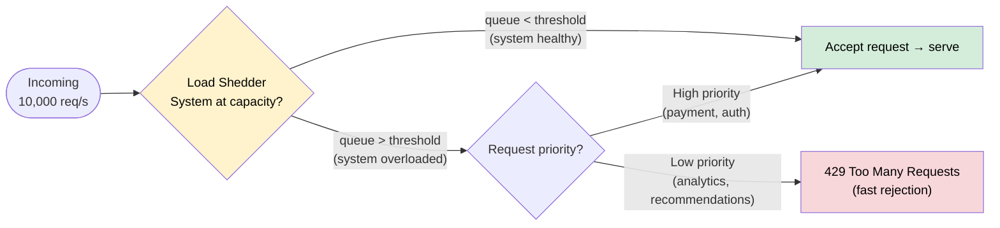

# Resilience Patterns

> **Resilience** is the ability of a system to handle and recover from failures gracefully — without cascading those failures to other services or causing a total outage. In distributed systems, failure is not exceptional; it is the norm.

**Level:** 5 · **Topic:** 6 · **Prerequisites:** [Monolith vs Microservices](../01-Monolith-vs-Microservices/README.md) · [API Gateway](../05-API-Gateway/README.md) · [Idempotency](../../Level-04-Distributed-Systems/07-Idempotency-and-Exactly-Once/README.md)

---

## 🎯 The Problem

In a microservices architecture with 50 services, even if each service is 99.9% available (8.7 hours of downtime per year), a chain of 10 services called sequentially has a combined availability of **99.9%^10 = 99%** — that's nearly 3.7 days of downtime per year.

Worse, a slow or failing service can cascade: Service A waits for Service B, which waits for Service C, which is overwhelmed. A's thread pool fills up, its heap fills up, it starts failing — and now A is down even though the original problem was in C. This is a **cascading failure**.

You need patterns that make your system fail gracefully, fail fast, and recover automatically.

---

## 🌍 Real-World Analogy

Electrical systems are a great model for resilience:

- **Circuit Breaker:** Your home's circuit breaker trips when there's an overload, cutting power to a circuit before it can start a fire. It "opens" (stops current), and you manually reset it. Services use the same idea.
- **Bulkhead:** On a ship, bulkheads are watertight compartments. If one compartment floods, the others are isolated and the ship stays afloat. In software, isolating thread pools per dependency means one slow dependency can't flood the rest.
- **Fallback:** If the premium coffee machine is broken, you offer instant coffee. Degraded but still serving customers.

---

## 🧠 Core Idea

Resilience patterns address different failure modes:

| Failure Mode | Pattern | Mechanism |
|-------------|---------|-----------|
| Slow responses | **Timeout** | Give up after N ms; don't wait forever |
| Transient failures | **Retry** | Try again; use backoff to avoid thundering herd |
| Persistent failures | **Circuit Breaker** | Stop trying when failure rate is high; auto-recover |
| One slow dependency starving threads | **Bulkhead** | Isolate resource pools per dependency |
| Unable to serve full response | **Fallback / Graceful Degradation** | Return cached/partial/default data |
| Overloaded system | **Load Shedding** | Reject low-priority requests early |

These are not alternatives — you use them in combination.

---

## 📊 How It Works

### Timeout

Never wait forever. Set a timeout appropriate to user expectations and SLAs.

```
Order Service → Payment Service
                timeout: 2000ms → if no response in 2s, return error immediately
```

**Rule of thumb:** Your timeout should be your P99 latency × 1.5. If your payment service answers 99% of requests in 800ms, set timeout to 1200ms.

### Retry with Exponential Backoff + Jitter



*Caption: Exponential backoff doubles the wait time after each failure. Jitter (randomness) prevents the "thundering herd" — all clients retrying at exactly the same moment, which would re-overwhelm a recovering service.*

**Backoff formula:** `delay = min(base_delay * 2^attempt, max_delay) + random(0, jitter_max)`

Example: base=100ms, max=30s, jitter=±100ms:
- Attempt 1: 100ms + jitter
- Attempt 2: 200ms + jitter
- Attempt 3: 400ms + jitter
- Attempt 4: 800ms + jitter
- ...
- Attempt 8: 30,000ms (capped) + jitter

**Only retry idempotent operations.** GET, PUT, DELETE are typically safe to retry. POST (which creates a resource) requires idempotency keys. See [Idempotency](../../Level-04-Distributed-Systems/07-Idempotency-and-Exactly-Once/README.md).

---

### Circuit Breaker — State Machine

The circuit breaker is the most important resilience pattern. Named after the electrical component.



*Caption: The circuit breaker has three states. CLOSED = normal, requests pass through. OPEN = tripped, fail fast without making network calls. HALF-OPEN = recovery testing, allow one trial request.*



*Caption: When the circuit is OPEN, the client returns an error immediately without making a network call. This prevents a failing service from consuming threads, connections, and latency budget across the system.*

---

### Bulkhead Isolation

Named after the watertight compartments on a ship.



*Caption: Without a bulkhead, one slow dependency can exhaust the shared thread pool, starving all other calls. With bulkheads, each dependency gets its own pool — a slow service can only exhaust its own bulkhead.*

---

### Fallback / Graceful Degradation



*Caption: When the primary service fails, a fallback provides a degraded but functional response. Netflix serves cached recommendations when the recommendation engine is down, rather than showing an empty page.*

---

### Load Shedding



*Caption: Load shedding proactively rejects low-priority requests when the system is under stress, protecting critical paths. Fail fast with 429 is better than queueing everything and timing out slowly.*

---

## 🔧 Types / Variations / Strategies

### Retry Policies

| Policy | Behavior | When to Use |
|--------|----------|-------------|
| **Fixed delay** | Retry after constant delay | Simple cases, low volume |
| **Exponential backoff** | Double delay each retry | Transient overloads |
| **Exponential backoff + jitter** | Randomize the delay | Multi-instance clients (avoids thundering herd) |
| **Retry with idempotency key** | Send same key on retry | Non-idempotent operations (POST) |
| **Retry budget** | Max N retries per time window across service | Prevents retry amplification |

### Circuit Breaker Configuration

| Parameter | Typical Value | Purpose |
|-----------|--------------|---------|
| Failure threshold | 50% failure rate or 5 consecutive failures | When to open |
| Count window | Last 10–20 requests | What to measure |
| Open timeout | 30–60 seconds | How long before trying again |
| Half-open probe count | 1–3 requests | How many probes before fully closing |

### Resilience Libraries

| Library | Language | Features |
|---------|----------|----------|
| **Resilience4j** | Java | CB, retry, bulkhead, rate limiter, time limiter |
| **Netflix Hystrix** | Java (legacy, maintenance mode) | CB, thread isolation — widely referenced conceptually |
| **Polly** | .NET | CB, retry, timeout, fallback, bulkhead |
| **Sentinel** (Alibaba) | Java | Flow control, circuit breaking, system load |
| **Envoy / Istio** | Proxy-level | CB, retry, timeout — no code changes needed |
| **AWS SDK built-in** | Various | Retry with backoff built into SDK |

---

## 🏢 Real-World Examples

**Netflix Hystrix (now Resilience4j):** Netflix invented Hystrix as their solution to cascading failures across 500+ microservices. Hystrix wrapped every service call in a "command" that enforced timeouts, retries, circuit breaking, and fallbacks. When the recommendation service was down, Hystrix's fallback returned cached or default recommendations — Netflix showed popular titles instead of a blank screen. Hystrix is now in maintenance mode; Resilience4j is the modern Java alternative.

**AWS Auto-Retry:** All AWS SDKs implement retry with exponential backoff and jitter by default. When you make a DynamoDB call that gets throttled (a `ProvisionedThroughputExceededException`), the SDK automatically retries with jitter. AWS documented this pattern because early users were causing thundering herds by retrying at fixed intervals.

**Google SRE — Load Shedding:** Google's Site Reliability Engineering book documents their approach to load shedding. When backend services are under load, they return `429` immediately for low-priority traffic rather than queuing everything and failing slowly. They also use "deadline propagation" — if a request's deadline has already passed (the user has given up waiting), the backend drops it immediately rather than wasting resources.

---

## ⚖️ Trade-offs

| Pattern | Benefit | Cost |
|---------|---------|------|
| **Timeout** | Prevents thread starvation | May fail valid slow requests |
| **Retry** | Handles transient failures | Can amplify load on struggling services |
| **Circuit Breaker** | Prevents cascade, allows recovery | Complexity; false opens during traffic spikes |
| **Bulkhead** | Isolates failures | More resources required (separate pools) |
| **Fallback** | Keeps serving users | Degraded UX; complexity of fallback logic |
| **Load Shedding** | Protects critical paths | Low-priority users get rejected |

---

## ✅ When to Use / ❌ When NOT to Use

**Always use in production microservices:**
- Timeouts on every external call (no exceptions)
- Retries with backoff + jitter for transient errors
- Circuit breakers for any dependency that can fail

**Use when you have the need:**
- Bulkheads when one slow dependency might affect others
- Fallbacks when you have a viable degraded alternative
- Load shedding when protecting against traffic spikes or DoS

**Be careful with:**
- Retries on non-idempotent operations — always use idempotency keys
- Aggressive timeouts that are shorter than your P99 latency
- Circuit breakers with thresholds that trip too easily on normal traffic variance

---

## ⚠️ Common Pitfalls

**Retry amplification (retry storms):** If Service A retries 3 times and calls Service B which retries 3 times to Service C, a single failed request becomes 9 requests to Service C. Use retry budgets and be conservative with retry counts. Consider retrying only at the edge (API Gateway) and letting errors propagate directly internally.

**Timeout that's too long:** A 30-second timeout doesn't protect you. A user has already given up. A thread is held for 30 seconds. Set timeouts based on actual latency profiles — typically 1–5x your P99.

**Not testing resilience:** Circuit breakers and fallbacks that were never tested don't work in production. Use chaos engineering (Netflix Chaos Monkey) to validate that your resilience patterns actually trigger correctly.

**Missing idempotency on retries:** Retrying a payment without idempotency keys charges the customer twice. Every retry-able operation must be idempotent.

**Circuit breaker threshold too sensitive:** Setting the threshold at "1 failure opens the circuit" means any momentary blip shuts down your dependency. Use a percentage threshold over a rolling window (e.g., 50% failure rate over the last 10 requests).

---

## 🎤 Interview Tips

- Open with: "In distributed systems, failures are inevitable. Resilience patterns let you fail gracefully and recover automatically."
- Walk through the **circuit breaker state machine** — closed → open → half-open — it's a common interview question.
- Distinguish **retry** (transient failures) from **circuit breaker** (persistent failures — stop retrying and give the service time to recover).
- Mention **bulkheads** for thread isolation — shows you understand cascade failure mechanisms.
- Mention **jitter in backoff** — many candidates forget this and it's important for avoiding thundering herds.
- Bring up **fallbacks**: "Netflix shows popular titles instead of blank page when recommendations fail."
- Connect retries to **idempotency** — shows you understand the cross-cutting nature of these patterns.

---

## 📝 TL;DR

- **Timeout:** always set; prevent waiting forever; calibrate to P99 latency
- **Retry + backoff + jitter:** for transient failures; only on idempotent ops; avoid retry storms
- **Circuit Breaker:** trips when failure rate exceeds threshold; returns errors immediately (fast fail); auto-recovers via half-open probe; key for preventing cascades
- **Bulkhead:** separate resource pools per dependency; one slow service can't starve others
- **Fallback:** cached data, defaults, or partial responses when primary fails
- **Load Shedding:** reject low-priority requests under load to protect critical paths
- Use all of these together in production; test them with chaos engineering

---

## 🧪 Test Yourself

1. Your Order Service calls 3 services: Payment (P99=200ms), Inventory (P99=50ms), Notification (P99=2000ms). What timeouts would you set for each?
2. A circuit breaker is in the OPEN state. What happens when a request comes in? What triggers the transition to HALF-OPEN?
3. Your service retries failed requests 3 times. You have 10 instances of your service. If a downstream service starts failing, how many requests per original request could actually hit the downstream service?
4. Why is adding random jitter to exponential backoff important? What problem does it solve?
5. Your recommendation engine is down. Design a fallback strategy for a "You might also like" section on a product page.

---

## 📚 Further Reading

- [Netflix Tech Blog — Hystrix](https://netflixtechblog.com/hystrix-dashboard-turbine-stream-aggregator-60985a2e51df) — the origin story
- [Resilience4j Documentation](https://resilience4j.readme.io/) — modern Java resilience library
- [AWS — Timeouts, retries, and backoff with jitter](https://aws.amazon.com/builders-library/timeouts-retries-and-backoff-with-jitter/) — excellent practical guide
- [Google SRE Book — Chapter 22: Addressing Cascading Failures](https://sre.google/sre-book/addressing-cascading-failures/) — deep dive
- [Polly (.NET)](https://github.com/App-vNext/Polly) — .NET resilience library
- Related: [Idempotency](../../Level-04-Distributed-Systems/07-Idempotency-and-Exactly-Once/README.md) · [Saga & Orchestration](../07-Saga-and-Orchestration/README.md)

---

*← [API Gateway](../05-API-Gateway/README.md) · [Level 05 Overview](../README.md) · Next: [Saga & Orchestration](../07-Saga-and-Orchestration/README.md) →*
