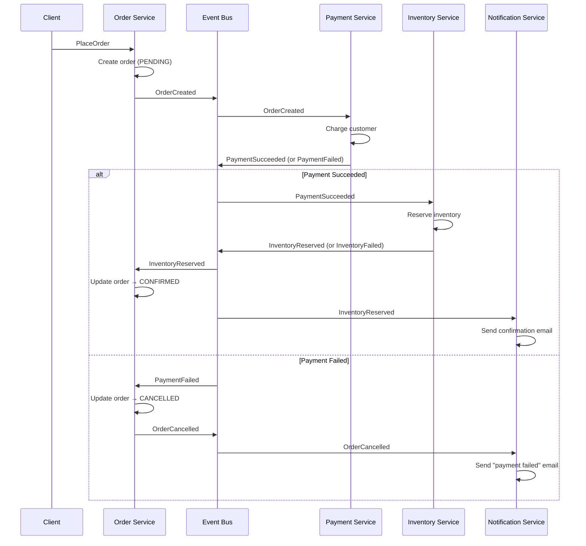
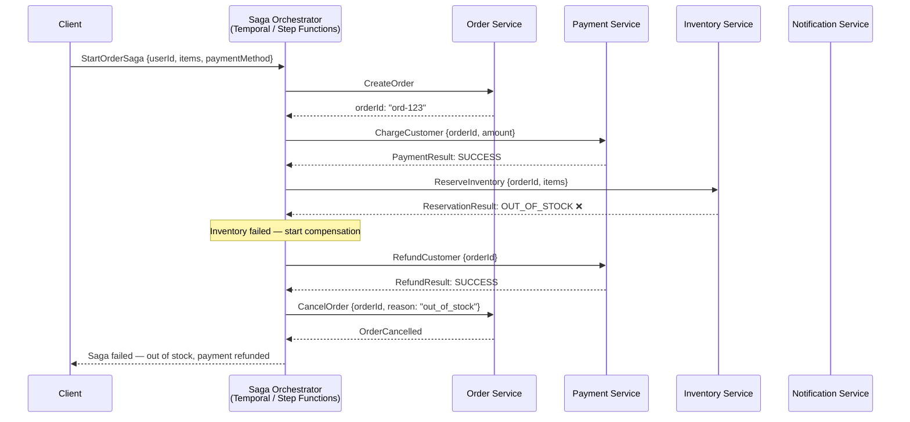
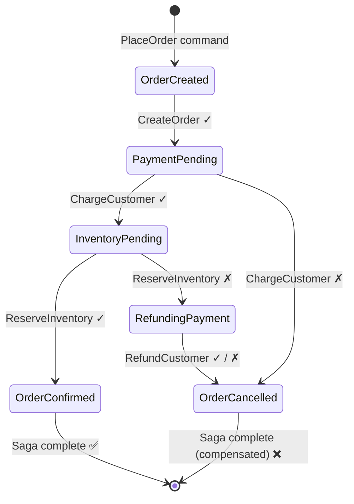
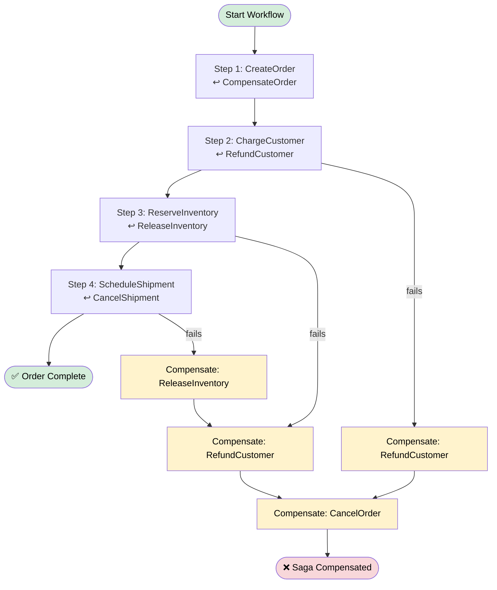

# Saga and Orchestration

> A **Saga** is a sequence of local transactions, each in a different service, that together accomplish a multi-service business operation — with **compensating transactions** to undo completed steps if something later fails. Orchestration engines like Temporal and AWS Step Functions provide the workflow runtime to manage these long-running processes reliably.

**Level:** 5 · **Topic:** 7 · **Prerequisites:** [Event-Driven Architecture](../02-Event-Driven-Architecture/README.md) · [Resilience Patterns](../06-Resilience-Patterns/README.md) · [Distributed Transactions](../../Level-04-Distributed-Systems/04-Distributed-Transactions/README.md) · [Idempotency](../../Level-04-Distributed-Systems/07-Idempotency-and-Exactly-Once/README.md)

---

## 🎯 The Problem

In a monolith with a single database, you can wrap a complex operation in a database transaction:

```sql
BEGIN;
  UPDATE inventory SET stock = stock - 1 WHERE product_id = 'p1';
  INSERT INTO orders (...) VALUES (...);
  UPDATE accounts SET balance = balance - 99.99 WHERE user_id = 'u1';
COMMIT;  -- atomically; all or nothing
```

If anything fails, the entire operation rolls back atomically. Clean.

In a microservices system, those three operations each live in a different service with a different database. **Two-Phase Commit (2PC)** is theoretically possible but practically unusable at scale:
- 2PC requires all databases to be available simultaneously
- Locks held during the prepare phase cause performance problems
- A single slow or failed participant blocks the entire transaction
- Modern cloud databases (DynamoDB, Spanner) may not support 2PC at all

You need a different approach to multi-service atomicity. That's the Saga.

---

## 🌍 Real-World Analogy

Booking a vacation involves multiple independent businesses: an airline, a hotel, a car rental. You can't call them all into a single conference room and make them commit atomically. Instead:

1. You book the flight ✅
2. You book the hotel ✅
3. You book the car ✅

If the car booking fails (no cars available), you **compensate**: cancel the hotel, cancel the flight. Each cancellation is the "undo" for the corresponding booking.

That's a Saga: a sequence of forward steps, each with a corresponding compensation step that undoes it if something later goes wrong.

---

## 🧠 Core Idea

A Saga decomposes a distributed transaction into a sequence of local transactions:

- **T1, T2, T3, T4...** are local transactions, each in one service
- Each local transaction publishes an event or message when it completes
- If Tn fails, the saga executes compensating transactions **C(n-1), C(n-2), ..., C1** in reverse order

### Key Properties

- **ACI** (not ACID): Sagas provide Atomicity (all succeed or all compensate), Consistency (via compensations), and Isolation (imperfect — intermediate states are visible). No Durability beyond what each service provides.
- **Eventual consistency:** Other services may briefly see a state where some steps are done but others aren't.
- **Compensations must be idempotent:** You might run them multiple times.
- **No rollback:** Compensations are new forward-moving transactions, not rollbacks.

### Two Implementation Styles

The two styles are choreography (each service reacts to events) and orchestration (a central coordinator issues commands). Both are sagas; they differ in who controls the flow.

---

## 📊 How It Works

### Choreography-Based Saga

Each service listens for events and decides its next action. No central controller.



*Caption: Choreography saga. Services react to each other's events. No central brain — each service knows what to do when it receives a particular event. Compensation: if PaymentFailed is emitted, Order Service listens and cancels the order.*

---

### Orchestration-Based Saga

A central orchestrator explicitly tells each service what to do and handles the saga's state machine.



*Caption: Orchestration saga. The orchestrator controls every step. When InventoryService fails, the orchestrator explicitly calls RefundCustomer and CancelOrder as compensating steps. The saga's state and logic live in one place.*

---

### Saga State Machine with Compensation



*Caption: Every forward step has a corresponding compensation path. If inventory reservation fails, the saga transitions to RefundingPayment (compensation for ChargeCustomer), then to OrderCancelled. The system always reaches a terminal state.*

---

### Temporal Workflow Example (Conceptual)



*Caption: Each step in a Temporal workflow has a corresponding compensation. Temporal durably persists the workflow state — if the workflow server crashes mid-execution, it resumes from exactly where it left off.*

---

## 🔧 Types / Variations / Strategies

### Choreography vs Orchestration Comparison

| Dimension | Choreography | Orchestration |
|-----------|-------------|---------------|
| **Control** | Distributed (each service reacts) | Centralized (orchestrator directs) |
| **Coupling** | Services coupled to event schema | Services coupled to orchestrator |
| **Visibility** | Hard to see overall workflow | Clear in orchestrator dashboard |
| **Debugging** | Trace across multiple event logs | Single workflow execution log |
| **Single point of failure** | No (events distributed) | Yes (orchestrator must be HA) |
| **Adding new steps** | Add new event listener | Change orchestrator definition |
| **Best for** | Simple, few steps, loose coupling | Complex multi-step, many compensation paths |

### Compensation Transaction Types

| Type | Description | Example |
|------|-------------|---------|
| **Semantic undo** | Creates a new opposite operation | PaymentRefunded reverses PaymentCharged |
| **Retry** | Keep retrying until success | RetryShipment until carrier accepts |
| **Ignore** | Accept the incomplete state | Email notification failure: don't compensate |
| **Manual intervention** | Flag for human review | Fraud detected: lock account, escalate |

### Orchestration Engines

| Tool | Type | Key Features | Language |
|------|------|-------------|----------|
| **Temporal** | Open source | Durable execution, workflow-as-code, replay, versioning | Go, Java, Python, TypeScript |
| **AWS Step Functions** | Managed | Native AWS integration, visual editor, Standard/Express | Any (via Lambda) |
| **Conductor** (Netflix) | Open source | Microservice orchestration, REST-based | Any |
| **Camunda** | Enterprise | BPMN-based, strong governance | Java, any via REST |
| **Azure Durable Functions** | Managed | Azure-native, code-based | C#, Python, JavaScript |
| **Cadence** (Uber) | Open source | Precursor to Temporal | Java, Go |

---

## 🏢 Real-World Examples

**Uber — Trip Fulfillment:** When you request an Uber, a saga begins: find a driver, charge the estimated fare to your card (hold), route optimization, driver assigned, trip starts, fare calculated, payment settled, receipt emailed. If the driver cancels, the saga compensates: release the hold, re-enter the matching queue. Uber built Cadence (now open-sourced as Temporal) specifically to manage these long-running workflows.

**Travel Booking (Expedia, Booking.com):** When you book a flight + hotel package, a saga books each component separately. If the hotel booking fails (sold out), the saga cancels the flight. This is classic saga territory. Expedia coordinates with dozens of airline and hotel APIs — each has its own system, its own failure modes, and its own cancellation API.

**E-commerce Order Fulfillment (Amazon):** An Amazon order placement triggers a saga spanning payment authorization, inventory reservation across multiple fulfillment centers, carrier selection, label generation, warehouse pick-list creation, and customer notification. Each step can fail independently. AWS Step Functions is commonly used in Amazon-ecosystem companies for exactly this pattern — orchestrating Lambda functions as workflow steps with automatic retries, timeouts, and error handling.

---

## ⚖️ Trade-offs

| Pros | Cons |
|------|------|
| Works without distributed locks or 2PC | Complex to design correct compensation logic |
| Services remain loosely coupled | Intermediate states are visible (no isolation) |
| Each service uses its own database technology | Harder to guarantee strict consistency |
| Can span long time durations (hours, days) | Eventual consistency: other requests may see partial state |
| Orchestration engines handle durability and retry | Compensations may not perfectly undo (e.g., email sent) |
| Clear audit trail in orchestrated sagas | Orchestration engines add operational overhead |

---

## ✅ When to Use / ❌ When NOT to Use

**Use Sagas when:**
- A business transaction spans multiple services with separate databases
- 2PC is not available, practical, or performant
- The operation might take a long time (minutes, hours, days)
- You need a recoverable, auditable workflow
- Steps are inherently asynchronous (waiting for payment confirmation, carrier pickup, etc.)

**Use Orchestration (vs Choreography) when:**
- The workflow has many steps or complex compensation paths
- You need visibility into workflow state (debugging, support)
- You need to handle timeouts, retries, and versioning systematically

**Avoid Sagas when:**
- Your transaction is within a single service (just use a database transaction)
- You genuinely need strict ACID isolation (consider a different architecture or 2PC on a limited scope)
- The complexity of compensations outweighs the benefit (maybe keep data in one service)

---

## ⚠️ Common Pitfalls

**Non-idempotent compensations:** Compensation steps will be retried on failure. If your `RefundCustomer` creates a new refund each time instead of being idempotent (check if refund already exists), customers get multiple refunds. Every step and compensation must be idempotent.

**"Pivot transaction" blindspot:** The step you can't compensate is your pivot — typically once a physical action happens (item shipped, email sent, printer ran). Know where your pivot is and design around it: delay irreversible actions to as late as possible in the saga.

**Ignoring the "lost message" problem:** In choreography-based sagas, if an event is lost, the saga stalls indefinitely. Use reliable messaging (Kafka with acknowledgments, transactional outbox pattern) and design timeouts that trigger compensation.

**State explosion in choreography:** With 6 services and 3 possible outcomes per step, the number of event types and handler combinations grows exponentially. If your choreography saga is getting complex, switch to orchestration.

**Not version-managing workflows:** Temporal and Step Functions can have long-running workflows (days, weeks). If you deploy a new version of the workflow definition while old instances are running, you need to handle compatibility. Use workflow versioning APIs.

**Assuming compensation always succeeds:** Your RefundCustomer step might also fail. Compensation failures need their own retry logic and potentially a dead-letter process with human escalation.

---

## 🎤 Interview Tips

- Start by explaining **why 2PC doesn't work** in microservices (blocking, requires all services available, poor cloud DB support).
- Introduce Saga as "a sequence of local transactions with compensating transactions for rollback."
- Compare **choreography** (event-driven, decentralized) vs **orchestration** (central coordinator, explicit state machine).
- Draw the state machine (OrderCreated → PaymentPending → InventoryPending → Confirmed, with compensation paths).
- Emphasize **idempotency** on every step — you will mention this, and interviewers will be impressed.
- Name the **pivot transaction** — the point of no return. Shows deep understanding.
- Mention **Temporal** or **AWS Step Functions** as production-grade orchestration engines.
- For booking/travel/e-commerce questions: Saga is almost always the right pattern for multi-step checkout flows.

---

## 📝 TL;DR

- **Saga:** replace a distributed 2PC transaction with a sequence of local transactions + compensations
- **Compensating transaction:** the "undo" for each completed step — not a rollback, a forward-moving corrective action
- **Choreography:** services react to each other's events; no central brain; simpler for few steps
- **Orchestration:** a central coordinator drives every step; better visibility; required for complex workflows
- **Temporal / Step Functions:** durable workflow engines that persist saga state, handle retries, and resume after crashes
- **Idempotency:** every step and compensation must be idempotent — they will run more than once
- **Pivot transaction:** the irreversible action; design your saga to push it as late as possible

---

## 🧪 Test Yourself

1. You're designing a flight + hotel package booking. List the saga steps and their compensating transactions. What is the "pivot transaction" where compensation becomes impossible?
2. A saga's `ChargeCustomer` step succeeded, but the orchestrator crashed before recording this. When it restarts and retries `ChargeCustomer`, what happens? How do you prevent a double charge?
3. Compare choreography and orchestration for a 3-step saga (Order → Payment → Inventory). What changes if you add a 4th step (Shipment scheduling) and the 4th step can fail in 3 different ways?
4. Your compensation for "ReserveInventory" is "ReleaseInventory." But `ReleaseInventory` is failing repeatedly (inventory service is down). What should your saga orchestrator do?
5. You have a Temporal workflow that takes up to 7 days to complete (waiting for external supplier confirmation). The workflow definition needs to change after 3 days. How do you handle this?

---

## 📚 Further Reading

- [Temporal Documentation](https://docs.temporal.io/) — the leading open-source workflow engine
- [AWS Step Functions](https://aws.amazon.com/step-functions/) — managed orchestration on AWS
- [Chris Richardson — Saga Pattern](https://microservices.io/patterns/data/saga.html) — canonical reference
- [Netflix Conductor](https://netflix.github.io/conductor/) — Netflix's original orchestration engine
- [Bernd Ruecker — Practical Process Automation](https://www.oreilly.com/library/view/practical-process-automation/9781492061441/) — book on saga orchestration
- Related: [Event-Driven Architecture](../02-Event-Driven-Architecture/README.md) · [CQRS & Event Sourcing](../03-CQRS-and-Event-Sourcing/README.md) · [Distributed Transactions](../../Level-04-Distributed-Systems/04-Distributed-Transactions/README.md)

---

*← [Resilience Patterns](../06-Resilience-Patterns/README.md) · [Level 05 Overview](../README.md) · Next: [Serverless Architecture](../08-Serverless-Architecture/README.md) →*
