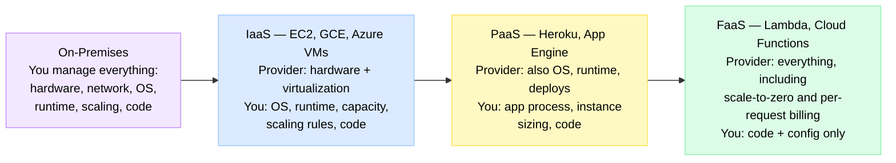
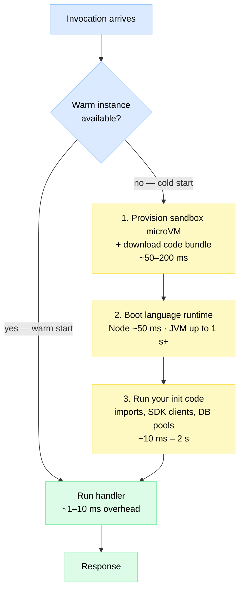
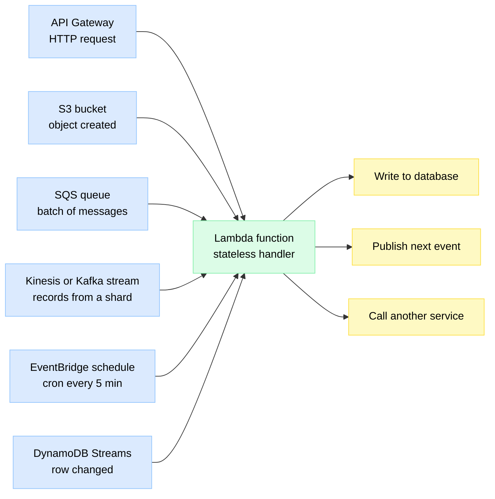
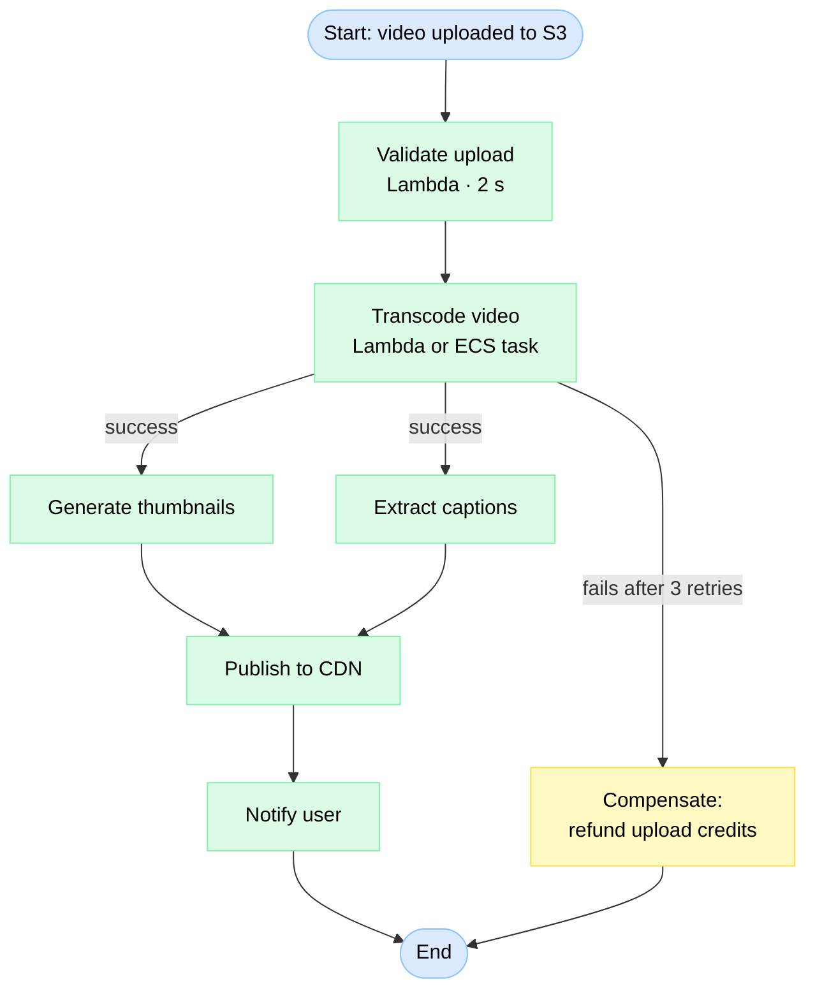
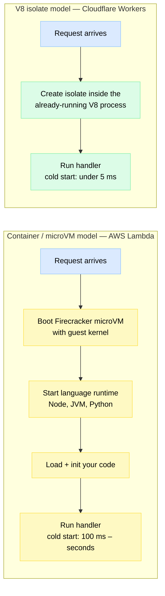
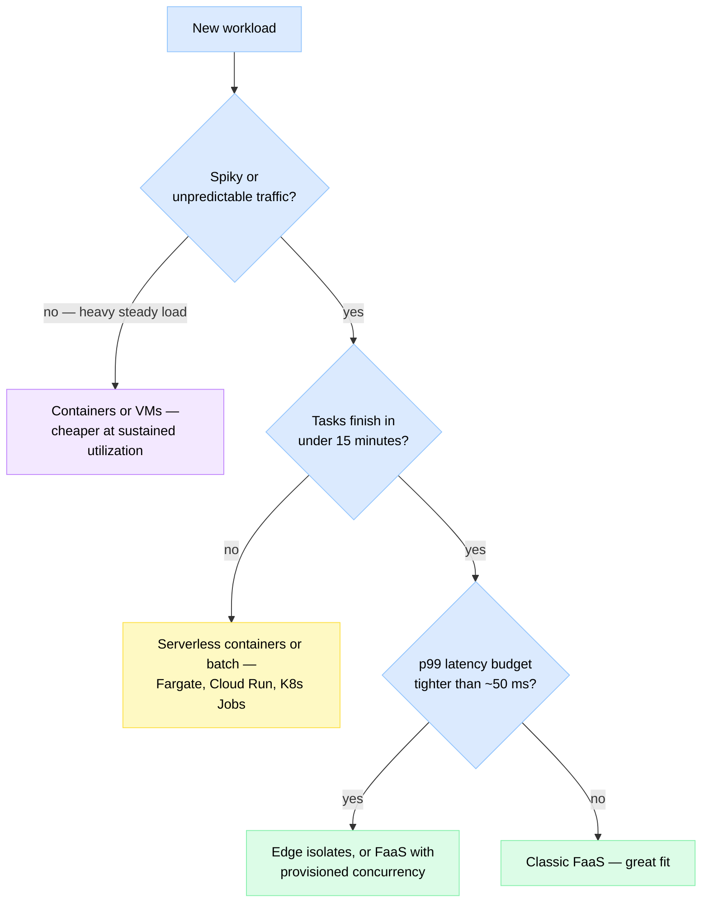

# Serverless Architecture — FaaS & Beyond

> **Serverless** is a cloud model where you ship just your code, the provider runs it on servers you never see or manage, scales it from zero to thousands of copies automatically, and bills you only for the milliseconds it actually executes.

**Level:** 5 · **Topic:** 8 · **Prerequisites:** [Event-Driven Architecture](../02-Event-Driven-Architecture/README.md) · [API Gateway](../05-API-Gateway/README.md) · [Message Queues](../../Level-03-Communication/04-Message-Queues/README.md)

---

## 🎯 The Problem

You build a small image-resize service for user avatars. Traffic looks like this: 3,000 uploads/hour at lunchtime, ~10/hour at 3 AM, and a 50× spike whenever marketing runs a campaign.

With traditional servers you must:

1. **Guess capacity.** Provision for the spike → pay for idle machines 90% of the time. Provision for the average → fall over during the campaign.
2. **Operate the fleet.** OS patches, runtime upgrades, autoscaling rules, health checks, 2 AM pages when a box dies.
3. **Pay for idle.** An EC2 instance bills by the hour whether it's resizing images or doing absolutely nothing.

**The core problem:** classic infrastructure couples *paying* and *operating* to *time*, but a workload that's *spiky, event-shaped, and short-lived* only needs compute in brief, unpredictable bursts — you're paying a full-time salary for a contractor's job. Serverless couples cost and capacity to *actual work done*.

---

## 🌍 Real-World Analogy

Think about how you get around a city:

- **Owning a car (on-prem / IaaS):** huge upfront cost, you handle insurance, oil changes, parking. It sits idle 95% of the day, but it's instantly available and cheapest per km *if* you drive constantly.
- **Leasing with maintenance included (PaaS):** the dealer handles servicing; you still pay monthly whether you drive or not.
- **Taxi / Uber (FaaS):** pay per ride, zero maintenance, a fleet that "scales" with demand. But: if no driver is nearby you wait a few minutes for pickup — that's a **cold start**. And if you commute 4 hours every day, Uber ends up costing far more than owning — that's the **cost crossover point**.

Serverless is Uber for compute: perfect for occasional, bursty trips; expensive for a daily 200 km commute.

---

## 🧠 Core Idea

### 1. Servers exist — you just stop managing them

"Serverless" is a marketing name, not a physics claim. Your code absolutely runs on servers (AWS Lambda runs on EC2 metal under a micro-VM hypervisor called **Firecracker**). What disappears is *your responsibility* for them: no instances to size, patch, scale, or keep alive. You upload a function; the platform handles the rest — including scaling to **zero** when nobody calls it.

### 2. The spectrum: IaaS → PaaS → FaaS

Each step right transfers more responsibility to the provider — and takes away more control.

*Caption: moving right, the provider absorbs more of the stack. FaaS is the extreme: you own only the function body and its configuration.*

### 3. The FaaS model — functions as the unit of deployment

**FaaS (Function as a Service)** — AWS Lambda, Google Cloud Run functions, Azure Functions — has three defining properties:

1. **Event-driven invocation.** A function never "runs"; it is *invoked* by an event: an HTTP request, a new file in [object storage](../../Level-02-Data-Layer/09-Object-Storage/README.md), a message on a [queue](../../Level-03-Communication/04-Message-Queues/README.md), a timer.
2. **Stateless execution.** Each invocation may land on a fresh instance. Anything in memory or on local disk can vanish between calls — state must live in an external DB, cache, or object store.
3. **Hard execution limits.** Platforms cap duration, memory, and payload size:

| Limit (typical, check current docs) | AWS Lambda | Google Cloud Run functions | Azure Functions (Consumption) |
|---|---|---|---|
| Max duration | 15 min | 60 min (HTTP) / 10 min (event) | 10 min (30+ min on Premium) |
| Memory | 128 MB – 10 GB | up to 32 GB | 1.5 GB (more on Premium) |
| Sync payload | 6 MB | 32 MB | ~100 MB |
| Default concurrency | 1,000/account (soft) | per-revision limits | dynamic |

The platform scales by running **many copies in parallel** — 1 request = 1 concurrent execution (Lambda model). 10,000 simultaneous uploads → up to 10,000 concurrent sandboxes.

### 4. Cold starts — the tax on scale-to-zero

If no warm instance exists when an event arrives, the platform must build one from scratch:

*Caption: a cold start is provision → boot runtime → run your init code — all before your handler sees the request. Warm starts skip straight to the handler.*

Typical cold-start figures on Lambda (from Mikhail Shilkov's and Datadog's ongoing benchmarks):

| Runtime | Typical cold start | Notes |
|---|---|---|
| Rust / Go | 30–150 ms | Compiled, tiny runtime |
| Node.js / Python | 100–300 ms | Grows with bundle size |
| .NET | 300–700 ms | AOT compilation helps a lot |
| Java | 400 ms – 1 s+ | Spring Boot can hit 5–10 s |

**Mitigations:**

| Technique | How it works | Cost |
|---|---|---|
| **Provisioned concurrency** | Keep N instances pre-initialized | You pay for them while idle — partially defeats the model |
| **SnapStart** (Java, Python, .NET) | Snapshot the initialized microVM memory; restore in ~200 ms instead of re-booting the JVM | Free-ish (Java); restore isn't zero |
| **Keep-warm pings** | Cron event every ~5 min keeps an instance alive | Only keeps 1–2 instances warm; a hack |
| **Smaller bundles, lazy init** | Less code to download and parse; open DB clients outside the handler once | Engineering discipline |
| **Faster runtime** | Rewrite hot functions in Go/Rust/Node | Rewrite cost |
| **Edge isolates** | Move to V8-isolate platforms (below) | Different constraints |

### 5. Event sources & triggers

A FaaS function is a stateless handler wired to event sources — this is [Event-Driven Architecture](../02-Event-Driven-Architecture/README.md) with the platform doing the plumbing:

*Caption: one function, many possible triggers. Sync triggers (API Gateway) wait for the response; async triggers (S3, SQS) retry on failure — so handlers must be idempotent.*

The [API Gateway](../05-API-Gateway/README.md) pairing is so common it has a name — the "serverless HTTP API": Gateway handles auth, routing, throttling; Lambda handles logic; DynamoDB stores state.

### 6. Orchestrating functions — Step Functions & Durable Functions

Real workflows span many functions: validate → transcode → thumbnail → publish → notify. Chaining them by having each function invoke the next creates untraceable spaghetti. Two options (the same split as in [Saga & Orchestration](../07-Saga-and-Orchestration/README.md)):

- **Choreography:** functions communicate via events (S3 → SNS → SQS → Lambda). Loosely coupled, but the workflow exists only "between the lines."
- **Orchestration:** a managed state machine — **AWS Step Functions** (declare states in JSON) or **Azure Durable Functions** (write orchestration as code, replayed event-sourcing-style) — calls each function, handles retries, timeouts, branching, and compensation, and keeps durable state *between* steps so the functions can stay stateless.

*Caption: a Step Functions state machine — parallel branches, retries, and a compensating step live in the workflow definition, not inside the functions.*

⚠️ Step Functions bills **per state transition** (~$25 per million). High-volume workflows with many tiny steps get expensive — this exact issue stars in the Prime Video story below.

### 7. Edge functions — why V8 isolates start in under 5 ms

Lambda gives every tenant a **Firecracker microVM**: strong isolation, but each cold start boots a guest kernel and a language runtime. **Cloudflare Workers** (and Deno Deploy, Vercel Edge) take a different bet: one **V8 process** per machine is *already running*, and each tenant gets a lightweight **isolate** inside it — the same sandboxing mechanism that separates tabs in Chrome.

*Caption: isolates skip the two slowest cold-start steps — no VM boot, no runtime boot — because the runtime is shared and always on. Cloudflare even pre-warms the isolate during the TLS handshake, marketing it as "0 ms cold starts."*

The trade-off: isolates run only JavaScript/WASM, offer small memory (~128 MB), short CPU budgets, and weaker isolation than a VM (Cloudflare compensates with V8 hardening and process-level defenses). You can't `apt install ffmpeg` in an isolate.

### 8. BaaS — the other half of serverless

**Backend as a Service** applies the same "no servers, pay per use" contract to *stateful* building blocks:

- **Firebase / Supabase:** managed auth, database, push notifications — mobile apps ship with almost no backend code.
- **DynamoDB on-demand:** pay per read/write request, no capacity planning.
- **Aurora Serverless v2:** a relational DB that scales capacity units up and down with load.
- **S3, SQS, SNS:** arguably the original serverless services — nobody has ever patched an S3 server.

A "fully serverless" app = FaaS for logic + BaaS for state + API Gateway at the front.

### 9. The pricing model — and the crossover point

Lambda pricing (x86, 2025-ish): **$0.20 per million requests + ~$0.0000167 per GB-second.**

Example: 512 MB function, 100 ms average → 0.05 GB-s per call → **~$1.03 per million invocations**. At 10 req/s steady (~26 M calls/month) that's **~$27/month** — already more than a small always-on instance that could handle the same load. Structurally, Lambda compute costs **~$0.060 per GB-hour** vs **~$0.008–0.012 per GB-hour** for EC2/containers — a **5–7× premium** per unit of compute. So:

> **Rule of thumb:** if your workload keeps servers busy above roughly **15–25% sustained utilization**, always-on VMs/containers are cheaper. Below that — or when traffic is spiky and unpredictable — serverless wins, because idle time costs you nothing (and your ops time counts too).

---

## 🔧 The Serverless Menu

| Flavor | Examples | Unit of deployment | Best for |
|---|---|---|---|
| **FaaS** | Lambda, Cloud Run functions, Azure Functions | A function | Event handlers, glue code, spiky APIs |
| **Edge functions** | Cloudflare Workers, Vercel Edge, Deno Deploy | JS/WASM isolate | Auth, personalization, A/B at <5 ms, close to users |
| **Serverless containers** | Cloud Run, Fargate, Azure Container Apps | A container image | Existing apps, longer jobs, any language/binary — see [Containers & Orchestration](../../Level-06-Scale-and-Reliability/07-Containers-and-Orchestration/README.md) |
| **BaaS** | Firebase, DynamoDB on-demand, Aurora Serverless, S3 | An API you call | State, auth, storage without ops |
| **Workflow engines** | Step Functions, Durable Functions | A state machine | Multi-step, long-running orchestration |

---

## 🏢 Real-World Examples

### Amazon Prime Video (2023) — the famous move *back* to a monolith
Prime Video's audio/video quality-monitoring service was built as serverless microservices: Step Functions orchestrating Lambdas, passing video frames between steps via S3. At scale it hit account limits and cost a fortune — **per-transition orchestration charges plus repeated S3 reads/writes of intermediate frames dominated the bill**. The team merged everything into a single process on ECS/EC2, keeping the same code but sharing data in memory: **~90% infrastructure cost reduction** and higher scale. Lesson: serverless decomposition adds a data-movement and orchestration tax; for high-volume, tightly-coupled pipelines, a [monolith](../01-Monolith-vs-Microservices/README.md) can be the optimization, not the regression.

### iRobot — a robot fleet with (almost) no servers
iRobot runs the cloud platform for millions of internet-connected Roombas on AWS IoT + Lambda, essentially 100% serverless. A small team operates a planet-scale fleet backend, and after Christmas morning — when tens of thousands of new robots come online in hours — the platform scales itself and their bill scales with actual robot chatter, not provisioned peak.

### Coca-Cola — vending machines
Coca-Cola's connected vending machines fire a payment/loyalty event per purchase — the canonical spiky, tiny-task workload. Moving the service from always-on EC2 to Lambda + API Gateway cut its cost from roughly **$13,000/year to ~$4,500/year** at ~30 M requests/month, with no fleet to patch (their re:Invent numbers).

### Netflix — Lambda as the encoding pipeline's glue
Netflix runs its heavy encoding on huge container/VM farms — but uses Lambda for the *event-driven edges*: when a studio master lands in S3, functions validate it and kick off encoding workflows; other functions handle backup checks, instance lifecycle, and security certificate rotation. Rule of thumb visible here: **serverless for coordination, dedicated fleets for heavy sustained compute.**

---

## ⚖️ Trade-offs

| 👍 Pros | 👎 Cons |
|---|---|
| Zero server ops — no patching, no capacity planning | Cold starts add tail latency (100 ms – seconds) |
| Scale to zero — idle costs nothing | 5–7× more expensive per GB-hour at high utilization |
| Automatic, near-instant scale-out per request | Hard limits: 15 min runtime, payload and memory caps |
| Pay-per-use maps cost to actual value delivered | Statelessness forced — all state must be external |
| Built-in per-function isolation and metrics | Vendor lock-in: triggers, IAM, orchestration are provider-specific |
| Tiny idea-to-production time for event glue | Harder local testing, debugging, and distributed tracing |
| Per-function security surface (least privilege IAM) | Concurrency spikes can DDoS downstream DBs (connection storms) |

---

## ✅ When to Use / ❌ When NOT to Use

**Reach for serverless when:**
- Traffic is **spiky or unpredictable** (webhooks, campaigns, IoT bursts, dev/staging environments).
- Work is **event-shaped and short**: file processing, notifications, stream records, cron jobs.
- You want **minimal ops** with a small team, or you're prototyping and may throw it away.
- Utilization would be low — the always-on alternative would sit mostly idle.

**Avoid (or hybridize) when:**
- **Long-running jobs** — a 3-hour ML training run can't fit a 15-minute limit; use containers/batch.
- **Ultra-low-latency paths** — a p99 of 20 ms can't absorb a 400 ms cold start (unless you pay for provisioned concurrency or use edge isolates).
- **Heavy, steady traffic** — above ~15–25% sustained utilization, VMs/containers are far cheaper (Prime Video's exact lesson).
- **Vendor lock-in is a real business risk** — Step Functions definitions and Lambda triggers don't port across clouds.

*Caption: a 30-second decision tree. The three killers for FaaS are steady high load, long tasks, and very tight latency budgets.*

---

## ⚠️ Common Pitfalls

1. **DB connection storms.** 1,000 concurrent Lambdas × 1 connection each melts a Postgres that allows 100 connections. Use RDS Proxy, DynamoDB, or HTTP-based DB access.
2. **Heavy init inside the handler.** Creating SDK clients/DB pools *inside* the handler repeats the cost every call; do it in global scope so warm starts reuse it.
3. **Forgetting idempotency.** Async triggers (S3, SQS) deliver **at-least-once** — a retried Lambda that isn't idempotent double-charges a customer.
4. **Lambda pinball.** Functions synchronously calling functions calling functions: you pay for all the waiting layers, and one cold start stacks on another. Use queues or a state machine instead.
5. **Ignoring the orchestration bill.** Step Functions' per-transition pricing punishes chatty, high-volume workflows (see Prime Video).
6. **Unbounded concurrency as a self-DDoS.** A poison-pill S3 bucket event or a replayed stream can fan out to thousands of executions. Set reserved-concurrency ceilings.
7. **Treating "serverless" as "cheap."** It's cheap at *low utilization*. Always do the GB-hour crossover math before and after launch.

---

## 🎤 Interview Tips

- Open with the crisp framing: "Servers still exist — what I stop owning is capacity, scaling, and ops; what I pay for is execution time, not uptime."
- **Name the numbers:** ~$0.20/M requests + GB-seconds; 15-min Lambda cap; cold starts from ~100 ms (Node) to 1 s+ (JVM); Workers isolates <5 ms.
- Always volunteer **cold starts + a mitigation** (provisioned concurrency, SnapStart, smaller bundles) — it separates users from architects.
- Cite **Prime Video 2023** when asked "is serverless always the right microservices choice?" — it shows judgment, not dogma. Contrast with iRobot/Coca-Cola where serverless was the win.
- Expected follow-ups: "How do you keep functions stateless but workflows stateful?" → Step Functions / Durable Functions. "How do you avoid DB connection exhaustion?" → RDS Proxy / serverless-native DBs. "When is a container better?" → long jobs, custom binaries, steady load.
- Connect to patterns you already know: FaaS is event-driven architecture with managed infrastructure; orchestration vs choreography is the [Saga](../07-Saga-and-Orchestration/README.md) discussion again.

---

## 📝 TL;DR

| Concept | One-liner |
|---|---|
| Serverless | Servers exist; you stop managing them — pay per execution, scale to zero |
| Spectrum | IaaS → PaaS → FaaS: each step trades control for less ops |
| FaaS | Stateless, event-triggered functions with hard limits (Lambda: 15 min, 10 GB) |
| Cold start | Provision microVM → boot runtime → init code; ~100 ms (Node) to seconds (JVM) |
| Mitigations | Provisioned concurrency, SnapStart, keep-warm, small bundles, faster runtimes |
| Orchestration | Step Functions / Durable Functions hold workflow state so functions don't have to |
| Edge isolates | V8 isolates (Cloudflare Workers) skip VM+runtime boot → <5 ms starts, JS/WASM only |
| Pricing | ~$0.06/GB-hour vs ~$0.01 for VMs → crossover at ~15–25% sustained utilization |
| Anti-pattern | Long jobs, tight p99s, heavy steady traffic — see Prime Video's 90% savings going monolith |

---

## 🧪 Test Yourself

**1. Walk through exactly what happens during a Lambda cold start. Why is Java hit hardest, and what are two mitigations?**

Answer

Cold start = (1) provision a Firecracker microVM and download the code bundle (~50–200 ms), (2) boot the language runtime, (3) run your initialization code (imports, SDK/DB clients) — all before the handler runs. Java suffers most because the JVM itself is slow to boot and frameworks like Spring do heavy classpath scanning and dependency injection at startup (multi-second inits are common). Mitigations: **SnapStart** (resume from a memory snapshot of the initialized VM, ~200 ms), **provisioned concurrency** (pre-warmed instances you pay for), plus smaller bundles, lazy init, or switching to Go/Rust/Node for hot paths.

**2. A 1 GB-memory function runs 200 ms per call at a steady 50 req/s. Roughly what does Lambda cost per month, and would an always-on instance be cheaper?**

Answer

Compute per call: 1 GB × 0.2 s = 0.2 GB-s. Monthly calls: 50 × 86,400 × 30 ≈ 130 M. Compute: 130 M × 0.2 GB-s ≈ 26 M GB-s × $0.0000167 ≈ **$434**, plus requests 130 M × $0.20/M ≈ $26 → **~$460/month**. Average concurrency is only 50 × 0.2 s = 10 in-flight requests — a couple of modest instances (~$60–120/month) or one 4-vCPU box could serve this. Steady 24/7 load sits far past the crossover point, so VMs/containers win by ~4–7×. (If the same traffic came in rare unpredictable bursts, the answer could flip.)

**3. Design a thumbnail pipeline: users upload images to S3, thumbnails must appear within seconds. What breaks when 10,000 images arrive in one minute?**

Answer

Wiring: S3 `ObjectCreated` event → Lambda resize → write thumbnail to a second bucket/prefix (never the same trigger prefix — infinite loop!). At 10,000 events/min, Lambda fans out to hundreds–thousands of concurrent executions: you can hit the account concurrency limit (throttles), and every execution opening a SQL connection storms the database (use DynamoDB or RDS Proxy). Hardening: put SQS between S3 and Lambda to buffer and control batch size, set reserved concurrency as a ceiling, make the handler idempotent (S3/SQS deliver at-least-once), and add a DLQ for poison images.

**4. Why can Cloudflare Workers claim ~0 ms cold starts while Lambda takes 100 ms+? What do isolates give up?**

Answer

Lambda cold starts pay for booting a per-tenant Firecracker microVM (guest kernel) plus a language runtime. Workers keep **one V8 process already running** on each edge machine and create a per-tenant **isolate** inside it — no VM boot, no runtime boot, just loading a small script into an existing engine (<5 ms; Cloudflare pre-warms during the TLS handshake). Trade-offs: JavaScript/WASM only (no arbitrary binaries), ~128 MB memory and small CPU budgets, and isolation enforced by V8 rather than a hardware-virtualized boundary — weaker tenant separation that Cloudflare backstops with additional process-level defenses.

**5. Amazon Prime Video cut costs ~90% by moving a serverless microservices workload into a monolith. What specifically was expensive, and what's the general lesson?**

Answer

Their quality-monitoring pipeline used Step Functions orchestrating many Lambda steps, passing video frames between steps through S3. Costs exploded from (1) **per-state-transition Step Functions pricing** at very high event volume and (2) **repeated S3 writes/reads of intermediate data** between steps; they also hit account scaling limits. Consolidating the steps into one ECS process let data flow in memory, cutting infra cost ~90%. Lesson: distribution has a data-movement + orchestration tax. Serverless excels at spiky, loosely-coupled event handling — not high-volume, tightly-coupled data pipelines. Architecture is context-dependent, not fashion-driven.

---

## 📚 Further Reading

- [Serverless Architectures — Mike Roberts on martinfowler.com](https://martinfowler.com/articles/serverless.html) — the canonical long-form treatment of FaaS and BaaS.
- [Cloud Programming Simplified: A Berkeley View on Serverless Computing (2019)](https://arxiv.org/abs/1902.03383) — academic take on limits and future directions.
- [Prime Video: Scaling up the audio/video monitoring service and reducing costs by 90% (archived)](https://web.archive.org/web/2024/https://www.primevideotech.com/video-streaming/scaling-up-the-prime-video-audio-video-monitoring-service-and-reducing-costs-by-90) — the famous post itself.
- [Cloud Computing without Containers — Cloudflare blog](https://blog.cloudflare.com/cloud-computing-without-containers/) — how V8 isolates work and why they start fast.
- [Firecracker: Lightweight Virtualization for Serverless Applications (NSDI '20)](https://www.usenix.org/conference/nsdi20/presentation/agache) — the microVM under Lambda and Fargate.
- [Cold Starts in AWS Lambda — Mikhail Shilkov](https://mikhail.io/serverless/coldstarts/aws/) — continuously updated per-language benchmarks.
- [AWS Lambda SnapStart announcement](https://aws.amazon.com/blogs/aws/new-accelerate-your-lambda-functions-with-lambda-snapstart/) and [iRobot on AWS](https://aws.amazon.com/solutions/case-studies/irobot/).

---

**⬅️ Previous:** [Saga & Orchestration](../07-Saga-and-Orchestration/README.md) · **➡️ Next:** [Service Mesh](../09-Service-Mesh/README.md) · **🏠 Level 5 Index:** [Architecture Patterns](../README.md)
