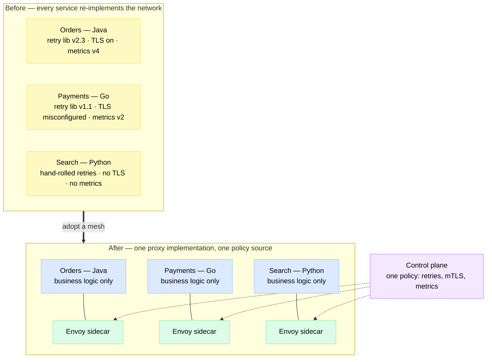
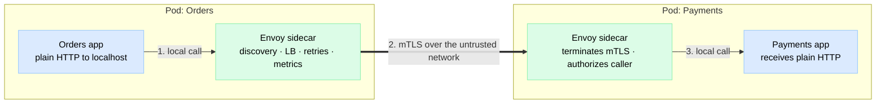
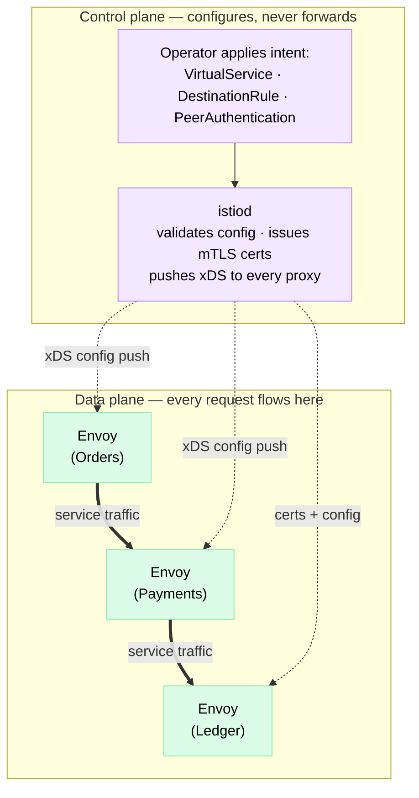
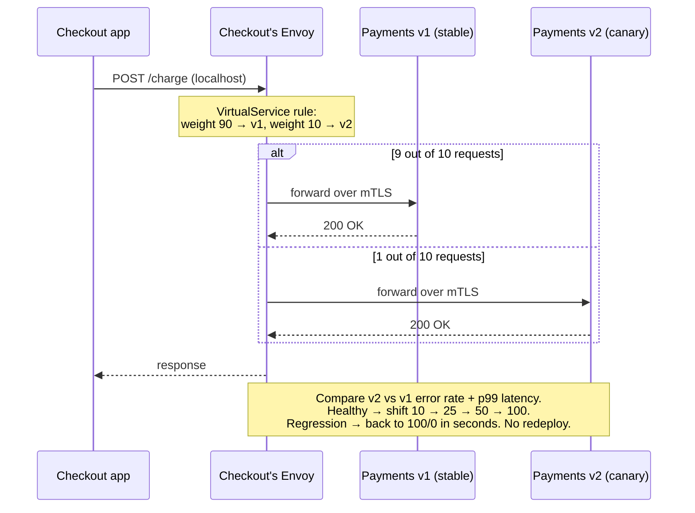
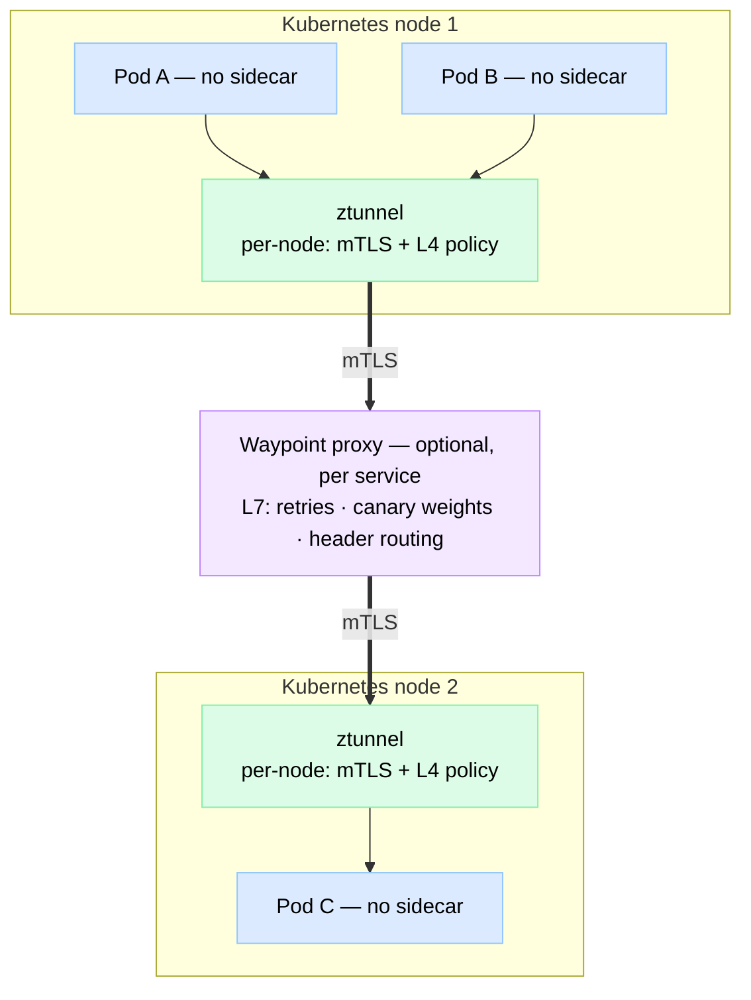

# Service Mesh

> A **service mesh** is a dedicated infrastructure layer — a fleet of small proxies deployed next to every service instance — that handles service-to-service networking (mTLS, retries, timeouts, traffic routing, metrics) so your application code doesn't have to.

**Level:** 5 · **Topic:** 9 · **Prerequisites:** [Service Discovery](../04-Service-Discovery/README.md) · [Resilience Patterns](../06-Resilience-Patterns/README.md) · [gRPC & RPC](../../Level-03-Communication/03-gRPC-and-RPC/README.md)

---

## 🎯 The Problem (Why does this exist?)

You've split the monolith. You now have 100+ microservices written in Java, Go, Python, and Node. Every one of them talks to others over the network — and the network is unreliable. So every service needs:

- **Retries with backoff** when a downstream call fails
- **Timeouts** so a slow dependency doesn't hang the caller
- **TLS** so traffic between services is encrypted and authenticated
- **Circuit breaking** so one sick service doesn't drag down the fleet ([Resilience Patterns](../06-Resilience-Patterns/README.md))
- **Metrics and trace propagation** so you can see what's happening

The first-generation answer was **shared libraries**: Netflix built Hystrix (circuit breaking), Ribbon (client-side load balancing), and friends. It worked — *if your whole company wrote Java*. In a polyglot org, you must re-implement that library in every language, keep the versions in sync, and redeploy **every service** each time you fix a retry bug or rotate a TLS cipher. In practice you get:

- The Go team's retry logic behaves differently from the Java team's.
- The Python service silently ships with TLS off because the library was "coming next sprint."
- A security patch takes **months** to roll out because it's baked into 100 binaries.

**The core problem:** cross-cutting network concerns are re-implemented N services × M languages times — inconsistently, buggily, and un-upgradeably. The mesh moves that logic **out of the process and into the platform**.

*The diagram below shows the same three services before and after a mesh — the network logic collapses into one proxy implementation, configured from one place.*



---

## 🌍 Real-World Analogy

Imagine a company with 100 offices. Today, every employee is personally trained to sort their own mail, screen visitors at their own door, and answer their own phone according to company policy. Training is inconsistent, some offices skip the security briefing, and when policy changes, HR must re-train 100 offices one by one.

The fix: give **every office a personal assistant** who sits right outside the door. Employees just do their job and hand outgoing mail to the assistant. The assistant handles the mail (network calls), checks visitor badges (mTLS authentication), retries a busy phone line (retries), hangs up on calls that run too long (timeouts), and logs every interaction (metrics).

Crucially, all assistants follow **one policy handbook published by HQ**. When HQ changes the visitor policy, every assistant applies it the same day — no employee retraining required.

- The **assistants** = sidecar proxies (the **data plane**)
- **HQ publishing the handbook** = the **control plane**
- The **employees** = your services, now blissfully unaware of mail-sorting

---

## 🧠 Core Idea

### 1. The sidecar proxy pattern

Deploy a small proxy (almost always [**Envoy**](https://www.envoyproxy.io/), a high-performance C++ proxy) **next to each service instance** — in Kubernetes, as a second container in the same pod (see [Containers & Orchestration](../../Level-06-Scale-and-Reliability/07-Containers-and-Orchestration/README.md)). Traffic rules (iptables) transparently redirect all inbound and outbound traffic through the proxy.

The magic: **your app only ever talks to localhost.** It makes a plain HTTP call to `localhost`; the sidecar intercepts it and handles service discovery, load balancing, mTLS, retries, and metrics on the real network. The receiving side's sidecar terminates mTLS, checks authorization, records metrics, and hands plain HTTP to its app.

*One request between two pods — each app sees only localhost; the sidecars own the scary network in the middle.*



Because the proxy is a separate process, it's **language-agnostic** (works identically for Java, Go, Python, COBOL-over-HTTP if you must) and **independently upgradeable** — patch the proxy fleet without touching a single application binary.

### 2. Data plane vs control plane

This is *the* vocabulary distinction interviewers listen for (coined crisply by Envoy's creator, Matt Klein — [read his post](https://blog.envoyproxy.io/service-mesh-data-plane-vs-control-plane-2774e720f7fc)):

| Plane | What it is | Touches your packets? |
|---|---|---|
| **Data plane** | The sidecar proxies. They sit in the request path and forward, secure, retry, and measure every packet. | ✅ Every single one |
| **Control plane** | The brain (Istio's **istiod**, Linkerd's **destination controller**). Watches Kubernetes, validates your routing/security config, issues certificates, and pushes configuration to every proxy via an API (Envoy's **xDS**). | ❌ Never |

Key operational consequence: if the control plane crashes, **traffic keeps flowing** — proxies run on their last-known config. You just can't push changes or issue new certs until it's back.

*Config flows down from istiod; requests only ever flow proxy-to-proxy.*



### 3. What the mesh buys you

- **🔐 mTLS everywhere (zero-trust).** Every proxy gets a short-lived certificate encoding a cryptographic service identity (SPIFFE-style, e.g. `spiffe://cluster/ns/payments/sa/payments-svc`). Every hop is encrypted **and mutually authenticated** — "Orders may call Payments; Search may not" becomes a one-line policy, not a firewall ticket. Certs rotate automatically (Istio default: every 24h).
- **🚦 Traffic management.** Split traffic by percentage (canary 90/10), route by header (`x-beta-user: true` → v2), **mirror** live traffic to a new version without returning its responses (shadow testing). This is what an [API Gateway](../05-API-Gateway/README.md) does for *north-south* traffic (edge → services) — the mesh does it for *east-west* traffic (service → service).
- **💪 Resilience by config.** Retries with budgets, per-route timeouts, circuit breaking (max connections/pending requests), and **outlier detection** — automatically ejecting a backend instance that keeps returning 5xx from the load-balancing pool. All the patterns from [Resilience Patterns](../06-Resilience-Patterns/README.md), applied uniformly with zero app code.
- **🔭 Observability for free(ish).** Since every request crosses a proxy, you get uniform **golden-signal** metrics — request rate, error rate, latency histograms per service pair (see [Observability](../../Level-06-Scale-and-Reliability/01-Observability/README.md)) — plus access logs and trace *spans*. One honest caveat: for distributed traces to connect, **your app must still forward trace headers** (`traceparent`) from inbound to outbound requests. The mesh can't do that part — it can't know which incoming request caused which outgoing one.

---

## 📊 How It Works: Canary Release via Traffic Splitting

The flagship demo. You're rolling out `payments v2`. Instead of a big-bang deploy, tell the mesh to send 10% of traffic to v2 and watch the golden signals:

```yaml
# Istio VirtualService — the entire canary, no app changes
http:
  - route:
      - destination: { host: payments, subset: v1 }
        weight: 90
      - destination: { host: payments, subset: v2 }
        weight: 10
```

*The caller's sidecar makes the 90/10 decision per request — the Checkout app has no idea a canary is happening.*



Why this beats replica-count canarying (running 1 v2 pod out of 10): mesh weights are **decoupled from capacity** (0.5% canary with full-size deployments), you can target by **header** (employees only), and rollback is a config change that propagates in seconds. Tools like Argo Rollouts and Flagger automate the shift-and-watch loop on top of the mesh.

---

## 🔧 Types / Variations

### The big three

| | **Istio** | **Linkerd** | **Consul Connect** |
|---|---|---|---|
| **Proxy (data plane)** | Envoy (C++) | `linkerd2-proxy` — purpose-built micro-proxy in Rust | Envoy (default) |
| **Origin** | Google + IBM + Lyft (2017); CNCF graduated 2023 | Buoyant (coined the term "service mesh"); CNCF graduated 2021 | HashiCorp |
| **Feature depth** | Deepest: rich routing, egress control, WASM plugins, multi-cluster | Deliberately minimal: mTLS, retries, splits, metrics — and that's the point | Solid; shines when meshing **VMs + Kubernetes** together |
| **Resource footprint** | Heaviest | Lightest (Rust proxy uses a few MB) | Medium |
| **Operational complexity** | High — many CRDs, famous learning curve | Low — "it just works" is the brand | Medium — natural if you already run Consul for [Service Discovery](../04-Service-Discovery/README.md) |
| **Choose it when** | You need every feature and have a platform team | You want 80% of the value at 20% of the complexity | Mixed VM/container estate, HashiCorp shop |

### The sidecar-less future

The per-pod sidecar is powerful but expensive (see Trade-offs). Two approaches are removing it:

- **eBPF ([Cilium Service Mesh](https://cilium.io/use-cases/service-mesh/)):** run networking, L4 policy, and even some L7 handling **in the Linux kernel** via eBPF programs — no per-pod proxy at all, with a per-node Envoy only where L7 rules demand it.
- **[Istio Ambient Mesh](https://istio.io/latest/blog/2022/introducing-ambient-mesh/):** split the sidecar's job in two. A per-**node** agent (**ztunnel**) does mTLS and L4 authorization for all pods on that node; an optional per-**service** **waypoint proxy** does L7 (routing, retries, canary) only for services that need it. Pods need no sidecar and no restart to join the mesh.

*Ambient mesh: security for everyone at the node level, L7 smarts only where you pay for them.*



---

## 🏢 Real-World Examples

### Lyft — where Envoy was born
Around 2015, Lyft was drowning in exactly the polyglot problem above: a PHP monolith plus a growing zoo of services, each with its own flaky HTTP handling, and engineers who **didn't trust the network** they couldn't see. Matt Klein and team built Envoy as a universal out-of-process proxy; by the time they [open-sourced it in 2016](https://eng.lyft.com/announcing-envoy-c-l7-proxy-and-communication-bus-92520b6c8191), it was fronting over 100 services and millions of requests per second — a production service mesh before the term was mainstream. Envoy became the third project ever to graduate from the CNCF (after Kubernetes and Prometheus).

### Google + IBM + Lyft — Istio
In 2017 Google and IBM teamed up with Lyft to put a control plane on top of Envoy — Istio. Google was effectively productizing an internal lesson: its RPC infrastructure (Stubby) had long given every internal service uniform auth, load balancing, and telemetry, and Istio brought that model to Kubernetes users.

### Monzo — Linkerd at a bank
UK digital bank Monzo runs **well over 1,500 microservices** (mostly small Go services) and adopted Linkerd early to get uniform metrics, retries, and routing without touching every service. Their famous [2017 payments outage post-mortem](https://community.monzo.com/t/resolved-current-account-payments-may-fail-major-outage/26296/95) — a Kubernetes bug interacting badly with their Linkerd deployment — is a classic honest read on the flip side: the mesh is powerful shared infrastructure, which means it's also a shared failure domain you must operate carefully.

### Airbnb & eBay — the migration wave
Airbnb built one of the *pre-mesh* systems, SmartStack (2013: HAProxy + Nerve + Synapse for service discovery), then spent years migrating its thousands of services to an Istio/Envoy-based mesh for consistent mTLS and traffic control. eBay similarly standardized on Istio across its enormous Kubernetes estate. The pattern repeats: companies that hand-rolled service networking in 2013–2016 converged on meshes once the tooling matured.

---

## ⚖️ Trade-offs

| ✅ You gain | ❌ You pay |
|---|---|
| mTLS + identity everywhere, rotated automatically — zero-trust without touching app code | **Latency:** two extra proxy hops per call, roughly **1–3 ms** added (fine for most; painful for sub-10ms budgets or deep call chains where it compounds) |
| Uniform retries, timeouts, circuit breaking, outlier detection in every language | **Resources:** each sidecar costs ~50–100 MB RAM + ~0.1–0.5 vCPU under load. At 1,000 pods that's ~100 GB of RAM doing nothing but proxying — a real cloud bill line item |
| Canary %, header routing, traffic mirroring — deploys decoupled from releases | **Operational complexity:** a new distributed system to install, monitor, and upgrade. Mesh upgrades touch *every pod* and are among the scariest infra changes you'll do |
| Golden-signal metrics + access logs for every service pair, for free | **Debugging depth:** engineers must now distinguish "app returned 503" from "Envoy generated 503" (response flags, connection pools, xDS state) |
| Network logic upgradeable fleet-wide without redeploying apps | **Another dependency:** control-plane bugs, cert-expiry incidents, and version-skew issues become *your* incidents |

---

## ✅ When to Use / ❌ When NOT to Use

**Reach for a mesh when:**
- You have **dozens-to-hundreds of services in multiple languages** — the library approach has visibly failed.
- Compliance or zero-trust mandates **encryption + authentication between all services** (PCI, HIPAA, FedRAMP).
- You need **fine-grained progressive delivery** (0.5% canaries, header-targeted routing, traffic mirroring).
- You have a **platform team** that can own the mesh as a product.

**Skip it (for now) when:**
- You run **< ~20 services**, or everything is one language — a well-maintained shared library plus Kubernetes-native tools is simpler and cheaper.
- Kubernetes **Ingress / an [API Gateway](../05-API-Gateway/README.md)** already covers your needs — if 95% of interesting traffic is north-south, a mesh mostly adds idle machinery.
- Your team is still stabilizing on Kubernetes itself — a mesh on top of shaky foundations multiplies the confusion.
- Latency budgets are brutally tight (high-frequency trading, real-time bidding) — milliseconds are your product.

Rule of thumb: **the mesh solves an organizational scaling problem, not a technical itch.** If you can name the three teams whose duplicated networking code it deletes, you're ready. If you just read a cool blog post, you're not.

---

## ⚠️ Common Pitfalls & Gotchas

1. **Adopting a mesh for one feature.** If all you want is mTLS, cert-manager + a CNI with encryption might do; if all you want is canaries, your gateway or Argo Rollouts might suffice. A mesh is a platform commitment — buy it for the bundle or not at all.
2. **Expecting distributed tracing "for free."** The mesh emits spans, but if apps don't propagate `traceparent` headers from inbound to outbound calls, you get confetti, not traces. Header propagation is still an app-code (or library) job.
3. **Retry amplification storms.** App retries 3× *and* its sidecar retries 3× *and* the next hop retries 3× → one failure fans out into 27 requests. Configure retries at **one layer** (prefer the mesh), use retry budgets, and cap with circuit breakers.
4. **Under-provisioned sidecars.** An OOM-killed or CPU-throttled Envoy manifests as mysterious latency spikes and connection resets in *someone else's service*. Size and monitor the proxies like the tier-1 infrastructure they are.
5. **Flipping mTLS to STRICT too early.** Enforce strict mode while some legacy workloads still lack proxies and they go dark instantly. Roll out in `PERMISSIVE` mode, watch the plaintext-connection metrics drain to zero, then tighten.
6. **Treating the mesh upgrade as routine.** Control-plane/proxy version skew has bitten many teams. Canary the mesh itself: upgrade one node pool / one namespace first, exactly as you'd canary an app.

---

## 🎤 Interview Tips

- **Frame it as an organizational fix:** "Cross-cutting network concerns were re-implemented per service per language; the mesh moves them into the platform so they're consistent and independently upgradeable." That sentence *is* the topic.
- **Use the vocabulary precisely:** data plane (sidecars, touch every packet) vs control plane (istiod, config + certs only). Bonus points for "the app talks to localhost; iptables redirects through the proxy."
- **Draw the canary:** caller's sidecar splitting 90/10 by config weight, watch golden signals, shift or roll back — no redeploy.
- **Contrast with an API Gateway:** gateway = north-south (edge), mesh = east-west (service-to-service). They coexist; many meshes reuse Envoy for both.
- **Name the costs unprompted:** ~1–3 ms per hop, sidecar RAM/CPU × every pod, serious operational complexity. Then give the "when NOT to use" answer — small/monoglot shops should use libraries + Ingress. Nothing signals seniority like declining a technology.
- Classic follow-ups: *"What happens if the control plane goes down?"* → data plane keeps serving on last-known config; you lose config pushes and cert issuance. *"How does mTLS identity work?"* → per-workload certs carrying a SPIFFE-style identity, auto-rotated. *"Do you still need tracing instrumentation?"* → yes, apps must propagate trace headers. *"What about sidecar overhead?"* → mention eBPF/Cilium and Istio Ambient (per-node ztunnel + optional waypoints).

---

## 📝 TL;DR

| Question | Answer |
|---|---|
| **What is it?** | An infrastructure layer of proxies (usually Envoy) beside every service instance, handling service-to-service networking uniformly |
| **Data plane** | The sidecar proxies — in the path of every request |
| **Control plane** | istiod & friends — validates config, issues certs, pushes xDS to proxies; never touches packets |
| **Headline features** | mTLS everywhere (zero-trust), traffic splitting/canaries/mirroring, retries + timeouts + circuit breaking + outlier detection, golden-signal metrics |
| **The catch** | ~1–3 ms extra latency per hop, sidecar CPU/RAM in every pod, a whole new system to operate |
| **Skip when** | Few services, single language, north-south-only needs — libraries + Ingress/[API Gateway](../05-API-Gateway/README.md) suffice |
| **Big three** | Istio (feature-rich), Linkerd (simple & light), Consul Connect (VMs + k8s) |
| **Direction of travel** | Sidecar-less: eBPF (Cilium), Istio Ambient Mesh (per-node ztunnel + optional waypoint proxies) |

---

## 🧪 Test Yourself

**1. Your company has 120 services in 5 languages. Why is the "shared networking library" approach failing, and how exactly does a sidecar fix it?**

<details><summary>Show answer</summary>

The library must be written and maintained 5 times (once per language), versions drift, behavior diverges (different retry semantics per language), and any fix requires rebuilding and redeploying all 120 services. A sidecar is a **separate process**, so it's language-agnostic — the same proxy binary with the same behavior runs beside every service regardless of language — and **independently upgradeable**: the platform team can patch TLS or retry logic fleet-wide by rolling proxies, without touching a single application binary.
</details>

**2. Istio's istiod crashes at 2 a.m. and stays down for an hour. What happens to production traffic during that hour? What *doesn't* happen?**

<details><summary>Show answer</summary>

Traffic keeps flowing — the data plane (Envoy sidecars) forwards requests using its **last-pushed configuration**, so existing routing, mTLS, and resilience policies keep working. What you lose while istiod is down: no new config pushes (you can't change a canary weight or add a route), no certificate issuance (a problem if certs expire during the outage — Istio's short-lived certs make prolonged control-plane outages dangerous), and newly started pods can't be properly configured/join the mesh. Control plane down = "frozen but serving," not "outage."
</details>

**3. Design a rollout of `payments v2` to 5% of real users using the mesh, and explain why this beats running 1 v2 pod out of 20.**

<details><summary>Show answer</summary>

Deploy v2 alongside v1 (both full-size or right-sized), then apply a VirtualService/TrafficSplit with weights 95/5. The **caller's sidecar** routes 5% of requests to v2. Compare v2's error rate and p99 latency against v1 (the mesh's per-subset golden-signal metrics make this trivial); if healthy, walk the weight up 5 → 25 → 50 → 100, and if not, set it back to 0 — rollback is a config push propagating in seconds, no redeploy. Beats replica-count canarying because: the percentage is **decoupled from pod counts** (you can do 0.5%), you can target by **header** (employees first), you can **mirror** traffic with zero user impact, and rollback doesn't wait for pods to terminate/start.
</details>

**4. After adopting a mesh, a minor downstream blip now triggers a traffic tsunami that takes the service fully down. What's the likely mechanism and the fix?**

<details><summary>Show answer</summary>

**Retry amplification.** Retries are configured at multiple layers — the app retries 3×, its sidecar retries each attempt 3×, and maybe the next hop's client retries too — so one failed request becomes 9–27 attempts, turning a blip into a self-inflicted DDoS. Fix: retry at **one layer only** (usually the mesh, so it's uniform), use **retry budgets** (e.g., retries may add at most 20% extra load) instead of fixed counts, keep per-try timeouts tight, and rely on circuit breaking/outlier detection to stop hammering an unhealthy backend.
</details>

**5. A 6-person startup with 12 Go services on Kubernetes asks whether they should install Istio "to be production-grade." What do you tell them, and at what point would your answer change?**

<details><summary>Show answer</summary>

Don't. With one language and 12 services, a small shared Go library (retries, timeouts, metrics) plus Kubernetes-native tools (Ingress/an API gateway for edge traffic, NetworkPolicies, cert-manager if they need TLS) delivers most of the value with none of the mesh's operational tax — which, for a 6-person team, would be the single most complex system they run. The answer changes when: they go **polyglot** (the library must be duplicated), service count grows to the point where inconsistent networking causes real incidents, compliance demands **mTLS between all workloads**, or they need fine-grained progressive delivery. The mesh solves an organizational scaling problem they don't have yet.
</details>

---

## 📚 Further Reading

- [Matt Klein — Announcing Envoy (Lyft Engineering, 2016)](https://eng.lyft.com/announcing-envoy-c-l7-proxy-and-communication-bus-92520b6c8191) — the origin story.
- [Matt Klein — Service Mesh Data Plane vs Control Plane](https://blog.envoyproxy.io/service-mesh-data-plane-vs-control-plane-2774e720f7fc) — the canonical vocabulary post.
- [William Morgan — The Service Mesh Manifesto](https://buoyant.io/service-mesh-manifesto) — from Linkerd's creator; refreshingly honest about hype ("the world's most over-hyped technology").
- [Istio — Architecture](https://istio.io/latest/docs/ops/deployment/architecture/) and [Introducing Ambient Mesh](https://istio.io/latest/blog/2022/introducing-ambient-mesh/).
- [Cilium — Service Mesh use case](https://cilium.io/use-cases/service-mesh/) — the eBPF, sidecar-less angle.
- [Monzo — 2017 payments outage post-mortem](https://community.monzo.com/t/resolved-current-account-payments-may-fail-major-outage/26296/95) — what operating a mesh at a bank really involves.
- Related in this curriculum: [Serverless Architecture](../08-Serverless-Architecture/README.md) · [Observability](../../Level-06-Scale-and-Reliability/01-Observability/README.md) · [Containers & Orchestration](../../Level-06-Scale-and-Reliability/07-Containers-and-Orchestration/README.md)

---

⬅️ Previous: [08 — Serverless Architecture](../08-Serverless-Architecture/README.md) · ➡️ Next: [10 — Multi-Tenancy & SaaS Architecture](../10-Multi-Tenancy/README.md) · 🏠 [Level 5 Index](../README.md)
