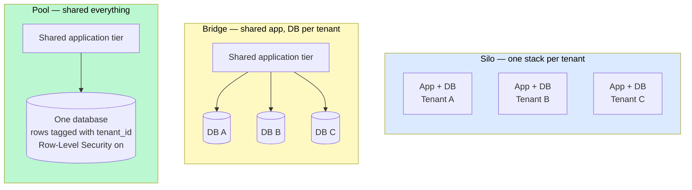
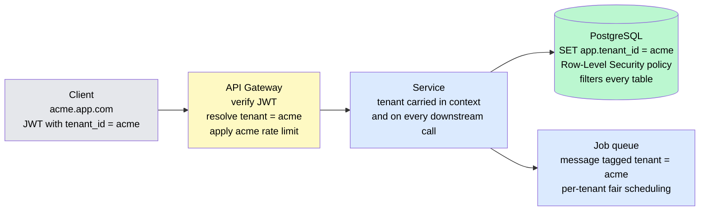
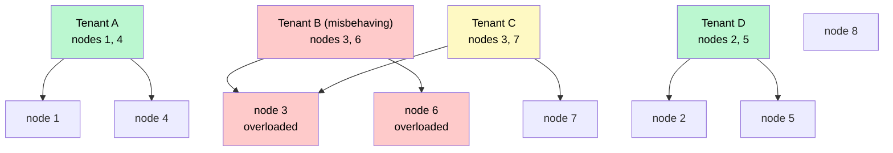

# Multi-Tenancy & SaaS Architecture

> **Multi-tenancy** is one deployment serving many customers ("tenants") whose data and traffic must stay isolated from each other. The central design decision is *how much they share* — from a single database with a `tenant_id` column to a fully separate stack per customer — and every other choice follows from it.

**Level:** 5 · **Topic:** 10 · **Prerequisites:** [Sharding & Partitioning](../../Level-02-Data-Layer/02-Sharding-and-Partitioning/README.md) · [Authentication & Authorization](../../Level-03-Communication/08-Authentication-and-Authorization/README.md) · [Rate Limiting](../../Level-03-Communication/07-Rate-Limiting/README.md) · [Monolith vs Microservices](../01-Monolith-vs-Microservices/README.md)

---

## 🎯 The Problem

You run a B2B analytics product with 10,000 customers on one shared database. Three things happen in the same week:

1. **The noisy neighbor.** One enterprise customer kicks off an export of 50 million rows. Their query pins the database CPU for twenty minutes. Nine thousand nine hundred and ninety-nine other customers watch their dashboards time out — and they will never know why.
2. **The leak.** A developer adds a new report endpoint and forgets one `WHERE tenant_id = ?`. For six hours, customers can see each other's revenue. This is the single most common security incident in SaaS, and it comes from an ordinary missed filter.
3. **The demand.** A bank signs a contract on the condition that its data lives on infrastructure in Germany, encrypted with keys it controls, with the ability to audit that no one else's data shares the same tables.

The naive fix — give every customer their own copy of the whole system — means 10,000 databases to migrate, back up, monitor, and pay for, and onboarding a customer takes a day instead of a second.

**The core problem:** sharing infrastructure is what makes SaaS economical; isolation is what makes it trustworthy. Multi-tenancy is the set of techniques for having both.

---

## 🌍 Real-World Analogy

Three ways to house 200 families:

- **An apartment building** (*pool* model). One structure, shared plumbing and power, cheap per unit, new residents move in the same day. But one resident's all-night party is everyone's problem, and a plumbing fault on floor 3 can flood floor 2.
- **A row of townhouses** (*bridge* model). Shared land and roof line, but separate walls, meters, and front doors. Costs a bit more; your neighbor's problems mostly stay theirs.
- **Detached houses on separate lots** (*silo* model). Total isolation — your own water, power, and fence. Expensive, slow to build, and the neighborhood needs a lot more roads to maintain.

Real SaaS companies usually build all three in one neighborhood: apartments for the thousands of small customers, townhouses for mid-size ones, and a few detached houses for the enterprise that insists. The hotel key card that only opens *your* room is the tenant-scoped auth token that makes any of this safe.

---

## 🧠 Core Idea

### Step 1 — The tenancy models

| Model | What's shared | What's isolated | Isolation | Cost per tenant | Onboarding | Noisy-neighbor risk |
|-------|---------------|-----------------|-----------|-----------------|------------|---------------------|
| **Silo** | Nothing (or just the code) | Whole stack: app, DB, sometimes account/VPC | Strongest | Highest | Slow (provision infra) | None |
| **Bridge (DB-per-tenant)** | Application tier, load balancer, cache | Database (or schema) per tenant | Strong at data layer | Medium | Minutes (create DB + run migrations) | Compute shared, storage isolated |
| **Pool** | Everything | Rows, via `tenant_id` | Logical only | Lowest | Instant (insert a row) | Highest |
| **Tiered / hybrid** | Small tenants pooled, large ones siloed | Depends on tier | Per tier | Optimized | Instant for small, slower for large | Managed by tiering |

Most successful SaaS products end up **hybrid**: pool by default, with the ability to promote a tenant to its own shard or its own stack when size, regulation, or contract demands it.

### Step 2 — Tenant identity and context propagation

Every request must know its tenant before it touches data. The tenant is resolved **once, at the edge** — from the subdomain (`acme.yourapp.com`), a claim in the JWT (`"tenant_id": "acme"`), or the API key — and then travels through every hop as an explicit context value (an HTTP header on service calls, a field on queue messages, a context object in code).

The rule: **a tenant ID that comes from the client's request body is an attacker's tenant ID.** It comes only from authenticated identity.

### Step 3 — Enforcing isolation at the data layer

Relying on every developer to remember `WHERE tenant_id = ?` fails eventually. Push the guarantee below the application:

- **Row-Level Security (PostgreSQL):** `CREATE POLICY tenant_isolation ON orders USING (tenant_id = current_setting('app.tenant_id'))`. The connection sets the tenant once; the database refuses to return other tenants' rows no matter what the query says. Forgetting the filter now returns zero rows instead of everyone's rows.
- **Repository / ORM default scopes:** every query builder is constructed with the tenant already applied; there is no "unscoped" query in normal code paths.
- **Physical isolation:** in bridge and silo models the connection string itself is per tenant — there is nothing to forget.
- **Tests that prove it:** an integration test that creates two tenants and asserts every endpoint returns only its own data is the cheapest security control you will ever write.

### Step 4 — Data partitioning with `tenant_id` as the shard key

Sharding by tenant co-locates all of one customer's data on one shard, which keeps their queries fast and single-shard. It also makes **tenant-aware placement** possible: put many small tenants on one shard, give a huge tenant its own, and move tenants between shards as they grow (Shopify calls this "pod balancing"). Every index should lead with `tenant_id` so lookups stay local.

The hazard is the **hot tenant** — one customer that is 30% of all traffic. Sharding by tenant means that customer sits on one shard no matter what. That's the moment to promote them to a dedicated shard or silo.

### Step 5 — Taming the noisy neighbor

Isolation of *data* is not isolation of *performance*. Controls, from cheapest to strongest:

1. **Per-tenant rate limits and quotas** at the API gateway — requests per second, rows per export, concurrent jobs.
2. **Fair scheduling in async work** — weighted fair queuing so 1,000 jobs from one tenant don't starve one job from another. A common implementation: one queue per tenant, round-robin across queues.
3. **Bulkheads** — separate worker pools, connection pools, or even clusters per tier (free / pro / enterprise), so a flood in one can't drain another.
4. **Shuffle sharding** — assign each tenant to a random small subset of nodes (say 2 out of 8). Two tenants share *both* nodes only rarely, so a badly behaving tenant takes down its own pair and a tiny fraction of others, not the whole fleet. With 8 nodes choose 2 there are 28 distinct pairs; with 100 nodes choose 5 there are 75 million.
5. **Dedicated capacity** — the silo model, when the contract pays for it.

### Step 6 — Cross-cutting concerns that become per-tenant

- **Encryption:** a data-encryption key per tenant (envelope-encrypted under a master key) enables *crypto-shredding* — delete the tenant's key and their data is unrecoverable everywhere at once, including backups. See [Data Privacy & Encryption](../../Level-06-Scale-and-Reliability/09-Data-Privacy-and-Encryption/README.md).
- **Data residency:** a tenant's home region is a property in the control plane; their shard, backups, and queues are pinned there.
- **Observability:** `tenant_id` as a log field and trace attribute is essential; as a *metrics label* it can explode cardinality — aggregate to tier, or track only the top N tenants.
- **Backups and restores:** "restore one customer's data to yesterday" is trivial in silo, possible in bridge, and a real engineering project in pool (logical export by `tenant_id`).
- **Feature flags and configuration:** per-tenant settings live in a **control plane** that provisions tenants, stores their tier/region/flags, and is queried by the **data plane** that serves requests.

### Step 7 — Moving a tenant between tiers

Growth turns pooled tenants into hot tenants. The migration is the CDC playbook: snapshot the tenant's rows to the new shard, tail changes until caught up, flip the routing entry in the control plane, verify, and delete the old rows after a soak. Done well, it's invisible to the customer; done as a "maintenance window," it's a churn risk.

---

## 📊 How It Works

### Silo vs Bridge vs Pool

*The same three tenants, housed three ways. Move left for isolation, right for economy.*

*Caption: Silo costs the most and isolates best; pool is the reverse. Bridge keeps the cheap shared compute while isolating the layer where leaks and noisy neighbors hurt most — the database.*

### A Request Through a Pooled System

*Tenant identity is established at the edge from the token, then enforced by the database itself, so a missing filter in application code cannot leak data.*

*Caption: Three independent enforcement points — gateway, service context, database policy. Defense in depth means one forgotten line is a bug, not a breach.*

### Shuffle Sharding: Blast Radius of a Bad Tenant

*Eight nodes; each tenant is assigned to a random pair. Tenant B's traffic flood affects only nodes 3 and 6 — and only tenants who happen to share both.*

*Caption: Tenant C shares one node with B and degrades slightly but still has node 7. Tenants A and D are untouched. With plain sharding, B's flood would have taken down its whole shard and every tenant on it.*

---

## 🔧 Types / Variations / Strategies

| Concern | Pool approach | Bridge approach | Silo approach |
|---------|---------------|-----------------|---------------|
| **Data isolation** | `tenant_id` column + RLS | Separate DB / schema per tenant | Separate everything |
| **Schema migrations** | Run once | Run N times (orchestrated, can take hours across thousands of DBs) | Run N times |
| **Connection pooling** | One pool | One pool per DB — watch total connections | Per stack |
| **Backup / restore one tenant** | Logical export by ID | Restore one DB | Restore one stack |
| **Per-tenant customization** | Config rows, feature flags | Config + optional schema differences | Anything, including code version |
| **Cost efficiency** | Best | Good | Poor |
| **Compliance stories (SOC 2, residency)** | Hardest to explain | Easy for data | Easiest |

---

## 🏢 Real-World Examples

### Salesforce — the original pooled multi-tenant platform
Salesforce runs enormous numbers of customer "orgs" on shared database instances with a **metadata-driven** design: customer-defined objects and fields are stored as rows in generic tables, interpreted at runtime, and every query is scoped by org. Their 2008 architecture paper is still the reference for how far the pool model can be pushed.

### Shopify — pods
Shopify groups shops into **pods**, each a fully independent slice of the platform with its own MySQL, Redis, and workers. A shop lives in exactly one pod; the routing layer sends its traffic there. Pods cap the blast radius of any failure and let Shopify **rebalance** — moving a shop that outgrows its pod with a live, binlog-tailed migration. It's a bridge/silo hybrid at massive scale.

### Slack — workspace sharding, then Vitess
Slack's data model is naturally tenant-scoped (everything hangs off a workspace). They sharded MySQL by workspace, hit hot-workspace and rebalancing pain, and migrated to Vitess so that tenant placement and resharding became routine operations instead of projects.

### AWS — shuffle sharding in Route 53 and beyond
Amazon's DNS service assigns each hosted zone to a shuffle-sharded set of name servers. A DDoS against one customer's domain overloads only that customer's shard — and the small, random overlap means almost every other customer keeps full service. The AWS Builders' Library article on the technique is required reading for noisy-neighbor design.

### Atlassian — moving to cloud multi-tenancy
Atlassian's cloud migration replaced per-customer server installs with a pooled platform backed by a **Tenant Context Service** that every request consults for a tenant's shard, region, and configuration. Their blog series is a candid account of how much of the work is the control plane, not the data plane.

### Stripe — accounts as tenants with hard isolation
Stripe treats every account as a tenant boundary enforced at the API key layer, with **per-account rate limits** and separate live/test data. Their public design notes on rate limiting describe the fairness problem — one integration in a retry storm must not degrade everyone else — and the layered limiters that solve it.

---

## ⚖️ Trade-offs

| Factor | Pool | Bridge | Silo |
|--------|------|--------|------|
| **Infrastructure cost** | Lowest | Medium | Highest |
| **Operational complexity** | Low (one of everything) | High (N databases to migrate, monitor, back up) | Highest (N stacks) |
| **Isolation guarantee** | Logical — one bug from a leak | Strong for data | Strongest |
| **Noisy-neighbor exposure** | High without limits | Compute shared | None |
| **Time to onboard a tenant** | Milliseconds | Minutes | Hours to days |
| **Enterprise / regulated sales** | Hardest | Workable | Easiest |
| **Blast radius of an outage** | Everyone | Compute: everyone; data: one | One tenant |

---

## ✅ When to Use / ❌ When NOT to Use

**Pool** when you have many small tenants, self-serve signup, and cost per tenant must approach zero (SMB tools, developer tools, consumer-facing SaaS).

**Bridge (DB per tenant)** when tenants are mid-size, data isolation must be provable, or per-tenant restores and residency are contractual — and you have the automation to run migrations across thousands of databases.

**Silo** when contracts, regulation, or sheer size demand it (banks, healthcare, governments, your top 1% of customers). Charge for it.

**Hybrid** is the realistic answer for anything that grows: pool by default, promote on demand.

**Don't over-engineer multi-tenancy** for an internal tool or a single-customer system. A `tenant_id` column you never use is harmless; a shuffle-sharded control plane for five customers is a year of wasted work.

---

## ⚠️ Common Pitfalls

1. **The missing `WHERE tenant_id`.** Use Row-Level Security or scoped repositories so the database enforces it. Write the two-tenant leak test.
2. **Tenant ID from the request body.** It must come from the authenticated identity, never from a parameter the client controls.
3. **Indexes that don't lead with `tenant_id`.** Every tenant-scoped query becomes a scan across all tenants' rows.
4. **Cache keys without the tenant.** `cache.get("dashboard:summary")` serves customer A's numbers to customer B. Prefix every key.
5. **Background jobs that run unscoped.** A nightly job that iterates "all orders" without a tenant context is both a leak and a noisy-neighbor generator.
6. **Thousands of databases, one migration at a time.** Bridge models need orchestrated, parallel, resumable migration runs — and a plan for the tenant whose migration fails halfway.
7. **Connection-pool multiplication.** DB-per-tenant with a pool per DB per app instance can hit the database server's connection limit fast. Use a proxy (PgBouncer, ProxySQL) or lazy pools.
8. **`tenant_id` as a metrics label.** Ten thousand tenants × every metric = a cardinality explosion that takes down the monitoring system. Aggregate.
9. **No plan for the hot tenant.** The day your largest customer is 40% of load, you need to move them. Build the tenant-migration path before you need it.

---

## 🎤 Interview Tips

- **The classic prompt:** "Design a multi-tenant SaaS platform." Start with the *model decision* and the tenant mix: "Thousands of small tenants → pool with RLS; enterprise tier → dedicated shard or silo. Hybrid." Then isolation enforcement, then noisy-neighbor controls, then residency.
- **Say "row-level security"** and "shuffle sharding" — both are recognized signals that you've operated a real multi-tenant system, not just read about columns.
- **Bring the leak test.** "The cheapest security control is an integration test that creates two tenants and hits every endpoint."
- **Common follow-up:** "A tenant is now 30% of your traffic — what do you do?" → Promote them to their own shard via CDC-style live migration; flip routing in the control plane; keep the old rows until verified.
- **Common follow-up:** "How do you run a schema migration across 5,000 tenant databases?" → Orchestrated, parallel with concurrency limits, resumable, with health checks between waves — and a design that tolerates tenants being on adjacent schema versions briefly.
- **Common follow-up:** "How do you delete a tenant for GDPR?" → Per-tenant encryption keys and crypto-shredding cover backups too; then logical deletion of rows.

---

## 📝 TL;DR

- Multi-tenancy is a spectrum: **pool** (shared rows) ↔ **bridge** (DB per tenant) ↔ **silo** (stack per tenant). Real products are **hybrid**: pool by default, promote on demand.
- Resolve the tenant **once at the edge** from authenticated identity; propagate it explicitly through every call and message.
- Enforce isolation **below the application** — Row-Level Security, scoped repositories, or physical separation — and prove it with a two-tenant test.
- Shard by `tenant_id`, lead every index with it, and have a live-migration path for hot tenants.
- Data isolation ≠ performance isolation: per-tenant rate limits, fair queuing, bulkheads, and **shuffle sharding** contain noisy neighbors.
- Per-tenant keys, residency, backups, and config all live in a **control plane** separate from the serving data plane.

---

## 🧪 Test Yourself

1. A SaaS product has 20,000 self-serve customers and 15 enterprise accounts that require EU data residency and per-customer restore. Propose a tenancy architecture and justify the model for each group.
2. Explain how PostgreSQL Row-Level Security prevents the "forgotten `WHERE tenant_id`" bug. What must the application do on each connection for the policy to work, and what new failure mode does it introduce?
3. With 12 nodes and each tenant assigned to a random 3, how many distinct node combinations exist? Explain in plain terms why a single abusive tenant affects far fewer other tenants than under plain sharding.
4. Your largest tenant now generates 35% of all writes and lives on a shared shard. Describe, step by step, how you move them to a dedicated shard with zero downtime.
5. List four places other than the database where tenant context must be enforced, and give a concrete bug that occurs when each is missed.

---

## 📚 Further Reading

- [AWS SaaS Lens — Tenant isolation, silo/pool/bridge](https://docs.aws.amazon.com/wellarchitected/latest/saas-lens/saas-lens.html) — the vocabulary most of the industry now uses.
- [Workload isolation using shuffle-sharding — Amazon Builders' Library](https://aws.amazon.com/builders-library/workload-isolation-using-shuffle-sharding/) — the math and intuition behind blast-radius reduction.
- [A Pods Architecture to Allow Shopify to Scale](https://shopify.engineering/a-pods-architecture-to-allow-shopify-to-scale) — bridge/silo hybrid with live rebalancing.
- [The Force.com Multitenant Architecture (Salesforce whitepaper)](https://developer.salesforce.com/wiki/multi_tenant_architecture) — the metadata-driven pool model.
- [Scaling Datastores at Slack with Vitess](https://slack.engineering/scaling-datastores-at-slack-with-vitess/) — tenant sharding and resharding at scale.
- [PostgreSQL Row Security Policies](https://www.postgresql.org/docs/current/ddl-rowsecurity.html) — the official docs for RLS.
- Previous: [09 — Service Mesh](../09-Service-Mesh/README.md) · Next Level: [Level 06 — Scale & Reliability](../../Level-06-Scale-and-Reliability/README.md) · Back to [Level 05 Overview](../README.md)
- See also: [Sharding & Partitioning](../../Level-02-Data-Layer/02-Sharding-and-Partitioning/README.md) · [Resilience Patterns](../06-Resilience-Patterns/README.md) · [Multi-Region & Geo-Distribution](../../Level-06-Scale-and-Reliability/06-Multi-Region-and-Geo-Distribution/README.md)
