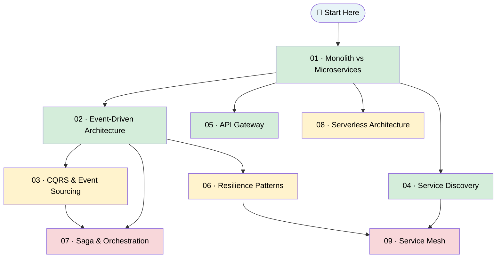

# Level 05 — Architecture Patterns

> Proven blueprints for organizing large systems. Once you understand the building blocks (databases, caches, load balancers), you need to know **how to wire them together** at scale. That's what architecture patterns give you.

---

## 🎯 Theme

Every system starts simple. Then it grows. Teams multiply, services multiply, failures multiply. Architecture patterns are the **battle-tested playbooks** that thousands of engineering teams have used to keep large systems maintainable, scalable, and resilient — even as they grow from 1 developer to 1,000.

In this level you'll learn the vocabulary, trade-offs, and decision frameworks that show up in every senior engineering interview and every architecture review.

---

## 🗺️ Roadmap

**Color guide:** Green = foundational · Yellow = intermediate · Red = advanced

---

## 📚 Topics

| # | Topic | What You'll Learn | Est. Time |
|---|-------|-------------------|-----------|
| 01 | [Monolith vs Microservices](./01-Monolith-vs-Microservices/README.md) | When to split, when to stay, the strangler fig migration | 45 min |
| 02 | [Event-Driven Architecture](./02-Event-Driven-Architecture/README.md) | Events, choreography, Kafka, loose coupling | 40 min |
| 03 | [CQRS & Event Sourcing](./03-CQRS-and-Event-Sourcing/README.md) | Separate reads from writes; store events, not state | 50 min |
| 04 | [Service Discovery](./04-Service-Discovery/README.md) | How services find each other in dynamic environments | 30 min |
| 05 | [API Gateway](./05-API-Gateway/README.md) | Single entry point, BFF pattern, routing & auth | 35 min |
| 06 | [Resilience Patterns](./06-Resilience-Patterns/README.md) | Circuit breakers, retries, bulkheads, graceful degradation | 45 min |
| 07 | [Saga & Orchestration](./07-Saga-and-Orchestration/README.md) | Long-running transactions without 2PC, Temporal, compensation | 50 min |
| 08 | [Serverless Architecture](./08-Serverless-Architecture/README.md) | FaaS, cold starts, event triggers, edge functions, when NOT to go serverless | 45 min |
| 09 | [Service Mesh](./09-Service-Mesh/README.md) | Sidecars, data vs control plane, Istio/Linkerd, mTLS, traffic splitting | 40 min |

**Total estimated time: ~6.5 hours**

---

## ✅ Prerequisites

Before diving in, you should be comfortable with:

- **Level 01** — Fundamentals (latency, throughput, availability, CAP theorem)
- **Level 02** — Data storage (databases, caching, replication)
- **Level 03** — Communication basics: [Message Queues](../Level-03-Communication/04-Message-Queues/README.md) and [Pub-Sub](../Level-03-Communication/05-Pub-Sub/README.md)
- **Level 04** — [Distributed Transactions](../Level-04-Distributed-Systems/04-Distributed-Transactions/README.md) and [Idempotency](../Level-04-Distributed-Systems/07-Idempotency-and-Exactly-Once/README.md)

---

## 🏆 Learning Outcomes

By the end of this level you will be able to:

1. **Choose** the right architectural style (monolith vs microservices) for a given team size and product stage
2. **Design** event-driven systems with proper decoupling and eventual consistency handling
3. **Explain** CQRS and Event Sourcing — when they help, when they hurt
4. **Draw** a service discovery diagram and explain client-side vs server-side patterns
5. **Design** an API Gateway layer with auth, rate limiting, and BFF variants
6. **Apply** circuit breakers, retries, and bulkheads to make distributed systems fault-tolerant
7. **Walk through** a Saga pattern with compensating transactions in an interview
8. **Decide** when serverless/FaaS fits — and when cold starts, costs, or lock-in rule it out
9. **Explain** how a service mesh moves retries, mTLS, and telemetry out of application code

---

## 🔗 What Comes Next

After this level, head to [Level 06 — Scale & Reliability](../Level-06-Scale-and-Reliability/01-Observability/README.md) where you'll learn observability (metrics, tracing, alerting) — the essential feedback loop for operating the architectures you just designed.

---

*Part of the [System Design Curriculum](../README.md)*
