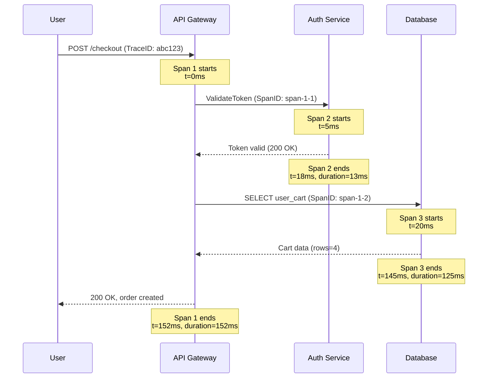

# Observability

> Observability is the ability to understand the internal state of a system by examining its external outputs — logs, metrics, and traces — so you can ask arbitrary questions about your system without deploying new code.

**Level:** 6 · **Topic:** 1 · **Prerequisites:** [Capacity Planning and Estimation](../02-Capacity-Planning-and-Estimation) · [Load Balancing](../../Level-01-Building-Blocks/02-Load-Balancing) · [CAP Theorem](../../Level-04-Distributed-Systems/01-CAP-Theorem)

---

## 🎯 The Problem

Your service goes down at 2 AM. Users are screaming. You SSH into a server and... now what?

In a monolith with a single process, you might grep a log file and find the culprit in minutes. But modern systems are distributed across dozens of microservices, running in Kubernetes pods that get killed and recreated constantly. A single user request might touch 15 different services before returning a response. When something breaks, **you are flying blind**.

The core problem is this: **you can't debug what you can't see**. Without deliberate instrumentation, production failures become black boxes:

- A database query is slow — but which one, called from where, triggered by what user action?
- Memory is climbing — but which service, which object, leaked by which code path?
- Error rate spiked — but only for users in one region, using one browser, hitting one endpoint?

Observability is how you answer these questions *after the fact*, without needing to have predicted them in advance. This is the key distinction from simple monitoring: monitoring tells you *something is wrong*; observability lets you figure out *why*.

---

## 🌍 Real-World Analogy

Think about the cockpit of a commercial aircraft. The pilots don't monitor the plane by occasionally looking out the window and hoping for the best. They have hundreds of instruments — altitude, airspeed, fuel flow, engine temperature, hydraulic pressure — all updated in real time, with alerts for anomalies, and a black box flight recorder capturing everything for post-incident analysis.

If something goes wrong mid-flight, investigators don't need to reproduce the problem. They *read the data that was already being collected*.

Your production system deserves the same treatment. **Logs are the flight recorder. Metrics are the instrument panel. Traces are the map of every route the flight took.**

---

## 🧠 Core Idea

### Monitoring vs Observability

**Monitoring** is watching known, pre-defined signals: "alert me if CPU > 80%." It works well when you know in advance what can go wrong.

**Observability** is the property of a system that allows you to ask *novel* questions at any time: "show me the 95th-percentile latency for checkout requests, broken down by payment provider, for users with more than 3 items in their cart, over the last 6 hours." You didn't have to predict that question when you wrote the code.

### The Three Pillars

| Pillar | What it is | Analogy |
|--------|------------|---------|
| **Logs** | Timestamped, structured records of discrete events | Security camera footage |
| **Metrics** | Numeric measurements aggregated over time | A dashboard speedometer |
| **Traces** | End-to-end records of a request's journey across services | GPS breadcrumb trail |

All three pillars work together. A metric alert fires → you open a trace to find the slow span → you read the logs for that specific service instance. Without all three, you are missing a dimension.

### SLI / SLO / SLA and Error Budgets

Before you can observe a system meaningfully, you need to define what "working" means.

- **SLI (Service Level Indicator):** A specific metric you measure, e.g., "the percentage of HTTP requests that return a 2xx response within 200ms."
- **SLO (Service Level Objective):** The target you set for an SLI, e.g., "99.9% of requests meet the above SLI."
- **SLA (Service Level Agreement):** A legal/contractual commitment to customers, usually with penalties if breached. Your SLO should be stricter than your SLA — if your SLA is 99.5%, your internal SLO might be 99.9%.

**Error budget** is the flip side of your SLO. If your SLO is 99.9%, you are *allowed* to be unavailable for 0.1% of the time. Over a year, that is **8.7 hours of downtime**. Over a month, that is **43.8 minutes**.

The error budget is a management tool: if you have burned 80% of your monthly budget by the 10th, you freeze risky deployments. If you have budget to spare, you ship faster. Google SRE invented this concept to turn reliability into a data-driven engineering decision rather than a political one.

Common SLO targets and their annual downtime allowances:

| SLO | Downtime/year | Downtime/month |
|-----|--------------|---------------|
| 99% ("two nines") | 87.6 hours | 7.3 hours |
| 99.9% ("three nines") | 8.7 hours | 43.8 minutes |
| 99.99% ("four nines") | 52.6 minutes | 4.4 minutes |
| 99.999% ("five nines") | 5.3 minutes | 26.3 seconds |

---

## 📊 How It Works

### Distributed Tracing — Following a Request Across Services

When a user hits your API, a single logical request fans out across multiple services. Tracing captures this entire journey as a tree of **spans**, each representing a unit of work in one service.



style AG fill:#d0e8ff,stroke:#6aadff,color:#000
style AU fill:#d4f1d4,stroke:#5cb85c,color:#000
style DB fill:#fff3cd,stroke:#f0ad4e,color:#000
style U fill:#f5d0f0,stroke:#c96cc9,color:#000

Every span shares the same **TraceID** (`abc123`) so you can reconstruct the full picture. If the total request took 152ms but the database span took 125ms, you know exactly where to focus.

Tools like **Jaeger** and **Zipkin** store and visualize these traces. **OpenTelemetry** is the vendor-neutral SDK that instruments your code once and exports to any backend.

### Logs — The ELK Stack

**ELK** (Elasticsearch, Logstash, Kibana) is the most common log aggregation stack:

1. **Logstash / Filebeat** — agents running on each host that ship log lines to a central destination
2. **Elasticsearch** — stores logs as indexed JSON documents, enables full-text search and aggregations
3. **Kibana** — dashboard UI for querying and visualizing logs

The modern best practice is **structured logging** — emit JSON, not free text:

```json
{
  "timestamp": "2026-06-24T02:14:33Z",
  "level": "ERROR",
  "service": "checkout-api",
  "trace_id": "abc123",
  "user_id": "u-9981",
  "message": "Payment gateway timeout",
  "duration_ms": 5001,
  "gateway": "stripe"
}
```

With structured logs, you can filter `trace_id = abc123` to find every log line across every service for a single request — correlating with your trace.

### Metrics — Prometheus and Grafana

**Prometheus** is a time-series database that scrapes numeric metrics from your services at regular intervals (typically every 15 seconds). You query it with **PromQL**.

**Grafana** sits on top of Prometheus (and other sources) to render dashboards. Most teams have a Grafana dashboard per service showing the **RED** and **USE** method metrics:

**RED method** (for *services*):
- **R**ate — requests per second
- **E**rrors — error rate (%)
- **D**uration — latency (p50, p95, p99)

**USE method** (for *resources* like CPUs, disks, queues):
- **U**tilization — % of time the resource is busy
- **S**aturation — how much work is queued/waiting
- **E**rrors — error events

A typical Grafana dashboard for a checkout service shows RED metrics on the top row, infrastructure USE metrics below, and SLO burn-rate gauges showing how fast you are consuming your error budget in real time.

---

## 🔧 Types / Variations / Strategies

| Pillar | What it captures | Best tool | Query language | Cost profile |
|--------|-----------------|-----------|---------------|-------------|
| **Logs** | Discrete events with full context and free-form data | ELK Stack, Loki, Datadog Logs | Lucene / LogQL / DQL | High — raw text is expensive to store and index at scale |
| **Metrics** | Numeric aggregates over time; no per-request detail | Prometheus + Grafana, Datadog Metrics | PromQL / MetricsQL | Low — pre-aggregated numbers compress well |
| **Traces** | End-to-end request journeys across service boundaries | Jaeger, Zipkin, Tempo | TraceQL / custom | Medium — often sampled (1–10%) to control volume |

**Sampling strategies for traces:**
- **Head-based sampling** — decide at request start whether to trace it (simple, but may miss rare errors)
- **Tail-based sampling** — buffer spans and decide after the request completes, so you can always keep slow or errored traces (smarter, more infrastructure overhead)

**Log levels** matter for cost control: run INFO in production, enable DEBUG only temporarily when diagnosing an issue.

---

## 🏢 Real-World Examples

**Google SRE** pioneered the SLI/SLO/error-budget framework, documented in the [Google SRE Book](https://sre.google/sre-book/table-of-contents/). Google runs "error budget meetings" where teams lose the ability to ship new features if they are burning budget faster than planned. This aligns incentives: reliability is not the ops team's problem, it's every engineer's problem.

**Datadog** is the most widely used commercial observability platform. It unifies logs, metrics, and traces under a single query language and correlation ID, so you can click from a metric spike to the traces that caused it to the log lines within those traces — all without context-switching. Datadog's pricing is volume-based (per host, per log GB ingested, per trace), which teaches you quickly that cardinality and log verbosity have real dollar costs.

**Netflix** runs tens of thousands of microservices and popularized the concept of "observability-driven development." Their Atlas metrics system handles millions of time series. Netflix engineers are expected to ship dashboards and runbooks alongside every new feature — observability is a first-class deliverable, not an afterthought. Netflix also open-sourced **Hystrix** (circuit breakers) and **Chaos Monkey** — tools that only make sense if you have strong observability to measure their effect.

---

## ⚖️ Trade-offs

**Cost vs coverage**
Full verbosity logging at scale is expensive. A high-traffic service logging every request at DEBUG level can generate terabytes per day. You must balance coverage (capturing enough to debug anything) against cost (storage, indexing, retention). Common strategies: log sampling for high-frequency events, short retention (7–30 days) with cold archival for compliance.

**Cardinality**
Metrics are cheap *until* you add high-cardinality labels like `user_id` or `request_id` to them. A metric with a label that has 10 million unique values creates 10 million individual time series, which explodes Prometheus memory and query time. Rule: keep metric labels low-cardinality (status code, region, endpoint). Put high-cardinality data in logs and traces.

**Alert fatigue**
More alerts does not mean more reliability. Teams that alert on every anomaly quickly learn to ignore their paging system. Best practice: alert on *symptoms* (user-visible SLI violations, error budget burn rate) rather than *causes* (CPU%, disk%). One well-tuned alert that always means "users are affected" is worth more than 50 noisy alerts that fire constantly.

---

## ✅ When to Use / ❌ When NOT to Use

**Use observability when:**
- You run more than one service or one instance of a service
- You cannot reproduce production issues in a development environment
- You have an SLA commitment to customers
- You are on-call and need to diagnose incidents quickly
- You want to make data-driven decisions about capacity and reliability

**Scale back or simplify when:**
- You are building an MVP or internal prototype with no SLA — basic logging to stdout and a single dashboard is fine
- Your traffic is low enough that you can read every log line manually
- The cost of full observability infrastructure exceeds the cost of the downtime it would prevent

---

## ⚠️ Common Pitfalls

**Not correlating the three signals**
Having logs, metrics, and traces in three disconnected tools that don't share a `trace_id` means you cannot pivot from a metric spike to the request that caused it. Always propagate a correlation ID (trace ID) through every service call and include it in log lines.

**No runbooks attached to alerts**
An alert fires at 3 AM. The on-call engineer doesn't know what to do. If every alert page doesn't link to a runbook ("when this fires, check X, then Y, escalate to Z if not resolved in 10 minutes"), you are just waking people up for no reason. Write the runbook when you write the alert, not after the first incident.

**Alerting on causes instead of symptoms**
CPU at 90% doesn't mean users are unhappy. It might be a batch job. Alert on SLI violations (latency p99 > 500ms for 5 minutes) instead. This reduces noise and keeps alerts meaningful.

**Over-alerting / under-alerting**
Both extremes are dangerous. Too many alerts → engineers mute their pagers. Too few → outages go undetected. Start with the RED method metrics on your most critical user journeys and tune from there.

**Treating observability as an afterthought**
Bolting on instrumentation after a system is built is painful and incomplete. Design for observability from the start: use structured logging, add trace context propagation to your HTTP/gRPC clients, and define SLIs before you launch.

---

## 🎤 Interview Tips

**SLI / SLO / SLA — know these cold:**
- SLI: a specific measurable indicator (e.g., request success rate)
- SLO: an internal target for an SLI (e.g., 99.9%)
- SLA: an external contractual promise (e.g., 99.5%), usually less strict than the SLO

**Error budget:**
Say: "An error budget is the inverse of the SLO. At 99.9% SLO, we have 0.1% — roughly 43 minutes per month — of allowed downtime. It turns reliability into a shared engineering resource: if we're burning budget fast, we slow down risky releases."

**What to monitor first:**
Answer with the RED method for services and SLO-based burn-rate alerting. Show you understand that alerting on symptoms (user-facing SLI) is better than alerting on causes (CPU).

**Three pillars in one sentence:**
"Logs for context, metrics for trends, traces for causality."

**If asked to design an observability system:**
Start from the user journey, define SLIs, set SLOs, then work backwards to decide what metrics to expose, what to log, and where to add trace instrumentation.

**Cardinality gotcha:**
Interviewers love asking why you shouldn't put `user_id` as a Prometheus metric label. Answer: cardinality explosion — one label value per user creates millions of time series.

---

## 📝 TL;DR

- Observability = Logs + Metrics + Traces working together, not in isolation
- Define SLIs (what you measure), SLOs (your target), and track your error budget (how much unreliability you can afford before freezing releases)
- Alert on symptoms (SLI violations, error budget burn rate) not causes (CPU, disk)
- Structured logging + trace ID propagation lets you correlate all three signals for a single request
- Cardinality is the silent killer of metrics systems — keep label values low-count

---

## 🧪 Test Yourself

1. Your 99.9% SLO means you have how many minutes of error budget per month? What happens when you exhaust it?
2. A metric shows p99 latency spiked from 80ms to 800ms for 10 minutes. Walk through exactly how you would use logs and traces to diagnose the root cause.
3. Why is alerting on "CPU > 80%" a bad practice compared to alerting on SLI burn rate? Give a concrete example where CPU is high but users are unaffected.
4. You want to add `user_id` as a label to a Prometheus counter metric tracking API calls. Your service has 5 million users. What goes wrong, and what should you do instead?

---

## 📚 Further Reading

- [Google SRE Book — Chapter 6: Monitoring Distributed Systems](https://sre.google/sre-book/monitoring-distributed-systems/) — the canonical reference for SLIs, SLOs, and the four golden signals
- [Google SRE Workbook — Implementing SLOs](https://sre.google/workbook/implementing-slos/) — practical walkthrough of building error budgets and burn-rate alerts
- [OpenTelemetry Documentation](https://opentelemetry.io/docs/) — the vendor-neutral standard for instrumenting services with traces, metrics, and logs
- [Prometheus Documentation — Best Practices](https://prometheus.io/docs/practices/naming/) — metric naming conventions, histogram guidelines, and cardinality advice
- [Cindy Sridharan — Monitoring and Observability](https://copyconstruct.medium.com/monitoring-and-observability-8417d1952e1c) — the essay that popularized "observability" in the software industry
- [Jaeger Documentation](https://www.jaegertracing.io/docs/) — distributed tracing concepts and Jaeger architecture
- [Grafana Best Practices](https://grafana.com/docs/grafana/latest/best-practices/) — dashboard design and alerting guidance
