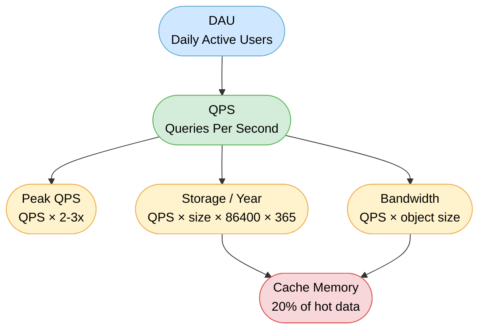

# Capacity Planning and Estimation

> Capacity planning is the practice of estimating the computational resources — servers, storage, bandwidth, and memory — a system will require to handle its expected load before you build it.

**Level:** 6 · **Topic:** 2 · **Prerequisites:** [01 - Observability](../01-Observability) · [Caching](../../Level-01-Building-Blocks/03-Caching)

---

## 🎯 The Problem

You're in a system design interview. The prompt is: "Design Twitter." No numbers are given. No user count, no tweet volume, no storage budget. Do you just start drawing boxes?

No — you estimate first. Without numbers, every architectural decision is a guess. Should you shard the database? Depends on how much data you have. Do you need a CDN? Depends on how much bandwidth you'll consume. Does the cache fit in memory? Depends on how large the working set is.

Capacity estimation turns vague requirements into concrete constraints, and concrete constraints drive architecture. This is a non-negotiable skill at senior engineering levels.

---

## 🌍 Real-World Analogy

Imagine you're a contractor hired to build a house. Before ordering lumber, you estimate: "The house is 2,000 sq ft, framing needs about 1 board foot per sq ft, so I'll order ~2,000 board feet plus 20% waste buffer." You don't measure every stud precisely at the start — you use rules of thumb and round up to avoid shortages.

Capacity planning works exactly the same way. You start with known quantities (users, actions per user), apply rules of thumb (average tweet size, peak multipliers), and arrive at resource estimates that are good enough to drive decisions. Exact numbers come later, from real traffic. For now, order-of-magnitude accuracy is the goal.

---

## 🧠 Core Idea

Back-of-the-envelope estimation is a structured skill, not a guessing game. It rests on three pillars:

1. **Powers of two as tools** — memory and storage sizes follow powers of two. Knowing that 2^10 ≈ 1,000 (a kilobyte) and 2^20 ≈ 1,000,000 (a megabyte) lets you multiply and divide rapidly without a calculator.

2. **Order-of-magnitude thinking** — you don't need to know if something is 1.2 million or 1.4 million. You need to know if it's in the millions, hundreds of millions, or billions. Being off by 2x is fine; being off by 100x is catastrophic.

3. **Assumptions stated out loud** — every estimate rests on assumptions. State them explicitly ("I'm assuming 300M DAU and 5 reads per user per day"). This shows clear thinking and lets your interviewer correct you if you're wildly off.

---

## 📊 How It Works

### Estimation Flow



Start with **DAU** (how many users are active daily) and fan out to compute everything else. Each downstream number feeds your architectural decisions.

---

### Powers of Two Cheatsheet

| Unit | Bytes | Approximate |
|------|-------|-------------|
| Kilobyte (KB) | 1,024 | ~10^3 |
| Megabyte (MB) | 1,048,576 | ~10^6 |
| Gigabyte (GB) | 1,073,741,824 | ~10^9 |
| Terabyte (TB) | ~1.1 × 10^12 | ~10^12 |
| Petabyte (PB) | ~1.1 × 10^15 | ~10^15 |
| Exabyte (EB) | ~1.1 × 10^18 | ~10^18 |

**Quick conversions to memorize:**
- 1 million bytes ≈ 1 MB
- 1 billion bytes ≈ 1 GB
- 1 trillion bytes ≈ 1 TB

---

### Latency Numbers You Should Know

These numbers, famously compiled by Jeff Dean, give you a mental model of where time goes in a system.

| Operation | Latency | Notes |
|-----------|---------|-------|
| L1 cache reference | ~1 ns | On-chip, fastest possible |
| L2 cache reference | ~4 ns | Still on-chip |
| RAM reference | ~100 ns | Main memory access |
| Read 4 KB from SSD | ~100 µs | 1,000× slower than RAM |
| Read 1 MB from SSD | ~1 ms | Sequential SSD read |
| Disk seek (HDD) | ~10 ms | Mechanical arm movement |
| Read 1 MB from HDD | ~20 ms | Sequential HDD read |
| Network round trip (same datacenter) | ~0.5 ms | Fast but not free |
| Network round trip (cross-continent) | ~150 ms | Speed of light across the ocean |
| Network round trip (client ↔ server) | ~200 ms | Typical mobile/web call |

**Key takeaways:** RAM is 1,000× faster than SSD. SSD is 100× faster than HDD. Network calls are expensive — avoid chatty patterns. Avoid synchronous HDD access in the hot path at all costs.

---

### Data Size Estimates

| Data Type | Size | Notes |
|-----------|------|-------|
| ASCII character | 1 byte | |
| Integer (32-bit) | 4 bytes | |
| Long / timestamp (64-bit) | 8 bytes | |
| UUID | 16 bytes | |
| IPv4 address | 4 bytes | |
| Tweet (plain text) | ~280 bytes | Max characters |
| Short URL | ~50 bytes | |
| Metadata row (typical) | ~100–200 bytes | ID + timestamps + fields |
| Small thumbnail | ~10 KB | |
| Profile picture | ~50–100 KB | |
| Web page | ~100 KB | |
| JPEG image (compressed) | ~300 KB | Average phone photo |
| MP3 audio (1 min) | ~1 MB | |
| HD video (1 min) | ~10 MB | Compressed H.264 |
| 4K video (1 min) | ~100 MB | |

---

## 🔧 Types / Variations / Strategies

### The Estimation Formula Steps

**Step 1 — Compute baseline QPS (Queries Per Second)**

```
QPS = DAU × actions_per_user_per_day ÷ 86,400
```

86,400 is the number of seconds in a day (60 × 60 × 24). Round it to 100,000 for mental math if needed.

**Step 2 — Compute peak QPS**

Traffic is never flat. Users cluster around morning commutes, lunch, evenings. Plan for spikes:

```
Peak QPS = QPS × 2 to 3
```

Use 2x for systems with steady traffic (SaaS tools), 3x for consumer apps (social networks, streaming).

**Step 3 — Compute storage per year**

```
Storage/year = write_QPS × avg_object_size × 86,400 × 365
```

Note that you use **write** QPS here, not read QPS — only writes add new data.

**Step 4 — Compute bandwidth**

```
Inbound bandwidth = write_QPS × avg_object_size
Outbound bandwidth = read_QPS × avg_object_size
```

**Step 5 — Estimate cache memory**

The 80/20 rule: 20% of content drives 80% of reads. Cache that hot 20%:

```
Cache memory needed = total_working_set × 0.20
```

Where `total_working_set` is the data that's likely to be requested in a given day.

---

### Replication and Safety Margins

Raw storage estimates need multipliers for production reality:

| Factor | Typical Multiplier |
|--------|--------------------|
| Database replication (3 replicas) | ×3 |
| Encoding overhead (metadata, indexes) | ×1.5 |
| Safety buffer (future growth, underestimation) | ×1.5–2 |
| **Combined** | **~5–10×** |

So if your math says 1 TB/year, plan for 5–10 TB of actual disk provisioning.

---

## 🏢 Real-World Examples

### Example 1: Twitter-Like Service

**Given:** 300M DAU, users read 5 tweets/day on average, write 1 tweet/day on average.

**Step 1 — Read QPS**
```
Read QPS = 300,000,000 × 5 ÷ 86,400
         = 1,500,000,000 ÷ 86,400
         ≈ 17,361 QPS
         ≈ ~17,000 read QPS
```

**Step 2 — Write QPS**
```
Write QPS = 300,000,000 × 1 ÷ 86,400
          ≈ 3,472 QPS
          ≈ ~3,500 write QPS
```

**Step 3 — Peak QPS**
```
Peak read QPS  = 17,000 × 3 = ~51,000 QPS
Peak write QPS = 3,500 × 3  = ~10,500 QPS
```

This is a read-heavy system (read:write ≈ 5:1), which is typical for social media. You'd lean toward read replicas and aggressive caching.

**Step 4 — Storage per year (tweets only)**

Average tweet = 280 bytes of text + 50 bytes of metadata = ~330 bytes. Round to 500 bytes to include indexes and encoding overhead.

```
Storage/year = 3,500 writes/s × 500 bytes × 86,400 s/day × 365 days
             = 3,500 × 500 × 31,536,000
             = 3,500 × 500 × ~31.5M
             = 3,500 × 15.75B
             ≈ 55 TB/year
```

With 3× replication: **~165 TB/year** of raw storage.

**Step 5 — Cache sizing**

Daily active data (tweets from the past 24 hours): ~3,500 writes/s × 500 bytes × 86,400 ≈ **150 GB**. Cache the hot 20%:

```
Cache memory = 150 GB × 0.20 = ~30 GB
```

That fits comfortably in a single Redis instance. Reads would be overwhelmingly served from cache, not disk — which validates the architecture.

---

### Example 2: Image Hosting Service

**Given:** 500M DAU, users upload 2 images/day on average, average image = 300 KB. Users view 20 images/day on average.

**Step 1 — Upload (write) QPS**
```
Upload QPS = 500,000,000 × 2 ÷ 86,400
           = 1,000,000,000 ÷ 86,400
           ≈ 11,574 uploads/s
           ≈ ~11,500 uploads/s
```

**Step 2 — View (read) QPS**
```
View QPS = 500,000,000 × 20 ÷ 86,400
         ≈ 115,740 reads/s
         ≈ ~115,000 reads/s
```

Read:write ratio ≈ 10:1. This screams CDN — you cannot serve 115,000 image reads per second from origin without it.

**Step 3 — Storage per year**
```
Storage/year = 11,500 uploads/s × 300,000 bytes × 86,400 s × 365 days
             = 11,500 × 300,000 × 31,536,000
             = 11,500 × ~9.46 × 10^12
             ≈ 108.8 × 10^15 bytes
             ≈ ~109 PB/year
```

With replication (3×) and encoding overhead (1.5×): **~490 PB/year**. You need distributed object storage (think S3-style), not traditional databases.

**Step 4 — Outbound bandwidth**
```
Bandwidth = 115,000 reads/s × 300,000 bytes
          = 34.5 × 10^9 bytes/s
          ≈ 34.5 GB/s
          ≈ ~276 Gbps
```

276 Gbps of outbound bandwidth from a single data center is not feasible. This confirms you need a globally distributed CDN to cache images close to users. The CDN absorbs the vast majority of this traffic so origin servers only see cache misses.

---

## ⚖️ Trade-offs

| Dimension | Precise Estimation | Fast Estimation |
|-----------|-------------------|-----------------|
| Accuracy | High | Order-of-magnitude |
| Time cost | Hours to days | Minutes |
| When useful | Procurement / budgeting | System design interviews, early-stage architecture |
| Risk if wrong | Overprovisioning (wasted cost) | Underprovisioning (outages) |

In interviews and early architecture discussions, fast estimation wins every time. The goal is to identify whether you need 10 servers or 10,000 — not whether you need 47 or 53. Be explicit that your numbers are estimates, not guarantees.

---

## ✅ When to Use / ❌ When NOT to Use

**Use capacity estimation when:**
- Starting a system design interview — always estimate before drawing architecture
- Evaluating whether a single machine can handle a use case (or if you need to distribute)
- Choosing between storage tiers (in-memory vs SSD vs HDD vs object storage)
- Justifying infrastructure budget to stakeholders
- Determining if a CDN, caching layer, or database sharding is needed

**Do not use raw back-of-envelope estimates when:**
- Making multi-million dollar infrastructure procurement decisions (hire a capacity team, run load tests)
- Tuning production systems under live traffic (use real observability data instead)
- The system is already running — actual metrics beat any estimate

---

## ⚠️ Common Pitfalls

**Forgetting the peak multiplier** — average QPS is not peak QPS. A system that handles average load fine will fall over during evening rush if you didn't design for 2–3× burst. Always multiply.

**Ignoring replication factor** — databases, blob stores, and message queues replicate data for durability. If you compute 50 TB and provision exactly 50 TB, you have zero redundancy. Apply the replication multiplier to storage estimates.

**Not stating assumptions** — if you assume 300M DAU and never say it, the interviewer can't tell whether you know your assumptions or whether you're just making up numbers. State every assumption out loud: "I'll assume 300M daily active users. Is that reasonable?"

**Mixing read and write QPS in storage calculations** — only writes add data. Using total QPS (read + write) will overestimate storage by 5–10× on read-heavy systems.

**Forgetting unit conversions** — bytes to kilobytes to megabytes to gigabytes. A common mistake is leaving sizes in bytes when computing TB-scale storage, causing off-by-1000x errors. Track your units at every step.

**Treating estimation as exact** — rounding 17,361 to 17,000 is fine. Spending five minutes computing 17,361.11 is not. Round aggressively and keep moving.

---

## 🎤 Interview Tips

**Say your assumptions out loud before computing anything.** Interviewers want to see your reasoning, not just your answer. "I'll assume 300M DAU, each user reads 10 posts and writes 1 post per day. Does that sound right to you?"

**Round aggressively.** 86,400 seconds/day is fine. So is 100,000. The difference is less than 20% — well within your error margin.

**Check your units at every step.** Write them out: `3,500 writes/s × 500 bytes/write × 86,400 s/day × 365 days/year`. Units should cancel correctly to give you `bytes/year`.

**Know the cheat numbers cold:**
- 86,400 seconds per day
- 31.5 million seconds per year (~10^7.5)
- 2^10 = 1,024 ≈ 1,000
- 2^20 ≈ 1 million
- 2^30 ≈ 1 billion

**Derive architecture from numbers.** Don't just compute — interpret. "50 TB/year means we need distributed storage. 17,000 read QPS means we need a caching layer. 276 Gbps means we absolutely need a CDN." This is what separates a good answer from a great one.

**Ask before you compute.** "Can I take a minute to estimate the scale before diving into architecture?" No interviewer will say no. This signals discipline and seniority.

---

## 📝 TL;DR

- Capacity planning converts user requirements into resource constraints (QPS, storage, bandwidth, cache size).
- The core formula: `QPS = DAU × actions/day ÷ 86,400`.
- Always multiply QPS by 2–3× for peak traffic.
- Only write QPS contributes to storage growth.
- Apply a 3–10× multiplier to raw storage for replication and overhead.
- State all assumptions out loud; round aggressively; check your units.
- Use the resulting numbers to justify every major architectural choice.

---

## 🧪 Test Yourself

Try these estimation problems before looking anything up. State your assumptions, show your math, and check your units.

**Problem 1 — Video Streaming**
A video streaming service has 100M DAU. Each user watches 2 hours of video per day. Assume videos are encoded at 5 Mbps (megabits per second). Estimate:
- Total outbound bandwidth required
- Storage added per year if 1% of users upload a 30-minute video each day

**Problem 2 — Messaging App**
A messaging app has 500M DAU. Each user sends 40 messages per day. The average message is 100 bytes. Estimate:
- Write QPS and peak write QPS
- Storage per year for messages (text only, 3× replication)
- How large the cache needs to be to serve the "hot" messages from the past 24 hours (cache the top 20%)

**Problem 3 — URL Shortener**
A URL shortening service handles 100M URL shortenings per day and 10 billion URL redirects per day. Each shortened URL mapping requires 500 bytes of storage. Estimate:
- Write QPS for new shortenings
- Read QPS for redirects
- Storage for URL mappings after 5 years

---

## 📚 Further Reading

- [Numbers Every Programmer Should Know - Jeff Dean / Colin Scott](https://colin-scott.github.io/personal_website/research/interactive_latency.html)
- [System Design Interview – An Insider's Guide (Alex Xu), Chapter 2: Back-of-the-Envelope Estimation](https://www.amazon.com/System-Design-Interview-insiders-Second/dp/B08CMF2CQF)
- [The Art of Capacity Planning (O'Reilly)](https://www.oreilly.com/library/view/the-art-of/9780596518578/)
- [Google SRE Book — Chapter 18: Software Engineering in SRE (capacity planning section)](https://sre.google/sre-book/software-engineering-in-sre/)
- [High Scalability Blog — Real-world architecture teardowns](http://highscalability.com/)
