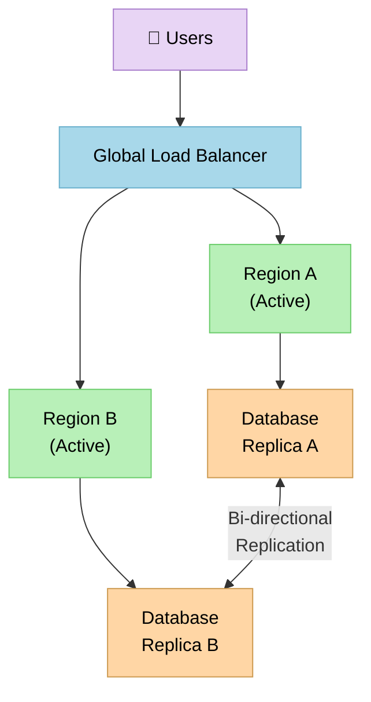
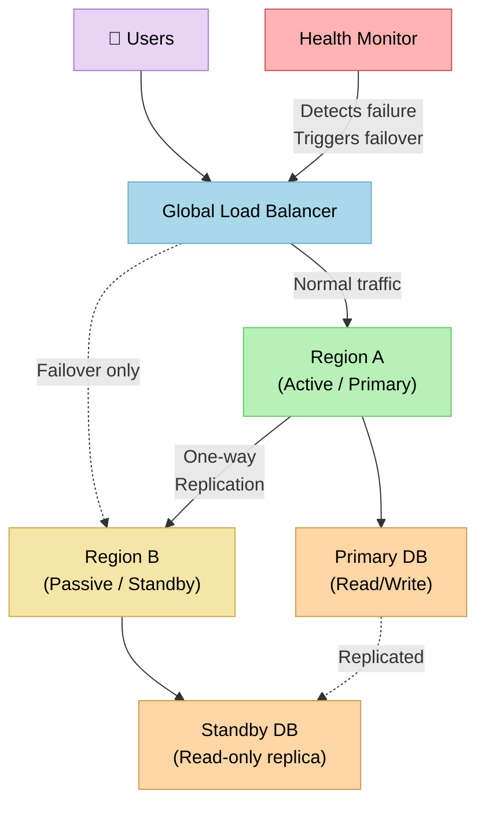

# High Availability and Disaster Recovery

> High Availability (HA) and Disaster Recovery (DR) are complementary strategies that keep your system running — HA prevents downtime through redundancy, while DR gets you back online when something catastrophic goes wrong anyway.

**Level:** 6 · **Topic:** 3 · **Prerequisites:** [Observability](../01-Observability), [Database Replication](../../Level-02-Data-Layer/01-Database-Replication), [Load Balancing](../../Level-01-Building-Blocks/02-Load-Balancing)

---

## 🎯 The Problem

Hardware dies. Datacenters flood. A bad deploy goes out at 2 AM. A network cable gets cut by a backhoe. Software has bugs that only appear under production load.

The question isn't *whether* your system will experience failure — it's *what happens to your users when it does*. Do they see an error page for three hours while your on-call engineer frantically restores a backup? Or do they keep shopping, watching videos, and sending messages without ever knowing anything went wrong?

High Availability and Disaster Recovery are your answers to that question. They're related but distinct:

- **High Availability** is about *preventing* unplanned downtime through redundancy and automatic failover. You build the system so that no single component failure takes everything down.
- **Disaster Recovery** is your plan for *recovering* from large-scale failures — a full datacenter outage, ransomware, or a corrupted database. It assumes something bad already happened and focuses on getting back to normal as fast as possible.

You need both. HA handles the everyday stuff; DR handles the "nothing is left standing" scenarios.

---

## 🌍 Real-World Analogy

Think about a commercial airplane. It has two engines not because one engine isn't enough to fly, but because if one fails mid-flight, you need the other to land safely. The redundancy isn't about performance — it's about survival.

That's High Availability: you duplicate critical components so that when one fails, the other takes over automatically. Passengers might not even notice.

Now think about a hospital. It runs on city power like everyone else, but it also has diesel generators in the basement and fuel reserves for days. When a hurricane knocks out the city grid, the hospital doesn't shut down — it switches to backup power within seconds. The generator is the Disaster Recovery plan: it's expensive, it sits idle most of the time, but when you really need it, it's there.

Your system needs both: redundant engines for everyday resilience, and a generator for when the city grid goes down.

---

## 🧠 Core Idea

The fundamental insight behind HA is **eliminating single points of failure (SPOFs)**. A single point of failure is any component where, if it goes down, everything goes down. Your job is to find every SPOF in your architecture and add redundancy around it.

Availability is measured as a percentage of time your system is operational:

```
Availability = Uptime / (Uptime + Downtime)
```

This is usually expressed in "nines" — and the difference between each nine is dramatic:

| Availability | Downtime per Year | Downtime per Month | Nickname |
|---|---|---|---|
| 99% | 3.65 days | 7.3 hours | Two nines |
| 99.9% | 8.76 hours | 43.8 minutes | Three nines |
| 99.99% | 52.6 minutes | 4.4 minutes | Four nines |
| 99.999% | 5.26 minutes | 26.3 seconds | Five nines |
| 99.9999% | 31.5 seconds | 2.6 seconds | Six nines |

Going from three nines to four nines might sound like a small jump, but it's the difference between "we'll fix it by morning" and "our automated systems caught it before most users noticed." Each additional nine costs significantly more to engineer and operate.

The second key concept is **redundancy**. Redundancy means having more capacity or more copies than you strictly need:
- **N+1 redundancy**: You need N components to run; you have N+1, so one can fail.
- **2N redundancy**: You have twice what you need — full duplication (like hospital generators).
- **Geographic redundancy**: Copies in different physical locations, so a local disaster can't take everything out.

---

## 📊 How It Works

There are two fundamental patterns for deploying redundant systems: **Active-Active** and **Active-Passive**.

### Active-Active Setup

In Active-Active, both (or all) regions are live and serving real user traffic simultaneously. The load balancer distributes requests across all of them. If one goes down, the others absorb the load.



Active-Active gives you the best availability and also improves performance (users get routed to the nearest region). The tradeoff is complexity — you need to handle data consistency across regions, and conflicts can arise when both regions accept writes.

### Active-Passive Setup

In Active-Passive, only one region (the primary) actively handles traffic. The secondary region is a warm standby — it receives replicated data and is ready to take over, but it doesn't serve users until a failover happens.



Active-Passive is simpler and cheaper — you're not paying to run two full production environments simultaneously. But failover isn't instant; there's a period where the passive region is catching up or traffic is being rerouted.

---

## 🔧 Types / Variations / Strategies

### Active-Active vs Active-Passive

| Mode | Description | Failover Time | Cost | Best Use Case |
|---|---|---|---|---|
| **Active-Active** | All nodes serve traffic simultaneously | Seconds (automatic load rebalancing) | High (full duplicate running costs) | High-traffic apps, latency-sensitive global products |
| **Active-Passive (Warm Standby)** | Primary active; standby receives replication | 1–5 minutes | Medium (standby runs at reduced capacity) | Most production web services |
| **Active-Passive (Cold Standby)** | Primary active; standby is off or minimal | 15–60 minutes | Low (standby barely running) | Internal tools, dev/staging mirrors |
| **Pilot Light** | Core data replication only; standby scaled up during DR | 30–60 minutes | Very Low | DR-only scenarios, cost-sensitive systems |

### N+1 Redundancy

N+1 means you deploy one more instance than required. If you need 4 app servers to handle your traffic, you run 5. When one goes down, you're at 4 — still operational. This is the minimum viable redundancy for any production service.

### Multi-AZ Deployments

Cloud providers split their regions into **Availability Zones (AZs)** — physically separate datacenters within the same geographic region, with independent power, networking, and cooling. A multi-AZ deployment spreads your instances across 2–3 AZs. A single AZ going down (which does happen) doesn't take you with it.

Multi-AZ is different from multi-region: AZs are close enough that latency is negligible (sub-millisecond), while multi-region introduces real latency (10–100ms+) but protects against larger-scale disasters like a city-level event.

### Backup Strategies

Redundancy keeps you running; backups keep you recoverable. The two serve different purposes and you need both.

**Backup types:**
- **Full backup**: A complete copy of all data. Slow and storage-heavy to create, but fast to restore.
- **Incremental backup**: Only the data that changed since the last backup (full or incremental). Fast and cheap, but restoration requires replaying a chain of backups.
- **Differential backup**: Everything that changed since the last *full* backup. Middle ground — faster to restore than incremental, but larger than incremental.

**The 3-2-1 Rule** is the gold standard for backup strategy:
- **3** copies of your data (1 primary + 2 backups)
- **2** different storage media types (e.g., SSD and cloud object storage)
- **1** copy offsite (physically separate location — S3, Glacier, another datacenter)

### RTO vs RPO

These two metrics define your DR targets and should be agreed upon with stakeholders *before* a disaster hits:

**RTO (Recovery Time Objective)**: How long can you be down before it causes unacceptable business impact? This is the maximum tolerable downtime.

- Example: "Our e-commerce site can be down for at most 1 hour before we lose enough revenue to justify the cost of a faster recovery system."
- An RTO of 1 hour means you need processes, automation, and runbooks that can restore service within 60 minutes from the moment failure is declared.

**RPO (Recovery Point Objective)**: How much data can you afford to lose? This defines how far back in time your system can safely roll back.

- Example: "Our analytics database can lose up to 4 hours of data — it can be replayed from event logs. But our payments database has an RPO of 0 — we cannot lose a single transaction."
- An RPO of 4 hours means daily backups are fine for analytics; an RPO of 0 means you need synchronous replication for payments.

Lower RTO and RPO = more expensive and complex. Define them per system, not organization-wide, because not everything needs five-nines treatment.

---

## 🏢 Real-World Examples

**AWS Multi-AZ RDS**: Amazon RDS can automatically replicate your database to a standby instance in a different AZ. If the primary fails, RDS automatically fails over to the standby — typically in 60–120 seconds — with no manual intervention. The endpoint stays the same; your application just reconnects. This is a well-worn example of Active-Passive HA for databases with a near-zero RPO (synchronous replication).

**Netflix and Chaos Engineering**: Netflix runs across multiple AWS regions and invented **Chaos Monkey** — a tool that randomly terminates production instances during business hours. The philosophy: if you're not continuously testing your failure handling, you don't actually know if it works. Their broader **Chaos Engineering** practice (now the industry standard) proactively injects failures — network latency, instance terminations, regional outages — to verify that the system stays up. "Hope" is not an HA strategy; verified resilience is.

**Google's Global Load Balancing**: Google operates a single anycast IP address for many of its services. User requests are routed to the nearest healthy datacenter automatically. If an entire region goes down, traffic is seamlessly rerouted to the next closest region. This is Active-Active at global scale, built into their network infrastructure. Your users in Sydney hit a Sydney datacenter; if that datacenter has issues, they transparently hit Singapore — all without a DNS change or manual failover.

---

## ⚖️ Trade-offs

**Cost of redundancy**: Running two regions instead of one roughly doubles your infrastructure costs. Active-Active at global scale means you're paying for capacity in every region even during normal operation. Five-nines availability is expensive to engineer and operate — make sure your business actually needs it.

**Operational complexity**: More components mean more things to monitor, patch, upgrade, and debug. A multi-region Active-Active setup with bi-directional database replication is dramatically more complex than a single-region deployment. That complexity introduces its own failure modes.

**Consistency during failover**: When you fail over, especially in Active-Active setups, you can hit consistency problems. If both regions accept writes and replication lags, you get conflicting versions of the same data — the "split brain" problem. Resolving conflicts (last-write-wins? merge? reject?) is hard and error-prone. Synchronous replication avoids this but adds latency to every write.

**The cost of not testing**: Your DR plan is only as good as your last successful test. Many teams discover their backups don't restore, their failover automation has bugs, or their runbooks are outdated — during an actual incident. Untested DR is theater.

---

## ✅ When to Use / ❌ When NOT to Use

**Use HA and DR when:**
- Users directly depend on your system's availability (customer-facing products, payment processing, healthcare)
- Downtime has a measurable business cost (e-commerce, SaaS subscriptions, ad platforms)
- Regulatory requirements mandate it (financial services, healthcare data)
- You have on-call engineers and the operational maturity to maintain complex infrastructure
- Your traffic patterns justify the cost (multi-region for a global audience makes sense; for 100 users in one city, it doesn't)

**Don't over-engineer when:**
- You're an early-stage startup where velocity matters more than uptime — a 99% SLA is probably fine until you have paying customers who care
- The cost of HA exceeds the cost of downtime (do the math: if 1 hour of downtime costs you $500 and multi-region costs $50,000/month, that's hard to justify)
- The system is internal tooling, dev environments, or non-critical batch processing
- Your data is stateless or easily regenerated — sometimes the recovery story is "just redeploy and rerun"

---

## ⚠️ Common Pitfalls

**Untested backups**: Backups you've never restored are just hopes. The classic horror story: after a database failure, the team discovers their backup job has been silently failing for three months. Test your restore process regularly — ideally automatically, on a schedule, with alerts if it fails.

**Shared fate (correlated failures)**: Your "redundant" setup isn't redundant if the redundant components share the same failure mode. Two servers in the same rack sharing a power strip isn't N+1 redundancy. Two database replicas in the same AZ don't protect you from an AZ outage. Two EC2 instances on the same physical host (which AWS can do if you're not careful) can both go down together. Think carefully about *what you're actually protecting against*.

**The split brain problem**: In any distributed system where two nodes can independently decide they're the primary, you risk split brain — both accept writes, they diverge, and you have two different versions of truth. This happens during network partitions. Mitigations include requiring a quorum (majority vote) before accepting writes, using a consensus algorithm like Raft or Paxos, or accepting that one side goes read-only during a partition. Don't ignore this — it leads to data corruption.

**DNS TTL and caching**: During failover, you often update DNS to point to the new primary. But DNS has TTL (time-to-live) — clients cache the old IP for the TTL duration. If your TTL is 300 seconds (5 minutes), some clients will keep hitting the dead server for up to 5 minutes after failover. Keep TTLs low (30–60 seconds) for critical services, but know that very low TTLs increase DNS lookup overhead.

**Treating HA and DR as the same thing**: They're complementary but different. HA prevents outages; DR recovers from them. You can have excellent HA and terrible DR (robust redundancy, but no working backup restore process). You need both.

---

## 🎤 Interview Tips

**Always define RTO and RPO first.** When asked "how would you make this system highly available?", the best engineers start with "it depends — what are the RTO and RPO requirements?" This shows you understand that HA is a spectrum with real cost trade-offs, not a binary yes/no.

**Distinguish HA from DR clearly.** Many candidates conflate them. State explicitly: "HA is about preventing downtime through redundancy and automatic failover. DR is about recovery when something catastrophic happens despite your HA measures. They complement each other." Interviewers love this distinction.

**Mention chaos engineering.** Bring up Netflix's Chaos Monkey or the broader chaos engineering discipline. It signals that you understand resilience isn't just about architecture — it requires active, continuous testing. "An untested DR plan is just a document."

**Talk about failure domains.** Use the phrase "correlated failures" or "blast radius." Show that you think about *what can fail together* and design to minimize the blast radius of any single failure.

**Give concrete numbers.** Don't just say "high availability" — say "99.99% availability, which is about 52 minutes of downtime per year." Numbers demonstrate you understand the engineering implications, not just the buzzwords.

**Don't forget the database.** Many candidates describe HA for stateless app servers and forget about the database, which is often the hardest part. Make sure to address database replication, failover, and the consistency trade-offs explicitly.

---

## 📝 TL;DR

- **HA** prevents downtime through redundancy; **DR** recovers from catastrophic failures. You need both.
- Availability is measured in "nines": 99.9% = 8.76 hours/year of downtime; 99.99% = 52.6 minutes/year.
- **Active-Active**: all nodes serve traffic; fast failover, higher cost, consistency complexity.
- **Active-Passive**: primary serves traffic, standby is ready; simpler, cheaper, slower failover.
- **RTO** = how long you can be down. **RPO** = how much data you can lose. Define both per system.
- Use the **3-2-1 backup rule**: 3 copies, 2 media types, 1 offsite.
- Always test your backups and DR procedures — untested plans are fiction.
- Avoid shared fate: redundancy is only real if the redundant components can't all fail for the same reason.
- Watch for **split brain**: two nodes that both think they're primary will diverge and corrupt your data.

---

## 🧪 Test Yourself

1. Your company's SLA promises 99.95% availability. How many minutes of downtime per year is that? Is that achievable with a single datacenter and good operations, or does it require multi-region?

2. You're designing a payments service. Stakeholders say the RPO must be zero (no data loss) and the RTO must be under 2 minutes. What database architecture do you propose, and what are the trade-offs?

3. Your team runs two app servers in different AZs — that's your redundancy. A bug in your latest deploy crashes all app servers simultaneously. Did your HA setup help? What went wrong, and what would you add to protect against this?

4. You have a single primary database with a read replica in another region. If the primary goes down, what steps are required to promote the replica? What data might you lose, and why?

5. Explain the split brain problem to a non-technical colleague. What causes it, why is it dangerous, and what's one common way to prevent it?

6. Your startup's database backup job has been running nightly and reporting success for six months. How would you verify that the backups are actually usable?

---

## 📚 Further Reading

- [AWS Well-Architected Framework — Reliability Pillar](https://docs.aws.amazon.com/wellarchitected/latest/reliability-pillar/welcome.html) — the canonical cloud reliability guide with concrete patterns and anti-patterns
- [Google SRE Book — Chapter 8: Release Engineering](https://sre.google/sre-book/release-engineering/) and [Chapter 26: Data Integrity](https://sre.google/sre-book/data-integrity/) — how Google thinks about reliability and data protection at scale
- [Chaos Engineering: System Resiliency in Practice](https://www.oreilly.com/library/view/chaos-engineering/9781492043850/) by Casey Rosenthal — the definitive book on proactive resilience testing
- [Netflix Tech Blog: Chaos Engineering](https://netflixtechblog.com/tagged/chaos-engineering) — real-world accounts of how Netflix tests and improves system resilience
- [Designing Data-Intensive Applications](https://dataintensive.net/) by Martin Kleppmann — Chapter 5 (Replication) and Chapter 8 (Distributed Systems Troubles) are essential reading for understanding the hard problems in HA
- [AWS Disaster Recovery Whitepaper](https://docs.aws.amazon.com/whitepapers/latest/disaster-recovery-workloads-on-aws/disaster-recovery-workloads-on-aws.html) — practical patterns for RTO/RPO targets with AWS services, including cost comparisons across DR strategies
