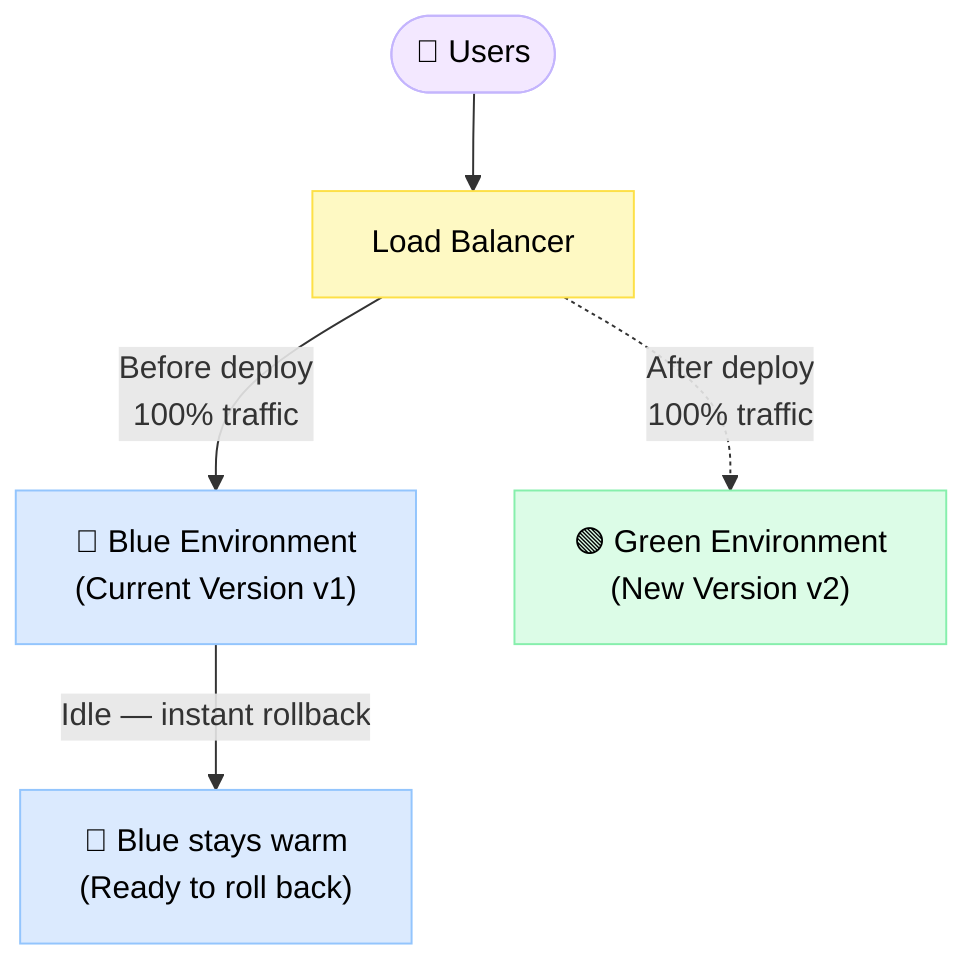
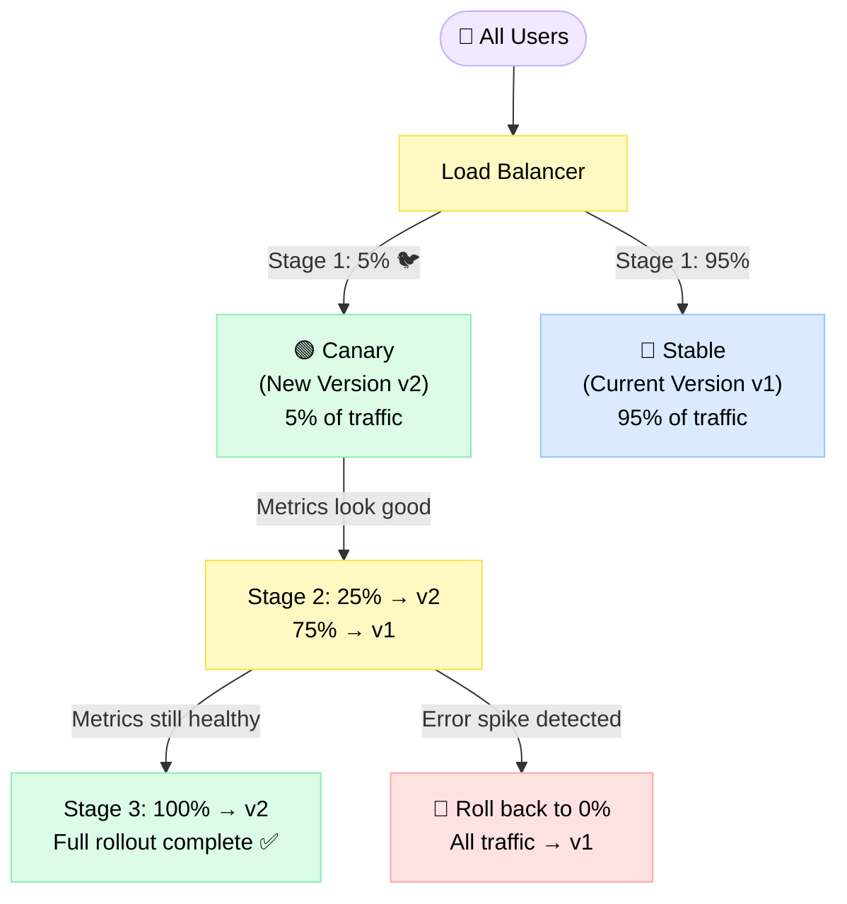

# Deployment Strategies

> A deployment strategy is the method you use to release new code into production while keeping your service available and your users happy.

**Level:** 6 · **Topic:** 4 · **Prerequisites:** [High Availability and DR](../03-High-Availability-and-DR) · [Load Balancing](../../Level-01-Building-Blocks/02-Load-Balancing)

---

## 🎯 The Problem

You need to ship new code — but your site can't go down. Even a brief outage at 2 AM costs you money, reputation, and user trust. On top of that, every deploy carries risk: what if the new code has a bug? What if the database migration is irreversible? You need a way to release changes safely, quickly, and with a clear escape hatch if things go wrong.

---

## 🌍 Real-World Analogy

Think of renovating a bridge while traffic keeps moving. You can't just close the bridge for six months — people need to cross. So engineers build a temporary bypass lane, reinforce one section at a time, and always keep at least one lane open. If a new section cracks, you stop work and route everyone back to the old lane. Deployment strategies work exactly the same way: keep traffic flowing, swap out the infrastructure piece by piece, and always have a rollback path ready.

---

## 🧠 Core Idea

The goal is **zero-downtime deploys** — releasing new code without dropping a single request. The catch is that different strategies make different trade-offs between:

- **Risk** — how much of your traffic can be affected if the new version is broken
- **Speed** — how fast you can get new code to all users
- **Rollback ease** — how quickly you can undo a bad deploy
- **Resource cost** — how much extra infrastructure you need during the transition

No single strategy wins on all four axes. Choosing the right one depends on your risk tolerance, your team's operational maturity, and the nature of the change you're shipping.

---

## 📊 How It Works

### Blue/Green Deployment

You maintain two identical production environments: **Blue** (currently live) and **Green** (the new version). You deploy to Green, test it, then flip the load balancer to point all traffic at Green. Blue stays warm as your instant rollback target.



**How it plays out:**
1. Deploy v2 to the Green environment — no users see it yet
2. Run your smoke tests and health checks against Green
3. Flip the load balancer: all traffic now hits Green
4. If anything looks wrong, flip back to Blue in seconds
5. Once you're confident, decommission or repurpose Blue

### Canary Deployment

Instead of an all-or-nothing switch, you gradually increase the percentage of users seeing the new version. Start at 5%, watch your metrics, then expand to 25%, then 100%.



**How it plays out:**
1. Route 5% of traffic to the new version (the "canary in the coal mine")
2. Watch error rates, latency, and business metrics for 10–30 minutes
3. If healthy, bump to 25%, then 50%, then 100%
4. If you see a problem at any stage, route traffic back to the old version immediately

### Rolling Deployment

You replace instances one at a time (or in small batches). At any moment during the deploy, some instances run the old version and some run the new one. There's no separate environment — the same cluster hosts both versions temporarily.

- Works well when version skew (old and new talking to each other) is safe
- Cheaper than Blue/Green since you don't double your infrastructure
- Rollback is slower — you have to re-deploy the old version to each instance

---

## 🔧 Types / Variations / Strategies

### Comparison Table

| Strategy | How it works | Rollback speed | Risk level | Resource cost | Best for |
|---|---|---|---|---|---|
| **Rolling** | Replace instances one by one | Slow (re-deploy old) | Medium | Low (no extra infra) | Stateless services with safe version skew |
| **Blue/Green** | Two full environments, flip the switch | Instant | Low | High (2× infra) | Critical services, schema changes, easy rollback requirement |
| **Canary** | Gradually shift traffic % to new version | Fast (reroute traffic) | Low → High | Low–Medium | High-traffic services, risk-averse teams, A/B testing |
| **Shadow / Dark** | Mirror real traffic to new version; responses discarded | N/A (no live impact) | None | Medium (double processing) | Validating new infra or ML models before any user sees them |

### Feature Flags (Decouple Deploy from Release)

A feature flag (also called a feature toggle) lets you deploy code to production but keep the new behavior turned off until you explicitly enable it. This decouples **deploy** (putting code on servers) from **release** (letting users see it).

```
if (featureFlags.isEnabled("new-checkout-flow", userId)) {
    showNewCheckout();
} else {
    showOldCheckout();
}
```

Benefits:
- Ship code continuously without exposing incomplete features
- Enable for internal users first, then a percentage of real users
- Kill switch: turn off a bad feature without a rollback deploy
- Combine with canary: flag enabled for 5% of users = canary release

### Database Migration Safety: The Expand/Contract Pattern

Database migrations are the hardest part of zero-downtime deploys. You can't just rename a column or drop a table while the old app code is still running — it'll break.

The **expand/contract pattern** solves this in three phases:

**Phase 1 — Expand (backward-compatible change)**
- Add the new column, new table, or new index alongside the old one
- Deploy app code that writes to *both* old and new columns
- Old app instances still work because the old column still exists

**Phase 2 — Migrate**
- Backfill the new column with data from the old column
- Verify data integrity
- Deploy app code that reads from the new column (still writes to both)

**Phase 3 — Contract (clean up)**
- Once all app instances use the new column, stop writing to the old one
- Drop the old column in a follow-up migration
- This migration is now safe because no live code touches the old column

Never drop or rename a column in the same deploy that changes app code that depends on it. Always separate schema changes from application changes by at least one deploy cycle.

### CI/CD Pipeline Overview

A healthy deployment pipeline looks like this:

```
Code Push → Unit Tests → Integration Tests → Build Artifact
    → Deploy to Staging → Smoke Tests → Deploy to Production (Canary)
    → Automated Metrics Check → Full Rollout or Rollback
```

Key principles:
- Every merge to main triggers the pipeline automatically
- The same artifact (Docker image, JAR, binary) that passes staging goes to production — no rebuilds
- Rollback means re-deploying a known-good artifact, not reverting source code

---

## 🏢 Real-World Examples

**Netflix** uses a combination of canary deploys and chaos engineering. New versions of their streaming service get rolled out to a small percentage of regions first. Their internal tooling (Spinnaker) automates canary analysis — if error rates or latency spikes beyond a threshold compared to the control group, the deploy is automatically halted and rolled back.

**Facebook / Meta** operates a "push train" — a continuous deployment system that ships code multiple times per day. Changes move through a series of canary stages: internal employees first, then 1% of users, then broader percentages, then full rollout. Each stage has automated and manual health checks. If you're a Meta engineer and your diff causes a 0.1% increase in error rate at the 1% stage, the system pages you before it goes further.

**GitHub** is famous for using feature flags (they call them "flipper" flags) extensively. New features ship to production behind flags, enabled for GitHub employees first, then early adopters, then everyone. This is how they shipped the new GitHub Actions UI, the new code search, and many other large features — code was in production for months before any external user saw it.

---

## ⚖️ Trade-offs

**Blue/Green:**
- Instant rollback and clean environment isolation are huge wins
- But you're paying for double the infrastructure during (and after) each deploy
- Database migrations are tricky — both Blue and Green share the same DB, so the schema must be compatible with both app versions simultaneously

**Canary:**
- You catch bugs with minimal user impact — only 5% see the broken version before you roll back
- But you need solid observability: if you can't measure error rates and latency by version, you're flying blind
- Running two versions simultaneously adds complexity, especially for stateful services

**Rolling:**
- Cheap and simple — no extra environments, no load balancer gymnastics
- Version skew is the danger: during a rolling deploy, old and new versions run side by side. If v1 and v2 have incompatible API contracts or different database expectations, you'll get errors
- Rollback is slow because you have to re-deploy the old version across all instances

---

## ✅ When to Use / ❌ When NOT to Use

**Use Blue/Green when:**
- You need instant rollback (financial systems, checkout flows)
- You're making significant schema changes and want a clean environment boundary
- Infra cost isn't a concern

**Use Canary when:**
- You have high traffic and good observability
- The change is risky and you want to limit blast radius
- You want to validate performance under real load before full rollout

**Use Rolling when:**
- Your service is stateless and version skew is safe
- You want simplicity and low cost
- Rollback speed is less critical

**Use Feature Flags when:**
- You want to ship code continuously but release on your schedule
- You need a kill switch without a re-deploy
- You're doing percentage-based rollouts at the application level

**Don't use Blue/Green when:**
- Infrastructure cost is a hard constraint
- Your database schema changes are complex and you haven't solved the dual-version schema problem

**Don't use Canary when:**
- You have low traffic (5% = 3 users — statistically meaningless)
- You don't have the observability to detect problems at a small percentage

---

## ⚠️ Common Pitfalls

**Skipping database migrations before app deploys.** The classic mistake: you deploy a new app that expects a new column, but you forgot to run the migration first. The result is 500 errors in production until you scramble to fix it. Always run migrations before deploying the app code that depends on them — and make sure those migrations are backward-compatible with the old app version.

**No rollback plan.** "We'll figure it out if something breaks" is not a rollback plan. Before every deploy, know exactly what you'll do if it goes wrong: which artifact you'll re-deploy, whether your database migration is reversible, and who's on call to approve the rollback.

**Canary without proper metrics.** If you route 5% of traffic to a new version but you're only watching CPU usage, you'll miss a bug that causes silent data corruption or a subtle increase in checkout abandonment. Define your success metrics before you deploy — error rate, p99 latency, business conversion rate — and set automatic rollback thresholds.

**Long-lived feature flags.** Feature flags are meant to be temporary. A flag that's been in the codebase for 18 months is technical debt. Clean up flags after the feature is fully rolled out.

**Ignoring version skew.** In a rolling deploy, old and new versions run simultaneously. If your new version changes the format of a Kafka message or a Redis cache key, the old version can't read it. Always design changes to be backward-compatible with the previous version.

---

## 🎤 Interview Tips

**Always mention rollback.** Interviewers want to know you think about what happens when things go wrong, not just when they go right. For any deployment strategy you discuss, explain what the rollback process looks like and how long it takes.

**Database migrations are the hard part.** Most deployment strategy questions in interviews gloss over this, which is exactly why you should bring it up. Explaining the expand/contract pattern immediately signals that you've shipped real systems. Say: "The tricky part is schema changes — I'd use the expand/contract pattern to make them backward-compatible across deploy boundaries."

**Feature flags decouple deploy from release.** This is a distinction many candidates miss. Shipping code to production and releasing it to users are two different things. Feature flags let you do continuous deployment without continuous release, which reduces the pressure on each individual deploy.

**Know your trade-offs cold.** If an interviewer asks "why not always use Blue/Green?", you should instantly say: "Double infrastructure cost, and the database schema has to be compatible with both environments simultaneously."

---

## 📝 TL;DR

- **Rolling**: cheap, replace instances one by one, slow rollback, beware version skew
- **Blue/Green**: two environments, instant rollback, double cost, great for critical services
- **Canary**: gradual traffic shift, limits blast radius, needs good observability
- **Shadow**: mirror traffic to new version, zero user risk, good for validation
- **Feature flags**: decouple deploy from release, kill switch without re-deploy
- **Database migrations**: use expand/contract — always make schema changes backward-compatible before touching app code
- **Golden rule**: always have a rollback plan before you deploy

---

## 🧪 Test Yourself

1. You're deploying a new version of your payment service. The new code requires a column rename in the `orders` table. How do you deploy this safely with zero downtime?

2. Your team uses rolling deploys. A new deploy is 50% complete when you notice error rates climbing. What do you do, and why is rollback harder than with Blue/Green?

3. You want to test a new recommendation algorithm on real traffic before fully committing. Which deployment strategy do you choose, and what metrics do you watch?

4. A product manager asks why the new dashboard feature isn't live yet — you deployed it last Tuesday. How do you explain feature flags and why this is actually a good thing?

5. What's the difference between a canary deploy and an A/B test? When would you use each?

---

## 📚 Further Reading

- [Martin Fowler — BlueGreenDeployment](https://martinfowler.com/bliki/BlueGreenDeployment.html)
- [Martin Fowler — CanaryRelease](https://martinfowler.com/bliki/CanaryRelease.html)
- [Martin Fowler — Feature Toggles (aka Feature Flags)](https://martinfowler.com/articles/feature-toggles.html)
- [Google SRE Book — Release Engineering](https://sre.google/sre-book/release-engineering/)
- [Netflix Tech Blog — Deploying the Netflix API](https://netflixtechblog.com/deploying-the-netflix-api-79b6176cc3f0)
- [Spinnaker — Open Source Multi-Cloud Continuous Delivery](https://spinnaker.io/)
- [Expand/Contract Pattern — Flyway Blog](https://flywaydb.org/documentation/tutorials/pattern_expand_contract)
