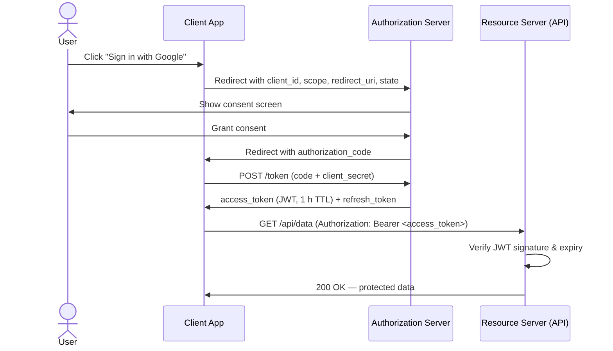

# Security at Scale

> Security at scale means layering authentication, authorization, encryption, and threat mitigation so that your system stays safe even when attackers have unlimited time, money, and bots.

**Level:** 6 · **Topic:** 5 · **Prerequisites:** [Observability](../01-Observability), [Deployment Strategies](../04-Deployment-Strategies)

---

## 🎯 The Problem

Once your API is public, it is hammered — constantly. Bots probe for weak passwords. Scrapers hit every endpoint. Credential-stuffing tools replay billions of leaked username/password pairs. A single misconfigured S3 bucket exposes millions of records and earns you a front-page headline.

At small scale you can get away with a single lock on the door. At scale you cannot:

- A 71 Tbps DDoS (Cloudflare, 2024) overwhelms any single firewall.
- A stolen JWT that never expires gives an attacker permanent access.
- One overly-permissive IAM role can let a compromised Lambda drain your entire database.

Security at scale is not one thing — it is a system of overlapping defenses that assumes every layer will eventually be breached.

---

## 🌍 Real-World Analogy

Think of a modern international airport. There is no single lock on the front door. Instead you pass through:

1. **Check-in** — identity verified against a passport (authentication).
2. **Ticket scan** — are you allowed on *this* flight? (authorization).
3. **Security screening** — bags X-rayed, liquids checked (input validation / WAF).
4. **Boarding gate** — ticket checked a second time (defense in depth).
5. **In-flight** — crew monitors behavior (anomaly detection / observability).

Each checkpoint is independent. Bypassing one does not grant access to the rest. That is defense in depth.

---

## 🧠 Core Idea

**Defense in depth** — never rely on a single control. Assume the outer layer will be compromised and make sure the next layer still holds.

**Authentication vs Authorization**

| Concept | Question it answers | Example |
|---|---|---|
| Authentication (AuthN) | Who are you? | Username + password, TOTP, passkey |
| Authorization (AuthZ) | What are you allowed to do? | RBAC roles, IAM policies, OAuth scopes |

You cannot authorize a user you have not authenticated. But authentication alone is not enough — a valid user should still only reach resources they are permitted to touch.

**Zero-trust architecture** — "never trust, always verify." Every request — even from inside the VPC — must carry a valid, short-lived credential. There is no trusted network perimeter. Google's BeyondCorp model (2011 paper, production since ~2014) pioneered this: Googlers access internal apps from coffee shops the same way they access them from the office.

---

## 📊 How It Works

### OAuth 2.0 / OIDC Authorization Code Flow

### Key Concepts

**Sessions vs JWT tokens**

- **Sessions**: server stores state (Redis, DB). Token is an opaque ID. Easy to revoke — just delete the session. Requires sticky storage or a shared session store.
- **JWT (JSON Web Token)**: server is stateless — the token carries all claims, signed with a secret or private key. No DB lookup on every request. *Downside*: cannot be revoked before expiry. Mitigate with short TTLs (15 min access token, 7-day refresh token).

**TLS in transit** — All traffic must use TLS 1.2+. TLS 1.3 is preferred (fewer round-trips, forward secrecy by default). Never transmit credentials over HTTP, even internally.

**Encryption at rest** — Databases, S3 buckets, and disk volumes should be encrypted (AES-256). AWS RDS, GCP Cloud SQL, and Azure SQL all offer this by default — just make sure you have not turned it off.

**Secrets management** — Never store secrets in code or environment variables committed to git. Use:
- **HashiCorp Vault** — dynamic secrets, auto-rotation, audit logs.
- **AWS Secrets Manager** — native AWS integration, automatic rotation for RDS credentials.
- **GCP Secret Manager / Azure Key Vault** — cloud-native equivalents.

The rule: a secret that has never touched a `.env` file checked into git is a secret that has never leaked.

---

## 🔧 Types / Variations / Strategies

### Common Attacks

| Attack | How it works | Defense |
|---|---|---|
| **DDoS** | Flood the server with traffic from thousands of IPs until it falls over | CDN-level absorption (Cloudflare, AWS Shield), rate limiting, anycast routing |
| **SQL Injection** | Inject SQL via user input: `' OR 1=1 --` | Parameterized queries / prepared statements; ORM; input validation |
| **XSS (Cross-Site Scripting)** | Inject JavaScript into a page that other users view | Content-Security-Policy header; output encoding; framework escaping (React, Angular do this by default) |
| **CSRF (Cross-Site Request Forgery)** | Trick a logged-in user's browser into making a request they did not intend | CSRF tokens (double-submit cookie pattern); `SameSite=Strict` cookies |
| **Credential Stuffing** | Replay billions of leaked username/password pairs from data breaches | MFA; breached-password detection (HaveIBeenPwned API); account lockout + CAPTCHA |

### Auth Methods

| Method | Stateful? | Best for | Drawback |
|---|---|---|---|
| **Sessions** | Yes (server-side) | Traditional web apps, easy revocation | Requires shared session store at scale; sticky sessions |
| **JWT** | No (client-side) | Stateless microservices, mobile apps | Cannot revoke without a blocklist; token bloat if claims grow |
| **OAuth 2.0** | Depends on impl. | Delegated access (third-party apps acting on behalf of users) | Complex flow; misconfigurations are common (open redirects, PKCE missing) |
| **OIDC** | Depends on impl. | Federated identity (SSO) on top of OAuth 2.0 | Adds ID token on top of OAuth — more to validate correctly |

### Additional Strategies

**Rate limiting** — Limit requests per IP, per user, or per API key. Typical pattern: 100 requests/minute for authenticated users, 10/minute for anonymous. Return `429 Too Many Requests` with a `Retry-After` header. Implement at the gateway layer (Kong, AWS API Gateway, Nginx) so it happens before your app code runs.

**WAF (Web Application Firewall)** — Sits in front of your app and blocks requests matching known attack patterns (OWASP CRS rule set). AWS WAF, Cloudflare WAF, and ModSecurity can block SQLi and XSS before your code ever sees the request.

**Principle of least privilege** — Every user, service account, and IAM role should have only the permissions it needs and nothing more. An S3-reading Lambda should not have `s3:DeleteObject`. Audit permissions quarterly. AWS IAM Access Analyzer and GCP IAM Recommender will tell you which permissions are unused.

---

## 🏢 Real-World Examples

**Cloudflare — DDoS mitigation at 71 Tbps**
In September 2024, Cloudflare mitigated the largest DDoS ever recorded: 71 terabits per second, sustained for ~80 seconds. This was possible because Cloudflare's anycast network spans 330+ cities — the attack traffic is absorbed at the edge, never reaching the origin. No single data center sees the full load.

**Google BeyondCorp — zero-trust in production**
Google published the BeyondCorp research paper in 2014 and has been running it internally since around 2011. The model: no corporate VPN. Every request carries a short-lived credential tied to device posture (OS version, disk encryption status) and user identity. Access is granted at the application layer, not the network layer. Google Workspace and GCP's Identity-Aware Proxy (IAP) bring this model to customers.

**AWS IAM — least privilege at cloud scale**
AWS IAM lets you express permissions at the level of individual API actions (`s3:GetObject` vs `s3:*`). Best practice at scale: use IAM roles (not long-lived access keys), enable AWS Organizations SCPs to set guardrails across accounts, and use AWS IAM Access Analyzer to surface policies that allow public access or cross-account access you did not intend.

---

## ⚖️ Trade-offs

| Decision | Upside | Downside |
|---|---|---|
| JWT (stateless) | No DB lookup per request; scales horizontally | Cannot revoke before expiry; must wait out TTL or maintain a blocklist |
| Sessions (stateful) | Instant revocation; small token size | Shared session store is a bottleneck; sticky sessions or Redis required |
| Strict CSP | Prevents XSS effectively | Breaks inline scripts; requires careful policy authoring; harder for legacy apps |
| MFA everywhere | Drastically reduces credential-stuffing success | Adds friction; increases support load (lost authenticator apps) |
| Short JWT TTL (15 min) | Limits damage from leaked tokens | Requires refresh token flow; more round-trips |

Security and user experience pull in opposite directions. Your job is to find a calibration that matches your threat model — a banking app and a recipe blog do not need the same friction.

---

## ✅ When to Use / ❌ When NOT to Use

**Use these patterns when:**
- You have public-facing endpoints (rate limiting and WAF are non-negotiable).
- You handle PII, financial data, or health records (encryption at rest + in transit is required by GDPR, PCI-DSS, HIPAA).
- You run microservices with service-to-service communication (mTLS or short-lived service tokens).
- You allow third-party integrations (OAuth 2.0 with scoped tokens).

**You might simplify when:**
- It is an internal tool on a private network with a handful of known users — you might not need OAuth2, but you still need HTTPS and least privilege.
- Early prototype with no real user data — but build the habit early; retrofitting security is expensive.

Never skip: HTTPS/TLS, input validation, and least-privilege IAM. These are baseline everywhere.

---

## ⚠️ Common Pitfalls

**Storing secrets in code or environment variables**
`.env` files get committed. CI logs print env vars. Use a secrets manager. Rotate credentials if they were ever exposed.

**JWTs without expiry (or with a 10-year TTL)**
A JWT with no `exp` claim is a permanent credential. Set `exp` to 15 minutes for access tokens. A stolen token with a 10-year TTL is as bad as a stored plaintext password.

**Overly broad IAM permissions**
`"Action": "*", "Resource": "*"` is a disaster waiting to happen. Scope every policy to the minimum required actions and resources. Regularly prune permissions that have not been used in 90 days.

**No rate limiting**
Without rate limiting, a single script can attempt millions of password guesses or scrape your entire database via your own API. Add rate limiting at the gateway before your first public launch.

**Storing tokens in `localStorage`**
`localStorage` is accessible to any JavaScript on your page. An XSS vulnerability can exfiltrate your access token silently. Store tokens in `HttpOnly` cookies (not accessible to JS) and rely on CSRF protection instead.

**Logging sensitive data**
Request logging that captures Authorization headers, passwords in query strings, or PII in request bodies creates a secondary breach vector. Scrub sensitive fields before logging.

---

## 🎤 Interview Tips

- **Always mention HTTPS/TLS first.** It is the baseline. If you say "the client sends credentials to the server" without mentioning TLS, an interviewer will notice.
- **Distinguish AuthN from AuthZ clearly.** "Authentication is who you are; authorization is what you are allowed to do. They are separate concerns with separate systems."
- **Explain where tokens live.** `HttpOnly` cookie vs `localStorage` is a classic follow-up. The right answer: `HttpOnly` cookie for web apps (not accessible to JS, requires CSRF token); `localStorage` is acceptable for native mobile apps where XSS is not a threat.
- **Know the JWT trade-off.** Stateless = no revocation without extra infrastructure. If asked "how do you log someone out immediately?" the answer is: maintain a token blocklist (Redis set of revoked JTI claims) checked on every request — which reintroduces statefulness.
- **Mention defense in depth.** Never describe a single control as "the solution." Layer WAF → rate limiting → input validation → least-privilege → encryption.
- **Bring up zero-trust if discussing microservices.** "Inside the VPC is not automatically trusted. Every service authenticates with a short-lived token."

---

## 📝 TL;DR

- Defense in depth: layer multiple controls so one failure does not mean total breach.
- Authentication (who) and authorization (what) are separate — implement both.
- Use HTTPS/TLS everywhere, encrypt data at rest, and store secrets in a secrets manager (never in code).
- JWTs are stateless and fast but cannot be revoked; sessions are revokable but need shared storage.
- Rate limit and WAF at the edge, before your app code runs.
- Least privilege: every identity gets only the permissions it actually needs.
- Zero-trust: verify every request, even from inside your own network.

---

## 🧪 Test Yourself

1. A user's JWT is stolen. The token has a 24-hour TTL and there is no blocklist. What are your options, and what is the architectural lesson?
2. You are designing an API that third-party developers will integrate with. Should you use API keys, OAuth 2.0, or both? When would you use each?
3. Your new service needs to read from an S3 bucket and write to a DynamoDB table. Describe the IAM policy you would attach to its execution role (be specific about actions and resources).
4. A penetration tester reports that your login endpoint has no rate limiting and no CAPTCHA. Walk through how you would fix this at the infrastructure level without changing application code.
5. Explain the difference between XSS and CSRF. What defense works for one but not the other?
6. Your team wants to adopt zero-trust internally. What is the first thing you would change, and what is the hardest migration challenge?

---

## 📚 Further Reading

- [OWASP Top 10](https://owasp.org/www-project-top-ten/) — the canonical list of the ten most critical web application security risks, updated regularly.
- [OAuth 2.0 RFC 6749](https://datatracker.ietf.org/doc/html/rfc6749) — the full specification; worth at least skimming sections 1–4 before any interview at a company that uses OAuth.
- [PKCE RFC 7636](https://datatracker.ietf.org/doc/html/rfc7636) — Proof Key for Code Exchange; required for public clients (SPAs, mobile apps) to prevent authorization code interception.
- [Google BeyondCorp paper](https://research.google/pubs/beyondcorp-a-new-approach-to-enterprise-security/) — the original 2014 paper that defined the zero-trust model most cloud vendors now implement.
- [JWT Best Practices RFC 8725](https://datatracker.ietf.org/doc/html/rfc8725) — what to validate, what algorithms to avoid (`alg: none`), and how to set claims correctly.
- [HashiCorp Vault documentation](https://developer.hashicorp.com/vault/docs) — practical guide to dynamic secrets, secret rotation, and audit logging.
- [Cloudflare DDoS Threat Report](https://radar.cloudflare.com/reports/ddos) — quarterly data on DDoS attack size, duration, and vectors; great for grounding answers in real numbers.
