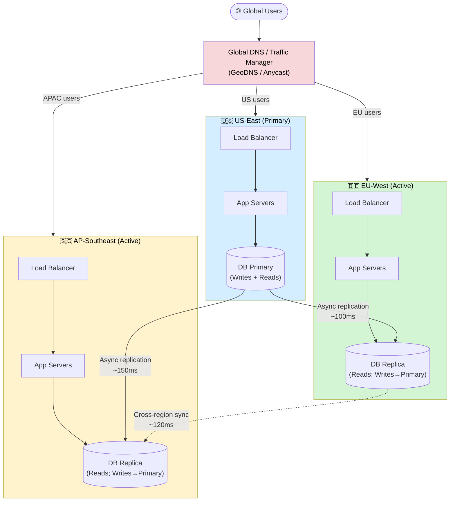
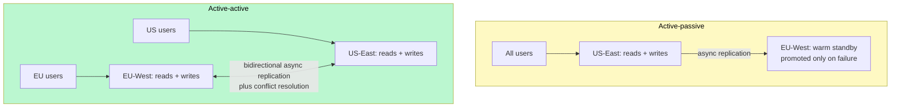
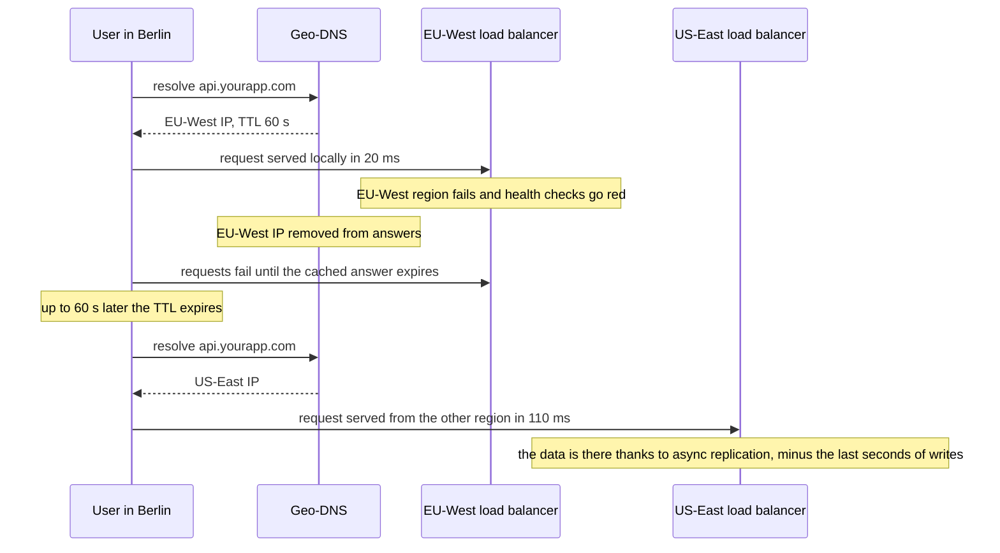

# Multi-Region and Geo-Distribution

> A multi-region architecture deploys your application across multiple geographic data centers so users get low latency from anywhere on Earth and your system survives regional disasters.

**Level:** 6 · **Topic:** 6 · **Prerequisites:** [High Availability and DR](../03-High-Availability-and-DR) · [CAP Theorem](../../Level-04-Distributed-Systems/01-CAP-Theorem) · [Security at Scale](../05-Security-at-Scale)

---

## 🎯 The Problem

Imagine your entire backend runs in `us-east-1` (Virginia). That works great for users in New York. But:

- A user in **Tokyo** is ~13,000 km away. The speed of light gives you a minimum round-trip of ~170ms — and that's before your app does any work. Real-world RTT to Virginia from Tokyo sits around **200–250ms**.
- A **flood in Virginia** (or an AWS AZ outage, or a misconfigured deployment) takes your entire product offline for every user on the planet.
- Your EU customers' data is sitting on servers in the United States — a potential **GDPR violation** that regulators can fine you 4% of global annual revenue for.

Single-region is fine when you're starting out. But once you have global users, SLAs above 99.9%, or compliance requirements, you need to think multi-region.

---

## 🌍 Real-World Analogy

Think about **McDonald's**. Every location serves the same menu — a Big Mac in Seoul tastes like a Big Mac in São Paulo. But they don't ship burgers from one central kitchen in Ohio. Each franchise has its own local kitchen, local staff, and local supply chain. HQ sets the standards; local kitchens execute.

Multi-region works the same way: your application code and data model are identical everywhere, but each region runs its own infrastructure. A customer in Singapore hits the Singapore region — not a server across the Pacific.

---

## 🧠 Core Idea

There are three main reasons to go multi-region:

**1. Latency — the speed of light is real**
Light travels through fiber at roughly 200,000 km/s. New York to London is ~5,500 km, meaning a minimum one-way latency of ~28ms. In practice, cross-continental RTT runs 70–140ms. For interactive apps (gaming, trading, video calls), that's unacceptable. Putting a region in Europe drops EU users to single-digit milliseconds.

**2. Disaster recovery**
A single-region architecture has a single point of failure at the regional level. Natural disasters, power outages, DNS misconfigurations, or cloud provider outages can wipe out your availability. Multiple regions mean a failure in one doesn't cascade globally.

**3. Data residency and compliance**
GDPR requires that EU personal data stays within the EU (or countries with adequate protection). CCPA, India's PDPB, China's PIPL all add similar constraints. Multi-region lets you pin data to the correct jurisdiction.

**The core tradeoff: consistency vs. latency**
This is where it gets hard. If your database is in Virginia and a user in Tokyo writes data, you can either:
- Wait for Virginia to confirm the write (strong consistency, ~200ms extra latency per write), or
- Accept the write locally in Tokyo and replicate to Virginia asynchronously (low latency, but risk of conflicts or stale reads)

You cannot escape the CAP theorem here. Geo-distribution forces you to make explicit choices about consistency.

---

## 📊 How It Works

### Multi-Region Topology

### Key Mechanisms

**Geo-DNS Routing**
Your DNS provider returns different IP addresses based on where the DNS query comes from. A user in Frankfurt resolves `api.yourapp.com` to the EU load balancer IP; a user in Sydney gets the AP IP. TTLs are kept short (30–60s) to allow fast failover.

**Anycast**
Instead of geo-routing at DNS, anycast lets multiple servers share the same IP address. BGP routing automatically sends the user to the nearest server. Cloudflare uses this extensively — your request to `1.1.1.1` hits whichever PoP is closest to you.

**Active-Active vs. Active-Passive**
- **Active-active**: all regions serve traffic simultaneously. Better for latency and load distribution. Harder to implement because you need conflict resolution.
- **Active-passive**: one region handles all writes; others are warm standbys that take over on failure. Simpler, but the passive regions add cost without helping latency for writes.

*Caption: Active-passive pays for a region that does nothing until the worst day. Active-active uses both — and inherits the write-conflict problem described below.*

**Cross-Region Replication Latency**
Real-world numbers to memorize:
- US-East to EU-West: ~80–100ms
- US-East to AP-Southeast: ~150–180ms
- EU-West to AP-Southeast: ~120–140ms

This is why async replication is the default — making every write wait for cross-continental confirmation would add 100–180ms to every write operation.

*What a region failover actually looks like from one user's point of view, and why the DNS TTL sets the floor on recovery time.*

*Caption: Two costs of the failover are visible here: up to one TTL of errors, and the writes that were still in the replication pipe when EU-West died. Anycast avoids the first; only synchronous replication avoids the second.*

**Conflict Resolution**
When two users in different regions write to the same record simultaneously, you get a conflict. Common resolution strategies:
- **Last-Write-Wins (LWW)**: timestamp decides. Simple, but clock skew between servers can lose data.
- **Vector Clocks**: track causality per-replica. More accurate, more complex.
- **CRDTs (Conflict-free Replicated Data Types)**: data structures designed to merge automatically without conflicts (e.g., counters, sets). Used heavily in systems like Riak and Redis.

**Follow-the-Sun Operations**
With regions across timezones, you can route on-call to whichever team is awake. US-East handles incidents during US business hours, EU-West during European hours, AP-Southeast during Asian hours. Reduces engineer burnout dramatically.

---

## 🔧 Types / Variations / Strategies

### Routing Strategies

| Strategy | How It Works | Latency | Best For |
|----------|-------------|---------|----------|
| **Geo-DNS** | DNS resolver returns region-specific IP based on requester location | ~DNS TTL for failover (30–60s) | Web apps, APIs where sub-second failover isn't needed |
| **Anycast** | Multiple servers share one IP; BGP routes to nearest | Immediate (network-layer) | DNS resolvers, DDoS mitigation, global UDP services |
| **GeoCDN** | CDN edge caches static assets close to users; dynamic requests forwarded to origin | <10ms for cached content | Static assets, media streaming, read-heavy content |

### Replication Modes

| Mode | Consistency | Latency Overhead | RPO | Use Case |
|------|-------------|-----------------|-----|----------|
| **Synchronous** | Strong — all replicas confirm before ack | +100–180ms per write | ~0 (no data loss) | Financial transactions, inventory systems |
| **Asynchronous** | Eventual — replicas lag by replication delay | ~0ms for primary write | Seconds to minutes of data loss possible | Social feeds, analytics, content delivery |

### Other Patterns Worth Knowing

**Data Residency Pinning**
For GDPR compliance, you partition your data by user region. EU users' data is stored only in EU-West. Your application layer enforces this routing — EU API calls only ever touch EU databases. This requires careful schema design and often separate database clusters per jurisdiction.

**Read Replicas Close to Users**
Even if your write primary is in US-East, you can put read replicas in EU and APAC. Reads (which are typically 80–90% of traffic) get low latency; writes pay the cross-region round-trip. This is the most common first step toward geo-distribution.

**Write Funneling**
In active-passive setups, all writes from all regions are forwarded to the primary region. EU users' writes travel ~100ms to US-East, get committed, then replicate back asynchronously. Simple to implement; the primary becomes a bottleneck at scale.

---

## 🏢 Real-World Examples

**Netflix**
Netflix runs across **3 AWS regions** (us-east-1, eu-west-1, us-west-2 as backup). If one region fails, traffic fails over automatically — this is the "Chaos Engineering" work they pioneered. For video delivery, they built **Open Connect**, their own CDN with servers embedded directly in ISP networks, so your Netflix stream never leaves your ISP's network.

**AWS Global Infrastructure**
AWS operates **30+ regions** and 90+ availability zones worldwide. Services like DynamoDB Global Tables let you write to any region and get automatic multi-master replication with last-write-wins conflict resolution. Route 53 provides geo-DNS and health-check-based failover.

**CockroachDB and Google Spanner**
These databases are built ground-up for geo-distribution. Google Spanner uses **TrueTime** (GPS + atomic clocks in every datacenter) to achieve external consistency across regions — strong consistency without the usual latency penalties. CockroachDB brings similar capabilities to open-source. Both let you pin data to specific regions for compliance.

**Cloudflare**
Cloudflare's network has **300+ Points of Presence (PoPs)** worldwide using anycast. Every PoP announces the same IP prefixes, so your request hits the nearest one automatically. This is how they absorb terabit-scale DDoS attacks — traffic is distributed across hundreds of locations rather than concentrated.

---

## ⚖️ Trade-offs

**Cost**
Running in 3 regions costs roughly **2–3x a single region** — you're duplicating compute, storage, and networking. Data egress between regions adds up fast: AWS charges ~$0.02/GB for cross-region transfer. If you're moving terabytes of replication data, that's thousands of dollars monthly before you've written a line of business logic.

**Operational Complexity**
Deployments must be coordinated across regions (blue-green or canary per-region). Schema migrations become dangerous — you can't change a column type in EU-West if US-East is still writing the old format. Monitoring and alerting must aggregate across regions. Debugging distributed transactions that span continents is genuinely hard.

**Consistency vs. Latency**
This is the [CAP theorem](../../Level-04-Distributed-Systems/01-CAP-Theorem) made concrete. You must decide what your system does when the network partition between US-East and EU-West takes 30 seconds to heal. Accept stale reads? Reject writes? Merge conflicts automatically? There is no free lunch.

**GDPR Data Residency Constraints**
Once you commit to storing EU data only in EU regions, you've created a hard dependency. Your EU region cannot go down and fail over to US-East — that would move EU personal data outside the EU. Your DR strategy for EU must involve another EU region (e.g., eu-west-1 to eu-central-1), which adds more cost and complexity.

---

## ✅ When to Use / ❌ When NOT to Use

**Use multi-region when:**
- Your users are genuinely global and latency impacts engagement or revenue
- Your SLA requires 99.99%+ uptime (single region can't reliably hit this)
- You have regulatory data residency requirements (GDPR, PDPB, PIPL)
- You need disaster recovery with RTO < 15 minutes
- You're a large enough business that 2–3x infra cost is acceptable

**Don't use multi-region when:**
- You're early stage — the complexity will slow you down more than latency hurts you
- Your user base is geographically concentrated (all users in one country)
- Your budget can't absorb 2–3x infra costs
- Your team doesn't have experience operating distributed systems yet — start with multi-AZ single-region first
- Your data model makes cross-region replication prohibitively complex

---

## ⚠️ Common Pitfalls

**Not testing regional failover**
Everyone says they have multi-region. Far fewer have actually tested it. Failover sounds easy until you discover that your session store isn't replicated, your job queue is single-region, or your TLS certificates are managed per-region with different renewal schedules. Run regular failover drills (Netflix's Chaos Monkey approach).

**Cross-region write conflicts**
If you go active-active with writes in multiple regions, you will get conflicts. Teams that don't think this through end up with last-write-wins silently clobbering data. Design your conflict resolution strategy upfront — don't discover you need it in production.

**Assuming low latency between regions**
Developers test locally (0ms between services) or within a single region (<1ms). Then they move to multi-region and suddenly a synchronous RPC call that chained 5 services adds 500ms of cross-region latency. Design your service boundaries so that the hot path doesn't require cross-region synchronous calls.

**Underestimating data egress costs**
Cloud providers charge for data leaving a region. Replication traffic, cross-region API calls, and log aggregation can generate surprising bills. Model your egress costs before committing to an architecture. Some teams build elaborate sync pipelines only to find the egress fees exceed the compute costs.

**Deploying all regions simultaneously**
Rolling out a bad deploy to one region is recoverable. Rolling it out globally at once before the first region is proven healthy is how you cause a global outage. Always deploy region-by-region with bake time in between.

---

## 🎤 Interview Tips

When multi-region comes up in an interview, these moves signal senior-level thinking:

- **Lead with the problem, not the solution.** "Before we go multi-region, what's the actual driver — latency, DR, or compliance? Each has a different architecture."

- **Mention real latency numbers.** "Cross-continental RTT is 100–180ms. That means async replication introduces that much potential data loss (RPO). Is that acceptable?" Interviewers notice when you know actual numbers.

- **Always state which region handles writes.** "I'd make US-East the write primary with async replication to EU and APAC. EU and APAC serve read replicas. Writes from EU pay the 100ms cross-region round-trip." This shows you've thought through the consistency model.

- **Bring up GDPR unprompted if the company has EU users.** "One constraint: if we store EU user data in US-East, that's a GDPR violation. We'd need EU data pinned to an EU region, which means our EU DR failover must also stay within the EU."

- **Reference the CAP theorem.** Link your design choices back to the tradeoff between consistency and availability. "We're choosing AP here — we'll accept eventual consistency on reads to keep latency low."

- **Ask about RPO and RTO.** "What's the acceptable recovery point objective if US-East goes down? If it's zero data loss, we need synchronous replication, which will impact write latency."

---

## 📝 TL;DR

- Multi-region solves three problems: latency (speed of light), disaster recovery, and data residency (GDPR).
- Cross-continental RTT is 100–180ms — this is your baseline for replication lag and tradeoff decisions.
- Go active-active for latency; go active-passive for simplicity. Active-active requires conflict resolution.
- Async replication keeps write latency low but means you can lose data (RPO > 0). Sync replication adds 100–180ms per write but gives you zero data loss.
- Multi-region costs 2–3x and requires deliberate engineering. Don't do it before you need it. Do it before a single-region incident takes you offline globally.

---

## 🧪 Test Yourself

1. Your startup has users in the US and Europe. EU page load times are 300ms. What's the fastest architectural change you can make to improve EU latency, and what are its limits?

2. You're designing a global e-commerce platform where inventory must be consistent across all regions (you can't oversell). How do you handle writes from multiple regions without overselling?

3. A user in Tokyo deletes their account (GDPR right to erasure). Your data is replicated across US-East, EU-West, and AP-Southeast. How do you ensure the deletion propagates everywhere within the required 30-day window?

4. Your US-East region goes down. You have a read replica in EU-West. What steps are required to promote EU-West to primary, and what data loss do you accept?

5. You're using last-write-wins conflict resolution. User A in New York and User B in London both edit the same document at exactly 14:00:00 UTC. Whose write wins? What could go wrong?

---

## 📚 Further Reading

- [AWS Well-Architected Framework — Reliability Pillar (Multi-Region)](https://docs.aws.amazon.com/wellarchitected/latest/reliability-pillar/plan-for-disaster-recovery-dr.html) — AWS's own guidance on multi-region patterns, RTO/RPO targets, and implementation strategies.
- [Spanner: Google's Globally Distributed Database (OSDI 2012)](https://research.google/pubs/spanner-googles-globally-distributed-database/) — The original paper describing TrueTime and how Google achieves external consistency across continents. Dense but foundational.
- [Netflix: Active-Active for Multi-Regional Resiliency](https://netflixtechblog.com/active-active-for-multi-regional-resiliency-c47719f6685b) — Netflix's engineering blog post on how they designed and operate active-active across AWS regions, including the Chaos Engineering practices they use to validate it.
- [CockroachDB: How We Built a Geo-Distributed SQL Database](https://www.cockroachlabs.com/blog/geo-distributed-sql/) — Practical walkthrough of the engineering challenges in building a geo-distributed transactional database.
- [Cloudflare: What is Anycast?](https://www.cloudflare.com/learning/cdn/glossary/anycast-network/) — Clear explanation of anycast routing and how it differs from geo-DNS, with real examples from Cloudflare's network.
