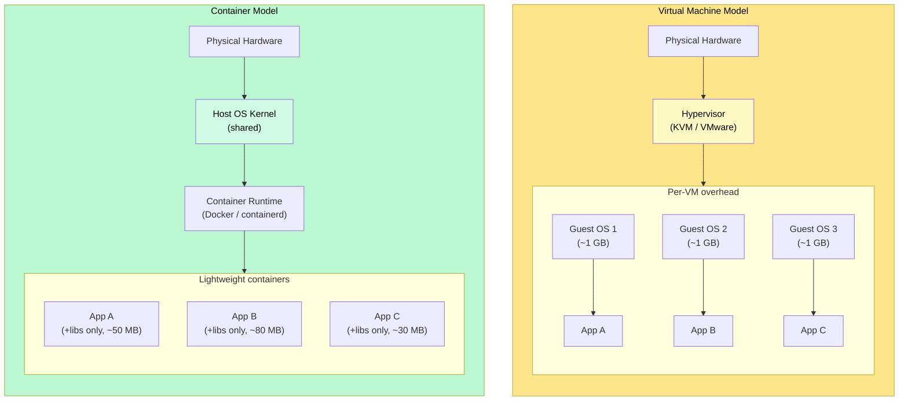
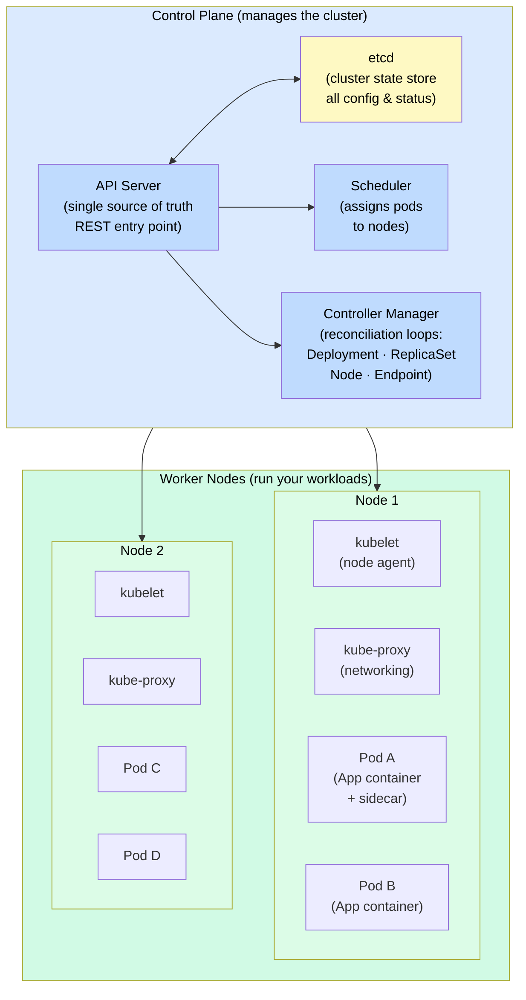
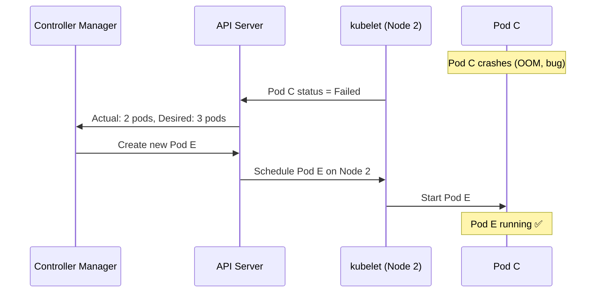

# Containers and Orchestration

> **Containers** package an application and its dependencies into a lightweight, portable unit; **orchestration** (via Kubernetes) automates deploying, scaling, and healing those containers across a cluster of machines.

**Level:** 6 · **Topic:** 7 · **Prerequisites:** [Deployment Strategies](../04-Deployment-Strategies/README.md) · [High Availability and DR](../03-High-Availability-and-DR/README.md) · [Observability](../01-Observability/README.md)

---

## 🎯 The Problem

You've built a microservices architecture with 20 services. Each service needs to:

- Run on multiple machines for redundancy.
- Scale up when traffic spikes and scale back down to save money.
- Restart automatically when a process crashes.
- Roll out new versions without downtime.
- Be isolated from other services' dependency conflicts.
- Communicate securely with other services.

Managing this by hand — SSHing into servers, running scripts, updating configs — doesn't scale past a handful of services. You need automation. This is what **containers** and **container orchestration** solve.

---

## 🌍 Real-World Analogy

**Containers** are like **shipping containers**. Before standardized containers, shipping goods was chaos — each cargo type needed custom handling. Once ISO standardized the container format, any ship, truck, or crane could handle any container. You can now ship a car engine the same way you ship bananas.

Similarly, before containers, "it works on my machine" was a constant problem. Docker standardized how software is packaged — once containerized, your app runs identically on a developer's laptop, a CI server, and a production cluster.

**Orchestration (Kubernetes)** is the **port authority** — the system that decides which ship carries which containers, reroutes when a ship has a problem, and ensures cargo always arrives.

---

## 🧠 Core Idea

### VMs vs Containers

The key innovation of containers is eliminating the guest OS overhead of virtual machines:



*Caption: VMs carry a full guest OS (~1 GB each), take minutes to boot, and have hypervisor overhead. Containers share the host kernel, start in milliseconds, and add only the app's dependencies (~10–200 MB).*

| Dimension | VMs | Containers |
|-----------|-----|------------|
| **Isolation** | Full OS-level (strongest) | Process-level (namespaces + cgroups) |
| **Startup time** | 30 seconds – 2 minutes | Milliseconds |
| **Image size** | 1–20 GB | 10–500 MB |
| **Density** | ~5–20 VMs per host | 100s of containers per host |
| **Overhead** | Hypervisor + guest OS | Near-native (5–10% max) |
| **Security boundary** | Strong (kernel isolation) | Weaker (shared kernel) |
| **Best for** | Multi-tenant isolation, legacy OSes | Microservices, CI/CD, high-density workloads |

### Docker: Images, Layers, and Registries

A **Docker image** is a read-only, layered template:

```
FROM ubuntu:22.04         ← Base OS layer (cached, reused across images)
RUN apt-get install python3  ← Layer: installed packages
COPY app.py /app/         ← Layer: your application code
CMD ["python3", "/app/app.py"]  ← Metadata: how to start
```

- **Layers are cached.** If only `app.py` changes, Docker only re-creates the last layer — builds take seconds, not minutes.
- **Registry:** A central store for images (Docker Hub, AWS ECR, GCR). Your CI pipeline builds an image, pushes it to the registry, and Kubernetes pulls it onto nodes.
- **Container:** A running instance of an image. Start 10 containers from the same image → 10 isolated processes, each with their own writable layer.

---

## 📊 How It Works

### Kubernetes Architecture

Kubernetes (K8s) is the de facto container orchestrator. It has two planes:



*Caption: The Control Plane watches desired state (in etcd) and reconciles it against actual state on Worker Nodes. You never manage nodes directly — you declare intent.*

### Key Kubernetes Concepts

**Pod:** the smallest deployable unit. One or more containers that share a network namespace and storage. Usually one container per pod; sidecars (logging, service mesh proxies) are the exception.

**Deployment:** declares "I want 3 replicas of this container image running at all times." The Deployment controller ensures this is always true — it creates a ReplicaSet, which creates Pods.

**Service:** a stable virtual IP/DNS name for a set of pods. Pods come and go; the Service endpoint doesn't change. Types:
- `ClusterIP`: internal-only (default).
- `NodePort`: exposes on each node's IP.
- `LoadBalancer`: provisions a cloud load balancer (ELB on AWS, etc.).

**ConfigMap / Secret:** decouple configuration from container images. Secrets are base64-encoded (and optionally encrypted at rest via etcd encryption).

**HorizontalPodAutoscaler (HPA):** watches CPU/memory metrics (or custom metrics via Prometheus) and scales the number of pods up/down automatically.

### Self-Healing in Practice



*Caption: Kubernetes detects the failure within seconds via the kubelet heartbeat, then the controller loop creates a replacement. No human intervention needed.*

---

## 🔧 Types / Variations / Strategies

### Container Runtimes

| Runtime | Notes |
|---------|-------|
| **Docker** | Most familiar; actually uses containerd underneath. Deprecated as K8s runtime (still fine for development). |
| **containerd** | The industry-standard K8s runtime. Lightweight, CNCF-graduated. |
| **CRI-O** | Lightweight alternative to containerd, designed specifically for Kubernetes. |

### Managed Kubernetes Offerings

| Provider | Service | Notes |
|----------|---------|-------|
| AWS | EKS | Most used in enterprise; integrates with IAM, ALB, EFS. |
| Google Cloud | GKE | Kubernetes was born at Google; GKE is the most feature-rich. |
| Azure | AKS | Tight integration with Azure AD and Azure Monitor. |
| DigitalOcean | DOKS | Simple, cheap, good for smaller workloads. |
| Self-hosted | kubeadm | Full control; full operational burden. |

### Service Mesh (Istio / Envoy)

As your microservice count grows, cross-cutting concerns multiply: retries, mTLS, traffic shaping, circuit breaking, distributed tracing. A **service mesh** handles these at the infrastructure layer, not in your code.

**How it works:** a sidecar proxy (Envoy) is injected alongside every pod. All traffic goes through the sidecar, not directly between apps.

```
Pod A → Envoy sidecar A → (mTLS, retry, trace) → Envoy sidecar B → Pod B
```

- **mTLS:** every service-to-service call is encrypted and authenticated. No secrets in code.
- **Traffic shaping:** canary deployments at 1% traffic split without changing code.
- **Circuit breaking:** automatically stop sending traffic to a failing downstream.
- **Observability:** distributed traces auto-generated from sidecar telemetry.

**When to add a service mesh:** usually not at the start. Add when you have 10+ services and operational overhead (retries, mTLS, tracing) becomes a significant burden. Istio adds latency (~1 ms per hop) and operational complexity.

### Serverless: The Other End of the Spectrum

Serverless (AWS Lambda, Google Cloud Run, Azure Functions) abstracts away even the container/VM — you deploy a function, the cloud runs it on demand and charges per invocation.

| | Containers (K8s) | Serverless |
|--|------------------|-----------|
| **Startup latency** | Milliseconds (warm) | Cold start: 100 ms – 2 s |
| **Max execution** | Unlimited | Typically 15 min (Lambda) |
| **State** | Stateful pods possible | Stateless only |
| **Operational burden** | High (cluster management) | Near-zero |
| **Cost model** | Pay per node (always-on) | Pay per invocation |
| **Best for** | Long-running, stateful, complex services | Intermittent, short, event-driven workloads |

---

## 🏢 Real-World Examples

### Spotify — Kubernetes at Scale
Spotify migrated from on-premise bare metal to GKE, running ~1 500 microservices on Kubernetes. Their infra team used Kubernetes to standardize deployments across all squads — developers no longer manage servers, just Kubernetes manifests. They use Helm charts for packaging and Argo CD for GitOps-style deployments.

### Airbnb — SOA on Kubernetes
Airbnb runs a service-oriented architecture on Kubernetes. They built Ottr (their internal K8s deployment platform) and use Envoy as a service mesh for all internal service communication. Every Airbnb engineer can deploy a new service without involving the infrastructure team.

### Netflix — Containers + Titus
Netflix runs containers via their own system (Titus) built on top of Apache Mesos (earlier) and now integrated with AWS ECS/EKS. Their containers handle everything from API serving to stream encoding. Netflix open-sourced many of their reliability patterns (Hystrix, Ribbon) that Kubernetes now implements natively.

### GitHub Actions / CI Pipelines
Nearly all modern CI/CD pipelines (GitHub Actions, GitLab CI, CircleCI) run jobs inside Docker containers for isolation. Each job gets a fresh container image, ensuring "clean room" builds. This is containers solving the "it works on my machine" problem for CI.

---

## ⚖️ Trade-offs

| Pro | Con |
|-----|-----|
| **Consistent environments** — dev/staging/prod parity eliminates "works on my machine" | **Kubernetes complexity** — steep learning curve; many new abstractions (Pods, Services, Deployments, Ingress, …) |
| **Resource efficiency** — high container density per host vs VMs | **Networking complexity** — overlay networks, service mesh, CNI plugins add operational burden |
| **Self-healing** — automatic restart on crash, rescheduling on node failure | **Stateful workloads are harder** — DBs in K8s require StatefulSets, PersistentVolumes, careful ops |
| **Rolling deployments** — zero-downtime deploys built-in | **Security surface** — shared kernel means container escapes are more serious than VM escapes |
| **Horizontal autoscaling** — HPA scales pods on metrics | **Cost of overprovisioning** — clusters need headroom; idle nodes cost money |
| **Ecosystem** — Helm, Argo CD, Prometheus, Grafana, Istio | **Debugging** — ephemeral containers + distributed tracing required for debugging microservices |

---

## ✅ When to Use / ❌ When NOT to Use

**Use containers and Kubernetes when:**
- You have multiple services that need independent deployment and scaling.
- You need consistent environments from development through production.
- You want self-healing and zero-downtime deployments as defaults.
- Your team is large enough to justify the operational investment (roughly: 5+ engineers, 5+ services).

**Do NOT use Kubernetes when:**
- You have a single service or a monolith — a PaaS (Heroku, Render, Railway) or serverless is simpler and cheaper.
- Your team is small and lacks Kubernetes expertise — operational overhead will dominate.
- Your workloads are highly bursty and short-lived — serverless is more cost-effective.
- You have strong Windows-native requirements — K8s Linux workloads are the default; Windows nodes exist but add complexity.

---

## ⚠️ Common Pitfalls

1. **Running databases in Kubernetes.** Stateful databases are hard in K8s. StatefulSets + PersistentVolumes + backup operators are real complexity. For most teams: run databases on managed services (RDS, Cloud SQL) outside K8s; run stateless services inside K8s.

2. **No resource requests/limits.** Without `requests` and `limits` on every container, one noisy-neighbor pod can starve all others on the node. Always set both.

3. **Using `latest` image tags in production.** `latest` is mutable — your deployment may silently pull a different image on rollout. Always use immutable tags (e.g., `myapp:sha-abc1234`).

4. **Not setting readiness and liveness probes.** Without probes, Kubernetes will route traffic to pods that haven't started yet (causing 502s) and won't restart pods that are deadlocked. Define both probes for every service.

5. **Secrets not actually secret.** Kubernetes Secrets are base64-encoded, not encrypted by default. Use etcd encryption at rest, or integrate with a secrets manager (AWS Secrets Manager, HashiCorp Vault, sealed-secrets).

6. **Ignoring egress costs.** Cross-AZ traffic in Kubernetes clusters on cloud providers is billed. Topology-aware routing (keeping traffic within an AZ where possible) can significantly reduce costs.

---

## 🎤 Interview Tips

- **Lead with the "why":** "Containers solve environment parity ('it works on my machine'); Kubernetes solves the operational problem of running containers at scale."
- **Know the K8s primitives:** Pod → ReplicaSet → Deployment → Service → Ingress. Walking through this hierarchy impresses interviewers.
- **Mention self-healing and HPA** — these are key selling points of K8s.
- **Know when NOT to use K8s** — "for a small startup with 2 services, a PaaS or serverless is better" shows maturity.
- **Service mesh is bonus material** — mention Envoy/Istio if asked about security or observability in microservices.
- Common follow-up: "How does K8s handle a rolling deploy?" — answer: the Deployment controller creates a new ReplicaSet, scales it up, scales the old one down, with configurable `maxSurge` and `maxUnavailable`.

---

## 📝 TL;DR

- **Containers** share the host kernel, start in milliseconds, and are ~10–50× more resource-efficient than VMs — they solve the "consistent environment" problem.
- **Docker** packages apps as layered images; a registry distributes them; `docker run` creates a container.
- **Kubernetes** automates running containers at scale: self-healing, autoscaling, rolling deployments, service discovery.
- K8s core loop: you declare desired state → the controller reconciles → kubelet runs containers on nodes.
- **Service mesh** (Istio/Envoy sidecar) adds mTLS, retries, and traffic shaping without changing app code.
- **Serverless** (Lambda/Cloud Run) removes even container management — best for short, event-driven workloads.
- Don't run stateful databases in Kubernetes unless you have specific expertise and reasons to.

---

## 🧪 Test Yourself

1. What is the key difference between a container and a VM? Why does this make containers better suited for microservices?
2. Explain the relationship between a Pod, a ReplicaSet, and a Deployment in Kubernetes.
3. A pod crashes in Kubernetes. Walk through exactly what happens: which component detects the failure, which creates a replacement, and which schedules it on a node.
4. What is a Kubernetes Service and why is it needed? What problem does it solve that directly addressing pod IP addresses does not?
5. You have 10 microservices. All calls between them are unencrypted. You want mTLS without changing application code. What technology would you introduce, and how does it work?

---

## 📚 Further Reading

- [Kubernetes Official Docs — Concepts](https://kubernetes.io/docs/concepts/) — the canonical reference.
- [CKAD Study Guide](https://github.com/dgkanatsios/CKAD-exercises) — hands-on Kubernetes exercises.
- [The Kubernetes Book — Nigel Poulton](https://nigelpoulton.com/books/) — beginner-friendly introduction.
- [Envoy Proxy Docs](https://www.envoyproxy.io/docs) — the sidecar underlying most service meshes.
- [Docker Getting Started](https://docs.docker.com/get-started/) — official beginner tutorial.
- [Google SRE Book — Chapter 7: The Evolution of Automation at Google](https://sre.google/sre-book/the-evolution-of-automation-at-google/) — context on why automation matters.
- Previous: [06 — Multi-Region and Geo-Distribution](../06-Multi-Region-and-Geo-Distribution/README.md) · Back to [Level 06 Overview](../README.md)
