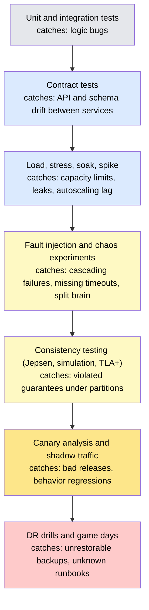
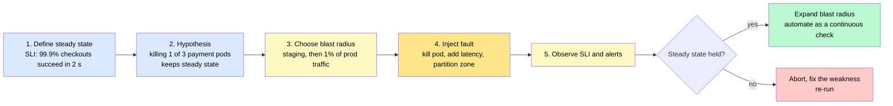
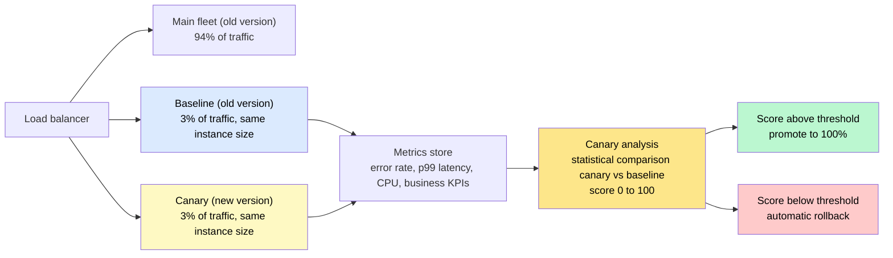

# Testing Distributed Systems — Load, Chaos & Canary

> Testing a distributed system means **deliberately subjecting it to the conditions that will eventually happen anyway** — traffic spikes, dead nodes, slow networks, partial failures, bad deploys — in a controlled way, so you find out how it behaves before your users do.

**Level:** 6 · **Topic:** 8 · **Prerequisites:** [Resilience Patterns](../../Level-05-Architecture-Patterns/06-Resilience-Patterns/README.md) · [Deployment Strategies](../04-Deployment-Strategies/README.md) · [Observability](../01-Observability/README.md) · [High Availability & DR](../03-High-Availability-and-DR/README.md)

---

## 🎯 The Problem

Every unit test passes. Integration tests pass. Staging is green. The release goes out — and production falls over in a way no test could have predicted:

- A downstream service isn't *down*, it's **slow** — 3-second responses instead of 30 ms. Thread pools fill, retries pile on, and the slowness spreads upstream until the whole site is timing out. Nothing actually crashed.
- The cache cluster restarts during a routine upgrade. Every request misses at once and the database — sized for a 95% hit rate — collapses under twenty times its normal load.
- A network blip between two availability zones makes the leader election flap. Two nodes both believe they're leader for eleven seconds. Both write.
- Black Friday brings 8× normal traffic. Nobody ever tested 8×. The bottleneck turns out to be a lock in a library nobody knew was single-threaded.
- The backups were taken faithfully every night for three years. The first time anyone tries to *restore* one, it fails.

Staging has 1% of the data, no real traffic shape, and no real failures. The bugs that matter only exist **at scale and under fault** — so the only way to find them is to create scale and fault on purpose.

**The core problem:** correctness of individual components tells you almost nothing about the behavior of the system they form. That behavior must be tested directly, and the only realistic test environment is one that looks a lot like production.

---

## 🌍 Real-World Analogy

Car manufacturers crash brand-new cars into concrete walls on purpose, with instrumented dummies inside, because no amount of inspecting the parts tells you what happens to a passenger at 60 km/h. Airlines put pilots in simulators and fail an engine on takeoff, again and again, because you cannot learn that reflex from a manual. Before a bridge opens, engineers park a row of fully loaded trucks on it and measure the deflection.

None of these are done to *break* the thing. They are done because the failure is going to happen someday, and a rehearsal is the only way to make sure the response is already known. Chaos engineering, load testing, and disaster-recovery drills are exactly this — crash tests and fire drills for software.

---

## 🧠 Core Idea

### Step 1 — The testing ladder gets new rungs

The classic pyramid (unit → integration → end-to-end) stops at "does the code do what I meant?" Distributed systems need rungs above it that ask "does the *system* survive what the world does to it?"

| Rung | Question it answers | Runs where |
|------|---------------------|------------|
| Unit / integration | Is the logic right? | CI |
| **Contract tests** | Do two services still agree on their API and message formats? | CI, per service pair |
| **Load / stress / soak** | Where does it break, and does it degrade gracefully? | Staging with production-sized data, or production shadow traffic |
| **Fault injection / chaos** | Does it survive real failures? | Staging, then production with a small blast radius |
| **Consistency testing** | Do the guarantees hold under partitions and crashes? | Dedicated harness (Jepsen, simulation) |
| **Canary + shadow traffic** | Is this specific release safe? | Production |
| **DR drills / game days** | Can we actually recover? Do the humans know what to do? | Production, scheduled |

### Step 2 — Load testing (and the mistakes that make it meaningless)

Four distinct tests, often confused:

- **Load test:** expected peak traffic — does it meet the SLO?
- **Stress test:** keep increasing until something breaks — *what* breaks first, and how? (Ideally you find the wall well above real peak.)
- **Soak test:** normal load for hours or days — memory leaks, connection leaks, log-disk growth, counters that overflow.
- **Spike test:** 0 → 10× in seconds — autoscaling lag, cold caches, thundering herds.

Tools: k6, Locust, Gatling, JMeter, wrk, Vegeta. The tool matters far less than the method:

1. **Test the real bottleneck.** Load-testing an API whose database is a mock tells you the speed of your mock.
2. **Use a production traffic shape** — real endpoint mix, real payload sizes, real key distribution (hot keys!). Replaying sampled production logs beats synthetic scripts.
3. **Use an open workload model.** Real users arrive at a *rate* regardless of how slow you are. A "closed" model (N virtual users in a loop) slows down its own request rate when the system slows down, hiding the collapse. This is **coordinated omission**, and it makes p99 look 10–100× better than reality.
4. **Measure percentiles, not averages.** The average of a system that's fast for 99% and hangs for 1% looks fine.
5. **Know your headroom number:** "we break at 3.2× current peak" is the output that matters for capacity planning.

### Step 3 — Fault injection and chaos engineering

Chaos engineering is *not* "break things in prod." It is a disciplined experiment:

1. **Define steady state** as a measurable signal — an SLI like "99.9% of checkouts succeed within 2 s."
2. **Hypothesize:** "If we kill one of the three payment-service instances, steady state will hold."
3. **Inject a realistic fault.** The menu: kill an instance or pod; add 500 ms of latency to a dependency; drop 10% of packets; partition two zones; fill a disk; exhaust file descriptors; skew a clock; return errors or *malformed* responses from a dependency; take down an entire availability zone or region.
4. **Observe.** Did the SLI hold? What alerts fired? What did the on-call see?
5. **Minimize blast radius and always have an abort switch.** Start in staging; then 1% of production traffic; expand only after the hypothesis holds.
6. **Automate and repeat.** A resilience property that isn't continuously tested regresses silently.

Tools: Chaos Monkey (Netflix's original), Gremlin, LitmusChaos, Chaos Mesh, AWS Fault Injection Service, Linux `tc netem` for network faults, and **Toxiproxy** for injecting latency and failures into dependencies during ordinary integration tests. **Game days** are the human version: a scheduled scenario ("the primary region just vanished") run as a team exercise with a facilitator, timed, and debriefed.

### Step 4 — Testing the consistency claims

"Strongly consistent" and "no data loss" are claims that need adversarial verification.

- **Jepsen** (Kyle Kingsbury): a harness that runs a real cluster, drives concurrent clients, injects partitions and clock skew and process crashes with a "nemesis," records every operation, then checks the history against a formal model (linearizability, snapshot isolation). It has found serious bugs in nearly every distributed database on the market — MongoDB, Cassandra, Elasticsearch, etcd, Redis, CockroachDB, Kafka, PostgreSQL's replication — usually in exactly the guarantee the vendor advertised.
- **Deterministic simulation testing:** FoundationDB runs its entire cluster as a single-threaded, deterministic simulation with a seeded random source, injecting every kind of fault, millions of times. Because runs are deterministic, any failure is exactly reproducible. TigerBeetle adopted the same approach; Antithesis offers it as a service.
- **Formal methods:** Amazon used TLA+ to specify DynamoDB, S3, and other services and found subtle bugs that testing had missed — including one that required a sequence of 35 steps to trigger.
- **Property-based testing** at the component level: generate random operation sequences and check invariants ("the ledger always balances").

### Step 5 — Testing in production, safely

At some point the only environment realistic enough is production itself. The techniques make that safe:

- **Canary releases with automated analysis:** route ~1–5% of traffic to the new version and *statistically compare* its metrics (error rate, latency, CPU, business KPIs) against a same-sized baseline running the old version. Netflix's Kayenta does this with a scoring model; a bad score rolls back automatically. The baseline is essential — comparing the canary to the whole fleet mixes in noise from different machine sizes and traffic.
- **Shadow (dark) traffic:** mirror real requests to the new version and **discard its responses**. It processes real load with zero user impact. Twitter's Diffy went further and diffed the responses of old and new to catch behavior changes. The catch: writes must be sandboxed — shadowing a request that sends an email sends two emails.
- **Feature flags as kill switches:** ship dark, enable for internal users, then 1%, and have a one-click off path that propagates in seconds.
- **Synthetic monitoring:** probes that continuously run real user journeys (log in, add to cart, pay with a test card) from multiple regions, catching breakage before real users report it.

### Step 6 — Disaster recovery: the test everyone skips

A backup that has never been restored is a hope, not a backup. A failover runbook that has never been executed is fiction. DR testing means:

- **Restore drills:** restore last night's backup to a fresh environment and run checks. Measure how long it took — that number is your real **RTO**, and the age of the backup is your real **RPO**.
- **Failover drills:** actually fail the primary database over to the replica; actually route traffic away from a region. Google's DiRT program and Amazon's GameDays do this with real production systems on a schedule, precisely so the surprise happens in a drill.
- **Dependency loss:** what happens when the identity provider, DNS, or the cloud KMS is unavailable for an hour?

### Step 7 — Mapping failure classes to tests

| What fails in the real world | How you test for it |
|-----------------------------|---------------------|
| Traffic 5× above forecast | Stress test to the breaking point; spike test for autoscaling lag |
| Slow (not dead) dependency | Latency injection with Toxiproxy/tc; verify timeouts and circuit breakers trip |
| Instance / pod / zone loss | Chaos experiments; canary before wide rollout |
| Network partition | Jepsen-style partition tests; verify quorum behavior and no split brain |
| Memory or connection leak | Soak test for 24–72 hours |
| Cache cold start / stampede | Chaos: flush the cache under load; verify request coalescing |
| Bad release | Canary with automated analysis; shadow traffic; feature-flag kill switch |
| Data loss or corruption | Restore drills; consistency checkers; simulation testing |
| Region outage | Scheduled region evacuation drill (DiRT / GameDay) |
| Humans don't know the runbook | Game days |

---

## 📊 How It Works

### The Distributed-Systems Testing Ladder

*Each rung catches a class of failure the rung below cannot see. Realism — and risk — increase as you climb.*

*Caption: Teams that stop at the top two rungs are testing components. Everything below them tests the system.*

### The Chaos Experiment Loop

*A chaos experiment is a hypothesis with an abort button, not random destruction.*

*Caption: The output of a failed experiment is a fix and a re-run — never a postmortem, because nothing user-facing broke.*

### Automated Canary Analysis

*The canary is compared to a same-sized baseline of the old version, not to the whole fleet, so the only variable is the code.*

*Caption: Without the baseline, a canary on a slightly newer machine type or a slightly different traffic mix produces false alarms — or false confidence.*

---

## 🔧 Types / Variations / Strategies

| Technique | Realism | Risk to users | Cost | What it uniquely finds |
|-----------|---------|---------------|------|------------------------|
| Load test in staging | Medium (fake data, no failures) | None | Medium | Capacity ceiling, obvious bottlenecks |
| Shadow traffic in prod | High | None if writes are sandboxed | Medium | Behavior and performance regressions on real load |
| Chaos in staging | Medium | None | Low | Missing timeouts, retries, fallbacks |
| Chaos in production | Highest | Bounded by blast radius | Medium | Real cascading failures, alerting gaps |
| Jepsen / simulation | High for the data layer | None | High (expertise) | Consistency violations, split brain, lost writes |
| Canary analysis | Highest | 1–5% of users briefly | Low once built | Bad releases before they're everywhere |
| DR drill | Highest | Planned, announced | High (people time) | Broken backups, wrong runbooks, missing access |

---

## 🏢 Real-World Examples

### Netflix — from Chaos Monkey to ChAP
Netflix created Chaos Monkey in 2011 to randomly terminate production instances during business hours, forcing every team to build for instance loss. Chaos Kong later evacuated entire AWS regions. Their Chaos Automation Platform (ChAP) now runs experiments as canaries — a small slice of traffic gets a fault injected while a control slice doesn't, and Kayenta scores the difference automatically. The book *Chaos Engineering* (Basiri, Rosenthal et al.) documents the discipline they built around it.

### Amazon — GameDays and TLA+
Amazon has run GameDays since the early 2000s: deliberately taking down data centers and dependencies to see what breaks, with the retail site live. Separately, AWS engineers published "How Amazon Web Services Uses Formal Methods" (2015), describing how TLA+ specifications found design bugs in S3 and DynamoDB that no testing had caught — one required 35 steps to reproduce.

### Google — DiRT
Google's Disaster Recovery Testing program, running since 2006, stages large-scale outages — a region lost, a headquarters "evacuated," key people unreachable — annually and for real. The lesson repeated in the SRE book: the failures found are usually organizational (who has access? which runbook?) rather than technical.

### Jepsen — the industry's bug finder
Kyle Kingsbury's Jepsen analyses are commissioned by database vendors precisely because the harness finds what their own tests don't: lost writes in MongoDB under partitions, stale reads in etcd and Consul, split-brain in Elasticsearch. CockroachDB, FaunaDB, and others now run Jepsen continuously in CI. If a system claims a consistency level, the first question is "has it been Jepsen-tested?"

### FoundationDB and TigerBeetle — deterministic simulation
FoundationDB's engineers have said they found more bugs in simulation than they ever saw in production — because the simulator runs billions of hours of simulated cluster time with fault injection, deterministically. TigerBeetle, a financial ledger database, was designed around the same technique from day one; Antithesis productized it for everyone else.

### Twitter — Diffy
Twitter open-sourced Diffy to send the same production request to the old service, the new candidate, and a second copy of the old one (to measure noise), then diff the three responses. Behavior regressions show up as diffs before any user sees them.

---

## ⚖️ Trade-offs

| Factor | Test in staging | Test in production |
|--------|-----------------|--------------------|
| **Realism** | Limited by data size and traffic shape | Total |
| **User risk** | None | Real, must be bounded (canary %, blast radius, abort switch) |
| **Cost** | Duplicate environment | Engineering discipline and tooling |
| **What you learn** | Component limits | System behavior, alerting quality, human response |
| **Prerequisites** | Test data, load generator | Observability, SLOs, kill switches, on-call buy-in |

---

## ✅ When to Use / ❌ When NOT to Use

**Invest in load, chaos, and canary testing when:**
- You have an SLO to protect and the cost of an outage is real.
- The system has more than a handful of services or any stateful replication.
- You already have observability good enough to *see* the effect of an experiment. (Chaos without metrics is vandalism.)

**Hold off on production chaos when:**
- There's no steady-state metric, no kill switch, or no one on-call who knows the experiment is running.
- The system is already unhealthy — you'll learn nothing and make it worse.
- You're a three-person startup with one server. Write the timeouts, set up the canary, and come back later.

**Never skip:** timeouts, restore drills, and a load test to *some* multiple of peak. Those are cheap and catch the outages that kill companies.

---

## ⚠️ Common Pitfalls

1. **Load testing the mock.** If the database, payment provider, or cache is stubbed, the test measures nothing real.
2. **Coordinated omission.** A closed-loop load generator throttles itself when the system slows, hiding tail latency. Use an open model (fixed arrival rate) or a tool that corrects for it.
3. **Reporting the average.** Report p50/p95/p99 and the error rate. An average hides the 1% of users who timed out.
4. **Chaos without a hypothesis.** "Let's kill stuff and see" produces incidents, not knowledge. Steady state first, then hypothesis, then fault.
5. **No abort switch.** Every production experiment must be stoppable in seconds by the on-call, not by the person who wrote it.
6. **Shadow traffic with side effects.** Mirrored requests that send emails, charge cards, or write to shared tables. Sandbox every write path before mirroring.
7. **Canaries too small to be statistically meaningful.** 0.1% of traffic on a low-volume endpoint yields a handful of requests; the analysis can't distinguish signal from noise. Size canaries by request count, not percentage.
8. **Backups that are never restored.** Schedule the restore drill; record the time; that's your RTO.
9. **Ignoring grey failure.** Tests that only kill things miss the far more common "slow, flaky, half-working" dependency. Inject latency and partial errors, not just death.
10. **Testing with staging's tiny dataset.** Query plans, cache hit rates, and index behavior change completely at production scale. Use a production-sized (anonymized) snapshot.

---

## 🎤 Interview Tips

- **The classic prompt:** "How do you know this design survives a zone outage?" Answer with the experiment: "Define the SLI, hypothesize it holds with one zone gone, take the zone down in staging then in prod at limited blast radius, watch the SLI and the alerts." Naming *steady state* and *blast radius* signals real chaos-engineering practice.
- **"How do you know your capacity?"** → A stress test with production traffic shape and production-sized data, in an open workload model, reporting p99 — and the resulting headroom multiple ("we break at 3×").
- **Mention Jepsen when consistency comes up.** "It claims linearizability — has it been Jepsen-tested?" is a senior-engineer question.
- **Canary analysis:** explain *why* the baseline exists. Interviewers like candidates who know the canary is compared to a same-sized old-version group, not to the fleet.
- **Common follow-up:** "How do you load-test without hurting production?" → Shadow traffic with sandboxed writes, rate-limited replay, separate capacity pool, and an abort switch.
- **Common follow-up:** "What's coordinated omission?" → A closed-loop tester slows its own request rate when the system slows, so it never records the latency users would have experienced. Fixed-rate generators avoid it.
- **DR:** "Our RTO is what the last restore drill measured, not what the document says."

---

## 📝 TL;DR

- Component tests can't reveal system behavior; distributed systems need **load, fault, consistency, canary, and DR** testing on top of the usual pyramid.
- **Load test** the real bottleneck with a production traffic shape, an *open* workload model, and p99 reporting; find your headroom multiple.
- **Chaos engineering** is an experiment: steady state → hypothesis → bounded fault injection → observe → abort or expand. Automate it.
- **Consistency claims need adversarial proof** — Jepsen, deterministic simulation, or formal methods.
- **Test in production safely** with automated canary analysis against a baseline, shadow traffic with sandboxed writes, and feature-flag kill switches.
- A backup you haven't restored and a failover you haven't run are not real. **Drill them and measure RTO/RPO.**

---

## 🧪 Test Yourself

1. Your load test reports a p99 of 120 ms at 5,000 requests/second, but production users at that rate see multi-second stalls. Name the most likely methodological flaw and explain how to fix the test.
2. Design a chaos experiment to verify that your checkout service tolerates a 2-second latency increase from the inventory service. State the steady-state metric, the hypothesis, the injection method, the blast radius, and the abort condition.
3. Why does automated canary analysis run a separate *baseline* group on the old version instead of comparing the canary to the rest of the fleet? Give two sources of noise the baseline removes.
4. A vendor says their database is "strongly consistent under network partitions." Describe how a Jepsen-style test would try to falsify that claim, and what a violation would look like in the operation history.
5. You mirror 10% of production traffic to a new version of the order service to test it under real load. A day later, customers complain about duplicate confirmation emails. What went wrong, and what should have been done before enabling shadow traffic?

---

## 📚 Further Reading

- [Principles of Chaos Engineering](https://principlesofchaos.org/) — the one-page manifesto from the Netflix team.
- [Chaos Engineering — Basiri, Rosenthal et al. (O'Reilly)](https://www.oreilly.com/library/view/chaos-engineering/9781492043850/) — the practice in depth, including ChAP and canary integration.
- [Jepsen analyses](https://jepsen.io/analyses) — read one for a database you use; the methodology section of any report explains the harness.
- [How Amazon Web Services Uses Formal Methods (CACM, 2015)](https://cacm.acm.org/research/how-amazon-web-services-uses-formal-methods/) — TLA+ finding real bugs in S3 and DynamoDB.
- [Google SRE Book — Testing for Reliability](https://sre.google/sre-book/testing-reliability/) — and the DiRT write-up in *Weathering the Unexpected*.
- [Automated Canary Analysis at Netflix with Kayenta](https://netflixtechblog.com/automated-canary-analysis-at-netflix-with-kayenta-3260bc7acc69) — the baseline-vs-canary design.
- [How NOT to Measure Latency — Gil Tene](https://www.youtube.com/watch?v=lJ8ydIuPFeU) — coordinated omission explained by the person who named it.
- [Testing Distributed Systems with Deterministic Simulation — Will Wilson (FoundationDB)](https://www.youtube.com/watch?v=4fFDFbi3toc) — why simulation finds more bugs than production.
- Previous: [07 — Containers & Orchestration](../07-Containers-and-Orchestration/README.md) · Next: [09 — Data Privacy, Encryption & Compliance](../09-Data-Privacy-and-Encryption/README.md) · Back to [Level 06 Overview](../README.md)
- See also: [Resilience Patterns](../../Level-05-Architecture-Patterns/06-Resilience-Patterns/README.md) · [Deployment Strategies](../04-Deployment-Strategies/README.md) · [Capacity Planning](../02-Capacity-Planning-and-Estimation/README.md)
