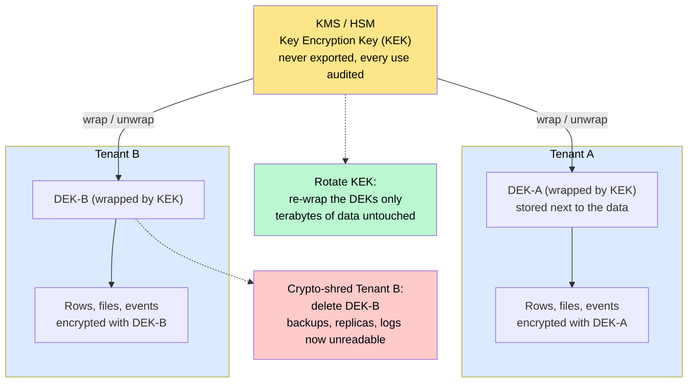
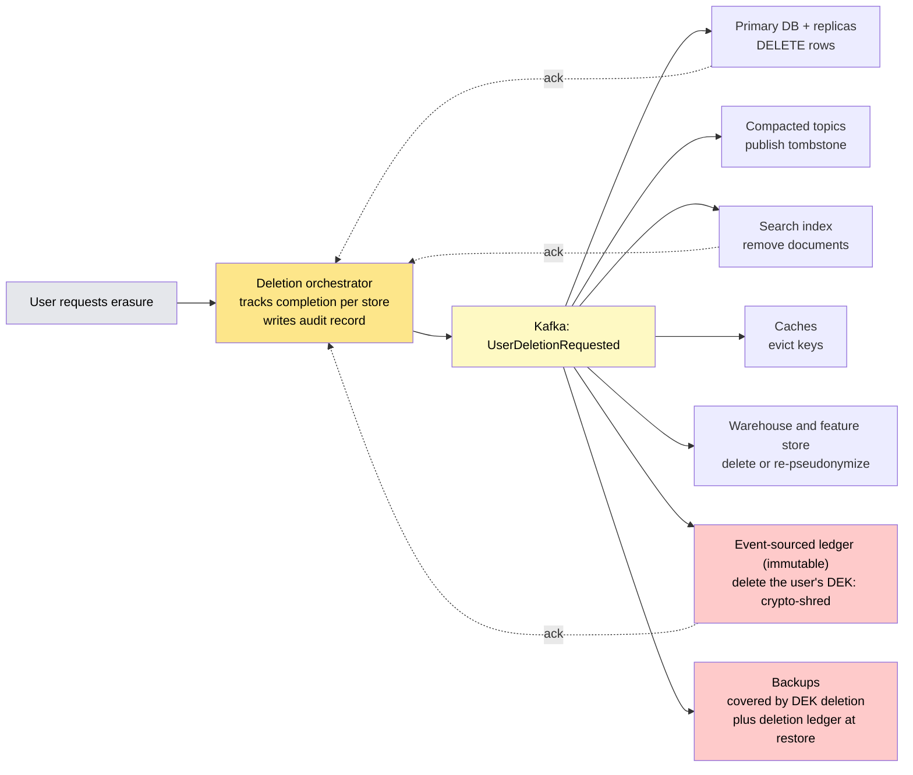
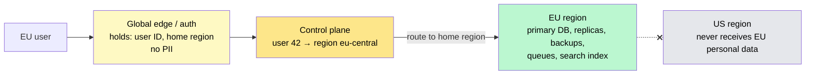

# Data Privacy, Encryption & Compliance

> **Privacy engineering** is designing a system so that personal data is protected *by default* — encrypted in transit and at rest, collected minimally, access-controlled, deletable on request, and stored where the law says — rather than bolted on after a regulator, a breach, or an enterprise customer asks.

**Level:** 6 · **Topic:** 9 · **Prerequisites:** [Security at Scale](../05-Security-at-Scale/README.md) · [Authentication & Authorization](../../Level-03-Communication/08-Authentication-and-Authorization/README.md) · [Object Storage](../../Level-02-Data-Layer/09-Object-Storage/README.md) · [Multi-Tenancy](../../Level-05-Architecture-Patterns/10-Multi-Tenancy/README.md)

---

## 🎯 The Problem

A user in Berlin clicks "Delete my account" and, under GDPR's right to erasure, you have 30 days to make their personal data disappear. Here is where it currently lives:

- The primary PostgreSQL database — and its three read replicas.
- A Kafka topic of user events with 30-day retention, plus a compacted topic that keeps the latest record forever.
- The Elasticsearch index that powers search.
- The analytics warehouse, where their events were joined into a hundred derived tables.
- The ML feature store and the model trained on it last month.
- Application logs in S3 that recorded their email address in a request URL.
- Ninety days of nightly database backups, which by design cannot be modified.
- An event-sourced order history that is **immutable** on purpose.

Meanwhile: an engineer's laptop holding a "temporary" database dump is stolen; a support tool shows full credit-card numbers to anyone with a login; an S3 bucket in Virginia turns out to hold EU citizens' records that a contract said would stay in Frankfurt; and the "encryption at rest" checkbox was ticked while the encryption keys sat in the same repository as the code.

**The core problem:** personal data sprawls into every copy, cache, index, and derivative of itself. Privacy is not a feature you add to the database — it's a property you must design into how data is classified, encrypted, keyed, located, and eventually destroyed.

---

## 🌍 Real-World Analogy

Think of a well-run hotel.

- Every room has a **safe** (encryption at rest), but the safes' master key lives in a separate **vault at head office**, never in the room (key management).
- Hallway cameras record only what's needed and the tapes are overwritten weekly (**data minimization** and **retention**).
- Guest records are **shredded** after the legally required period — and a guest can demand their file be destroyed on request (**erasure**).
- That request is easy if the guest's file is one folder in one cabinet. It is a nightmare if reception photocopied it to housekeeping, the restaurant, the spa, and an offsite archive (**data sprawl**).
- The cleverest trick: if each guest's papers were stored in a locked box with its own key, you could "destroy" all copies everywhere by simply **destroying the key** (crypto-shredding).
- And a guest who booked the Paris branch expects their records to stay in Paris (**residency**).

---

## 🧠 Core Idea

### Step 1 — Classify and inventory

You cannot protect data you can't find. Start with a classification — **public / internal / confidential / PII / sensitive PII** (health, financial, biometric, children's data) — and tag it at the schema level: which columns, which event fields, which buckets. Modern data catalogs and lineage tools (or a disciplined spreadsheet) tell you where each class flows. Under GDPR, "personal data" includes IP addresses, device IDs, cookies, and location — far more than names and emails.

### Step 2 — Encryption in transit and at rest

**In transit:** TLS 1.2+ (prefer 1.3) on every hop, including inside the data center — [mTLS between services](../../Level-05-Architecture-Patterns/09-Service-Mesh/README.md) makes "internal network" mean nothing to an attacker who gets in.

**At rest** comes in layers, and the layer determines what you're actually protected from:

| Layer | What it protects against | What it does NOT protect against | Cost |
|-------|--------------------------|----------------------------------|------|
| **Disk / volume encryption** (EBS, LUKS, cloud default) | A stolen or discarded disk | Anyone with database or OS access — data is plaintext to every query | Free, transparent |
| **Database TDE** (transparent data encryption) | Stolen data files and backups | Any SQL access, SQL injection, a DBA | Low |
| **Application / field-level encryption** | Database compromise, SQL injection dumps, DBAs, most breaches | Compromise of the app server holding keys | Breaks indexing and searching on that field |
| **Client-side / end-to-end** | The service operator itself | Nothing — but the service can't process the data | Highest; only for messaging-style products |

"We encrypt at rest" usually means only the first row. For PII fields that matter — government IDs, health data, card data — field-level encryption is the real control.

### Step 3 — Key management and envelope encryption

Encryption is only as strong as the place the key lives. The standard architecture:

1. A **Key Management Service** (AWS KMS, Google Cloud KMS, Azure Key Vault, HashiCorp Vault) backed by a hardware security module holds a **Key Encryption Key (KEK)** that *never leaves* it.
2. Each object, record, user, or tenant gets its own **Data Encryption Key (DEK)**. Data is encrypted with the DEK locally (fast, symmetric AES-GCM).
3. The DEK is itself encrypted ("wrapped") by the KEK via one KMS call, and the wrapped DEK is stored **next to the data**.
4. To read: fetch the wrapped DEK, ask KMS to unwrap it (an audited call), decrypt the data. Cache unwrapped DEKs briefly in memory.

This is **envelope encryption**, and it gives you three things a single key can't:

- **Rotation without re-encrypting data:** rotate the KEK, re-wrap the DEKs (small), leave the terabytes untouched.
- **Blast-radius limits:** one leaked DEK exposes one object or one tenant, not everything.
- **Crypto-shredding:** destroy a user's or tenant's DEK and every copy of their data — replicas, backups, logs, immutable event logs — becomes unreadable ciphertext at once, without touching any of it.

### Step 4 — Minimize, pseudonymize, tokenize

The cheapest data to protect is data you never collected.

- **Minimization:** collect what the feature needs, nothing more. Don't log request bodies. Don't keep raw location when a city will do.
- **Tokenization:** replace a sensitive value with a random token and keep the mapping in a tightly controlled **vault**. The classic case is payment cards — store `tok_8f3a…` everywhere and only the vault (or your payment provider, like Stripe) ever holds the number. This shrinks your PCI DSS scope from "the whole platform" to "the vault."
- **Pseudonymization:** replace identifiers with keyed hashes (HMAC with a secret — *never* an unsalted hash, which is trivially reversible for emails and phone numbers) so analytics can join on users without holding their identity.
- **Aggregation and differential privacy:** for statistics, add calibrated noise so no individual can be re-identified from the aggregate. Apple and Google use this for telemetry; the U.S. Census used it in 2020.

### Step 5 — Deletion in a distributed system

"Delete the row" is the easy 5%. The design:

1. **Deletion is an event.** A `UserDeletionRequested` message fans out to every service that owns a copy of user data; each service acknowledges completion; an orchestrator tracks the job and produces an **audit record** proving what was deleted and when.
2. **Kafka:** for compacted topics, publish a **tombstone** (key with null value) so compaction removes the record; for regular topics, rely on retention being short enough or on crypto-shredding.
3. **Immutable stores** (event sourcing, append-only ledgers, WORM backups): you can't delete, so you **crypto-shred** — encrypt each user's payloads under a per-user DEK from day one, and delete the key. This is the standard answer and it's the one interviewers want to hear.
4. **Backups:** either per-user keys (shredding covers them) or a **deletion ledger** consulted at restore time to re-delete anything restored.
5. **Derived data:** search indexes, caches, warehouse tables, feature stores. Each needs a consumer of the deletion event. ML models trained on the data are genuinely hard — document the retraining policy.
6. **Data Subject Access Requests** (export everything you hold on me) use the same fan-out in reverse.

### Step 6 — Residency and sovereignty

Regulation increasingly dictates *where* data may live: GDPR transfer rules for EU data, sector rules in finance and health, and national laws in India, China, Russia, and elsewhere. The architecture:

- A user's or tenant's **home region** is a property in the control plane, decided at signup and rarely changed.
- Their primary data, replicas, backups, queues, and search indexes are **pinned to that region**.
- Global services (edge, CDN, routing, auth) hold only what's needed to route — ideally no PII, or only pseudonymous IDs.
- Cross-region replication of personal data is a deliberate exception with a legal basis, not a default.

| Regulation | Scope | What it forces into the design |
|------------|-------|--------------------------------|
| **GDPR** (EU) | Any EU resident's personal data | Lawful basis, minimization, erasure & access rights, breach notification within 72 h, transfer restrictions, fines up to 4% of global revenue |
| **CCPA / CPRA** (California) | California consumers | Access, deletion, opt-out of sale/sharing |
| **HIPAA** (US) | Health information | Access controls, audit logs, encryption, business-associate agreements |
| **PCI DSS** | Payment card data | Never store CVV; tokenize PANs; segment the card-handling environment |
| **SOC 2** | Service organizations (contractual) | Documented, audited controls for security, availability, confidentiality |
| **DPDP Act** (India) | Indian residents' data | Consent, purpose limitation, breach notification |

### Step 7 — Access control, secrets, and the log problem

- **Least privilege** on PII tables, with **column masking** in support and analytics tools (show `j***@example.com`).
- **Break-glass access:** production data access requires a ticket, a time-boxed grant, and an immutable audit log — and someone reviews that log.
- **Secrets management:** keys and credentials come from Vault/KMS at runtime, never from the repo, a Docker image, or a plaintext environment file.
- **Logs are the #1 accidental leak.** Emails in URLs, tokens in headers, full request bodies in debug logs. Scrub at the logging library, not in each service, and give logs a short retention.

### Step 8 — Retention as a property of the data class

Every store holding PII gets a **TTL**: raw events 30 days, logs 14 days, backups 35 days, inactive accounts purged after N years. Object storage lifecycle rules, database partitions dropped by date, and Kafka retention do the work automatically — a retention policy that requires a human to run a script will not be run.

---

## 📊 How It Works

### Envelope Encryption with Per-Tenant Keys

*The master key never leaves the KMS. Each tenant's data key is small, wrapped, and stored beside the data. Deleting one wrapped DEK shreds one tenant everywhere.*

*Caption: One KMS call per read wraps or unwraps a 32-byte key; the bulk encryption happens locally with AES. Rotation and deletion become key operations instead of data operations.*

### Deletion as an Orchestrated Event

*A single request fans out to every owner of a copy. Immutable stores are handled by destroying the user's key rather than by rewriting history.*

*Caption: The orchestrator's completion record is what you show an auditor. Any store that can't acknowledge is a store you didn't know held personal data.*

### Data Residency Routing

*Region is decided once, at signup, and pinned. The global edge routes on a pseudonymous ID and never holds the personal record.*

*Caption: Residency is a routing decision in the control plane plus a discipline about what global components are allowed to store.*

---

## 🔧 Types / Variations / Strategies

| Technique | Purpose | Trade-off |
|-----------|---------|-----------|
| **Disk / TDE encryption** | Baseline protection for lost media | Doesn't protect against application-level access |
| **Field-level encryption** | Protect specific PII from DB compromise | No indexing/search on the field; key handling in app |
| **Deterministic encryption / blind index** | Equality lookups on encrypted fields (HMAC of value as an index) | Leaks equality patterns; no range queries |
| **Envelope encryption** | Scalable keys, rotation, crypto-shredding | KMS dependency and latency on cold reads |
| **Tokenization** | Remove sensitive values (cards) from most systems | Vault is a critical dependency; extra hop |
| **Pseudonymization (keyed hash)** | Analytics without identity | Re-identification possible if the secret leaks |
| **Differential privacy** | Safe aggregate statistics | Reduced accuracy; needs careful budget |
| **Retention TTLs** | Shrink the exposure window automatically | May conflict with audit requirements — keep those in a separate, minimal store |

---

## 🏢 Real-World Examples

### Google — encryption at rest by design
Google's public whitepaper on encryption at rest describes exactly the envelope model: data chunks encrypted with per-chunk DEKs, DEKs wrapped by KEKs in a central KMS, keys rotated on schedules, and every key access audited. Tink, their open-source crypto library, encodes the same patterns so engineers can't easily misuse primitives.

### AWS KMS and S3 SSE-KMS
AWS made envelope encryption a one-line option: `SSE-KMS` on S3 generates a per-object DEK, wraps it under a customer-managed KMS key, and logs every decrypt to CloudTrail. Customer-managed keys with per-tenant key policies are how many SaaS vendors deliver "bring your own key" and crypto-shredding to enterprise customers.

### Stripe — tokenization to shrink PCI scope
A merchant integrating Stripe never sees a card number: the browser sends the card straight to Stripe's vault and gets back a token. The merchant's entire platform is out of PCI scope for storage. Stripe's own architecture concentrates the card-handling environment into a tightly segmented, separately audited system.

### Apple — differential privacy in the OS
Since iOS 10, Apple has collected usage statistics (emoji popularity, health trends, typing suggestions) with local differential privacy — noise is added on the device before anything is sent, so Apple's servers can compute population statistics without being able to learn any one user's behavior.

### Meta — Privacy Aware Infrastructure
Meta's engineering posts on "Privacy Aware Infrastructure" describe tagging data with purpose and policy at the schema level, tracking lineage as it flows through thousands of systems, and enforcing "policy zones" so that data collected for one purpose can't silently be used for another. It is the largest published example of Step 1 (classification and lineage) done at scale.

### Kafka and GDPR — crypto-shredding in practice
Confluent's guidance for GDPR erasure in Kafka is the crypto-shredding pattern: encrypt event payloads with per-user keys held in a separate key store; delete the key to erase the user across every topic, partition, replica, and consumer's local copy — without rewriting an append-only log.

---

## ⚖️ Trade-offs

| Decision | Choose this… | …and you give up |
|----------|--------------|-----------------|
| Field-level encryption on PII | Real protection from DB compromise | Indexing, searching, sorting on those fields; some query flexibility |
| Per-user / per-tenant DEKs | Crypto-shredding, small blast radius | A key store that holds billions of wrapped keys (fine — they're tiny) and KMS latency on cold reads |
| Tokenization vault | Tiny compliance scope | An extra hop and a critical dependency on the vault |
| Strict residency pinning | Compliance, enterprise deals | Global features that need cross-region joins; more regions to operate |
| Aggressive minimization and TTLs | Less to breach, less to delete | Analytics depth, long-term debugging data |
| Differential privacy | Publishable statistics | Precision, especially for small groups |

---

## ✅ When to Use / ❌ When NOT to Use

**Apply the full playbook (classification, field-level encryption, per-tenant keys, deletion orchestration, residency) when:**
- You hold regulated data: health, payments, government IDs, children's data, biometrics.
- You sell to enterprises or operate in the EU, California, India, or any residency-regulated market.
- Your data has a long tail of derivatives (warehouse, ML, search) where sprawl is real.

**Keep it proportionate when:**
- The data is genuinely non-personal (server metrics, public catalog data).
- You're early and small: still do TLS everywhere, disk encryption, secrets out of the repo, PII out of logs, and short retention — these are cheap and non-negotiable. Add per-user keys before you have a lot of immutable history, because retrofitting them is painful.

**Never:** store CVVs, put keys beside data, log tokens, or treat "the internal network" as trusted.

---

## ⚠️ Common Pitfalls

1. **Keys next to data.** A KMS key ID in the code and the wrapped DEK in the row is fine; the *unwrapped* key in a config file or environment variable next to the database is the whole design defeated.
2. **"Encrypted at rest" = disk encryption only.** Protects against stolen disks; does nothing against the SQL injection that dumps the table.
3. **PII in logs, URLs, and analytics events.** The most common real-world leak. Scrub at the library; never put identifiers in query strings.
4. **Forgetting derived data in deletion.** Search index, caches, warehouse, feature store, and the cold backups. If a store can't acknowledge a deletion event, you didn't know it had the data.
5. **Unsalted hashes as "anonymization."** `SHA256(email)` is reversible for essentially every email address on earth. Use an HMAC with a secret key, or tokenize.
6. **TLS to the load balancer, plaintext behind it.** Encrypt every hop; use mTLS inside the mesh.
7. **No key rotation, no audit trail.** If you can't say who decrypted what and when, you can't investigate a breach — or pass an audit.
8. **Deletion that isn't idempotent or auditable.** Retries must be safe; the completion record is what a regulator asks for.
9. **Treating IPs and device IDs as non-personal.** Under GDPR they're personal data. Classify accordingly.
10. **Residency by policy document, not by architecture.** If the code *can* write EU data to a US bucket, one day it will.

---

## 🎤 Interview Tips

- **The classic prompt:** "How do you implement GDPR deletion in an event-sourced or append-only system?" → **Crypto-shredding**: per-user DEKs from day one, delete the key, and the immutable log becomes unreadable for that user. Then describe the deletion-event fan-out and the audit record.
- **"How do you encrypt at rest properly?"** → Envelope encryption: KMS-held KEK, per-object/tenant DEKs stored wrapped beside the data, rotation by re-wrapping, audited unwraps. Distinguish it from disk encryption.
- **"EU customers need their data in the EU."** → Home region in the control plane, region-pinned storage/replicas/backups/queues, PII-free global edge, explicit exceptions only.
- **Common follow-up:** "How do you search an encrypted email field?" → Deterministic encryption or a blind index (HMAC of the normalized value) for equality; accept that range and fuzzy search are gone, or search on a non-sensitive derived field.
- **Common follow-up:** "What about backups?" → Per-user keys make shredding cover them; otherwise a deletion ledger re-applied at restore time.
- **Common follow-up:** "How do you get out of PCI scope?" → Tokenize at the edge (or use a provider's vault); never let card numbers touch your systems.
- Show breadth by naming the layers — classification, encryption, keys, minimization, deletion, residency, access/audit, retention — and depth by going deep on any one.

---

## 📝 TL;DR

- Personal data sprawls into replicas, queues, indexes, warehouses, logs, and backups — privacy must be designed into classification, keys, location, and deletion, not added to a table.
- **Encrypt every hop** (TLS + mTLS) and understand that disk encryption only protects against stolen disks; **field-level encryption** protects against database compromise.
- **Envelope encryption** with a KMS-held KEK and per-tenant/per-user DEKs gives cheap rotation, small blast radius, and **crypto-shredding** — the standard answer for deleting from immutable stores and backups.
- **Collect less, tokenize what's sensitive, pseudonymize with keyed hashes,** and apply TTLs everywhere.
- Deletion is an **orchestrated, audited event** fanned out to every store — including Kafka tombstones, search, caches, and derived data.
- **Residency** is a control-plane routing decision plus a rule that global components hold no PII.

---

## 🧪 Test Yourself

1. Your order history is an immutable, event-sourced log replicated to three regions and backed up nightly to WORM storage. A user invokes their right to erasure. Design the mechanism that makes their data unrecoverable within 30 days without rewriting the log or the backups.
2. Explain envelope encryption. Why is rotating the KEK cheap, and why does a single leaked DEK matter less than a single leaked KEK?
3. A teammate proposes "anonymizing" the analytics warehouse by replacing emails with `SHA256(email)`. Explain why this fails and what to use instead.
4. Compare disk-level encryption, database TDE, and application-level field encryption in terms of which attacker each stops. Which one protects against a SQL injection that dumps the users table?
5. Design the data flow for an EU-only tenant on a platform whose edge, auth, and CDN are global. What may the global components store, and how does a request reach the tenant's region?

---

## 📚 Further Reading

- [Google Cloud — Encryption at rest (whitepaper)](https://cloud.google.com/docs/security/encryption/default-encryption) — the DEK/KEK envelope design described end to end.
- [AWS KMS — Envelope encryption](https://docs.aws.amazon.com/kms/latest/developerguide/concepts.html#enveloping) — the concepts page every cloud implementation follows.
- [Handling GDPR with Apache Kafka — Confluent](https://www.confluent.io/blog/handling-gdpr-log-forget/) — crypto-shredding for append-only logs.
- [Meta — Privacy Aware Infrastructure](https://engineering.fb.com/2023/09/07/security/privacy-aware-infrastructure-purpose-limitation-meta/) — classification, lineage, and policy zones at scale.
- [OWASP Cryptographic Storage Cheat Sheet](https://cheatsheetseries.owasp.org/cheatsheets/Cryptographic_Storage_Cheat_Sheet.html) — what to use and what never to use.
- [NIST SP 800-57 — Key Management Recommendations](https://csrc.nist.gov/publications/detail/sp/800-57-part-1/rev-5/final) — key lifecycles and rotation.
- [GDPR Article 17 — Right to erasure](https://gdpr-info.eu/art-17-gdpr/) — the actual text, shorter than you'd think.
- [Apple — Differential Privacy overview](https://www.apple.com/privacy/docs/Differential_Privacy_Overview.pdf) — local DP in a consumer product.
- Previous: [08 — Testing Distributed Systems](../08-Testing-Distributed-Systems/README.md) · Next Level: [Level 07 — Big Data & Specialized Systems](../../Level-07-Big-Data-and-Specialized/README.md) · Back to [Level 06 Overview](../README.md)
- See also: [Security at Scale](../05-Security-at-Scale/README.md) · [Multi-Region & Geo-Distribution](../06-Multi-Region-and-Geo-Distribution/README.md) · [CQRS & Event Sourcing](../../Level-05-Architecture-Patterns/03-CQRS-and-Event-Sourcing/README.md)
