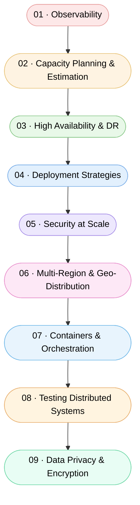

# Level 6 — Scale & Reliability

By this point you have built a solid foundation in distributed systems, data management, and architectural patterns. Level 6 is where you learn to keep those systems running — at any scale, under any conditions. You will explore the tools and techniques that separate a hobby project from a production-grade service: how to observe what is actually happening inside your system, how to plan for growth before it hits you, and how to stay online when things inevitably go wrong.

---

## Learning Outcomes

After completing this level you will be able to:

- Instrument systems with metrics, logs, and traces to diagnose problems quickly
- Estimate capacity requirements and model traffic growth before you hit limits
- Design for high availability and build disaster recovery plans you can actually test
- Choose deployment strategies that let you ship changes safely without downtime
- Apply security controls that hold up under real-world attack surface at scale
- Architect multi-region topologies and reason about latency, consistency, and failover across geographies
- Explain containers vs VMs and use Kubernetes to achieve self-healing and autoscaling at scale
- Verify a system survives real conditions with load tests, chaos experiments, Jepsen-style consistency checks, canary analysis, and DR drills
- Engineer privacy in: envelope encryption with a KMS, per-tenant keys and crypto-shredding, tokenization, orchestrated deletion, and data residency

---

## Topics

Work through these in order — each one builds on the concepts introduced before it:

1. [Observability](./01-Observability/README.md)
2. [Capacity Planning and Estimation](./02-Capacity-Planning-and-Estimation/README.md)
3. [High Availability and Disaster Recovery](./03-High-Availability-and-DR/README.md)
4. [Deployment Strategies](./04-Deployment-Strategies/README.md)
5. [Security at Scale](./05-Security-at-Scale/README.md)
6. [Multi-Region and Geo-Distribution](./06-Multi-Region-and-Geo-Distribution/README.md)
7. [Containers and Orchestration](./07-Containers-and-Orchestration/README.md)
8. [Testing Distributed Systems — Load, Chaos & Canary](./08-Testing-Distributed-Systems/README.md)
9. [Data Privacy, Encryption & Compliance](./09-Data-Privacy-and-Encryption/README.md)

---

## Roadmap

---

## Prerequisites

You should be comfortable with the material in these earlier levels before starting here:

- [Level 1 — Building Blocks: Load Balancing](../Level-01-Building-Blocks/02-Load-Balancing/README.md)
- [Level 1 — Building Blocks: Caching](../Level-01-Building-Blocks/03-Caching/README.md)
- [Level 2 — Data Layer: Database Replication](../Level-02-Data-Layer/01-Database-Replication/README.md)
- [Level 4 — Distributed Systems: CAP Theorem](../Level-04-Distributed-Systems/01-CAP-Theorem/README.md)

If any of those topics feel shaky, revisit them first — the concepts here assume you can reason about replication lag, cache invalidation, and partition tolerance without needing to look them up.

---

## Estimated Time

**10 – 12 hours** across all nine topics, depending on how deeply you explore the hands-on exercises and external references in each section.
