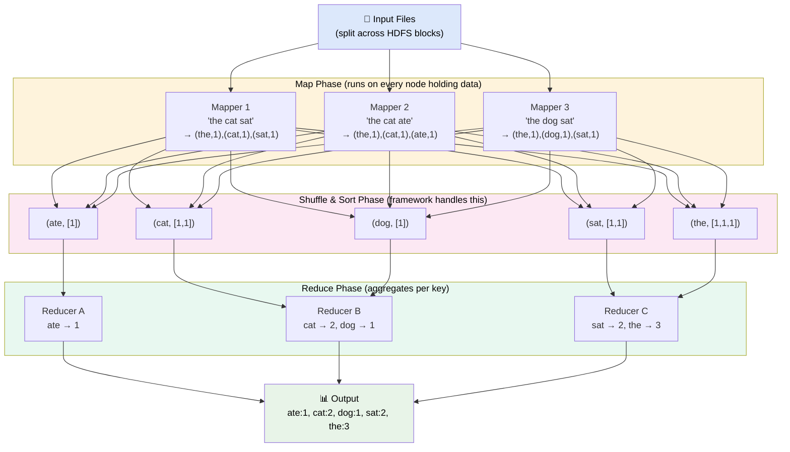
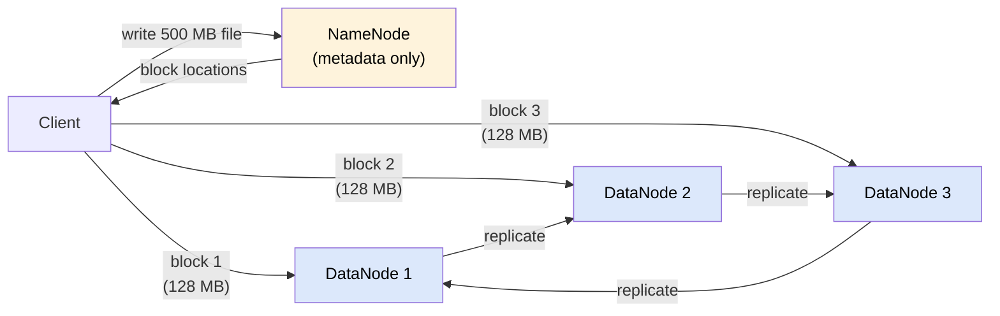
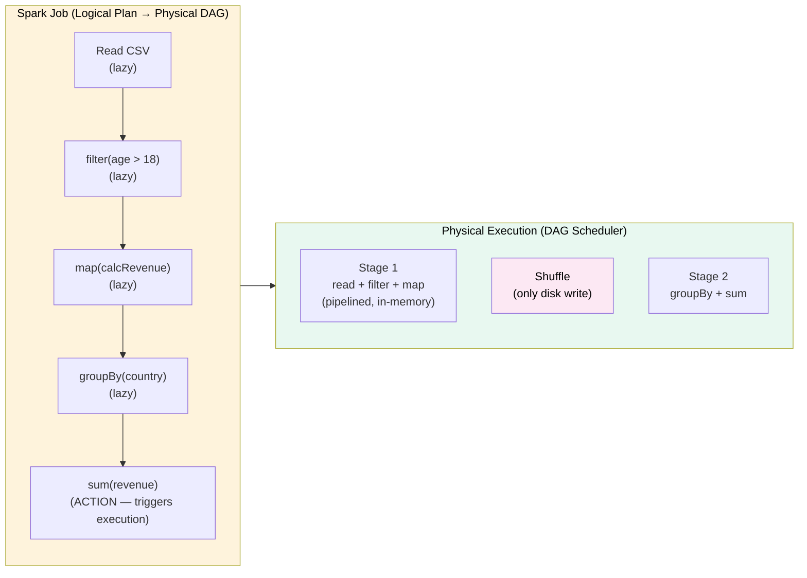

# Batch Processing

> **Batch processing** is the technique of collecting a large, bounded dataset and running a computation over all of it at once — trading immediacy for throughput and simplicity.

---

**Level:** 7 · **Topic:** 1 of 6 · **Prerequisites:** [Level 04 — Distributed Systems](../../Level-04-Distributed-Systems/README.md) · [Level 02 — Data Layer](../../Level-02-Data-Layer/README.md)

---

## 🎯 The Problem

You have 10 years of e-commerce transactions — 50 TB on disk. You need to compute:
- Revenue by product category per month
- Customer lifetime value for every user
- Fraud patterns across billions of events

Running this on a single machine would take weeks. You need to split the work across hundreds of machines, coordinate them reliably, and stitch the results together — without losing data if a node crashes mid-computation.

---

## 🌍 Real-World Analogy

Imagine a giant library needs to count every word across 1 million books. One person would take a lifetime. Instead you:

1. **Split** the books among 1,000 workers (one box each)
2. Each worker **counts words in their box** and hands back a list: `{"the": 3042, "cat": 17, ...}`
3. A **coordinator** collects all lists and **sums the counts** per word: `{"the": 9,400,000, ...}`

That's MapReduce. The library doesn't care that workers are slow or that one drops their box — you just reassign the box.

---

## 🧠 Core Idea

Batch processing has three characteristics:

| Characteristic | Description |
|---------------|-------------|
| **Bounded** | The dataset has a known beginning and end |
| **High throughput** | Optimize for total data volume, not per-record latency |
| **Offline** | Results arrive minutes to hours later — that's acceptable |

The breakthrough insight of **MapReduce** (Google, 2004): if you constrain programs to two functions — `map` and `reduce` — the framework can automatically parallelize, distribute, and fault-tolerate the computation.

---

## 📊 How It Works

### MapReduce: Word Count Example

The classic "hello world" of distributed computing counts word frequencies in a massive text corpus.

**Caption:** Each mapper emits `(key, value)` pairs. The framework groups all values by key (shuffle). Each reducer processes one key's values list. No mapper needs to talk to another — pure parallelism.

### HDFS: Where the Data Lives

Hadoop Distributed File System stores each file split into **128 MB blocks**, replicated 3× across DataNodes. The NameNode tracks the block map. MapReduce jobs run on the same nodes that hold the data — **data locality** means no network transfer for reads.

**Caption:** The NameNode is a single coordinator (with HA standby). DataNodes hold actual bytes. Replication factor of 3 tolerates 2 simultaneous disk failures.

### Apache Spark: MapReduce, Reimagined

Hadoop MapReduce writes intermediate results to disk after every map and reduce step. For iterative algorithms (machine learning, graph processing), this means dozens of disk reads/writes per iteration — painfully slow.

Spark's answer: keep data **in memory** as **Resilient Distributed Datasets (RDDs)** — immutable, partitioned collections that can be recomputed from lineage if a node fails.

**Caption:** Spark builds a DAG of transformations lazily. Only one shuffle (disk write) occurs — between stage 1 and stage 2. Everything else is pipelined in RAM. This is why Spark is 10–100× faster than Hadoop MR for iterative workloads.

---

## 🔧 Types / Variations / Strategies

### ETL vs ELT

| Approach | Transform Where? | Best For |
|----------|-----------------|----------|
| **ETL** (Extract-Transform-Load) | In a separate processing engine before loading | Legacy DWs, strict data contracts |
| **ELT** (Extract-Load-Transform) | Inside the data warehouse after loading | Cloud DWs (BigQuery, Snowflake) with cheap compute |

### Batch Frameworks Comparison

| Framework | Storage | Execution Model | Language | Sweet Spot |
|-----------|---------|-----------------|----------|------------|
| Hadoop MapReduce | HDFS | Disk-based MR | Java | Very large, infrequent jobs |
| Apache Spark | Memory/HDFS/S3 | DAG, in-memory | Scala/Python/Java/R | Iterative ML, fast analytics |
| Apache Hive | HDFS/S3 (columnar) | SQL → MR/Tez | SQL | Ad-hoc analytics by SQL users |
| dbt | DW (BigQuery etc.) | ELT via SQL | SQL + Jinja | Analytics engineering |
| Apache Beam | Pluggable (GCP/AWS) | Unified batch+stream | Python/Java | Portability across runners |

### Partitioning Strategies for Batch Jobs

| Strategy | How | Use When |
|----------|-----|----------|
| **By date** | `output/year=2024/month=01/day=15/` | Time-series; prune old partitions easily |
| **By key range** | Split records A–M and N–Z | Uniform key distribution |
| **Hash partitioning** | `hash(key) % N` → shard N | Even distribution, no hotspots |

---

## 🏢 Real-World Examples

### Google — The Origin Story
Google published the MapReduce paper in 2004 describing how they rebuilt their web index. A single MapReduce job processed **20 TB** of web crawl data across 2,000 machines in under 5 minutes — something previously impossible. The paper spawned Hadoop and the entire big data ecosystem.

### Spotify — Daily Recommendation Pipeline
Spotify runs massive nightly Spark jobs to compute the "Discover Weekly" playlist for 600M+ users. The job ingests hundreds of TB of listening history, computes collaborative filtering signals, and writes personalized playlist seeds — ready before Monday morning. Total runtime: a few hours on thousands of Spark executors.

### Netflix — Spark for Data Science
Netflix processes ~700 billion events per day. Their data science teams use Spark (running on AWS EMR) to train recommendation models, compute A/B test results, and generate content performance dashboards. Jobs that once took 24 hours on Hadoop now finish in under 2 hours on Spark.

---

## ⚖️ Trade-offs

| Pro | Con |
|-----|-----|
| Simple mental model (bounded input → bounded output) | High latency — results arrive hours later, not seconds |
| Extremely high throughput — optimized for data volume | Not suitable for real-time decisions |
| Fault tolerance via re-execution of failed tasks | Resource-intensive; clusters are expensive to run 24/7 |
| Cheap storage (S3, HDFS) as the source of truth | Operational complexity: cluster tuning, shuffle spills |
| Easy to reason about and test offline | Stale data; what you see is always "as of last run" |

---

## ✅ When to Use / ❌ When NOT to Use

**Use batch processing when:**
- You need to process an entire historical dataset (backfills, model retraining)
- Results can be hours stale — nightly reports, dashboards, weekly recommendations
- Throughput matters more than latency
- The dataset is bounded and well-defined
- You're doing complex aggregations that don't need real-time answers

**Do NOT use batch processing when:**
- You need sub-second or sub-minute results (use [stream processing](../02-Stream-Processing/README.md))
- The dataset is unbounded / continuously arriving
- You need to react immediately to an event (fraud detection, alerting)
- The computation is trivially small — batch overhead isn't worth it

---

## ⚠️ Common Pitfalls

1. **Data skew.** One reducer key has 10× more data than others → that one reducer becomes the bottleneck. Fix: salting, custom partitioners.
2. **Shuffle spills to disk.** If intermediate shuffle data exceeds executor memory, Spark spills to disk, killing performance. Fix: increase `spark.executor.memory`, reduce shuffle partitions.
3. **Small files problem.** HDFS/S3 performs poorly with millions of tiny files. Each file = one HDFS block entry, one Spark task. Fix: compact files before processing; use Parquet with large row groups.
4. **Ignoring late data.** Batch jobs with daily partitions silently drop events that arrive after the partition close time. Fix: define a late data window and re-run or merge.
5. **Reprocessing without idempotency.** If a job fails mid-write, partial output can corrupt the partition. Fix: write to a temp location, then atomic rename.

---

## 🎤 Interview Tips

- **"Walk me through MapReduce."** Use the word-count example. Emphasize: map emits (key, value) pairs → framework shuffles/sorts by key → reduce aggregates. Mention data locality.
- **"Why is Spark faster than Hadoop MR?"** Key answer: in-memory RDDs avoid disk I/O between stages; DAG execution pipelines multiple transformations.
- **"When would you NOT use Spark?"** When you need real-time results (stream processing), when the dataset fits in a single machine's memory (just use pandas/DuckDB), or when you need SQL-first ELT (use dbt + BigQuery).
- **"What is a shuffle and why is it expensive?"** A shuffle is when all mappers must send their output across the network to reducers, sorted by key. It involves disk I/O + network transfer — the single biggest bottleneck in distributed batch jobs.
- **Real numbers to cite:** Spark processes at ~50–100 MB/s per core; a 1,000-executor Spark job can sustain ~50 GB/s throughput; Hadoop MR might need 3–5× more time for the same job.

---

## 📝 TL;DR

- **Batch processing** handles large, bounded datasets — throughput over latency.
- **MapReduce:** map (key, value pairs) → shuffle (group by key) → reduce (aggregate). Runs on HDFS with data locality.
- **Apache Spark** is MapReduce's faster successor: in-memory DAG execution, 10–100× faster for iterative workloads.
- **ETL** transforms before loading; **ELT** loads first and transforms inside the warehouse — ELT dominates in cloud architectures.
- Use batch for nightly reports, model training, historical backfills. Use [stream processing](../02-Stream-Processing/README.md) when you need real-time results.

---

## 🧪 Test Yourself

1. In MapReduce word count, what does the **shuffle phase** actually do and why is it necessary?
2. A Spark job processing 10 TB of log data takes 6 hours. You're told it's CPU-bound, not shuffle-bound. What's your first optimization?
3. You have 50 million tiny 1 KB files in S3. Your Spark job takes 3 hours just to start. What's the problem and fix?
4. Your batch ETL job runs every night at 2 AM. Events from 11:58 PM sometimes arrive at 2:05 AM (after the job starts). How do you handle late data?
5. Why does Spark's lazy evaluation model help performance? What triggers actual computation?
6. Describe the difference between ETL and ELT. When would you choose each?

---

## 📚 Further Reading

- [MapReduce: Simplified Data Processing on Large Clusters](https://research.google/pubs/pub62/) — Original Google paper (2004)
- [Apache Spark Documentation](https://spark.apache.org/docs/latest/) — RDDs, DataFrames, DAG scheduler
- [The Google File System](https://research.google/pubs/pub51/) — Foundation for HDFS
- [Designing Data-Intensive Applications](https://dataintensive.net/) — Chapter 10 (Batch Processing) by Martin Kleppmann
- Next: [02 — Stream Processing](../02-Stream-Processing/README.md) — when batch latency is too slow
- Related: [03 — Data Warehouses & Lakes](../03-Data-Warehouses-and-Lakes/README.md) — where batch output lands
