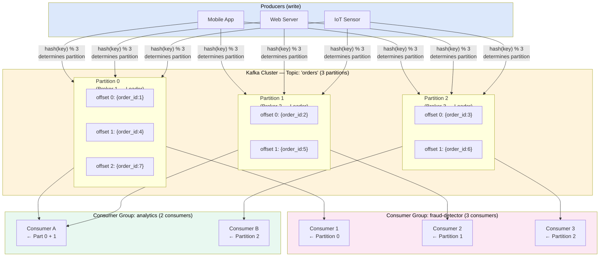
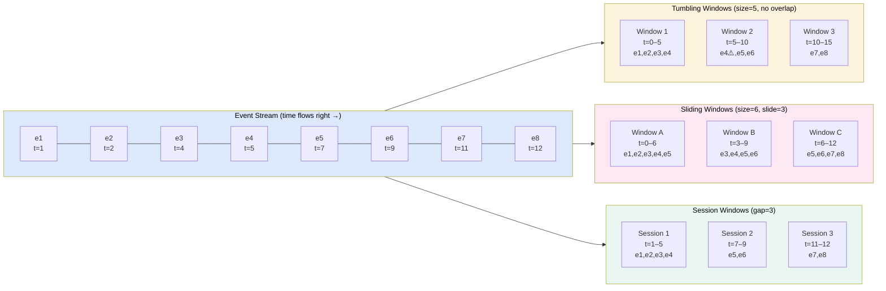
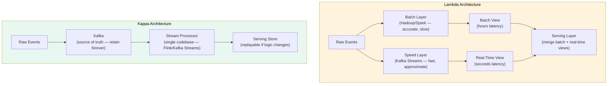

# Stream Processing

> **Stream processing** is the continuous computation over an **unbounded**, ever-arriving stream of data — processing each event (or small batch) as it arrives, rather than waiting to collect everything first.

---

**Level:** 7 · **Topic:** 2 of 6 · **Prerequisites:** [01 — Batch Processing](../01-Batch-Processing/README.md) · [Level 03 — Pub-Sub](../../Level-03-Communication/05-Pub-Sub/README.md) · [Level 04 — Idempotency & Exactly-Once](../../Level-04-Distributed-Systems/07-Idempotency-and-Exactly-Once/README.md)

---

## 🎯 The Problem

Your e-commerce site processes 500,000 orders per minute. You need to:
- Detect fraudulent transactions **within 200 ms** of each order
- Show a real-time dashboard of revenue with **5-second** granularity
- Alert operations if error rates exceed 1% in any **60-second window**

Batch processing runs every hour — that's 59 minutes too late. You need a system that treats data as a **continuous stream**, processes it the moment it arrives, and scales horizontally as traffic grows.

---

## 🌍 Real-World Analogy

Think of a city's traffic management system. A **batch** approach would be: collect all traffic data from midnight to midnight, analyze it the next day, and send updated signal timings the following week. Useless for today's gridlock.

A **stream** approach is like having sensors at every intersection feeding a central computer in real time. The moment a blockage forms on Main St., the computer reroutes signals within seconds. The data never stops — it's unbounded — and decisions must happen in milliseconds.

---

## 🧠 Core Idea

Stream processing rests on three fundamental ideas:

1. **The stream is infinite.** Unlike batch, there's no "end of file." Your system must run forever.
2. **Event time vs. processing time.** An event *happened* at 3:00:01 PM (event time) but arrived at your processor at 3:00:05 PM (processing time). They differ due to network lag, retries, or mobile devices going offline. Getting this right is crucial.
3. **Windows define "done."** Since streams never end, you group events into finite **windows** to compute aggregations.

---

## 📊 How It Works

### Diagram 1 — Apache Kafka: The Distributed Log

Kafka is the most widely used streaming backbone. Its core abstraction is the **commit log** — an immutable, append-only sequence of records.

**Caption:** Kafka topics are split into partitions. Each partition is an ordered, immutable log. Multiple independent consumer groups can read the same topic at their own pace — Kafka retains messages for a configurable retention period (e.g., 7 days), so replaying from any offset is free.

**Key Kafka concepts:**

| Concept | Description |
|---------|-------------|
| **Topic** | A named, ordered stream of records (like a database table) |
| **Partition** | A topic's log is split into N partitions for parallelism; each partition is fully ordered |
| **Offset** | A monotonically increasing integer identifying each record's position within a partition |
| **Consumer Group** | A set of consumers that jointly consume a topic; each partition assigned to exactly one consumer in the group |
| **Retention** | Kafka keeps messages for a configured time (e.g., 7 days) — consumers can replay from any point |
| **Replication** | Each partition has a leader + N-1 followers; leader handles reads/writes, followers replicate |

### Diagram 2 — Windowing: Grouping the Infinite Stream

Since streams never end, we slice time into windows to compute aggregations.

**Caption:** Three window types. Tumbling windows are non-overlapping buckets (hourly reports). Sliding windows overlap — every 3 s, compute the last 6 s (smoothing metrics). Session windows close when activity stops for a configurable gap (user session analytics).

### Late Data & Watermarks

Events arrive out of order. A watermark is the processor's estimate of the current event time: "I believe all events before time T have now arrived." Events arriving after the watermark is past their window are **late data**.

Strategies for late data:
- **Ignore it** (simplest — acceptable if <0.1% of events)
- **Reopen the window** for late events within a grace period
- **Side-output** late events to a separate stream for manual reconciliation

---

## 🔧 Types / Variations / Strategies

### Stream Processing Frameworks

| Framework | Model | State | Exactly-Once | Sweet Spot |
|-----------|-------|-------|-------------|------------|
| **Apache Kafka Streams** | Stream-stream joins, windowing | RocksDB local state | Yes (transactional) | Microservices, simple topologies |
| **Apache Flink** | Stateful stream processing | Distributed snapshots (Chandy-Lamport) | Yes | Complex CEP, low-latency, large state |
| **Spark Structured Streaming** | Micro-batch (default) or continuous | Checkpoints | Yes | Teams already using Spark; near-real-time |
| **Google Dataflow** | Apache Beam runtime | Managed | Yes | GCP-native, fully managed |
| **Amazon Kinesis** | Managed Kafka-like | DynamoDB checkpoints | At-least-once | AWS-native, simple pipelines |

### Lambda vs. Kappa Architecture

These are two competing philosophies for combining batch and stream processing:

| Architecture | Pros | Cons |
|-------------|------|------|
| **Lambda** | Accurate batch view corrects stream approximations | Two codebases (batch + stream) → maintenance nightmare |
| **Kappa** | Single codebase; replay Kafka to recompute | Requires Kafka to retain all data forever; harder for complex batch logic |

**Industry trend:** Kappa is winning. Maintaining two codebases is too costly. Systems like Flink and Kafka Streams are accurate enough that the batch correction layer is rarely needed.

### Exactly-Once in Streams

Getting exactly-once semantics in streams is hard. Three delivery guarantees:

| Guarantee | How | Risk |
|-----------|-----|------|
| **At-most-once** | Fire and forget | Drop events on failure |
| **At-least-once** | Retry until ACK | Duplicates (need idempotent consumers) |
| **Exactly-once** | Distributed transactions + idempotent producers | Higher latency, more complex |

Kafka achieves exactly-once with: **idempotent producers** (sequence numbers deduplicate retries) + **transactional API** (atomic write across partitions) + **consumer offsets committed inside the same transaction**.

See also: [Idempotency & Exactly-Once](../../Level-04-Distributed-Systems/07-Idempotency-and-Exactly-Once/README.md)

---

## 🏢 Real-World Examples

### LinkedIn — Where Kafka Was Born
LinkedIn built Kafka in 2010 to handle their activity streams (page views, likes, messages) — **1.4 trillion messages per day** at peak. The key insight: treat the log as the source of truth. Open-sourced in 2011, it's now the de facto standard for streaming infrastructure. LinkedIn uses Kafka as the backbone connecting 1,000+ microservices.

### Uber — Real-Time Surge Pricing
Uber's **uReplicator** (a Kafka mirroring system) replicates streams across data centers. Flink jobs process GPS location events from millions of drivers to compute supply/demand in each geohash cell every 5 seconds — feeding the surge pricing model. Processing latency: under 100 ms end-to-end.

### Netflix Keystone
Netflix's **Keystone** platform processes **2 trillion+ events per day** — playback quality, A/B test signals, error logs. It uses Kafka as the backbone and Flink for stateful processing. A key use case: if video quality drops for >1% of streams in a region within a 30-second window, Keystone triggers an automatic alert to the CDN operations team within seconds.

---

## ⚖️ Trade-offs

| Pro | Con |
|-----|-----|
| Low latency — react to events in milliseconds | More complex than batch — state management, watermarks, late data |
| Handles unbounded data naturally | Exactly-once is hard; at-least-once is default in many systems |
| Scales horizontally (add partitions/consumers) | Debugging stateful streaming jobs is difficult |
| Kafka retains data — replay is free | Operational cost: Kafka clusters need tuning (retention, replication) |
| Single pipeline can serve multiple consumers | Out-of-order events require careful watermark tuning |

---

## ✅ When to Use / ❌ When NOT to Use

**Use stream processing when:**
- Latency requirements are seconds or less (fraud, alerting, real-time dashboards)
- Data is naturally unbounded (user activity, IoT sensors, logs)
- You need to react to events, not just analyze them
- Multiple downstream systems consume the same event stream

**Do NOT use stream processing when:**
- Results can be hours stale — batch is simpler and cheaper
- You need complex multi-table historical joins across terabytes (use a data warehouse)
- Your team doesn't have expertise to operate Kafka + Flink — operational overhead is real
- The problem is fundamentally bounded (backfill, report generation)

---

## ⚠️ Common Pitfalls

1. **Ignoring event time vs. processing time.** Computing a 1-hour window on processing time instead of event time produces wrong results when events arrive late. Always use event time + watermarks.
2. **Unbounded state growth.** Storing state per user forever — RAM exhaustion. Fix: use time-to-live (TTL) on state, evict stale sessions.
3. **Kafka partition hotspots.** Choosing a poor partition key (e.g., `user_id` but one user generates 90% of events) creates one hot partition. Fix: composite key or random salting.
4. **Not handling consumer group rebalancing.** When a consumer crashes and rejoins, Kafka triggers a rebalance — all consumers pause. Fix: use incremental cooperative rebalancing (Kafka 2.4+).
5. **Conflating stream and table.** A Kafka topic is a stream; a state store (RocksDB in Kafka Streams) is a table. Confusion between the two leads to architectural mistakes.
6. **Undersizing Kafka retention.** If retention is too short and a consumer falls behind, it misses messages. Default 7-day retention is often insufficient for disaster recovery replays.

---

## 🎤 Interview Tips

- **"Explain Kafka's architecture."** Cover: topics → partitions → offsets. Consumer groups: each partition → exactly one consumer. Replication: leader/follower per partition. Retention: consumers can replay.
- **"What are windowing strategies?"** Tumbling (non-overlapping, e.g., hourly reports), sliding (overlapping, e.g., 5-min window every 1 min), session (activity-based).
- **"How does Kafka ensure exactly-once?"** Idempotent producers (sequence IDs) + transactional API (atomic offset commit + output write).
- **"Lambda vs. Kappa?"** Lambda: two codebases (batch accuracy + stream speed). Kappa: one codebase, stream is source of truth, replay Kafka for reprocessing. Kappa is now preferred.
- **"What's a watermark?"** The processor's assertion: "all events before time T have arrived." Events after the watermark for their window = late data.
- **Real numbers:** Kafka sustains ~1 GB/s write throughput per broker; typical production clusters handle billions of messages/day; Flink achieves sub-100 ms end-to-end latency.

---

## 📝 TL;DR

- **Stream processing** handles unbounded, continuously arriving data with low latency.
- **Kafka** is the backbone: immutable partitioned log, consumer groups, offset-based replay, 7-day retention.
- **Windowing** (tumbling/sliding/session) groups infinite streams into finite buckets for aggregations.
- **Watermarks** handle out-of-order events by estimating when a time window is "complete."
- **Exactly-once** requires idempotent producers + transactional commits.
- **Flink** is the leading stateful stream processor; **Kafka Streams** is simpler for microservices.
- **Lambda** (batch + stream) vs **Kappa** (stream only) — Kappa is winning.

---

## 🧪 Test Yourself

1. A sensor sends GPS coordinates every second. You want the average speed in each 1-minute window. What window type do you use, and why?
2. An event has `event_time=14:59:58` but arrives at your Flink job at `15:00:05` — 2 seconds after the 15:00:00 window closed. How do you handle this?
3. Your Kafka topic has 12 partitions. You have a consumer group with 15 consumers. How many consumers are actually doing work? Why?
4. Describe the difference between "at-least-once" and "exactly-once" in Kafka. What mechanisms enable exactly-once?
5. You're computing a rolling count of unique users in the last 5 minutes, updating every 30 seconds. What window type is this? What's the challenge with "unique users"?
6. Why would you choose Kappa over Lambda architecture? What trade-off does Kappa accept?

---

## 📚 Further Reading

- [Kafka: The Definitive Guide](https://www.confluent.io/resources/kafka-the-definitive-guide/) — Free from Confluent
- [Apache Flink Documentation](https://flink.apache.org/docs/stable/) — Especially the "Stateful Stream Processing" section
- [Questioning the Lambda Architecture](https://www.oreilly.com/radar/questioning-the-lambda-architecture/) — Jay Kreps (Kafka creator) on why Kappa is better
- [Designing Data-Intensive Applications](https://dataintensive.net/) — Chapter 11 (Stream Processing) by Martin Kleppmann
- Related: [Bonus 19 — Distributed Message Queue](../../Bonus-Real-World-Architectures/19-Distributed-Message-Queue/README.md)
- Related: [Bonus 20 — Ad Click Aggregator](../../Bonus-Real-World-Architectures/20-Ad-Click-Aggregator/README.md)
- Next: [03 — Data Warehouses & Lakes](../03-Data-Warehouses-and-Lakes/README.md)
