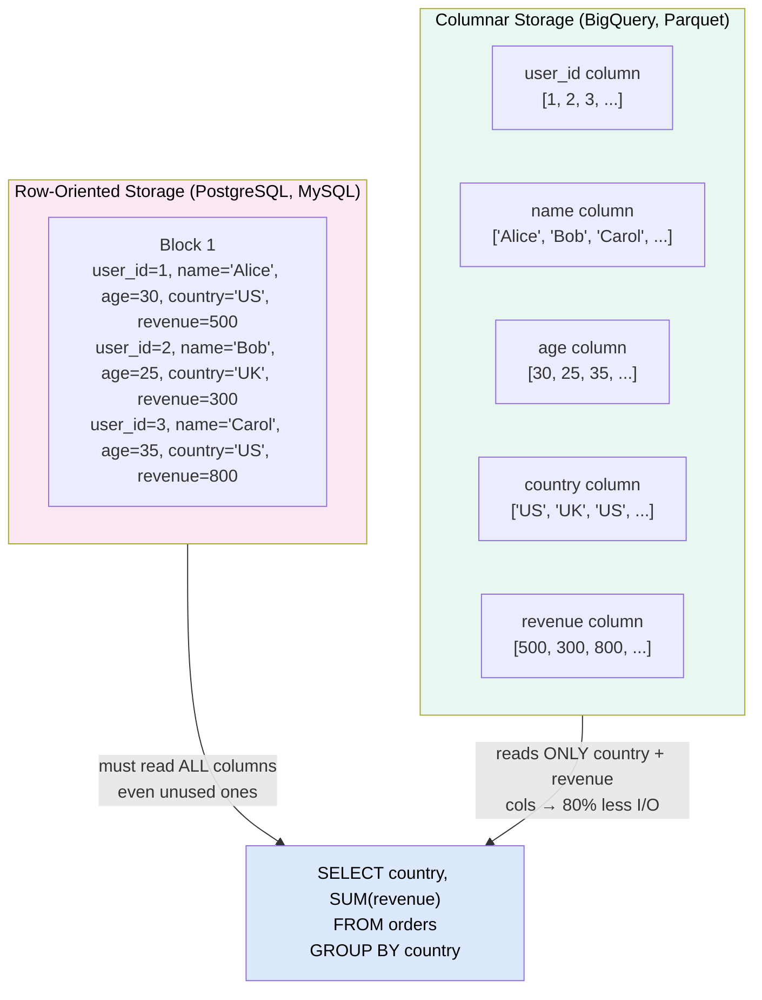
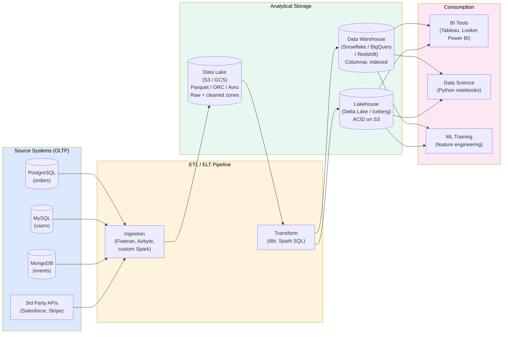
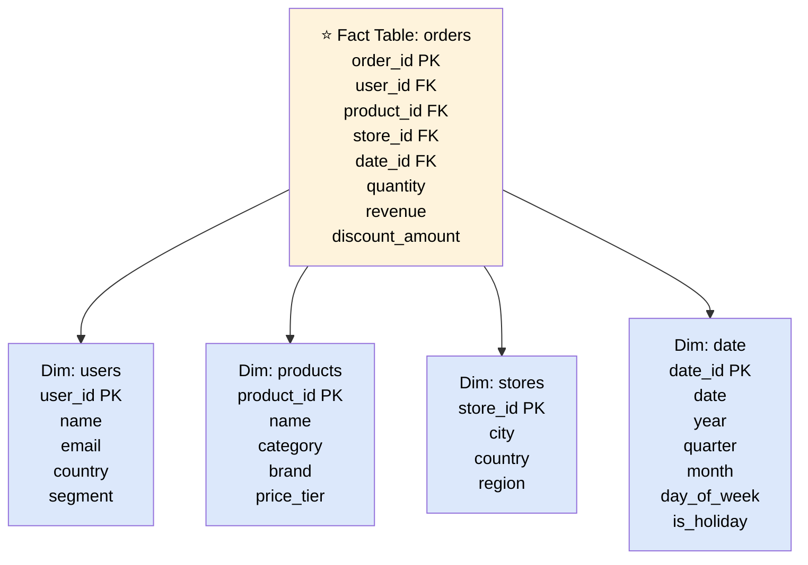

# Data Warehouses & Lakes

> A **data warehouse** is an analytical store optimized for complex read queries over large datasets; a **data lake** is a raw, schema-on-read repository of any data format — together they form the analytics backbone of modern organizations.

---

**Level:** 7 · **Topic:** 3 of 6 · **Prerequisites:** [01 — Batch Processing](../01-Batch-Processing/README.md) · [Level 02 — Data Layer](../../Level-02-Data-Layer/README.md)

---

## 🎯 The Problem

Your operational database (PostgreSQL, MySQL) is excellent at handling thousands of transactions per second — orders, logins, payments. But when your CFO asks "show me revenue by product category, broken down by country, for every day in 2023, compared to 2022" — that query touches **billions of rows**, requires multiple table joins, and would bring your production database to its knees.

You need a separate system designed from the ground up for analytical queries. One that can:
- Scan billions of rows efficiently
- Handle ad-hoc SQL from 500 analysts simultaneously
- Join 50+ tables without dying
- Return results in seconds, not hours

---

## 🌍 Real-World Analogy

Your **operational database** is a convenience store: organized for quick, frequent transactions — grab a coffee, pay, done. Optimized for many small interactions.

A **data warehouse** is a wholesale warehouse like Costco: not designed for individual shoppers, but for bulk operations — loading pallets, scanning entire aisles, analyzing inventory patterns. You don't pop in for a single item; you come with a forklift.

A **data lake** is the warehouse's raw receiving dock: everything arrives — packaged, unpacked, labeled, unlabeled. It's all stored as-is. You figure out structure when you actually need it.

---

## 🧠 Core Idea

The fundamental insight is: **OLTP and OLAP have opposite access patterns**.

| | OLTP | OLAP |
|--|------|------|
| **Queries** | Look up 1 row by primary key | Aggregate millions of rows |
| **Rows touched** | 1–10 per query | Millions–billions |
| **Operations** | INSERT/UPDATE heavy | SELECT heavy |
| **Users** | Application code | Analysts, BI tools |
| **Data freshness** | Real-time | Hours to days |
| **Schema changes** | Frequent | Infrequent |
| **Optimization** | Row-based storage | Columnar storage |

This difference in access patterns drives fundamentally different storage layouts.

---

## 📊 How It Works

### Row Storage vs. Columnar Storage

**Caption:** For the query `SELECT country, SUM(revenue)`, row storage reads every column in every row — including `name` and `age` which are useless. Columnar storage reads only the two needed columns. For a 100-column table with a 2-column query, that's a 98% I/O reduction.

**Additional columnar advantages:**
- **Better compression:** `country` column contains `['US','UK','US','US','UK',...]` — highly repetitive, compresses 10–50×
- **SIMD vectorization:** CPUs can apply `SUM()` to a contiguous array of integers far faster than scattered row data

### The Full Analytics Pipeline

**Caption:** Source systems feed into a data lake (raw storage). Transformations produce clean, modeled data in the warehouse or lakehouse. BI tools and data scientists query the warehouse.

### Dimensional Modeling: Star Schema

Most data warehouses are organized around the **star schema** — a central **fact table** surrounded by **dimension tables**.

**Caption:** Analysts write queries like `JOIN orders ON date WHERE year=2024 GROUP BY category`. The fact table stores numeric measures (revenue, quantity); dimension tables store descriptive attributes. This schema is optimized for ad-hoc slicing and dicing.

---

## 🔧 Types / Variations / Strategies

### Data Warehouse vs. Data Lake vs. Lakehouse

| | Data Warehouse | Data Lake | Lakehouse |
|--|---------------|-----------|-----------|
| **Storage** | Proprietary (Snowflake, Redshift) | Object store (S3, GCS) | Object store (S3) |
| **Schema** | Schema-on-write (defined upfront) | Schema-on-read (flexible) | Schema-on-write (enforced at write) |
| **Format** | Proprietary columnar | Parquet, ORC, Avro, JSON | Open: Delta Lake, Apache Iceberg |
| **ACID** | Yes | No | Yes |
| **Cost** | Expensive (compute bundled) | Cheap storage | Cheap storage + separate compute |
| **Query Speed** | Fast | Slow (no index, no stats) | Fast (metadata + Z-ordering) |
| **Best For** | BI dashboards, SQL analysts | ML training data, raw archive | Both use cases unified |

### Major Platforms

| Product | Type | Key Differentiator |
|---------|------|-------------------|
| **Snowflake** | DW | Separate storage/compute; instant elasticity; any cloud |
| **BigQuery** | DW | Serverless; pay-per-query; built-in ML; Google-scale |
| **Amazon Redshift** | DW | AWS-native; RA3 nodes decouple compute/storage |
| **Databricks / Delta Lake** | Lakehouse | Apache Spark + ACID on S3; open source |
| **Apache Iceberg** | Lakehouse format | Open table format; time travel; any engine |
| **Apache Parquet** | File format | Open columnar format; works with any tool |

### Open File Formats

| Format | Type | Strengths | Weaknesses |
|--------|------|-----------|------------|
| **Parquet** | Columnar | Best compression, universal support | No ACID |
| **ORC** | Columnar | Hive-optimized, good for Spark | Less universal |
| **Delta Lake** | Columnar + ACID | ACID, time travel, schema enforcement | Databricks ecosystem |
| **Apache Iceberg** | Columnar + ACID | Open standard, multi-engine, hidden partitioning | Newer, less tooling |
| **Avro** | Row-based | Schema evolution, good for Kafka serialization | Poor for analytics |

---

## 🏢 Real-World Examples

### Airbnb — Data Warehouse at Scale
Airbnb migrated from a single-node Hive cluster to a distributed data warehouse serving 1,000+ analysts. Their **Minerva** framework enforces a single source of truth for metrics — `bookings`, `revenue`, `host_satisfaction_score` — defined once in code (using dbt-like transformations) and reused everywhere. This eliminated metric inconsistency across dashboards.

### Netflix — BigQuery + S3 Lakehouse
Netflix processes **700 billion events per day**. Raw events land in S3 (Parquet). A subset is loaded into BigQuery for ad-hoc SQL by 2,000+ internal users. Critical metrics (A/B test results, content performance) are computed via Spark on the S3 lake. The two-tier approach gives them both cheap storage and fast SQL.

### Snowflake — The "Multi-Cluster Shared Data" Architecture
Snowflake's key innovation: storage (S3) and compute (virtual warehouses) are completely separate. You can spin up 100 concurrent SQL query engines against the same data without them contending. Shopify runs 300+ virtual warehouses against a single Snowflake storage layer — different teams get isolated compute at different sizes (S, M, L) without sharing resources.

---

## ⚖️ Trade-offs

| Pro | Con |
|-----|-----|
| Columnar storage → 10–100× faster analytics queries | Not suited for OLTP (slow row-level inserts/updates) |
| Separation of storage/compute (Snowflake, BigQuery) → elastic cost | Data latency: warehouse data is typically 1–24 hours behind production |
| SQL interface accessible to non-engineers | Schema changes require re-modeling and ETL updates |
| Handles petabyte-scale queries (BigQuery: no index needed) | Expensive at scale; BigQuery charges per TB scanned |
| Data lake: cheap raw storage for all data | Data lake without governance = "data swamp" |
| Lakehouse: best of both worlds | Lakehouse is newer, tooling still maturing |

---

## ✅ When to Use / ❌ When NOT to Use

**Use a data warehouse when:**
- Analysts need fast SQL over historical data
- You're building dashboards and BI reports
- Data arrives in well-understood, structured formats
- ACID transactions and data quality matter

**Use a data lake when:**
- You need to store raw, semi-structured, or unstructured data (logs, JSON, images)
- Data consumers are data scientists, not SQL analysts
- You need cheap long-term archival
- Schema is uncertain — you'll define it when you query

**Use a lakehouse when:**
- You need both SQL analytics (BI) and ML training (Python) over the same data
- You want ACID on cheap object storage
- You're starting fresh and can use Iceberg or Delta Lake from day one

**Do NOT use any of these for:**
- Your production transactional workload (use PostgreSQL, MySQL, DynamoDB)
- Sub-second query responses for end users (use Elasticsearch, Redis)
- Streaming/real-time analytics (use Flink + Kafka — see [Topic 02](../02-Stream-Processing/README.md))

---

## ⚠️ Common Pitfalls

1. **Querying the OLTP database for analytics.** Joining 5 tables across 100M rows on your production Postgres → killing user-facing latency. Always build a separate analytics system.
2. **The data swamp.** Dumping everything into S3 with no schema registry, no naming conventions, no ownership — nobody knows what's there or if it's correct. Fix: data catalog (AWS Glue, Apache Atlas) + column-level metadata.
3. **Ignoring data freshness SLAs.** Analysts think data is real-time but ETL runs once daily. Document and display data freshness on every dashboard.
4. **Star schema anti-patterns.** Putting too many attributes in the fact table ("snowflake schema gone wrong") → slow queries that can't use columnar pruning. Keep fact tables narrow.
5. **Cost shock in BigQuery.** A poorly written query that scans 100 TB accidentally costs ~$500. Fix: partition pruning, column selection, query cost estimates before running.
6. **Not partitioning the data lake.** Querying 5 years of Parquet files without `WHERE year=2024` causes a full scan of petabytes. Always partition by time + key fields.

---

## 🎤 Interview Tips

- **"Why not just use Postgres for analytics?"** Row storage → must read all columns even for `SELECT country, SUM(revenue)`. Index lookups work for OLTP (1 row), not OLAP (millions of rows). Columnar storage + compression makes analytics 10–100× faster.
- **"Explain columnar storage."** Data stored column-by-column, not row-by-row. Query only reads the columns it needs. Same-type data compresses much better. Enables SIMD vectorized operations.
- **"What's a star schema?"** Fact table (metrics: revenue, quantity) surrounded by dimension tables (who: user, what: product, when: date, where: location). Optimized for GROUP BY / aggregation queries.
- **"Data lake vs. data warehouse vs. lakehouse?"** Lake: raw, cheap, schema-on-read. Warehouse: structured, fast SQL, schema-on-write. Lakehouse: ACID + open formats on object storage — combines both.
- **Real numbers:** BigQuery scans ~1 TB/s; Snowflake can scale to 1,000s of concurrent queries; Parquet achieves 10:1 compression on typical analytical data.

---

## 📝 TL;DR

- **OLTP** is for transactions (row storage, many small writes); **OLAP** is for analytics (columnar storage, few large scans).
- **Columnar storage** reads only needed columns → 10–100× less I/O → faster queries + better compression.
- **Data warehouse** (Snowflake, BigQuery, Redshift): structured, SQL, fast, schema-on-write.
- **Data lake** (S3 + Parquet): cheap raw storage, schema-on-read, ML-friendly.
- **Lakehouse** (Delta/Iceberg): ACID transactions + columnar on object storage — best of both.
- **Star schema**: narrow fact table (metrics) + wide dimension tables (attributes) = optimal for GROUP BY analytics.

---

## 🧪 Test Yourself

1. Your analytics query is `SELECT country, SUM(revenue) FROM orders GROUP BY country`. Explain why columnar storage is dramatically faster than row storage for this query.
2. What's the difference between a data lake and a data warehouse? When would you choose each?
3. You're designing a data model for an e-commerce warehouse. Identify the fact table and at least 3 dimension tables. What columns go in each?
4. A data scientist complains the data lake is a "data swamp." What organizational and technical steps would you take to fix it?
5. Snowflake separates compute and storage. What concrete benefit does this give a company with 300 analysts?
6. What is "schema-on-read" vs. "schema-on-write"? Which does a data lake use and why is that useful for raw data?

---

## 📚 Further Reading

- [The Data Warehouse Toolkit](https://www.kimballgroup.com/data-warehouse-business-intelligence-resources/books/data-warehouse-dw-toolkit/) — Ralph Kimball; the bible of dimensional modeling
- [Designing Data-Intensive Applications](https://dataintensive.net/) — Chapter 3 (Storage Engines) and Chapter 10
- [Delta Lake Documentation](https://docs.delta.io/) — ACID on S3
- [Apache Iceberg Documentation](https://iceberg.apache.org/docs/latest/) — Open lakehouse table format
- [BigQuery Under the Hood](https://cloud.google.com/blog/products/bigquery/in-memory-query-execution-in-google-bigquery) — Dremel paper
- Previous: [02 — Stream Processing](../02-Stream-Processing/README.md)
- Next: [04 — Search Systems](../04-Search-Systems/README.md)
