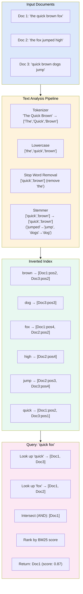
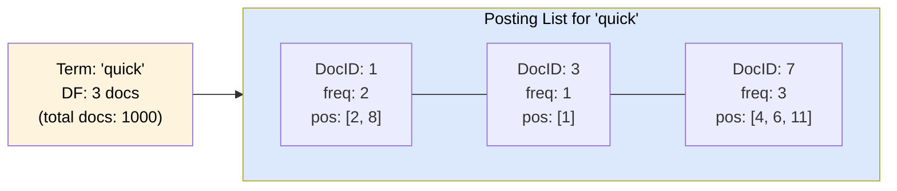
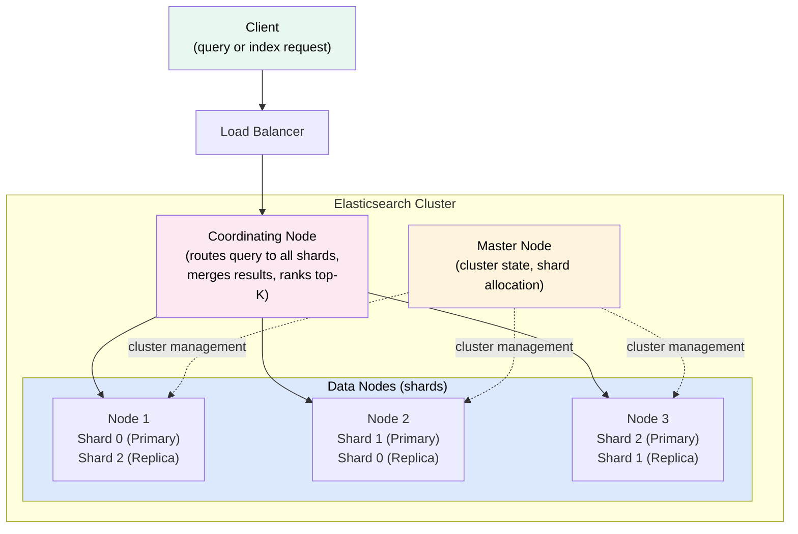

# Search Systems

> A **search system** enables users to find relevant documents from a massive corpus using natural language queries — powered by an **inverted index** that maps terms to the documents containing them, ranked by relevance.

---

**Level:** 7 · **Topic:** 4 of 6 · **Prerequisites:** [Level 02 — Sharding & Partitioning](../../Level-02-Data-Layer/02-Sharding-and-Partitioning/README.md) · [Level 04 — Distributed Systems](../../Level-04-Distributed-Systems/README.md) · [03 — Data Warehouses & Lakes](../03-Data-Warehouses-and-Lakes/README.md)

---

## 🎯 The Problem

GitHub hosts 420 million repositories. When you search for `"merge sort javascript"`, you expect:
- Results in **under 200 ms**
- Relevant files ranked by importance, not random order
- Results across **all 420 million repos** (petabytes of code)
- Partial matches and typo tolerance

A traditional database `WHERE content LIKE '%merge sort%'` would scan every row in every table — impossible at this scale. You need a data structure specifically designed for text search.

---

## 🌍 Real-World Analogy

Before Google, finding information in a library meant reading every book's index pages in the back — each book had an "index" listing which pages mentioned specific terms. A search engine is like hiring 10,000 librarians to **pre-read every book**, build a master index across all of them, and file it by term:

> "the word 'merge' appears on: Book A pg.5, Book C pg.12, Book D pg.3"
> "the word 'sort' appears on: Book A pg.5, Book B pg.8, Book D pg.3"

When you search `"merge sort"`, they instantly look up both entries, find Book A pg.5 and Book D pg.3 appear in both lists → those pages are the results. That master index is the **inverted index**.

---

## 🧠 Core Idea

Two phases define a search system:

1. **Indexing** (offline): Process every document → extract terms → build the inverted index. This is expensive but done once (and incrementally on updates).

2. **Querying** (online): Look up query terms in the index → retrieve posting lists → intersect/union them → rank by relevance → return top-K results. Must be fast (< 100 ms).

The key insight: **do expensive work at index time so query time is fast**.

---

## 📊 How It Works

### Building and Querying an Inverted Index



**Caption:** Indexing transforms raw text → normalized terms → posting lists. Each entry in the index is a term mapping to a **posting list** — the list of document IDs (and optionally positions) where that term appears. Query time intersects posting lists to find documents matching all terms.

### The Posting List in Detail



**Caption:** Each posting stores: `DocID` (which document), term frequency `TF` (how often the term appears in that doc), and optionally positions (for phrase queries like `"quick brown fox"`). `DF` = document frequency = how many docs contain this term (used for IDF calculation).

### Ranking: From TF-IDF to BM25

**TF-IDF** (Term Frequency–Inverse Document Frequency):
```
TF(t, d)  = count of term t in document d / total terms in d
IDF(t)    = log(total docs / docs containing t)
Score     = TF(t,d) × IDF(t)
```

**Why IDF?** Common words like "the" appear in every document. If `DF = total docs`, then `IDF = log(1) = 0` → common words get zero weight. Rare, specific terms get high weight.

**BM25** (Best Match 25) — the modern standard:
```
BM25(t, d) = IDF(t) × [TF(t,d) × (k1+1)] / [TF(t,d) + k1×(1 - b + b×|d|/avgDL)]
```

Where:
- `k1` ∈ [1.2, 2.0] — controls term frequency saturation (doubling TF doesn't double score)
- `b` = 0.75 — controls document length normalization (long docs shouldn't dominate)
- `|d|` = document length; `avgDL` = average document length in corpus

**Worked example** — 1000 documents, query "quick fox", Doc1 has both terms:
- `IDF("quick")` = log(1000/50) = 3.0 (appears in 50 docs → somewhat rare)
- `IDF("fox")` = log(1000/10) = 4.6 (appears in only 10 docs → rare → high weight)
- Doc1 scores higher on "fox" than "quick" — fox is a better discriminating term.

---

## 🔧 Types / Variations / Strategies

### Text Analysis Components

| Component | What It Does | Example |
|-----------|-------------|---------|
| **Tokenizer** | Split text into tokens | `"New York City"` → `["New", "York", "City"]` |
| **Lowercase filter** | Normalize case | `"Quick"` → `"quick"` |
| **Stop word filter** | Remove common words | Remove "the", "a", "is" |
| **Stemmer** | Reduce to root form | `"running"` → `"run"`, `"dogs"` → `"dog"` |
| **Lemmatizer** | Linguistic root form | `"better"` → `"good"` (smarter than stemmer) |
| **Synonym filter** | Expand terms | `"car"` → also match `"automobile"` |
| **N-gram tokenizer** | Substrings for autocomplete | `"apple"` → `"ap","app","appl","apple"` |
| **Edge n-gram** | Prefix matching | `"apple"` → `"a","ap","app","appl","apple"` |

### Elasticsearch Architecture



**Caption:** A query hits the coordinating node, which fans out to all primary shards in parallel. Each shard returns its local top-K results. The coordinator merges all partial results, re-ranks globally, and returns the final top-K. This is the "scatter-gather" pattern.

### Sharding a Search Index

| Strategy | How | Trade-off |
|----------|-----|-----------|
| **By document ID** (hash) | `hash(doc_id) % N_shards` | Uniform distribution; can't prune shards |
| **By time** | Shard per day/month | New queries hit recent shards only; old shards are cold |
| **By tenant** | One index per customer | Isolation; too many small indices cause overhead |

### Query Types

| Query Type | Use Case | Example |
|------------|----------|---------|
| **Full-text (match)** | Analyze + score | `"quick brown fox"` |
| **Exact term** | Keyword, ID lookups | `status: "active"` |
| **Range** | Dates, numbers | `price: [10 TO 50]` |
| **Phrase** | Word order matters | `"New York"` (not "York New") |
| **Fuzzy** | Typo tolerance | `"recieve"` matches `"receive"` (edit distance 2) |
| **Wildcard** | Pattern matching | `"quick*"` matches `"quicksort"` |
| **Aggregation** | Facets, analytics | Count by category, date histogram |

---

## 🏢 Real-World Examples

### Elasticsearch at Uber
Uber uses Elasticsearch to power their internal trip search — finding any of 15 billion+ historical trips by rider, driver, city, status, date range. The index contains **100+ TB** of data across 100+ shards. Key insight: they use time-based indices (one index per month) and alias them — querying recent data hits only recent shards, so most searches scan <10% of the total index.

### GitHub Code Search
GitHub rebuilt their code search in 2023 using a custom engine (Zoekt, a trigram-based code search engine). They index **45 million repositories**, ~100 TB of code. Unlike prose, code search needs exact substring matches (`strncmp` should match exactly), not stemming. They chose trigram indexing (breaking code into 3-char sequences) over traditional term-based indexing to handle code's unique characteristics (symbols, operators, case-sensitivity).

### Algolia
Algolia is a hosted search service processing **1.75 trillion search queries per year**. Their key differentiator: sub-10 ms latency for autocomplete, achieved by storing the entire index in RAM (memory-mapped, never touching disk for hot queries), and pre-building prefix trees on every attribute. They serve 10,000+ companies including Twitch and Medium.

---

## ⚖️ Trade-offs

| Pro | Con |
|-----|-----|
| Sub-100 ms full-text search over billions of documents | Index size can be 2–5× the source data size |
| Relevance ranking (BM25) beats `LIKE '%query%'` dramatically | Near-real-time indexing (not true real-time — 1 second refresh default in ES) |
| Scales horizontally via sharding + replication | Joins are hard — Elasticsearch is not relational |
| Flexible schema — add new fields without migration | Consistency trade-offs: distributed search is eventually consistent |
| Rich query DSL: fuzzy, range, aggregations | Operational complexity: tuning heap size, shard counts, refresh intervals |

---

## ✅ When to Use / ❌ When NOT to Use

**Use a search system when:**
- Users type natural language queries over text content
- Relevance ranking matters (not just filtering)
- You need fuzzy matching, autocomplete, typo tolerance
- The dataset is large (millions+ documents)
- You need full-text search + filters + aggregations in one query

**Do NOT use Elasticsearch when:**
- You need strong consistency and ACID transactions (use PostgreSQL)
- Your queries are simple key-value lookups (use Redis or a database)
- You're doing analytics over structured data (use a data warehouse)
- You need vector/semantic search (use pgvector or a vector database — see [Topic 05](../05-Recommendation-and-ML-Systems/README.md))

---

## ⚠️ Common Pitfalls

1. **Too many shards.** Elasticsearch recommends shards of 10–50 GB each. 1,000 shards of 1 GB each wastes resources (each shard is a Lucene index with overhead). Fix: fewer, larger shards.
2. **Mapping explosion.** Indexing dynamic JSON with arbitrary keys → thousands of field mappings → out-of-memory errors. Fix: use `dynamic: "strict"` to reject unknown fields.
3. **Not setting a refresh interval.** Default refresh (1 s) triggers frequent segment merges, slowing indexing. Fix: during bulk loads, set `refresh_interval: -1`, then trigger manually at the end.
4. **Over-fetching in scatter-gather.** Each shard returns top-1000 results; coordinator re-ranks 1000 × N_shards results. With 100 shards, that's 100,000 results to merge. Fix: use `search_type=dfs_query_then_fetch` for accuracy, or reduce `from+size` depth.
5. **Stemming English text for code.** Stemming `"running"` to `"run"` is great for prose but disastrous for code — `"running_total"` should not match `"run_total"`. Always use a separate analyzer for code.
6. **Forgetting to warm up replicas.** After a restart, replicas have cold OS page cache — first queries are slow. Fix: pre-warm by running key queries against replicas on startup.

---

## 🎤 Interview Tips

- **"How does an inverted index work?"** Build it from scratch: tokenize → normalize → store (term → [(docID, freq, positions)]). Walk through the word-count example. Show intersection of posting lists for multi-term queries.
- **"What's TF-IDF? Why BM25?"** TF-IDF: term frequency × inverse document frequency. Problem: doubling TF doubles score infinitely. BM25 adds saturation (k1) and length normalization (b) — more realistic and outperforms TF-IDF on benchmarks.
- **"How does Elasticsearch scale?"** Sharding (distributes data), replication (availability + read throughput), coordinating node (scatter-gather). Each shard is a self-contained Lucene index.
- **"How does autocomplete work?"** Edge n-gram tokenizer at index time: `"apple"` → `["a","ap","app","appl","apple"]`. Query-time prefix match against edge n-grams. Returns results in < 5 ms from a hot index.
- **"Elasticsearch vs. a database search?"** DB: `LIKE '%fox%'` = full table scan, no ranking, O(n). ES: inverted index = O(log n) lookup + posting list intersection, BM25 ranking. Incomparable at scale.
- **Related reading:** [Bonus 22 — Google Search Architecture](../../Bonus-Real-World-Architectures/22-Google-Search/README.md)

---

## 📝 TL;DR

- **Inverted index**: maps term → list of documents containing it. Built offline; queried online in milliseconds.
- **Text analysis**: tokenize → lowercase → remove stop words → stem → build posting lists.
- **TF-IDF** scores by term rarity × term frequency. **BM25** adds saturation and length normalization — the modern standard.
- **Elasticsearch/OpenSearch**: Lucene-based, horizontally scalable, scatter-gather across shards.
- **Sharding** distributes the index; **replication** ensures availability and read throughput.
- For autocomplete: edge n-gram indexing enables sub-millisecond prefix matching.

---

## 🧪 Test Yourself

1. Walk through building an inverted index for these three documents: "dog bites man", "man bites dog", "dog bites dog". Show the posting lists.
2. A search for "running" returns documents about "running shoes" but not "runner's high." How would stemming fix this? What's the risk?
3. You have an Elasticsearch index with 500 shards of 100 MB each (50 GB total). Performance is poor. What's wrong and how do you fix it?
4. Explain BM25's document length normalization. Why does it help vs. raw TF-IDF?
5. A user types "recive" (typo for "receive"). How does fuzzy search work? What is "edit distance"?
6. You want to implement autocomplete for a search box that shows results after each keystroke. What Elasticsearch feature do you use and how does it work?

---

## 📚 Further Reading

- [Elasticsearch: The Definitive Guide](https://www.elastic.co/guide/en/elasticsearch/guide/current/index.html) — Free online; covers inverted index, analysis, mapping
- [Apache Lucene](https://lucene.apache.org/) — The engine under Elasticsearch and OpenSearch
- [BM25 Paper](https://dl.acm.org/doi/10.1561/1500000019) — "Probabilistic Relevance Models" by Robertson & Zaragoza
- [GitHub's Code Search Explained](https://github.blog/2023-02-06-the-technology-behind-githubs-new-code-search/) — How they rebuilt at 45M repo scale
- Related: [Bonus 22 — Google Search](../../Bonus-Real-World-Architectures/22-Google-Search/README.md)
- Next: [05 — Recommendation & ML Systems](../05-Recommendation-and-ML-Systems/README.md) — where vector search meets inverted index
