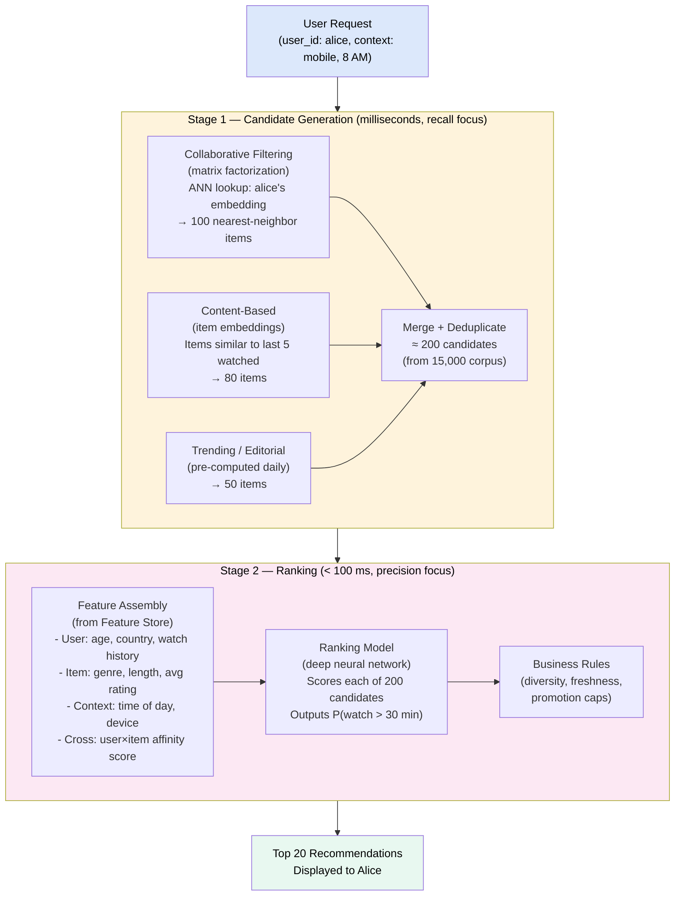
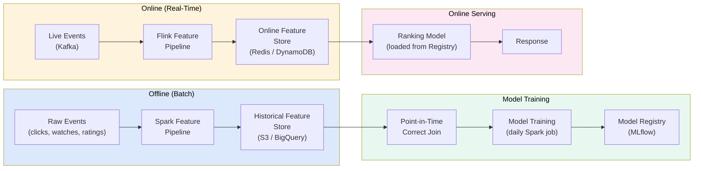

# Recommendation & ML Systems

> A **recommendation system** predicts what a user will find relevant — content, products, people — by learning patterns from historical behavior; modern systems use a **two-stage architecture** (fast candidate generation → precise ranking) to serve personalized results at scale.

---

**Level:** 7 · **Topic:** 5 of 6 · **Prerequisites:** [04 — Search Systems](../04-Search-Systems/README.md) · [01 — Batch Processing](../01-Batch-Processing/README.md) · [02 — Stream Processing](../02-Stream-Processing/README.md)

---

## 🎯 The Problem

Netflix has 250 million subscribers and 15,000+ titles. When Alice logs in on Monday morning, she should see the 20 most relevant titles *for her, right now* — not just popular titles, and not just what she's watched before.

The brute-force approach — score all 15,000 titles against Alice's preferences using a complex ML model — takes 500 ms per title × 15,000 = 7,500 seconds. That's 2+ hours, not an acceptable homepage load time.

You need a system that can:
- Reduce 15,000 → ~200 candidates in milliseconds (retrieval)
- Precisely rank those 200 using rich features in < 100 ms (ranking)
- Retrain models continuously as user preferences shift
- Handle 250 million users simultaneously

---

## 🌍 Real-World Analogy

Think of a high-end bookstore with a personal shopper service.

**Candidate generation** = the shopper goes to the back warehouse and quickly pulls 50 books you *might* like based on a rough profile: "she likes mysteries and reads fast."

**Ranking** = the shopper then carefully examines those 50 books — checking your exact reading history, the time of day, what you bought last week, current bestsellers — and arranges the top 10 on the display table.

You only see the final 10, but behind the scenes were two completely different processes with very different time budgets.

---

## 🧠 Core Idea

Modern recommendation at scale requires three architectural shifts:

1. **Two stages, not one.** Cheap retrieval over billions → expensive ranking over hundreds. Each stage uses different models with different latency budgets.
2. **Embeddings as a universal language.** Users, items, and contexts all get compressed into vectors in a shared mathematical space. Similarity = relevance.
3. **Offline training, online serving.** Models train on yesterday's data (batch), but serve predictions today (milliseconds). Feature stores bridge the gap.

---

## 📊 How It Works

### Recommendation Approaches

**Collaborative Filtering (CF):** "Users like you also liked..."
- Find users with similar taste (user-based CF)
- Or find items that co-occur in similar users' histories (item-based CF)
- Matrix factorization: decompose the user×item rating matrix into lower-dimensional embeddings

**Content-Based Filtering:** "Because you liked X, here's more like X"
- Use item features (genre, director, runtime) to find similar items
- Does not need other users' data → solves cold start for new items

**Hybrid (Production Standard):** Combine both, plus contextual signals (time, device, location, trending).

### The Two-Stage Recommender Architecture

**Caption:** Stage 1 is about recall — get relevant candidates cheaply. Multiple retrieval sources run in parallel. Stage 2 is about precision — rank those candidates using expensive features and a deep model. The 15,000→200→20 funnel makes the whole thing feasible in under 200 ms.

### Embeddings & Vector Similarity (ANN)

An **embedding** is a dense vector representation (e.g., 128 dimensions) learned from behavior:
- Users who watch similar shows get similar embeddings
- Items that are co-watched get similar embeddings
- "Similarity" = cosine similarity or dot product between vectors

**Approximate Nearest Neighbor (ANN):** Finding the 100 closest vectors to Alice's embedding among 15 million items in < 5 ms requires specialized indexes:

| Algorithm | How | Library |
|-----------|-----|---------|
| **HNSW** (Hierarchical Navigable Small World) | Graph-based; navigate a multi-layer graph | `hnswlib`, Elasticsearch `knn`, Weaviate |
| **IVF** (Inverted File Index) | Cluster vectors; search only nearby clusters | `faiss` (Facebook AI) |
| **LSH** (Locality Sensitive Hashing) | Hash similar vectors to same buckets | ScaNN (Google) |

Trade-off: ANN is not exact — it may miss 1-5% of the true nearest neighbors. Acceptable for recommendations (top-100 candidates don't need to be perfectly optimal).

### Feature Stores

Features used at serving time (online) must also be available at training time (offline). Without a feature store, teams recompute features differently in training vs. serving → **training-serving skew** (the #1 cause of production ML failures).

**Caption:** The feature store is the bridge. Offline features (historical averages, long-term preferences) are computed in batch and stored in S3. Online features (last 5 clicks, current session) are computed in Flink and served from Redis. Training uses offline features; serving uses online features — both use the same pipeline definitions.

---

## 🔧 Types / Variations / Strategies

### Recommendation Approach Comparison

| Approach | Data Needed | Cold Start Problem | Accuracy | Scalability |
|----------|-------------|-------------------|----------|-------------|
| **User-Based CF** | User-item ratings matrix | New users have no history | High for active users | Poor (O(users²) similarity) |
| **Item-Based CF** | User-item ratings matrix | New items have no history | High, stable | Good (item space < user space) |
| **Matrix Factorization (MF)** | Ratings/interactions | Both cold start issues | Very high | Excellent (offline training) |
| **Content-Based** | Item features | No new-item problem | Medium | Good |
| **Two-Tower Neural** | Interactions + features | Mitigated by features | Very high | Excellent (offline embedding) |
| **Hybrid** | All of the above | Partially mitigated | Best | Excellent |

### The ML System Lifecycle

```mermaid
flowchart LR
    DATA["Data Collection<br/>(logs, clicks, ratings)"] --> PREP["Data Prep<br/>(label, split train/val/test)"] --> TRAIN["Model Training<br/>(Spark, PyTorch, TF)"] --> EVAL["Offline Evaluation<br/>(NDCG, Precision@K)"]
    EVAL -->|"passes threshold"| DEPLOY["Model Deployment<br/>(shadow → canary → 100%)"]
    DEPLOY --> SERVE["Online Serving<br/>(model server, feature store)"]
    SERVE --> MONITOR["Monitoring<br/>(prediction drift, CTR, coverage)"]
    MONITOR -->|"model decay detected"| DATA

    style DATA fill:#dce8fb,color:#000
    style PREP fill:#fef3dc,color:#000
    style TRAIN fill:#e8f8f0,color:#000
    style EVAL fill:#fce8f3,color:#000
    style DEPLOY fill:#fef3dc,color:#000
    style SERVE fill:#dce8fb,color:#000
    style MONITOR fill:#fce8f3,color:#000
```

### Handling the Cold Start Problem

| Scenario | Problem | Solutions |
|----------|---------|-----------|
| **New user** | No interaction history | Ask onboarding questions; use demographic-based defaults; promote popular items |
| **New item** | No co-occurrence data | Use item content features (genre, description embeddings); cross-encoder similarity to existing items |
| **New platform** | No data at all | Bootstrap with editorial picks; grow interaction data quickly |

---

## 🏢 Real-World Examples

### Netflix — Personalized Everything
Netflix's recommendation system is responsible for **80% of content watched** (vs. 20% from search). Their architecture uses a two-stage system: matrix factorization generates candidate embeddings (stored in Annoy ANN index), a deep neural network ranks candidates using 100+ features. Key insight: they optimize for *long-term engagement* (did the user enjoy the title?), not just clicks. A/B testing is central — every model change is tested on a segment before full rollout.

### YouTube — Watch Next at 2 Billion Users
YouTube's recommendation paper (2016, "Deep Neural Networks for YouTube Recommendations") described the two-stage architecture that became the industry blueprint. **Candidate generation:** a two-tower model maps user and video into a shared embedding space; ANN retrieves top-200 candidates from 20 million+ videos. **Ranking:** a deep network with 1 billion+ parameters scores those 200 using watch time, likes, comments, and engagement history. They explicitly optimize for *watch time*, not just click-through rate, to reduce clickbait.

### Spotify — Discover Weekly
Spotify computes Discover Weekly for 600M+ users every Monday using collaborative filtering on implicit feedback (streams, saves, playlist adds). They run a massive Spark job to decompose the 600M × 100M track matrix using matrix factorization (NMF). The resulting 128-dimensional user/track embeddings power both Discover Weekly and "Because You Listened To..." recommendations. They also use audio embeddings (spectral features from raw audio) for new tracks with no history — solving the new-item cold start.

### TikTok — Interest Graph Over Social Graph
Unlike Instagram (social graph: follow people you know), TikTok optimizes purely for engagement on each video — even from creators you've never heard of. Their recommendation models rapidly converge on user preferences (within ~10 videos of a new session) using strong real-time signals (watch completion rate, replays, shares). Each video gets a fresh score per user per session — no long-term stale preferences.

### Amazon — "Customers Who Bought This Also Bought"
Amazon pioneered item-based collaborative filtering in 1998. Their key innovation: instead of user-user similarity (expensive: O(users²)), compute item-item similarity offline (items co-purchased together). At query time for any product, retrieve precomputed similar items from a lookup table — O(1). Simple, scalable, and still used 25 years later.

---

## ⚖️ Trade-offs

| Pro | Con |
|-----|-----|
| Dramatically increases engagement (Netflix: 80% of watches) | Training-serving skew is the #1 source of bugs — hard to detect |
| Two-stage approach makes billion-scale feasible | Cold start problem for new users/items |
| Embeddings enable fast ANN retrieval | ANN is approximate — may miss truly relevant items |
| Feature stores ensure consistent features across training/serving | Feature stores are complex to build and maintain |
| Online/offline split allows expensive models to run offline | Model staleness — user preferences shift faster than daily retraining |
| A/B testing enables safe model improvements | Feedback loop / filter bubble: over-recommending narrow niches |

---

## ✅ When to Use / ❌ When NOT to Use

**Use a recommendation system when:**
- Your catalog is large enough that users can't browse everything
- You have behavioral data (clicks, watches, purchases, ratings)
- Personalization measurably increases engagement or revenue
- You have the engineering resources to build and maintain ML pipelines

**Do NOT over-engineer recommenders when:**
- You have < 10,000 items — a simple popularity list is often fine
- You have < 100,000 users — you don't have enough signal for CF
- You lack behavioral data — content-based is limited without interactions
- Explainability is required (regulated industries) — deep neural networks are black boxes

**Simpler approaches that work surprisingly well:**
- "Most popular in your category" (zero ML required)
- "Recently released + high rating" (simple heuristic)
- User-specified preferences (ask users what they like)

---

## ⚠️ Common Pitfalls

1. **Training-serving skew.** Feature computed differently at training time vs. serving time → model sees different data distributions. Fix: use a feature store to guarantee identical feature computation for both.
2. **Optimizing the wrong metric.** Optimizing for CTR → clickbait. Optimizing for watch time alone → users watch passively. Fix: define the right north star metric (long-term satisfaction, retention) even if harder to measure.
3. **Feedback loops / filter bubbles.** Recommending only what users already like → reinforces existing tastes → diversity decreases → users churn. Fix: inject diversity constraints, promote exploration items.
4. **Model decay without monitoring.** User preferences shift, new content arrives — a 3-month-old model becomes stale. Fix: track prediction accuracy and engagement metrics daily; auto-alert on drift.
5. **Cold start ignored until too late.** Launching a recommender that shows nothing useful to new users → first impression damage. Fix: design cold start paths before launch.
6. **ANN index not refreshed.** New items added to the catalog after the ANN index was built → invisible to Stage 1. Fix: scheduled index rebuilds + delta updates for near-real-time new items.

---

## 🎤 Interview Tips

- **"Explain collaborative filtering."** User-based: find similar users → recommend what they liked. Item-based: find co-purchased items → recommend those. Matrix factorization: learn latent user/item embeddings, dot-product = predicted rating.
- **"How does the two-stage recommender work?"** Stage 1 (cheap, recall-focused): ANN over embeddings → 200 candidates from millions. Stage 2 (expensive, precision-focused): deep ranking model with 100+ features → top 20.
- **"What is a feature store?"** A system that stores pre-computed features, shared between offline training and online serving, to prevent training-serving skew.
- **"What is the cold start problem?"** New user or new item with no behavioral history → can't compute embeddings. Fix: content-based features, onboarding questions, popularity defaults.
- **"How does Netflix recommend in < 200 ms with 250M users?"** Two-stage: ANN retrieval (< 10 ms) → neural ranking of 200 candidates (< 100 ms). Features pre-computed in feature store — no heavy computation at serve time.
- **Real numbers:** Netflix A/B tests show each 1% improvement in recommendation relevance → 1% reduction in subscription cancellations; YouTube's two-tower model processes 1 billion training examples daily.

---

## 📝 TL;DR

- **Recommenders** use collaborative filtering (user behavior patterns) and content-based filtering (item features), often combined.
- **Embeddings** compress users and items into dense vectors — similarity in embedding space = predicted affinity.
- **ANN** (approximate nearest neighbor) retrieves candidates from billions of items in milliseconds.
- **Two-stage architecture**: Stage 1 (ANN retrieval → 200 candidates) + Stage 2 (deep ranking → top 20). Fast recall then precise precision.
- **Feature stores** prevent training-serving skew — the single biggest source of production ML bugs.
- **Cold start**: new users/items have no history → use content features, onboarding, or popularity defaults.

---

## 🧪 Test Yourself

1. Explain the difference between user-based and item-based collaborative filtering. Which scales better and why?
2. A new movie is added to Netflix. How does the recommendation system handle it before any users have watched it? (cold start problem)
3. Why is a two-stage architecture used instead of scoring all items with the full ranking model?
4. What is training-serving skew? Give a concrete example of how it could happen in a recommendation system.
5. TikTok serves relevant content to brand-new users within 10 videos. How? What signals are they using?
6. Your recommendation system's CTR is improving but user retention is decreasing. What might be happening and how do you fix it?

---

## 📚 Further Reading

- [Deep Neural Networks for YouTube Recommendations](https://research.google/pubs/pub45530/) — The blueprint paper (2016)
- [System Design for Recommendations and Search](https://eugeneyan.com/writing/system-design-for-discovery/) — Eugene Yan's excellent blog post
- [Feature Stores for ML](https://www.featurestore.org/) — Overview of the feature store ecosystem (Feast, Tecton, Hopsworks)
- [Spotify's Music Recommendation](https://research.atspotify.com/2021/09/the-evolution-of-music-recommendation-at-spotify/) — Blog from Spotify Research
- Related: [04 — Search Systems](../04-Search-Systems/README.md) — ANN search connects both topics
- Next: [06 — Probabilistic Data Structures](../06-Probabilistic-Data-Structures/README.md)
