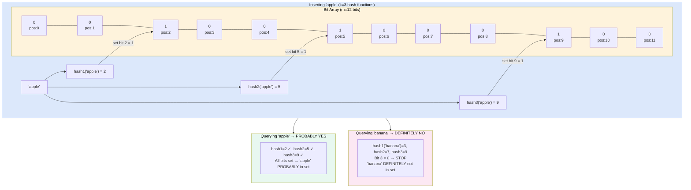
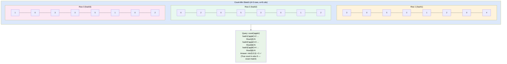
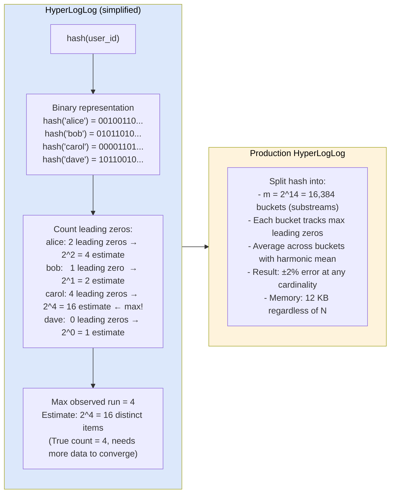

# Probabilistic Data Structures

> **Probabilistic data structures** trade a small, controllable probability of error for dramatically reduced memory usage — answering questions like "have I seen this item?", "how often did I see this item?", and "how many distinct items did I see?" using kilobytes instead of gigabytes.

---

**Level:** 7 · **Topic:** 6 of 6 · **Prerequisites:** [Level 04 — Distributed Systems](../../Level-04-Distributed-Systems/README.md) · [01 — Batch Processing](../01-Batch-Processing/README.md)

---

## 🎯 The Problem

Your CDN serves 10 billion requests per day. You want to answer:
1. "Has this URL been cached before?" — you need to check a set of 500 million cached URLs
2. "How many times has this URL been requested this hour?" — frequency counting across all URLs
3. "How many unique users visited our site today?" — cardinality of user IDs (users can visit multiple times)

The exact solutions:
- Problem 1: A hash set of 500M URLs → ~50 GB of RAM
- Problem 2: A hash map of URL → count → ~100 GB of RAM
- Problem 3: Store every unique user ID → ~10 GB of RAM per day

Total: 160 GB per node, replicated. Prohibitively expensive.

The probabilistic solutions: **~50 MB total** — with answers that are 99%+ accurate.

---

## 🌍 Real-World Analogy

Imagine a nightclub bouncer with a terrible memory and unlimited space (exact solution) vs. a bouncer with a very good notebook but limited pages (probabilistic solution).

**Exact bouncer:** writes down every name in a phonebook. Always knows if someone's been here before. But the book is 500 pages and takes forever to search.

**Bloom filter bouncer:** uses a sophisticated stamp system — each name activates 3 specific ink stamps on a shared card. "If all 3 stamps are lit, probably been here. If any is missing, definitely hasn't been here." Fits on one card. Might rarely say "yes" when it should say "no" — but **never** says "no" when it should say "yes".

That's the key trade-off: **false positives possible, false negatives impossible**.

---

## 🧠 Core Idea

All probabilistic data structures exploit one insight: **most applications don't need exact answers**.

- "Has this URL been seen?" — a 0.1% false positive rate means 1 in 1,000 cache misses becomes an unnecessary cache check. That's fine.
- "How many times was this URL called?" — being off by 2–5% is acceptable for rate limiting.
- "How many unique users today?" — being within 1–2% is fine for dashboards.

The trade: correctness for the vast majority of answers, huge memory savings, and often O(1) time.

---

## 📊 How It Works

### 1. Bloom Filter — Membership Testing

A Bloom filter answers: "Is element X in this set?" with guarantee: **no false negatives** (if it says "no", X is definitely NOT in the set). Trade-off: small false positive rate (if it says "yes", X is *probably* in the set — not certainly).

**Structure:** a bit array of `m` bits, initialized to all 0. `k` independent hash functions.

**Inserting "apple":**

**Caption:** "apple" sets bits 2, 5, 9. Querying "apple" finds all 3 set → "probably yes." Querying "banana" hits bit 3 = 0 → "definitely no" (one miss is enough to say "no"). If another inserted word happened to set bit 3, 7, and 9, a query for "banana" would falsely say "probably yes" — that's a false positive.

**Key properties:**
- **No false negatives:** if a bit is 0, the element was never inserted — guaranteed
- **False positive rate:** p = (1 - e^(-kn/m))^k where n = elements inserted
- **Cannot delete** elements (setting bits back to 0 would affect other elements)
- **Space:** a typical Bloom filter with n=10M elements and 1% FP rate needs ~96 MB. An exact hash set needs ~500 MB+.

**Practical Bloom filter sizing:**

| n (elements) | Target FP Rate | Bits needed (m) | # Hash functions (k) | Memory |
|-------------|----------------|-----------------|----------------------|--------|
| 1 million | 1% | 9.59 MB | 7 | 1.2 MB |
| 10 million | 1% | 95.9 MB | 7 | 12 MB |
| 100 million | 1% | 959 MB | 7 | 120 MB |
| 100 million | 0.1% | 1.44 GB | 10 | 180 MB |

Formula: `m = -n * ln(p) / (ln(2))²` and `k = m/n * ln(2)`

### 2. Count-Min Sketch — Frequency Estimation

A Count-Min Sketch answers: "How many times have I seen element X?" — with a slight overcount guarantee (never undercounts).

**Structure:** a 2D array of `d × w` counters. `d` hash functions, one per row.

**Caption:** Each row uses a different hash function. To query, hash `x` with each function → take the minimum counter value across all rows. The minimum reduces the impact of hash collisions (which only add to counts, never subtract). Result: a slight overestimate, never an underestimate.

- **Error bound:** estimated count ≤ true count + ε × N, where ε = e/w and N = total stream length
- **Space:** O(d × w) — typically kilobytes to megabytes
- **Use case:** top-K most frequent items (heavy hitters), rate limiting, DDoS detection

### 3. HyperLogLog — Cardinality Estimation

HyperLogLog answers: "How many **distinct** elements have I seen?" — within ~2% error — using only **~12 KB of memory** regardless of whether you've seen 1,000 or 1 trillion distinct elements.

The key insight: in a random bit string, seeing a run of `k` leading zeros has probability 2^(-k). If the maximum run of leading zeros observed is `k`, you've likely seen ~2^k distinct items.

**Caption:** Real HyperLogLog uses thousands of buckets (substreams) to reduce variance. Each bucket hashes items into a substream and tracks max leading zeros in that substream. The harmonic mean of all bucket estimates converges to the true cardinality within ~2%, using ~12 KB total.

**HyperLogLog properties:**
- **Memory:** ~12 KB for 2^14 buckets — fixed, regardless of cardinality (1K or 1 trillion)
- **Error:** ±2% for 2^14 buckets (1.04 / √m standard error)
- **Merge-able:** HLL registers from two time periods can be merged without reprocessing
- **Redis:** `PFADD key elem` and `PFCOUNT key` — built-in HyperLogLog

---

## 🔧 Types / Variations / Strategies

### Comparison of Probabilistic Data Structures

| Structure | Question Answered | Memory | Error Type | Guarantee |
|-----------|------------------|--------|------------|-----------|
| **Bloom Filter** | Is X in this set? | O(n) bits | False positives | No false negatives |
| **Counting Bloom Filter** | Is X in set? (with deletes) | O(n) small ints | False positives | No false negatives + supports delete |
| **Count-Min Sketch** | How many times did X appear? | O(d × w) | Overcount only | count ≤ true + ε×N |
| **HyperLogLog** | How many distinct elements? | O(1) ~12 KB | ±2% error | Probabilistic cardinality |
| **MinHash** | How similar are two sets? | O(k) | ±1/√k error | Jaccard similarity estimation |
| **Skip List** | Ordered set operations | O(n) | Exact | Probabilistic balance |

### Variants and Extensions

| Variant | Extends | Key Feature |
|---------|---------|-------------|
| **Counting Bloom Filter** | Bloom filter | Replaces bits with counters → supports element deletion |
| **Scalable Bloom Filter** | Bloom filter | Automatically grows as set size increases |
| **Count-Min with Heap** | CMS | Tracks top-K heavy hitters alongside counts |
| **HyperLogLog++** (Google) | HLL | Sparse representation for small cardinalities; bias correction |
| **Cuckoo Filter** | Bloom filter | Supports deletion; better cache performance at high load factors |

---

## 🏢 Real-World Examples

### Cassandra & Bigtable — Bloom Filters for SSTable Lookups
Every SSTable (immutable disk file) in Cassandra has a Bloom filter in memory. Before reading from disk, Cassandra checks: "Is this row key in this SSTable?" If the Bloom filter says "definitely no," the SSTable disk read is skipped entirely. At 1% FP rate with millions of SSTables, this eliminates ~99% of unnecessary disk reads. Bigtable uses the same technique. Memory cost: ~10 MB per node (vs. ~10 GB to store all keys exactly).

### Redis — Built-in HyperLogLog
Redis ships HyperLogLog as a first-class data type. Instagram uses Redis `PFADD` / `PFCOUNT` to track unique visitors per post — each post's HLL uses ~12 KB regardless of whether the post has 100 or 10 million unique viewers. Without HLL, storing unique user IDs for a viral post with 10M viewers would cost ~80 MB per post. With HLL: always 12 KB, ±2% accuracy — perfectly acceptable for dashboard metrics.

### CDN Deduplication (Akamai, Cloudflare)
CDNs use Bloom filters to detect if a URL has been seen recently (within the last hour). If "probably yes" → serve from cache. If "definitely no" → fetch from origin, add to Bloom filter. False positives (saying a URL is cached when it isn't) just cause an unnecessary origin check — harmless. This allows CDNs to maintain "have I seen this?" state for billions of URLs across edge nodes using megabytes of RAM per node.

### Google BigQuery — HyperLogLog for COUNT(DISTINCT)
When you run `SELECT COUNT(DISTINCT user_id) FROM events` over billions of rows in BigQuery, the exact answer would require storing all user IDs in a large hash set during aggregation — expensive across distributed machines. BigQuery uses HyperLogLog++ to compute an approximation (±1–2%) without materializing the full set, enabling sub-second responses for cardinality queries over terabytes of data.

### LinkedIn — Count-Min Sketch for Top-K Trending Topics
LinkedIn uses Count-Min Sketch to track the most-mentioned terms across millions of posts per minute — identifying trending topics in near-real-time. The CMS uses ~2 MB of RAM to track frequencies across 50 million unique terms per hour. A heap paired with the CMS maintains the current top-1000 trending terms. Exact counting would require ~800 MB for the same frequency map.

---

## ⚖️ Trade-offs

| Pro | Con |
|-----|-----|
| Massive memory savings: 100–1000× less than exact structures | Probabilistic — results are not always correct |
| O(1) or O(k) time complexity (k = hash functions) | Error rate must be understood and acceptable to the use case |
| Fixed memory (HLL) regardless of input cardinality | Bloom filters cannot support deletion (unless using Counting BF) |
| Merging HLL registers is trivial → distributed cardinality | Cannot enumerate members (Bloom filter doesn't store elements) |
| Battle-tested in production (Cassandra, Redis, BigQuery) | Tuning parameters (m, k, d, w) requires understanding the math |

---

## ✅ When to Use / ❌ When NOT to Use

**Use probabilistic data structures when:**
- Memory is constrained and exact answers aren't required
- You're processing high-volume streams where exact tracking is impractical
- The false positive/error rate is acceptable in your use case (monitoring, rate limiting, caching)
- You need merge-able summaries from distributed nodes (HLL)

**Specific triggers:**
- "Is this item in the set?" at massive scale → Bloom filter
- "How often has this item appeared?" → Count-Min Sketch
- "How many distinct users/events?" → HyperLogLog
- "Are these two user sets similar?" → MinHash

**Do NOT use probabilistic structures when:**
- False positives are unacceptable (financial transactions, medical records)
- You need to enumerate members of the set
- You need to delete specific elements (use Counting Bloom Filter or exact structure)
- Your dataset fits comfortably in memory exactly — no reason to trade accuracy

---

## ⚠️ Common Pitfalls

1. **Bloom filter saturation.** As more elements are inserted and bit array fills up, false positive rate rises dramatically. Fix: monitor fill ratio; rebuild or use Scalable Bloom Filter when FP rate exceeds threshold.
2. **Ignoring the error when aggregating.** Count-Min Sketch error is ε × N (total elements), not ε × true_count. At N = 1 billion total events, 1% error = 10 million overcount. Fix: use tighter ε for high-volume streams.
3. **Wrong hash functions.** Using correlated hash functions (e.g., all linear variants of the same function) causes uneven bit distribution → higher FP rate. Fix: use independent, high-quality hash functions (MurmurHash3, xxHash).
4. **Reusing HLL across time periods incorrectly.** HLL merging is only valid for the same cardinality question. Adding a new day's HLL to an old one estimates the union — which is correct. But resetting and re-adding is wrong if the question is "unique users this month." Fix: always think about the merge semantics.
5. **Confusing "no false negatives" with "always correct."** A Bloom filter saying "probably yes" can be wrong. Saying "definitely no" is always right. Many engineers conflate these — plan for the ~1% false positive explicitly.
6. **Choosing m too small to start.** Once a Bloom filter is deployed (e.g., in a Cassandra SSTable), you can't resize it. Fix: size for peak cardinality × 1.5× safety margin from the start.

---

## 🎤 Interview Tips

- **"Explain a Bloom filter."** Bit array + k hash functions. Insert: set k bits. Query: check k bits — if any 0, definitely not in set; if all 1, probably in set. No false negatives; configurable false positive rate. Use case: Cassandra SSTable lookup, CDN cache check.
- **"What does HyperLogLog do?"** Estimates cardinality (number of distinct elements) using ~12 KB, with ~2% error. Uses leading-zero counts in hash outputs to estimate the magnitude of the distinct set. Redis has it built in as `PFADD`/`PFCOUNT`.
- **"When would you use Count-Min Sketch?"** Frequency estimation in high-volume streams — "how often has IP 1.2.3.4 hit this endpoint?" without storing a full hash map per IP.
- **"Can you delete from a Bloom filter?"** No — you can't unset bits because other elements may share those bits. Counting Bloom Filter extends it with counters instead of bits, enabling deletion.
- **"What's the false positive formula?"** p ≈ (1 - e^(-kn/m))^k. Decreasing p requires increasing m (more bits) or k (more hash functions, with diminishing returns past optimal k).
- **Real numbers to cite:** HLL uses 12 KB for any cardinality; Bloom filter at 1% FP for 100M elements needs ~120 MB; exact hash set for same would need ~4–8 GB.

---

## 📝 TL;DR

- **Probabilistic data structures** trade small, controlled error for enormous memory savings.
- **Bloom filter:** "Is X in this set?" — no false negatives, configurable false positive rate, fixed bit array. Used in Cassandra, CDNs.
- **Count-Min Sketch:** "How often did X appear?" — slight overcount only. Used for trending topics, rate limiting.
- **HyperLogLog:** "How many distinct elements?" — ±2% error using only 12 KB. Used in Redis, BigQuery's COUNT(DISTINCT).
- The common thread: hash multiple times, summarize into a fixed-size structure, accept bounded error.

---

## 🧪 Test Yourself

1. A Bloom filter has m=1000 bits, k=3 hash functions, and has had n=200 elements inserted. Qualitatively, what is the approximate false positive rate? Is it high or low? What would you change to lower it?
2. Cassandra uses Bloom filters on each SSTable. Explain what problem they solve and why false positives are acceptable here but false negatives are not.
3. Instagram stores a HyperLogLog per post to count unique viewers. A post gets 10 million views (with some repeat viewers). The HLL returns 7.3 million unique viewers. Is this a reasonable result? Why can't they just use a hash set?
4. You want to find the top-10 most frequent search terms out of 1 billion queries per day. Describe a solution using Count-Min Sketch + a heap.
5. A Bloom filter is "full" (most bits are 1). What is the false positive rate approaching and what should you do?
6. Can you merge two HyperLogLog registers from two different server nodes to get the total unique users across both? How? What does this enable architecturally?

---

## 📚 Further Reading

- [Bloom Filters by Example](https://llimllib.github.io/bloomfilter-tutorial/) — Interactive visual tutorial
- [HyperLogLog: The Analysis of a Near-Optimal Cardinality Estimation Algorithm](http://algo.inria.fr/flajolet/Publications/FlFuGaMe07.pdf) — Original paper by Flajolet et al.
- [Count-Min Sketch](https://people.cs.umass.edu/~mcgregor/711S12/sketches1.pdf) — Original paper by Cormode & Muthukrishnan
- [Redis HyperLogLog](https://redis.io/commands/pfadd/) — Production documentation
- [Cassandra Bloom Filters](https://cassandra.apache.org/doc/latest/cassandra/operating/bloom_filters.html) — How Cassandra tunes FP rates per table
- Previous: [05 — Recommendation & ML Systems](../05-Recommendation-and-ML-Systems/README.md)
- Level overview: [Level 07 — Big Data & Specialized](../README.md)
- Bonus: [19 — Distributed Message Queue](../../Bonus-Real-World-Architectures/19-Distributed-Message-Queue/README.md) · [20 — Ad Click Aggregator](../../Bonus-Real-World-Architectures/20-Ad-Click-Aggregator/README.md)
