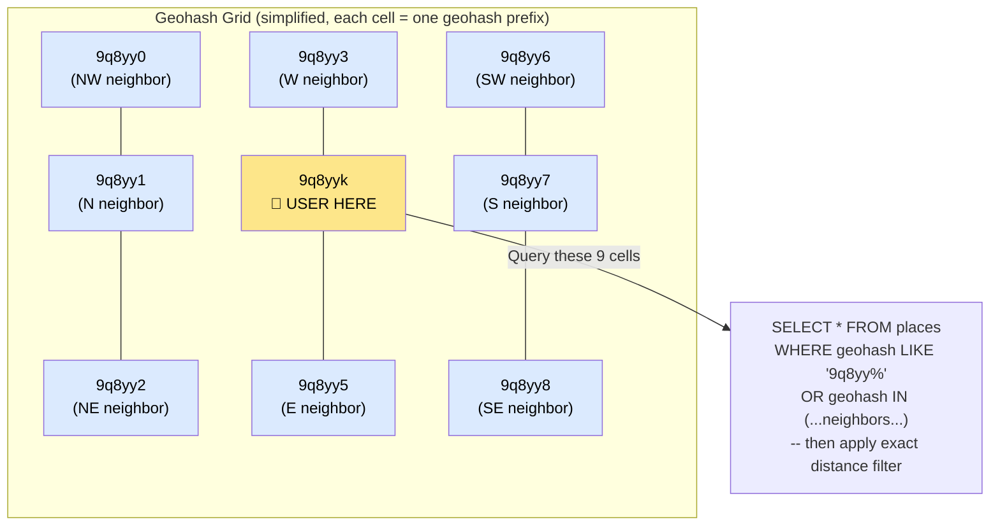
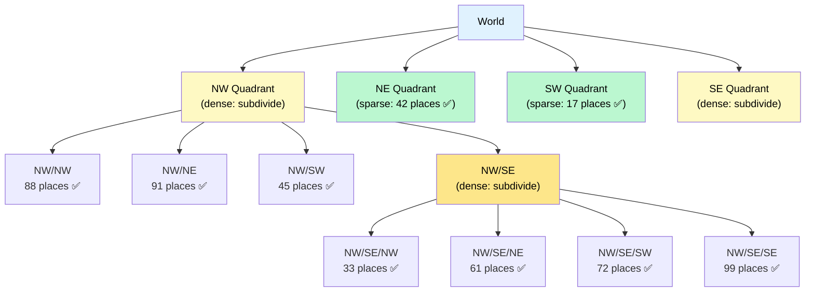

# Geospatial Indexing

> **Geospatial indexing** is a family of techniques that organize location data (latitude/longitude points) so that proximity queries — "find all restaurants within 1 km of me" — can be answered in milliseconds instead of scanning the entire dataset.

**Level:** 7 · **Topic:** 7 · **Prerequisites:** [Indexing](../../Level-02-Data-Layer/03-Indexing/README.md) · [Sharding and Partitioning](../../Level-02-Data-Layer/02-Sharding-and-Partitioning/README.md)

---

## 🎯 The Problem

You're building a food delivery app. You have 10 million restaurants in your database with `latitude` and `longitude` columns. A user opens the app — how do you find the nearest 20 open restaurants in under 50 ms?

**Naive approach — full table scan:**
```sql
SELECT *, sqrt(pow(lat - 37.77, 2) + pow(lng + 122.42, 2)) AS dist
FROM restaurants
ORDER BY dist
LIMIT 20;
```
This computes the distance from every row to the user's location. At 10 million restaurants, this is 10 million distance calculations per query. At 100 000 active users, that's 1 trillion calculations per second. Non-starter.

**Why a normal B-tree index doesn't help:**

A B-tree index on `latitude` can answer "restaurants between lat 37.0 and 38.0" efficiently — but that's a horizontal band around the globe, not a circle. Adding a B-tree on `longitude` doesn't compose: the database must still intersect two ranges and recompute distance on thousands of candidates. You need an index structure that understands **2D proximity natively**.

---

## 🌍 Real-World Analogy

Imagine you're looking for a coffee shop near your hotel. A city directory organized **alphabetically by name** is useless. A city map divided into **numbered grid squares** is perfect: you find your grid square, look at neighboring squares, and only evaluate those shops.

Each geospatial indexing technique is essentially a different way to map the 2D surface of the Earth onto a 1D list that keeps nearby places close together in the list. The challenge is that 2D space is fundamentally harder to linearize than 1D space — this is the **dimensionality problem**.

---

## 🧠 Core Idea

All geospatial indexes solve the same problem: **map (lat, lng) → a sortable key such that nearby locations produce nearby keys**.

If you can do that, a standard B-tree index on that key lets you find neighbors with a simple range scan.

### Technique 1 — Geohash

A **geohash** interleaves the bits of latitude and longitude, producing a Base-32 string where a **shared prefix ≈ nearby location**.

**How interleaving works:**
```
Latitude  bits:  0 1 1 0 1 0 1 ...
Longitude bits:  1 0 0 1 1 1 0 ...
Interleaved:     01 10 01 01 11 10 01 ...
```
The resulting bitstring, encoded as Base-32, is the geohash.

**Prefix = area:**
- `9q8y` = a large square (~40 km × 20 km) covering the San Francisco Bay Area.
- `9q8yy` = a smaller square (~5 km × 5 km), still in the Bay Area.
- `9q8yyk` = an even smaller square (~600 m × 600 m), near downtown SF.
- `9q8yykz` = a tiny square (~75 m × 37 m) near a specific intersection.

Each additional character narrows the area by a factor of ~32. Strings that share a longer prefix are geographically closer.

**Radius query with geohash:**
1. Compute the user's geohash at the desired precision (e.g., length 6 ≈ 600 m cells).
2. Get the 8 neighboring cells (the user's cell + 8 surrounding cells).
3. SELECT WHERE geohash_prefix IN (those 9 cell prefixes).
4. Apply exact distance filter on the ~hundreds of candidates.

**The boundary problem:** two points on opposite sides of a geohash cell boundary are very close geographically but may have very different geohash strings. Always query the 8 neighbors — never just the user's own cell.

### Technique 2 — Quadtree

A **quadtree** recursively subdivides the map into 4 quadrants until each cell contains at most N points (e.g., N = 100).

```
World
├── NW quadrant (many points → subdivide)
│   ├── NW/NW (< 100 points → leaf)
│   ├── NW/NE (< 100 points → leaf)
│   ├── NW/SW (< 100 points → leaf)
│   └── NW/SE (many points → subdivide further)
│       └── ...
├── NE quadrant (< 100 points → leaf)
├── SW quadrant (< 100 points → leaf)
└── SE quadrant (many points → subdivide)
```

**Radius query:** start at the root, recursively visit only quadrants that overlap the search circle. Skip entire subtrees that are clearly too far away.

**Advantage over geohash:** quadtrees naturally handle **non-uniform density**. A dense city gets deeply subdivided; a sparse desert gets a single large leaf. This keeps each leaf at roughly the same number of points, making query time predictable regardless of population density.

**Used by:** Twitter's Geospatial Index, spatial databases, Yelp's internal location system, gaming engines for spatial collision detection.

### Technique 3 — Google S2 (Hilbert Curve)

Google's S2 library projects the Earth's surface onto a cube face, then applies a **Hilbert space-filling curve** to map each 2D cell to a 1D integer (called a cell ID).

The key property of the Hilbert curve: it preserves locality far better than simpler mappings. Points close in 2D are usually close in the 1D Hilbert ordering (though not perfectly — no perfect 2D→1D mapping exists).

**S2 cell hierarchy:**
- Level 0: 6 cells (the 6 cube faces, each ~85 million km²).
- Level 1: 24 cells.
- ...
- Level 13: ~1.27 km² per cell.
- Level 30: ~1 cm² per cell.

Each level divides cells into 4 sub-cells. A cell ID at any level encodes the entire path from root to that cell.

**Used by:** Google Maps, Google Places, Foursquare, many location-based services. Available as open-source libraries for most languages.

### Technique 4 — Uber H3 (Hexagonal Grid)

Uber open-sourced **H3** in 2018: a hexagonal hierarchical grid over the globe.

**Why hexagons beat squares:**
- In a square grid, neighbors in the cardinal directions are at distance 1, but diagonal neighbors are at distance √2 ≈ 1.41. This **distorts distance** — a square's "nearby" cells are not all equally nearby.
- In a hexagonal grid, **all 6 neighbors are equidistant**. This makes radius queries and neighbor lookups geometrically uniform, which improves accuracy for distance-based clustering and routing.
- Hexagons also tile the sphere more uniformly than squares, reducing distortion at high latitudes.

**H3 resolution levels:** 16 levels (0–15). At resolution 9, each hexagon covers ~0.1 km². At resolution 12, ~1000 m².

**Used by:** Uber (driver dispatch, surge pricing, trip analysis), DoorDash, Grab, Lyft.

---

## 📊 How It Works

### Geohash Grid and Neighboring Cells



*Caption: Always query the user's cell plus all 8 surrounding cells. A nearby restaurant may be in the adjacent cell but just meters away. Querying only the user's cell misses boundary cases.*

### Quadtree Structure



*Caption: Quadtrees subdivide only where density demands it. Dense areas (cities) get deep trees; sparse areas stay as large leaves. Radius queries prune entire subtrees that can't intersect the search circle.*

---

## 🔧 Types / Variations / Strategies

| Technique | Shape | Locality | Handles Density | Complexity | Best For |
|-----------|-------|----------|----------------|------------|----------|
| **Geohash** | Square grid | Good (prefix sharing) | Fixed-size cells | Low | Simple radius queries, Redis GEO, general use |
| **Quadtree** | Recursive squares | Good | Yes (adaptive depth) | Medium | Non-uniform density, in-memory spatial trees |
| **R-Tree** | Arbitrary bounding boxes | Excellent | Yes | Medium | PostgreSQL PostGIS, Oracle Spatial, complex geometries |
| **Google S2** | Spherical (cube-projected) | Excellent (Hilbert curve) | Yes | High | Google-scale location services, precise spherical geometry |
| **Uber H3** | Hexagonal grid | Excellent (equidistant neighbors) | Yes (15 resolutions) | Medium | Ride-sharing, logistics, spatial analytics |
| **KD-Tree** | Recursive hyperplane splits | Good | Moderate | Medium | In-memory k-nearest-neighbor for small datasets |

### Database/System Support

| System | Geospatial Index Type | Notes |
|--------|----------------------|-------|
| **PostgreSQL + PostGIS** | R-Tree (GiST index) | Most powerful; supports complex geometries, polygons, projections |
| **MySQL 8** | R-Tree (spatial index) | Good for basic geospatial; less powerful than PostGIS |
| **Redis GEO** | Geohash (stored as sorted set) | `GEOADD`, `GEORADIUS`, `GEOPOS` — easy, fast, in-memory |
| **Elasticsearch** | Geohash + R-Tree hybrid | `geo_point` type; aggregations on geohash tiles |
| **MongoDB** | 2dsphere index (geohash-based) | `$near`, `$geoWithin` operators |
| **Google BigQuery** | S2 cells | `ST_GEOGPOINT`, `ST_DISTANCE` on S2 geometry |

---

## 🏢 Real-World Examples

### Uber — H3 + Machine Learning
Uber uses H3 hexagons for surge pricing: they aggregate driver/rider demand in each hex cell at each resolution level, then use ML to predict supply-demand imbalance. H3's equidistant neighbors make spatial aggregation mathematically clean. Dispatch uses S2-based spatial indexing to find the nearest available driver within milliseconds across millions of active drivers.

### Google Maps / Google Places
Google Maps uses S2 internally for all geospatial operations — map tile generation, POI indexing, routing. S2's spherical geometry avoids the distortions of flat projections (Mercator projection makes Greenland look huge; S2 cells don't). The `GEORADIUS`-style queries in Google Places API resolve in < 20 ms for billions of indexed locations.

### Yelp
Yelp stores business locations with PostgreSQL + PostGIS. The `GIST` index on the `location` column (a PostGIS `geometry` type) allows efficient `ST_DWithin(location, user_point, radius)` queries. At query time, the PostGIS R-Tree eliminates most businesses before the exact distance formula is applied.

### Tinder / Nearby Friends
Proximity-based social apps use Redis `GEORADIUS` for simple "people near me" queries. Tinder stores user locations in Redis with `GEOADD` and queries with `GEORADIUS_RO`. The geohash-backed sorted set in Redis makes this extremely fast and easy to update as users move.

### DoorDash / Food Delivery
DoorDash uses H3 hexagons to define delivery zones, estimate delivery time by zone, and route Dashers. Each restaurant is assigned its H3 cell; nearby Dashers query adjacent cells. H3's hierarchical resolution lets them aggregate at multiple zoom levels (city-wide → neighborhood → block level).

---

## ⚖️ Trade-offs

| Factor | Geohash | Quadtree | S2 / H3 |
|--------|---------|----------|---------|
| **Implementation complexity** | Low | Medium | High |
| **Boundary handling** | Requires 9-cell query | Natural (tree traversal) | Natural (cell neighbors) |
| **Non-uniform density** | Fixed cells (hot spots possible) | Adaptive depth (handles it) | Fixed cells at each resolution |
| **Spherical accuracy** | Degrades near poles | Flat-world assumption | Accurate spherical geometry |
| **Query speed** | Fast (string prefix index) | Fast (tree traversal) | Fast (integer range index) |
| **Ecosystem support** | Universal (Redis, PostgreSQL, Mongo) | Limited (mostly in-memory) | Growing (Google, Uber, BigQuery) |

---

## ✅ When to Use / ❌ When NOT to Use

**Use geospatial indexing when:**
- You need "find things near a point" (k-NN or radius queries).
- You have more than a few thousand points — full scan becomes too slow.
- You need real-time location updates (ride-sharing, asset tracking).
- You need spatial aggregation (heatmaps, surge pricing zones, delivery zones).

**Choose the right technique:**
- **Simple radius search, small to medium scale:** Redis GEO (geohash) or PostgreSQL PostGIS.
- **Adaptive density, in-memory (< 50 M points):** Quadtree.
- **Globally uniform, analytics, hexagonal zones:** Uber H3.
- **Maximum accuracy, Google ecosystem:** S2.

**Do NOT use geospatial indexing when:**
- Your data has < 10 000 points — a full scan with a distance calculation is fine.
- You only need bounding-box queries (min/max lat + lng) — a composite B-tree index on (lat, lng) with filtered range scans is sufficient for axis-aligned rectangles.

---

## ⚠️ Common Pitfalls

1. **Querying only the user's own geohash cell.** A user right on a cell boundary will miss points just meters away in the adjacent cell. Always include all 8 neighboring cells.

2. **Using the wrong geohash precision.** Length-4 geohash cells are ~40 km wide — useless for "near me." Length-7 cells are ~150 m wide — may return too few results. Calibrate precision to your search radius: roughly, length 5 ≈ 5 km, length 6 ≈ 600 m, length 7 ≈ 75 m.

3. **Not applying an exact distance filter after the index scan.** The geohash/quadtree query returns *candidates* in a bounding square. A restaurant in the corner of a geohash cell might be farther away than the radius. Always apply `ST_DWithin` or Haversine as a post-filter.

4. **Using Euclidean distance instead of Haversine.** Latitude and longitude are spherical coordinates, not Cartesian. At the equator, 1 degree of longitude ≈ 111 km. At 60°N latitude, 1 degree of longitude ≈ 55 km. `sqrt(pow(lat1-lat2, 2) + pow(lng1-lng2, 2))` is wrong. Use the Haversine formula or PostGIS `ST_Distance`.

5. **Not handling updates for moving objects.** In ride-sharing, drivers move constantly. Storing their location in a database with a geospatial index and updating it every second creates massive write amplification. Use an in-memory store like Redis GEO for real-time moving objects; batch-update the persistent store less frequently.

---

## 🎤 Interview Tips

- **Start with the problem:** "A B-tree index on lat/lng doesn't work for 2D proximity because ranges on two separate columns don't compose into a circle."
- **Name at least two approaches:** Geohash and Quadtree are the minimum. S2/H3 is bonus.
- **Explain the boundary problem** for geohash — always query 9 cells, not just 1. Interviewers love catching candidates who miss this.
- **Mention the two-phase approach:** spatial index → candidates → exact distance filter.
- **Know the Haversine formula** at a conceptual level — "lat/lng are spherical, not Cartesian, so Euclidean distance gives wrong answers near the poles."
- For **Uber design:** propose H3 + Redis for real-time driver location, explain why hexagons matter.
- For **Yelp/Tinder design:** geohash with Redis GEO or PostGIS is the standard answer.

---

## 📝 TL;DR

- Normal B-tree indexes on (lat, lng) fail for proximity queries — you need 2D-aware indexes.
- **Geohash:** interleaves lat/lng bits into a string; shared prefix = nearby. Fast, simple, boundary gotcha (query 9 cells).
- **Quadtree:** recursively subdivides space; adaptive to density; used in in-memory spatial databases.
- **Google S2:** projects globe onto a cube + Hilbert curve; spherically accurate; used at Google scale.
- **Uber H3:** hexagonal cells; equidistant neighbors; excellent for spatial analytics and logistics.
- Always apply an **exact distance post-filter** after the spatial index — the index gives candidates, not final answers.
- Use **Redis GEO** for simple radius queries; **PostGIS** for complex geometry; **H3** for spatial analytics.

---

## 🧪 Test Yourself

1. Why can't you use a standard B-tree index on `(latitude, longitude)` to efficiently answer "find all restaurants within 500 m of my location"?
2. Explain the geohash boundary problem. A user is at geohash cell `9q8yyk`. A restaurant 100 m away is at `9q8yyj`. Will the query `WHERE geohash LIKE '9q8yyk%'` find the restaurant? How do you fix this?
3. Compare geohash and quadtree for a scenario where 90% of your 10 million locations are in 5 dense cities. Which handles this better and why?
4. Why do hexagons make better spatial index cells than squares for distance-based queries? Give a geometric reason.
5. You're building Uber. Driver locations update every 2 seconds. You have 1 million active drivers. Why is storing driver locations in Postgres with a PostGIS index a bad idea? What would you use instead?

---

## 📚 Further Reading

- [Uber Engineering — H3: Uber's Hexagonal Hierarchical Spatial Index](https://www.uber.com/blog/h3/) — the original H3 announcement.
- [Google S2 Geometry Library](http://s2geometry.io/) — documentation and interactive demos.
- [PostGIS Documentation](https://postgis.net/docs/) — the most powerful open-source geospatial extension.
- [Redis GEO Commands](https://redis.io/commands/?group=geo) — `GEOADD`, `GEORADIUS`, `GEOPOS`.
- [Geohash Explorer](https://www.movable-type.co.uk/scripts/geohash.html) — interactive geohash visualization.
- [Nick Johnson — Geohash and Neighbors](https://www.bigdatarepublic.nl/articles/geohash-neighbors/) — detailed walkthrough of boundary queries.
- Previous: [06 — Probabilistic Data Structures](../06-Probabilistic-Data-Structures/README.md) · Next: [08 — Specialized Databases](../08-Specialized-Databases/README.md) · Back to [Level 07 Overview](../README.md)
- See also: [Bonus — Uber](../../Bonus-Real-World-Architectures/README.md) · [Bonus — Google Maps](../../Bonus-Real-World-Architectures/README.md) · [Bonus — Nearby Friends](../../Bonus-Real-World-Architectures/README.md)
