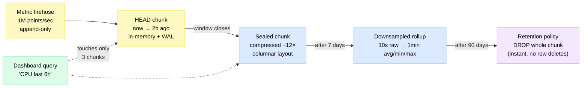
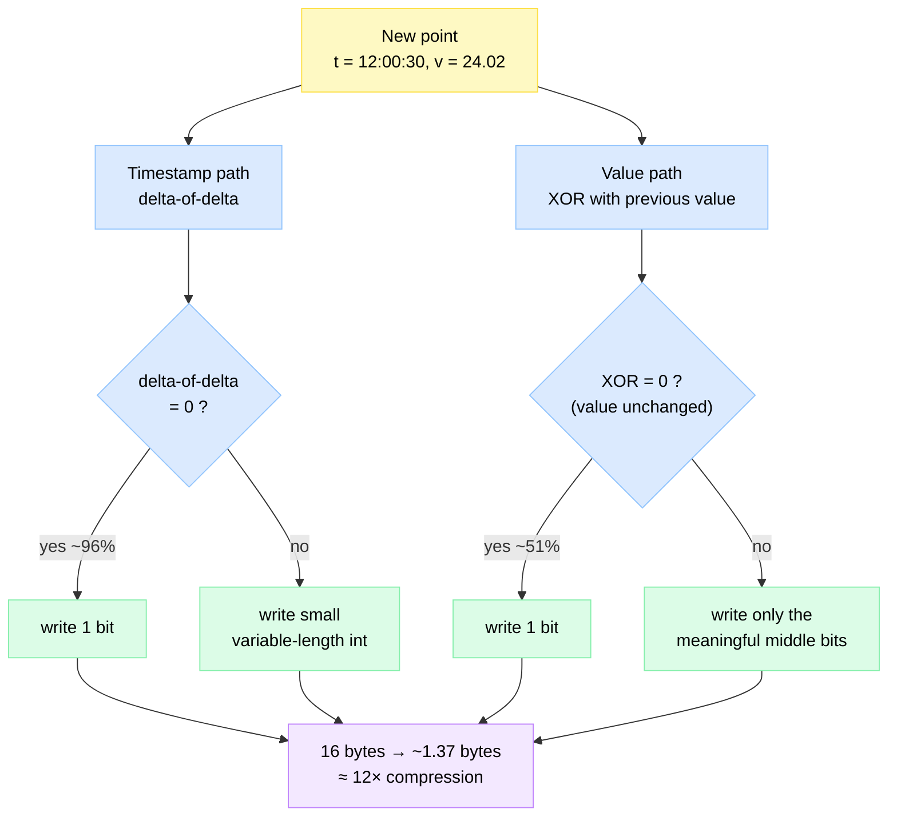
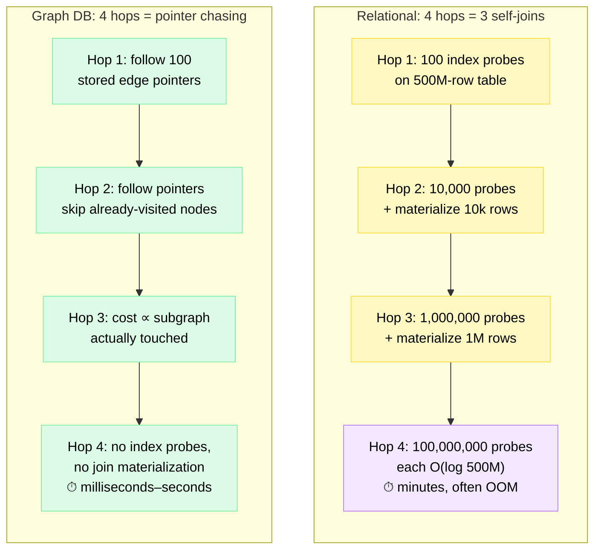
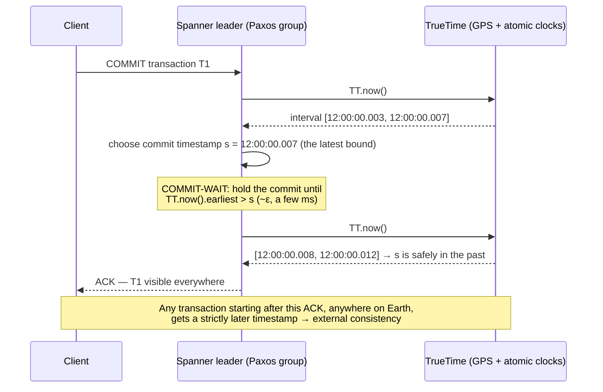
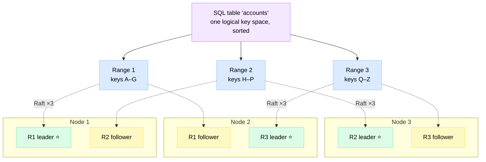
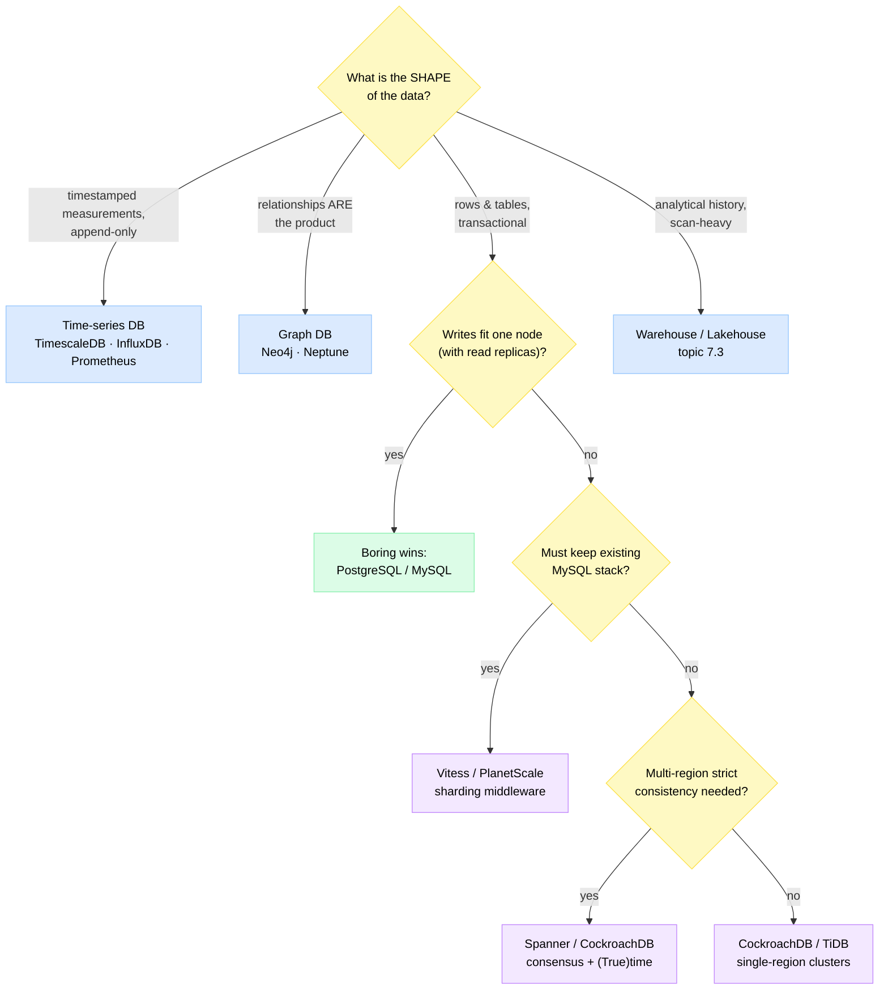

# Specialized Databases — Time-Series, Graph & NewSQL

> **Specialized databases** are storage engines designed around one specific *shape* of data — time-stamped measurements, densely connected relationships, or globally distributed relational rows — trading generality for a 10–100× advantage on that one shape.

**Level:** 7 · **Topic:** 8 · **Prerequisites:** [SQL vs NoSQL](../../Level-01-Building-Blocks/04-Databases-SQL-vs-NoSQL/README.md) · [Database Internals](../../Level-02-Data-Layer/04-Database-Internals/README.md) · [CAP Theorem](../../Level-04-Distributed-Systems/01-CAP-Theorem/README.md)

---

## 🎯 The Problem (Why does this exist?)

Three teams at the same company, one Monday morning:

1. **The metrics team** stores server telemetry in PostgreSQL. The table hit 2 billion rows; inserts are fine but the "CPU last 24h" dashboard now takes 45 seconds, and storage costs grow 1 TB/month even though nobody ever *updates* a row.
2. **The fraud team** wants "accounts within 4 hops of this stolen credit card." Their SQL query has four self-joins on a 500-million-row table. It ran for 11 minutes, then the analyst gave up.
3. **The payments team** sharded MySQL by user ID (see [Sharding](../../Level-02-Data-Layer/02-Sharding-and-Partitioning/README.md)). Now a transfer between two users on *different shards* needs a hand-rolled two-phase commit, and the compliance team wants strictly ordered, globally consistent transactions across three continents.

None of these teams has a "big data" problem in the raw-volume sense. They have a **shape mismatch**: a general-purpose row-store B-tree engine being asked to behave like an append-only log, a pointer-chasing network, and a planet-spanning consensus system. A general-purpose database *can* limp through each case — with heroic tuning — but an engine built for that exact shape does it natively.

---

## 🌍 Real-World Analogy

A Swiss Army knife is a marvel: blade, saw, scissors, corkscrew. You can survive a camping trip with it. But watch a professional kitchen: the chef uses a **chef's knife**, the surgeon next door uses a **scalpel**, and the carpenter uses a **saw**. Nobody performs surgery with a Swiss Army knife — not because it lacks a blade, but because the *geometry of the tool* matches the *geometry of the job*.

PostgreSQL/MySQL is the Swiss Army knife — genuinely good at almost everything, the right default. Time-series, graph, and NewSQL databases are the chef's knife, scalpel, and saw: narrower, sharper, and dramatically better when the job matches. The skill you're building in this chapter is recognizing *which job you're holding*.

---

## 🧠 Core Idea

Every database makes physical-layout bets (recall [Database Internals](../../Level-02-Data-Layer/04-Database-Internals/README.md)): how rows sit on disk, what the index points to, how writes are ordered. A general-purpose engine bets on "random reads and writes to individual rows." Specialized engines bet differently:

| Wall you hit | Data shape | Why the general engine struggles | Specialized family |
|---|---|---|---|
| Dashboards over billions of append-only points | Timestamped measurements | B-trees fragment under append-heavy load; rows store repetitive data uncompressed; old data needs `DELETE`, not `DROP` | **Time-series DB** |
| Multi-hop relationship queries | Networks / relationships | Each hop is a self-join; cost grows with *table* size, not neighborhood size | **Graph DB** |
| ACID transactions beyond one machine | Global relational rows | Single-node engines don't scale writes; manual sharding forfeits cross-shard transactions | **NewSQL / Distributed SQL** |

### Part 1 — Time-Series Databases (InfluxDB, TimescaleDB, Prometheus)

A time-series workload is peculiar: **95–99% writes**, almost all appends to "now," virtually no updates, and reads that aggregate ranges ("avg CPU per minute, last 6h") with a strong bias toward recent data. TSDBs exploit every one of those traits:

**1. Time-partitioned chunks.** Data is physically split into time windows (TimescaleDB *chunks*, Prometheus *2-hour blocks*, InfluxDB *shard groups*). The active chunk stays hot in memory (backed by a write-ahead log); older chunks are sealed, compressed, and eventually dropped. Deleting 30-day-old data is `DROP CHUNK` — freeing a file, not deleting 500M rows one by one.

*The lifecycle of a data point, from hot append to cheap deletion:*



**2. Gorilla compression (the famous Facebook paper).** In 2015 Facebook published [Gorilla](https://www.vldb.org/pvldb/vol8/p1816-teller.pdf), the in-memory TSDB behind their monitoring. Its compression shrank a 16-byte point (8-byte timestamp + 8-byte float) to **~1.37 bytes on average — about 12×** — using two tricks:

- **Delta-of-delta timestamps:** metrics arrive on a schedule (every 10s), so the *delta between deltas* is almost always 0 → stored as a single bit. Facebook measured ~96% of timestamps compressing to 1 bit.
- **XOR-encoded values:** consecutive readings are similar, so `value XOR previous` is mostly zero bits. Identical value → 1 bit (~51% of points); otherwise store only the small window of meaningful bits.

*Why 16 bytes shrinks to ~1.37 — two independent tricks per point:*



TimescaleDB, InfluxDB, and Prometheus all use descendants of these encodings (delta-of-delta, XOR floats, plus dictionary/run-length encoding for labels).

**3. Downsampling, retention & continuous aggregates.** Nobody needs 10-second resolution from last year. TSDBs automate the rollup: keep raw data 7 days, 1-minute averages 90 days, 1-hour averages 2 years — then delete. **Continuous aggregates** (TimescaleDB) / **tasks** (InfluxDB) / **recording rules** (Prometheus) maintain these rollups incrementally as data arrives, so dashboards read tiny pre-aggregated tables instead of re-scanning raw points.

**Use cases:** infrastructure metrics and observability, IoT sensor fleets (a wind farm emitting 100k readings/sec), finance tick data, energy smart meters.

### Part 2 — Graph Databases (Neo4j, Amazon Neptune)

**The property graph model:** data is stored as **nodes** (entities), **edges/relationships** (directed, typed connections), and **properties** (key-value pairs on both). `(:Person {name:"Aditi"})-[:FRIENDS_WITH {since:2019}]->(:Person {name:"Ben"})`. The relationships are first-class citizens, not reconstructed at query time from foreign keys.

**The superpower: index-free adjacency.** Each node physically stores direct pointers to its relationships. Traversing a hop is *dereferencing a pointer* — O(neighbors) — not an index lookup. In SQL, every hop is a join: a B-tree probe whose cost is O(log N) *of the entire table*, repeated per candidate row, with intermediate results materialized between hops.

*The same "friends-of-friends up to 4 hops" question in both worlds (100 friends per person, 500M-row friendship table):*



The key insight: SQL join cost scales with the **size of the whole table**; graph traversal cost scales with the **size of the neighborhood you actually visit**. On a small graph the difference is invisible; at social-network scale it is the difference between milliseconds and minutes.

**Cypher**, Neo4j's query language (and the basis of the ISO GQL standard), expresses traversals as ASCII art:

```cypher
// People 2–3 hops away who aren't already my friends — ranked by mutual paths
MATCH (me:Person {id: 42})-[:FRIENDS_WITH*2..3]-(candidate:Person)
WHERE NOT (me)-[:FRIENDS_WITH]-(candidate) AND candidate <> me
RETURN candidate.name, count(*) AS mutual_paths
ORDER BY mutual_paths DESC LIMIT 10;
```

**RDF/SPARQL, briefly:** the other graph tradition stores *triples* (`subject–predicate–object`, e.g., `Einstein bornIn Ulm`) and queries them with SPARQL. It shines for interoperable knowledge graphs and ontologies (Wikidata, life sciences). Amazon Neptune supports both models: property graph via openCypher/Gremlin, RDF via SPARQL.

**Use cases:** fraud-ring detection, social graphs, recommendations ("customers who bought X also…"), knowledge graphs powering search and increasingly LLM retrieval (see [AI & LLM Infrastructure](../09-AI-and-LLM-Infrastructure/README.md)), dependency and network topology analysis.

### Part 3 — NewSQL / Distributed SQL (Spanner, CockroachDB, TiDB, Vitess)

For a decade the deal was: want SQL + ACID? Stay on one big machine. Want horizontal scale? Go NoSQL and forfeit transactions and joins. **NewSQL breaks the trade-off: full SQL, real ACID transactions, and horizontal write scaling** — by rebuilding the database on consensus replication.

**Google Spanner and TrueTime.** Distributed transactions need a global ordering of events, but perfectly synchronized clocks don't exist (see [Clocks & Ordering](../../Level-04-Distributed-Systems/06-Clocks-and-Ordering/README.md)). Google's answer: stop pretending clocks are perfect and instead **bound the imperfection**. Every datacenter has GPS receivers and atomic clocks; the **TrueTime API** returns not a timestamp but an *interval* `[earliest, latest]` guaranteed to contain true time — uncertainty ε typically single-digit milliseconds. The trick that makes transactions globally ordered is **commit-wait**:

*Commit-wait: deliberately waiting out clock uncertainty buys external consistency.*



By waiting a few milliseconds, Spanner guarantees that once a commit is acknowledged, *every* later transaction anywhere on the planet sees a later timestamp — linearizable, globally consistent SQL. Per [CAP](../../Level-04-Distributed-Systems/01-CAP-Theorem/README.md) it's a CP system: during a partition, a minority region refuses writes rather than serving inconsistency.

**CockroachDB: Raft-replicated ranges.** Open-source Spanner-inspired design, minus the atomic clocks (it uses hybrid logical clocks with a max-offset bound, and retries reads that fall inside the uncertainty window). The table's sorted key space is cut into **ranges** (~512 MB); each range is its own **Raft group** replicated 3+ ways across nodes; a leaseholder replica serves reads. Add a node → ranges rebalance automatically; lose a node → Raft elects new leaders in seconds.

*One logical SQL table, physically sharded into consensus groups:*



**TiDB** takes the same shape with a MySQL-compatible SQL layer over the Raft-replicated TiKV store, plus a columnar replica (TiFlash) so analytics and transactions share one system (HTAP). **Vitess** is philosophically different: not a new engine but **sharding middleware for stock MySQL**, born at YouTube (~2010) to survive viral growth. A `vtgate` proxy makes hundreds of MySQL shards look like one database, handling routing, resharding, and connection pooling — the productionized version of the manual sharding pain from [Sharding & Partitioning](../../Level-02-Data-Layer/02-Sharding-and-Partitioning/README.md). PlanetScale is its commercial cloud form.

### Honorable mentions

| Niche | Examples | The trick | Pointer |
|---|---|---|---|
| **Ledger DBs** | Amazon QLDB (retired 2025), immudb | Append-only journal, cryptographically hash-chained → provable audit history | Niche DBs can die — plan exit paths |
| **Embedded OLTP** | SQLite | Whole database in-process, one file — the most deployed DB on Earth (billions of devices) | Mobile apps, browsers, edge |
| **Embedded OLAP** | DuckDB | "SQLite for analytics": vectorized columnar engine in-process | Laptop-scale analytics; see [Warehouses & Lakes](../03-Data-Warehouses-and-Lakes/README.md) |
| **Wide-column** | Cassandra, Bigtable | Partition-key + clustering-key layout for massive write throughput | Recap in [SQL vs NoSQL](../../Level-01-Building-Blocks/04-Databases-SQL-vs-NoSQL/README.md) |
| **Geospatial** | PostGIS, H3-based systems | Spatial indexes for "near me" queries | Previous topic: [Geospatial Indexing](../07-Geospatial-Indexing/README.md) |
| **Vector DBs** | Pinecone, pgvector, Milvus | ANN indexes over embeddings | Next topic: [AI & LLM Infrastructure](../09-AI-and-LLM-Infrastructure/README.md) |

---

## 📊 The Decision Matrix

The four questions that pick a database family: **data shape → query pattern → consistency needs → scale.**

| Your data looks like | Dominant queries | Consistency need | Scale | Reach for |
|---|---|---|---|---|
| Business records, forms, orders | CRUD, joins, reports | ACID | Fits one beefy node (+ replicas) | **PostgreSQL/MySQL** — the default |
| Business records | Same, plus cross-shard transactions | ACID, maybe multi-region | Beyond one node's writes | **NewSQL** (Spanner, CockroachDB, TiDB) or **Vitess** if staying MySQL |
| Timestamped measurements, append-only | Range scans + aggregations, recent-biased | Eventual is fine | Millions of points/sec | **Time-series DB** (TimescaleDB, InfluxDB, Prometheus) |
| Entities where *connections* are the point | Multi-hop traversals, path finding | Usually single-region ACID | Billions of edges | **Graph DB** (Neo4j, Neptune) |
| Documents with flexible/nested schema | Fetch/update by key, some secondary queries | Tunable | Horizontal | **Document DB** (MongoDB, DynamoDB) |
| Historical events for analysts | Full scans, GROUP BY over TB–PB | Batch freshness | Petabytes | **Warehouse/Lakehouse** ([topic 7.3](../03-Data-Warehouses-and-Lakes/README.md)) |

*A 30-second decision tree — start at the top whenever someone says "which database?":*



---

## 🏢 Real-World Examples

- **Facebook — Gorilla / Beringei:** Facebook's monitoring needed the last 26 hours of billions of series queryable in milliseconds while the site burned. Gorilla kept it all *in RAM* — possible only because of the 12× compression above — and served as the write-through cache in front of the long-term HBase store. Open-sourced later as Beringei; its encodings now live inside Prometheus, InfluxDB, and TimescaleDB.
- **Netflix — Atlas:** Netflix's telemetry platform grew from ~1 million metrics in 2011 to over a billion, so they built [Atlas](https://netflixtechblog.com/introducing-atlas-netflixs-primary-telemetry-platform-bd31f4d8ed9a), an in-memory dimensional TSDB with its own stack-based query language, optimized for "operational intelligence now" over perfect history.
- **PayPal — fraud graphs:** fraudsters reuse assets (devices, cards, addresses). Individually each account looks clean; as a graph, 50 "unrelated" accounts sharing 3 devices and 2 shipping addresses form an obvious cluster. PayPal and most large payment companies run graph analyses precisely because ring detection is a multi-hop neighborhood query — the worst case for SQL joins, the home game for a graph engine.
- **Google Ads — F1 on Spanner:** the AdWords revenue engine outgrew a heavily sharded MySQL installation whose resharding took years. Google moved it to [F1](https://research.google/pubs/pub41344/), built on Spanner — proof that "SQL + ACID + horizontal scale" runs a trillion-dollar ad business, not just a demo.
- **YouTube — Vitess:** rather than abandon MySQL during hypergrowth, YouTube wrapped it in Vitess. The project is now CNCF-graduated and runs MySQL fleets at Slack, GitHub, and Block — and powers PlanetScale.

---

## ⚖️ Trade-offs (Pros & Cons)

| Family | You gain | You pay |
|---|---|---|
| **Time-series** | 10–20× compression, fast range aggregations, free retention/downsampling | Poor at updates/deletes of single rows; high-cardinality label explosions; another system to run |
| **Graph** | Millisecond multi-hop traversals; queries that mirror the domain | Weaker at bulk scans/aggregations; harder horizontal sharding (graphs resist clean partitioning); smaller talent pool |
| **NewSQL** | SQL + ACID + horizontal scale + built-in HA | Write latency floor (consensus round-trips, commit-wait); cross-region transactions are physics-bound; operational complexity or vendor lock-in |
| **General-purpose (baseline)** | One system, mature tooling, everyone knows it | Hits the three walls above at scale — with much more tuning pain |

The meta trade-off: **every specialized DB is another system** — another backup strategy, another failure mode, another thing the on-call engineer must understand at 3 a.m. Polyglot persistence is powerful *and* an operational tax.

---

## ✅ When to Use / ❌ When NOT to Use

**Use a specialized database when:**
- The workload *is* the shape: metrics/IoT firehose → TSDB; multi-hop relationship questions asked constantly → graph; provable need for transactions beyond one node → NewSQL.
- You've measured the general-purpose engine failing (slow dashboards, join explosions, shard-key gymnastics) — not just imagined it.
- The team can afford to operate (or pay for) one more system.

**Do NOT use one when:**
- PostgreSQL with an extension gets you 80% (PostGIS, pgvector, TimescaleDB-on-Postgres) — the boring option keeps your stack unified.
- You ask a graph-*shaped* question once a month — run it as a batch job instead of adopting a graph DB.
- "It might not scale someday" is the only justification. Premature NewSQL adoption buys you consensus-protocol write latency for traffic a single Postgres box would have laughed at.

---

## ⚠️ Common Pitfalls & Gotchas

1. **High-cardinality labels in TSDBs.** `user_id` as a metric label creates one series per user — millions of series, exploding index memory (the classic Prometheus outage). Keep labels low-cardinality; put IDs in logs or traces.
2. **Using a graph DB as your primary store because the data "has relationships."** *All* data has relationships. The test is whether your *queries* are variable-depth traversals. Two fixed joins? Relational is fine.
3. **Expecting NewSQL writes to be as fast as single-node writes.** Every commit crosses a quorum (plus commit-wait on Spanner). Intra-region that's single-digit ms; a multi-continent quorum is 100ms+ — physics, not a config flag.
4. **Ignoring retention until the disk fills.** TSDBs make deletion cheap *only* if you configure retention policies up front. "We'll keep everything for now" is how you end up with 40 TB of 10-second-resolution data nobody queries.
5. **Supernodes in graphs.** A celebrity with 100M followers makes "friends-of-friends" explode regardless of engine. Real systems cap traversal fan-out or handle hub nodes specially.
6. **Betting the company on a niche engine.** QLDB was retired by AWS in 2025. Before adopting a specialized store, check community size, managed offerings, and your exit path.

---

## 🎤 Interview Tips

- **Lead with the decision framework, not the product name:** "Data shape → query pattern → consistency → scale. This is append-only timestamped data queried by recent range, so a time-series DB." Naming the *reasoning* beats naming InfluxDB.
- **Have one number per family:** Gorilla compresses 16 bytes → ~1.37 bytes (~12×); 4-hop friend queries = 3 self-joins vs pointer chasing; TrueTime uncertainty ε = single-digit ms and commit-wait rides on it.
- **Classic follow-up: "Why not just use Postgres for metrics?"** Answer honestly: you can, to a point — and TimescaleDB *is* Postgres. The wins are chunking, columnar compression, and continuous aggregates, not magic.
- **Classic follow-up: "How does Spanner give consistency across continents?"** TrueTime intervals + commit-wait: wait out the clock uncertainty so acknowledged commits are globally ordered.
- **Show restraint.** Interviewers love: "I'd start with Postgres and split out a TSDB only when metrics volume justifies a second system." Tool-collecting is a red flag; judgment is the signal.
- Expect a **"design a metrics/monitoring system"** question — it's the applied version of this whole topic (partitioning, compression, downsampling, retention).

---

## 📝 TL;DR

| Family | One-liner | Killer mechanism | Flagship names |
|---|---|---|---|
| **Time-series** | Append-only measurements, range-aggregated | Time-chunking + Gorilla compression (16B → ~1.37B) + auto retention/downsampling | InfluxDB, TimescaleDB, Prometheus |
| **Graph** | Relationships as first-class data | Index-free adjacency: hops are pointer derefs, cost ∝ neighborhood not table | Neo4j, Amazon Neptune |
| **NewSQL** | SQL + ACID + horizontal scale | Consensus-replicated ranges; Spanner adds TrueTime + commit-wait for global ordering | Spanner, CockroachDB, TiDB, Vitess |
| **Rule of thumb** | Start boring (Postgres); specialize when a wall is *measured* | Data shape × query pattern × consistency × scale | — |

---

## 🧪 Test Yourself

**1. Your PostgreSQL metrics table has 2B rows; dashboards take 45s and storage grows 1 TB/month. Which family fixes this, and via which three mechanisms?**

<details>
<summary>Show answer</summary>

A time-series database (or the TimescaleDB extension on the existing Postgres). The three mechanisms: **(1) time-partitioned chunks** — queries touch only the chunks in their time range, and old data is dropped as whole chunks instead of row-by-row deletes; **(2) compression** — delta-of-delta timestamps + XOR-encoded values (Gorilla-style) shrink points ~12×, cutting that 1 TB/month to under 100 GB; **(3) continuous aggregates + retention** — dashboards read incrementally-maintained rollups (avg per minute) instead of scanning raw points, and retention policies age raw data out automatically.
</details>

**2. Explain Gorilla's two encodings. Why does it hit ~12× on server metrics but far less on, say, random sensor noise?**

<details>
<summary>Show answer</summary>

**Timestamps:** delta-of-delta — points arrive on a near-fixed interval, so the second-order difference is usually 0 and stored as one bit (~96% of the time). **Values:** XOR with the previous value — similar consecutive floats share sign/exponent/high-mantissa bits, so the XOR is mostly zeros and only the short "meaningful bit" window is stored; identical values need one bit (~51%). Both encodings exploit **redundancy**: regular arrival times and slowly changing values. Random noise has neither — deltas of deltas are nonzero and XORs have high entropy — so each point needs many literal bits. Compression ratio is a property of the data's predictability, not the algorithm alone.
</details>

**3. A fraud analyst needs "all accounts within 5 hops of this flagged card." Why does this crush a relational DB but not a graph DB?**

<details>
<summary>Show answer</summary>

In SQL, 5 hops = 4 self-joins. Each hop performs an index probe per candidate row at O(log N) of the entire link table, and materializes exponentially growing intermediate results (100-way fan-out → up to 100⁵ candidate paths), typically minutes of work or an out-of-memory error. A graph DB uses **index-free adjacency**: each node stores direct pointers to its edges, so a hop is a pointer dereference with no index probes and no join materialization, and visited-node pruning keeps work proportional to the *actual neighborhood touched*, not the table size. Caveat worth mentioning: supernodes (hub accounts shared by thousands) still explode fan-out and need capping in any engine.
</details>

**4. How does Spanner give externally consistent transactions across continents, and what is the cost?**

<details>
<summary>Show answer</summary>

**TrueTime** turns clock error from an unknown into a bounded interval: GPS receivers + atomic clocks let the API return `[earliest, latest]` guaranteed to contain true time (ε typically a few ms). On commit, the Paxos leader picks timestamp `s ≥ TT.now().latest`, then **commit-waits** until `TT.now().earliest > s` before acknowledging — so when the client hears "committed," `s` is unambiguously in the past everywhere on Earth, and any later transaction gets a later timestamp (external consistency / linearizability). **Costs:** every write pays the commit-wait (~ε) plus Paxos quorum round-trips — a latency floor no config can remove; multi-region quorums add speed-of-light delays; and it's CP — a partitioned minority region rejects writes.
</details>

**5. A startup on MySQL is hitting its write ceiling. Compare "adopt Vitess" vs "migrate to CockroachDB."**

<details>
<summary>Show answer</summary>

**Vitess:** keeps stock MySQL underneath — the team's replication, backup, and query knowledge survives; vtgate makes many shards look like one database and automates resharding. But it's middleware: you must choose good shard keys, and cross-shard transactions/joins are limited and best avoided. Lowest-risk path when the org is deeply MySQL-native (the YouTube story). **CockroachDB:** a true distributed engine — Raft-replicated ranges give transparent sharding, serializable cross-node transactions, and node-failure survival with no shard-key gymnastics. But it's Postgres-wire (not MySQL), so the app, ORM, and ops tooling all change, and consensus adds per-write latency. Rule of thumb: heavy MySQL investment + shardable workload → Vitess; greenfield-ish or genuinely needs cross-shard ACID / multi-region → distributed SQL.
</details>

---

## 📚 Further Reading

- [Gorilla: A Fast, Scalable, In-Memory Time Series Database](https://www.vldb.org/pvldb/vol8/p1816-teller.pdf) — the Facebook VLDB 2015 paper; the compression section is a joy.
- [Spanner: Google's Globally-Distributed Database](https://static.googleusercontent.com/media/research.google.com/en//archive/spanner-osdi2012.pdf) — OSDI 2012; read §3 on TrueTime.
- [F1: A Distributed SQL Database That Scales](https://research.google/pubs/pub41344/) — Google Ads on Spanner.
- [Time-series compression algorithms, explained](https://www.timescale.com/blog/time-series-compression-algorithms-explained/) — TimescaleDB's walkthrough of delta-of-delta and XOR encoding.
- [Prometheus TSDB internals](https://prometheus.io/docs/prometheus/latest/storage/) — blocks, head chunk, WAL, compaction.
- [Neo4j: graph database concepts](https://neo4j.com/docs/getting-started/appendix/graphdb-concepts/) — property graph model and index-free adjacency.
- [CockroachDB architecture overview](https://www.cockroachlabs.com/docs/stable/architecture/overview) — ranges, Raft, leaseholders.
- [Vitess history](https://vitess.io/docs/overview/history/) — from YouTube war story to CNCF graduation.
- *Designing Data-Intensive Applications* (Kleppmann) — Ch. 2 (data models) and Ch. 9 (consistency) frame this whole topic.

---

⬅️ **Previous:** [Geospatial Indexing](../07-Geospatial-Indexing/README.md) · ➡️ **Next:** [AI & LLM Infrastructure](../09-AI-and-LLM-Infrastructure/README.md) · 🏠 **Level 7 Index:** [Big Data & Specialized Systems](../README.md)
