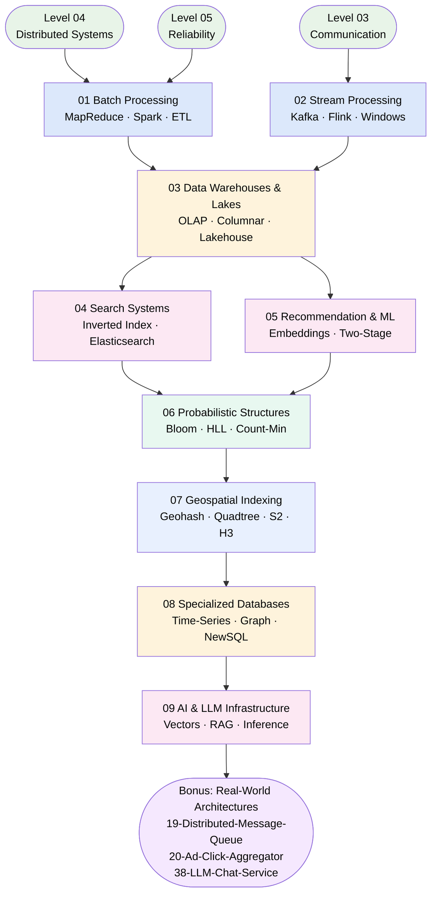

# Level 7 — Big Data & Specialized Systems

> **Theme: The Pro Tier — Data-Intensive & Specialized**
> You've mastered distributed systems fundamentals. Now you tackle the systems that handle petabytes, milliseconds, and millions of events — the infrastructure powering analytics, search, recommendations, and real-time intelligence.

---

**Level:** 7 · **Prerequisites:** [Level 04 — Distributed Systems](../Level-04-Distributed-Systems/README.md) · [Level 05 — Reliability & Scalability](../Level-06-Scale-and-Reliability/README.md) · [Level 03 — Communication](../Level-03-Communication/README.md)
**Estimated Time:** 15–19 hours · **Difficulty:** Advanced

---

## 🎯 What You'll Learn

By the end of Level 7, you will be able to:

- Design batch and stream processing pipelines for petabyte-scale data
- Explain how Kafka, Flink, and Spark work under the hood
- Choose between data warehouses, data lakes, and lakehouses
- Build full-text search with inverted indexes and ranking
- Architect a two-stage recommendation system (candidate generation → ranking)
- Apply probabilistic data structures to trade exactness for dramatic space savings
- Choose between geohash, quadtree, S2, and H3 for "find things near me" queries
- Pick the right specialized database — time-series, graph, or NewSQL — for the shape of your data
- Design AI-era systems: vector search, RAG pipelines, and GPU-efficient LLM inference serving

---

## 📚 Topics

| # | Topic | Description | Est. Time |
|---|-------|-------------|-----------|
| 01 | [Batch Processing](01-Batch-Processing/README.md) | MapReduce, Hadoop, Spark, ETL/ELT — processing huge bounded datasets | 1.5 h |
| 02 | [Stream Processing](02-Stream-Processing/README.md) | Kafka, Flink, windowing, exactly-once — real-time unbounded data | 2.5 h |
| 03 | [Data Warehouses & Lakes](03-Data-Warehouses-and-Lakes/README.md) | OLTP vs OLAP, columnar storage, Snowflake, S3, lakehouse | 2 h |
| 04 | [Search Systems](04-Search-Systems/README.md) | Inverted index, TF-IDF, BM25, Elasticsearch, sharding a search index | 2 h |
| 05 | [Recommendation & ML Systems](05-Recommendation-and-ML-Systems/README.md) | Collaborative filtering, embeddings, two-stage architecture, feature stores | 2 h |
| 06 | [Probabilistic Data Structures](06-Probabilistic-Data-Structures/README.md) | Bloom filter, Count-Min Sketch, HyperLogLog — space vs. exactness | 1.5 h |
| 07 | [Geospatial Indexing](07-Geospatial-Indexing/README.md) | Geohash, quadtree, Google S2, Uber H3 — efficient "find near me" queries | 1.5 h |
| 08 | [Specialized Databases](08-Specialized-Databases/README.md) | Time-series, graph, NewSQL/Spanner — matching the database to the data's shape | 1.5 h |
| 09 | [AI & LLM Infrastructure](09-AI-and-LLM-Infrastructure/README.md) | Embeddings, vector DBs (HNSW), RAG, LLM inference serving, token streaming | 2 h |

---

## 🗺️ Learning Roadmap

---

## 🔗 How Level 7 Connects to the Rest of the Curriculum

| Concept | Built On | Used By |
|---------|----------|---------|
| Kafka (Topic 02) | [Pub-Sub messaging](../Level-03-Communication/05-Pub-Sub/README.md) | Ad-Click Aggregator (Bonus 20) |
| Exactly-once delivery | [Idempotency](../Level-04-Distributed-Systems/07-Idempotency-and-Exactly-Once/README.md) | Stream Processing (Topic 02) |
| Sharding a search index | [Sharding & Partitioning](../Level-02-Data-Layer/02-Sharding-and-Partitioning/README.md) | Search Systems (Topic 04) |
| Two-stage recommender | Topics 04 + 05 combined | Netflix, YouTube |
| Bloom filter in storage | Topic 06 | Cassandra, Bigtable |
| Geospatial proximity | [Indexing](../Level-02-Data-Layer/03-Indexing/README.md) + [Sharding](../Level-02-Data-Layer/02-Sharding-and-Partitioning/README.md) | Topic 07 (Uber, Yelp, Tinder) |

---

## 🏁 Prerequisites Checklist

Before diving in, make sure you're comfortable with:

- [ ] Consistent hashing and partitioning strategies ([Level 04](../Level-04-Distributed-Systems/README.md))
- [ ] CAP theorem and replication trade-offs ([Level 04](../Level-04-Distributed-Systems/README.md))
- [ ] Pub-Sub messaging basics ([Level 03 — Pub-Sub](../Level-03-Communication/05-Pub-Sub/README.md))
- [ ] Basic SQL and database indexing ([Level 02](../Level-02-Data-Layer/README.md))

---

## 💡 Study Tips for Level 7

1. **Batch before stream.** Topic 01 gives you the mental model; Topic 02 adds the "now make it real-time" twist.
2. **Draw data flows.** Every system here is fundamentally a pipeline — data in, transformation, data out. Sketch it before reading.
3. **Real numbers matter.** When interviewers ask about big data, they expect you to anchor on actual scale (GB/s throughput, billions of records, millisecond latency targets).
4. **Connect the dots.** The two-stage recommender (Topic 05) uses vector search from Topic 04 and may serve results via a stream from Topic 02. See the whole picture.

---

*Part of the [System Design Curriculum](../README.md) — Level 7 of 8*
