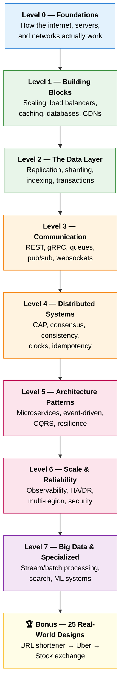

# 🏗️ The Complete System Design Curriculum

> From "What is a server?" to "Design a global, multi-region, exactly-once payment system."
> A free, structured, beginner-to-ultra-advanced path to mastering system design — with diagrams, real-world examples, and analogies you'll actually remember.

[]()
[]()
[]()
[]()

---

## 🎯 What is this?

This repository is a **one-stop, self-paced course** to learn system design from the absolute basics to a professional, interview-ready, and real-world-ready level.

It is built like a video game: you start at **Level 0** and unlock the next level only after the previous one makes sense. Each level builds directly on the one before it. By the end, you'll be able to read a sentence like *"design a service that ingests 5 million events per second with sub-100ms p99 latency and no data loss"* and know exactly where to start.

Every single topic includes:

- 📖 **A detailed README** — explains the *what*, the *why*, and the *how*, in plain English.
- 📊 **Diagrams** — visual mental models (rendered automatically on GitHub via Mermaid).
- 🌍 **Real-world examples** — how Netflix, Uber, Amazon, WhatsApp, Google, and others actually do it.
- 🧠 **Analogies** — every abstract idea is anchored to something from everyday life.
- ⚖️ **Trade-offs** — there are no "best" solutions in system design, only trade-offs. We make them explicit.
- 🎤 **Interview tips** — what interviewers actually probe for.
- 📝 **TL;DR + key takeaways** — for fast revision before an interview.

---

## 👤 Who is this for?

| You are… | This repo gives you… |
|---|---|
| A **student / beginner** who has never built a backend | A gentle, jargon-free on-ramp starting from "what is a client and a server" |
| A **developer** who can build apps but freezes in design interviews | A structured vocabulary and a repeatable framework |
| A **senior engineer** prepping for L5/L6/staff interviews | Deep dives on consensus, CQRS, multi-region, and 25 full case studies |
| A **curious mind** who wants to know how Uber/WhatsApp actually work | The Bonus folder — real architectures, demystified |

**Prerequisites:** Basic programming knowledge (you've written a function and called an API). That's it. We explain everything else.

---

## 🗺️ The Learning Roadmap



---

## 📚 Full Curriculum

### 🟦 [Level 0 — Foundations](./Level-00-Foundations/)
*The "how does any of this work" level. Don't skip it.*
1. [What is System Design?](./Level-00-Foundations/01-What-is-System-Design/)
2. [The Client-Server Model](./Level-00-Foundations/02-Client-Server-Model/)
3. [How the Internet Works](./Level-00-Foundations/03-How-the-Internet-Works/)
4. [Network Protocols — IP, TCP, UDP](./Level-00-Foundations/04-Network-Protocols/)
5. [DNS — The Internet's Phonebook](./Level-00-Foundations/05-DNS/)
6. [HTTP & HTTPS](./Level-00-Foundations/06-HTTP-and-HTTPS/)
7. [Latency, Throughput & Performance](./Level-00-Foundations/07-Latency-Throughput-Performance/)

### 🟩 [Level 1 — Building Blocks](./Level-01-Building-Blocks/)
*The core LEGO bricks of every system.*
1. [Scalability — Vertical vs Horizontal](./Level-01-Building-Blocks/01-Scalability/)
2. [Load Balancing](./Level-01-Building-Blocks/02-Load-Balancing/)
3. [Caching](./Level-01-Building-Blocks/03-Caching/)
4. [Databases — SQL vs NoSQL](./Level-01-Building-Blocks/04-Databases-SQL-vs-NoSQL/)
5. [Proxies — Forward & Reverse](./Level-01-Building-Blocks/05-Proxies/)
6. [Content Delivery Networks (CDN)](./Level-01-Building-Blocks/06-CDN/)
7. [Stateless vs Stateful Systems](./Level-01-Building-Blocks/07-Stateless-vs-Stateful/)

### 🟩 [Level 2 — The Data Layer](./Level-02-Data-Layer/)
*Where your data lives, and how to keep it fast and safe.*
1. [Database Replication](./Level-02-Data-Layer/01-Database-Replication/)
2. [Sharding & Partitioning](./Level-02-Data-Layer/02-Sharding-and-Partitioning/)
3. [Indexing](./Level-02-Data-Layer/03-Indexing/)
4. [Database Internals — B-Trees & LSM Trees](./Level-02-Data-Layer/04-Database-Internals/)
5. [ACID & Transactions](./Level-02-Data-Layer/05-ACID-and-Transactions/)
6. [Connection Pooling](./Level-02-Data-Layer/06-Connection-Pooling/)
7. [Data Modeling](./Level-02-Data-Layer/07-Data-Modeling/)
8. [Consistent Hashing](./Level-02-Data-Layer/08-Consistent-Hashing/)
9. [Object & Blob Storage (S3)](./Level-02-Data-Layer/09-Object-Storage/)

### 🟧 [Level 3 — Communication](./Level-03-Communication/)
*How services talk to each other and to clients.*
1. [API Design & REST](./Level-03-Communication/01-API-Design-REST/)
2. [GraphQL](./Level-03-Communication/02-GraphQL/)
3. [gRPC & RPC](./Level-03-Communication/03-gRPC-and-RPC/)
4. [Message Queues](./Level-03-Communication/04-Message-Queues/)
5. [Publish-Subscribe (Pub/Sub)](./Level-03-Communication/05-Pub-Sub/)
6. [WebSockets & Real-Time Communication](./Level-03-Communication/06-WebSockets-and-Realtime/)
7. [Rate Limiting](./Level-03-Communication/07-Rate-Limiting/)

### 🟧 [Level 4 — Distributed Systems](./Level-04-Distributed-Systems/)
*The hard, beautiful core. Where most senior interviews live.*
1. [The CAP Theorem](./Level-04-Distributed-Systems/01-CAP-Theorem/)
2. [Consistency Models](./Level-04-Distributed-Systems/02-Consistency-Models/)
3. [Consensus — Paxos & Raft](./Level-04-Distributed-Systems/03-Consensus-Paxos-Raft/)
4. [Distributed Transactions — 2PC & Saga](./Level-04-Distributed-Systems/04-Distributed-Transactions/)
5. [Leader Election](./Level-04-Distributed-Systems/05-Leader-Election/)
6. [Clocks & Event Ordering](./Level-04-Distributed-Systems/06-Clocks-and-Ordering/)
7. [Idempotency & Exactly-Once](./Level-04-Distributed-Systems/07-Idempotency-and-Exactly-Once/)
8. [Distributed Locking](./Level-04-Distributed-Systems/08-Distributed-Locking/)

### 🟥 [Level 5 — Architecture Patterns](./Level-05-Architecture-Patterns/)
*Proven blueprints for organizing large systems.*
1. [Monolith vs Microservices](./Level-05-Architecture-Patterns/01-Monolith-vs-Microservices/)
2. [Event-Driven Architecture](./Level-05-Architecture-Patterns/02-Event-Driven-Architecture/)
3. [CQRS & Event Sourcing](./Level-05-Architecture-Patterns/03-CQRS-and-Event-Sourcing/)
4. [Service Discovery](./Level-05-Architecture-Patterns/04-Service-Discovery/)
5. [API Gateway](./Level-05-Architecture-Patterns/05-API-Gateway/)
6. [Resilience Patterns — Circuit Breakers, Bulkheads, Retries](./Level-05-Architecture-Patterns/06-Resilience-Patterns/)
7. [Saga & Workflow Orchestration](./Level-05-Architecture-Patterns/07-Saga-and-Orchestration/)

### 🟥 [Level 6 — Scale & Reliability](./Level-06-Scale-and-Reliability/)
*Making it observable, available, and safe at planet scale.*
1. [Observability — Logs, Metrics, Traces](./Level-06-Scale-and-Reliability/01-Observability/)
2. [Capacity Planning & Back-of-the-Envelope Estimation](./Level-06-Scale-and-Reliability/02-Capacity-Planning-and-Estimation/)
3. [High Availability & Disaster Recovery](./Level-06-Scale-and-Reliability/03-High-Availability-and-DR/)
4. [Deployment Strategies — Blue/Green, Canary](./Level-06-Scale-and-Reliability/04-Deployment-Strategies/)
5. [Security at Scale](./Level-06-Scale-and-Reliability/05-Security-at-Scale/)
6. [Multi-Region & Geo-Distribution](./Level-06-Scale-and-Reliability/06-Multi-Region-and-Geo-Distribution/)
7. [Containers & Orchestration — Docker & Kubernetes](./Level-06-Scale-and-Reliability/07-Containers-and-Orchestration/)

### 🟪 [Level 7 — Big Data & Specialized Systems](./Level-07-Big-Data-and-Specialized/)
*The pro tier: data-intensive and specialized architectures.*
1. [Batch Processing — MapReduce & Spark](./Level-07-Big-Data-and-Specialized/01-Batch-Processing/)
2. [Stream Processing — Kafka & Flink](./Level-07-Big-Data-and-Specialized/02-Stream-Processing/)
3. [Data Warehouses & Data Lakes](./Level-07-Big-Data-and-Specialized/03-Data-Warehouses-and-Lakes/)
4. [Search Systems — Inverted Indexes & Elasticsearch](./Level-07-Big-Data-and-Specialized/04-Search-Systems/)
5. [Recommendation & ML Systems](./Level-07-Big-Data-and-Specialized/05-Recommendation-and-ML-Systems/)
6. [Probabilistic Data Structures — Bloom Filters, HyperLogLog](./Level-07-Big-Data-and-Specialized/06-Probabilistic-Data-Structures/)
7. [Geospatial Indexing — Geohash, S2, H3](./Level-07-Big-Data-and-Specialized/07-Geospatial-Indexing/)

### 🏆 [Bonus — 34 Real-World System Designs](./Bonus-Real-World-Architectures/)
*Apply everything. Ordered from easiest to hardest.*

| # | Design | Difficulty | Key concepts |
|---|--------|-----------|--------------|
| 1 | [URL Shortener (TinyURL/Bitly)](./Bonus-Real-World-Architectures/01-URL-Shortener/) | ⭐ | Hashing, base62, read-heavy caching |
| 2 | [Pastebin](./Bonus-Real-World-Architectures/02-Pastebin/) | ⭐ | Blob storage, TTL, key generation |
| 3 | [Distributed Rate Limiter](./Bonus-Real-World-Architectures/03-Rate-Limiter/) | ⭐⭐ | Token bucket, Redis, sliding window |
| 4 | [Notification Service](./Bonus-Real-World-Architectures/04-Notification-Service/) | ⭐⭐ | Fan-out, queues, retries, fault isolation |
| 5 | [Web Crawler](./Bonus-Real-World-Architectures/05-Web-Crawler/) | ⭐⭐ | BFS, politeness, dedup, frontier |
| 6 | [News Feed (Twitter/X)](./Bonus-Real-World-Architectures/06-News-Feed-Twitter/) | ⭐⭐⭐ | Fan-out on write vs read, timelines |
| 7 | [Instagram](./Bonus-Real-World-Architectures/07-Instagram/) | ⭐⭐⭐ | Media storage, feed, followers graph |
| 8 | [WhatsApp / Chat](./Bonus-Real-World-Architectures/08-WhatsApp-Chat/) | ⭐⭐⭐ | WebSockets, presence, delivery receipts |
| 9 | [YouTube / Netflix Streaming](./Bonus-Real-World-Architectures/09-YouTube-Netflix-Streaming/) | ⭐⭐⭐ | Transcoding, CDN, adaptive bitrate |
| 10 | [Typeahead / Autocomplete](./Bonus-Real-World-Architectures/10-Typeahead-Autocomplete/) | ⭐⭐⭐ | Tries, ranking, prefix sharding |
| 11 | [Uber / Lyft](./Bonus-Real-World-Architectures/11-Uber-Ride-Sharing/) | ⭐⭐⭐⭐ | Geospatial, matching, real-time tracking |
| 12 | [Zomato / Swiggy / DoorDash](./Bonus-Real-World-Architectures/12-Food-Delivery/) | ⭐⭐⭐⭐ | Three-sided marketplace, ETA, logistics |
| 13 | [Airbnb / Booking](./Bonus-Real-World-Architectures/13-Airbnb-Booking/) | ⭐⭐⭐⭐ | Availability, search, double-booking |
| 14 | [Google Drive / Dropbox](./Bonus-Real-World-Architectures/14-Google-Drive-Dropbox/) | ⭐⭐⭐⭐ | File sync, chunking, conflict resolution |
| 15 | [Google Maps](./Bonus-Real-World-Architectures/15-Google-Maps/) | ⭐⭐⭐⭐ | Graphs, routing, geospatial indexing |
| 16 | [Ticketmaster](./Bonus-Real-World-Architectures/16-Ticketmaster/) | ⭐⭐⭐⭐ | Concurrency, locking, fairness, spikes |
| 17 | [Payment System (Stripe)](./Bonus-Real-World-Architectures/17-Payment-System/) | ⭐⭐⭐⭐⭐ | Idempotency, ledgers, exactly-once |
| 18 | [Distributed Cache (Redis)](./Bonus-Real-World-Architectures/18-Distributed-Cache/) | ⭐⭐⭐⭐⭐ | Consistent hashing, eviction, replication |
| 19 | [Distributed Message Queue (Kafka)](./Bonus-Real-World-Architectures/19-Distributed-Message-Queue/) | ⭐⭐⭐⭐⭐ | Logs, partitions, consumer groups |
| 20 | [Ad Click Aggregator](./Bonus-Real-World-Architectures/20-Ad-Click-Aggregator/) | ⭐⭐⭐⭐⭐ | Stream processing, idempotency, accuracy |
| 21 | [Distributed Job Scheduler](./Bonus-Real-World-Architectures/21-Distributed-Job-Scheduler/) | ⭐⭐⭐⭐⭐ | Cron at scale, leader election, at-least-once |
| 22 | [Google Search](./Bonus-Real-World-Architectures/22-Google-Search/) | ⭐⭐⭐⭐⭐ | Crawling, indexing, ranking |
| 23 | [Distributed Counter / Analytics](./Bonus-Real-World-Architectures/23-Distributed-Counter-Analytics/) | ⭐⭐⭐⭐⭐ | CRDTs, approximation, hot keys |
| 24 | [Stock Exchange](./Bonus-Real-World-Architectures/24-Stock-Exchange/) | ⭐⭐⭐⭐⭐ | Matching engine, low latency, ordering |
| 25 | [Live Streaming (Twitch)](./Bonus-Real-World-Architectures/25-Live-Streaming/) | ⭐⭐⭐⭐⭐ | Low-latency video, chat scale, ingest |
| 26 | [Unique ID Generator (Snowflake)](./Bonus-Real-World-Architectures/26-Unique-ID-Generator/) | ⭐⭐ | Snowflake IDs, time-sortable, clock skew |
| 27 | [Distributed Key-Value Store (Dynamo)](./Bonus-Real-World-Architectures/27-Key-Value-Store/) | ⭐⭐⭐⭐⭐ | Consistent hashing, quorums, vector clocks |
| 28 | [Google Docs (Collaborative Editing)](./Bonus-Real-World-Architectures/28-Google-Docs-Collaborative-Editing/) | ⭐⭐⭐⭐⭐ | OT vs CRDTs, real-time sync |
| 29 | [Nearby Friends / Yelp (Proximity)](./Bonus-Real-World-Architectures/29-Nearby-Friends-Proximity/) | ⭐⭐⭐⭐ | Geospatial index, dynamic location fan-out |
| 30 | [Video Conferencing (Zoom)](./Bonus-Real-World-Architectures/30-Video-Conferencing/) | ⭐⭐⭐⭐⭐ | WebRTC, SFU vs MCU, NAT traversal |
| 31 | [E-Commerce Platform (Amazon)](./Bonus-Real-World-Architectures/31-E-Commerce-Platform/) | ⭐⭐⭐⭐ | Catalog, cart, inventory, checkout saga |
| 32 | [Email Service (Gmail)](./Bonus-Real-World-Architectures/32-Email-Service/) | ⭐⭐⭐⭐ | SMTP, object storage, per-user search, spam |
| 33 | [Content Delivery Network (CDN)](./Bonus-Real-World-Architectures/33-Content-Delivery-Network/) | ⭐⭐⭐⭐ | Edge routing, cache hierarchy, purge |
| 34 | [Distributed Logging & Monitoring (Datadog)](./Bonus-Real-World-Architectures/34-Distributed-Logging-Monitoring/) | ⭐⭐⭐⭐ | Ingestion, time-series, alerting, cardinality |

---

## 🧭 How to use this repository

1. **Start at Level 0.** Even if you think you know it, skim it — the vocabulary is used everywhere later.
2. **Read one topic per sitting.** Each README is designed to be a complete, ~20-minute lesson.
3. **Look at the diagrams first, then read.** The visual gives you a hook to hang the details on.
4. **Do the "Test Yourself" questions** at the end of each topic before moving on.
5. **After Level 4, start the Bonus designs in parallel.** Theory + practice reinforce each other.
6. **Before an interview,** re-read just the `TL;DR` and `Interview Tips` sections of each topic.

### Suggested pace

| Goal | Pace | Time to finish |
|---|---|---|
| Interview in 2 weeks | 4–5 topics/day + 1 case study/day | ~2 weeks |
| Solid, lasting understanding | 1 topic/day | ~10 weeks |
| Casual learning | 2–3 topics/week | ~6 months |

---

## 🧱 How each topic folder is organized

```
Level-XX-Name/
└── NN-Topic-Name/
    └── README.md   ← everything: explanation, diagrams, examples, trade-offs, interview tips
```

Every topic README follows the same structure so you always know where to find things — see [STYLE_GUIDE.md](./STYLE_GUIDE.md) for the template. A shared [GLOSSARY.md](./GLOSSARY.md) defines every term in one place.

---

## ⭐ The Golden Rules of System Design

Keep these in mind through every topic:

1. **There is no "best," only trade-offs.** Every choice costs you something. Name the cost.
2. **Scale changes everything.** A design for 100 users is wrong for 100 million, and vice-versa.
3. **The bottleneck is usually the database.** Most scaling work is about reads, writes, and data.
4. **Everything fails, all the time.** Design for failure as the normal case, not the exception.
5. **Estimate before you architect.** Numbers (QPS, storage, bandwidth) drive the design.
6. **Keep it simple.** The best design is the simplest one that meets the requirements. Don't add Kafka because it sounds cool.

---

## 📖 Quick links

- ✅ [Progress tracker](./PROGRESS.md) — check off topics as you go
- 📋 [Glossary of terms](./GLOSSARY.md)
- ✍️ [Style guide / chapter template](./STYLE_GUIDE.md)

---

*Happy learning. By the end of this, "design Twitter" won't scare you — it'll excite you.* 🚀
